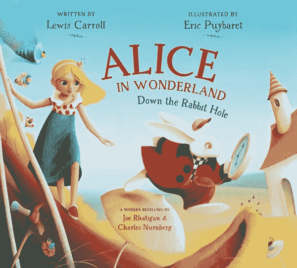

# ML16:动手文本预处理

> 原文：<https://medium.com/analytics-vidhya/ml16-ef6105b5bb34?source=collection_archive---------23----------------------->

## 自然语言处理的第一步&文本挖掘

```
Read time: 6 minComplete Python code on Colab: [https://bit.ly/3pHaDI6](https://bit.ly/3pHaDI6)
```

> **(1)*[*正文:爱丽丝梦游仙境*](#7200) *(2)*[*正文预处理*](#c815) *(3)*[*摘要*](#fff0)
> *(4)*[*附录*](#a1bf)*

**

*图 1:爱丽丝梦游仙境封面。[(来源)](https://www.charlesbridge.com/products/alice-in-wonderland)*

# **正文:爱丽丝梦游仙境**

*我们从[古腾堡的网站](https://www.gutenberg.org/files/11/11-h/11-h.htm)上截取了*爱丽丝梦游仙境*第一章的部分内容。内容如下:*

> *“我敢肯定这不是正确的词，”可怜的爱丽丝说，她又一次充满了泪水，她继续说，“我一定是梅布尔，我将不得不去住在那个狭小的房子里，几乎没有玩具玩，哦！有太多的课程要学了！不，我已经下定决心了；如果我是梅布尔，我会留在这里！*

# *(2) *文本预处理**

*NLP & TM 有几个基本的文本预处理步骤:*

1.  *扩张收缩*
2.  *小写转换*
3.  *删除非字母字符*
4.  *标记化*
5.  *删除停用词*
6.  *词汇化或词干化*

*正如您在上面的 Colab 链接中看到的，预处理后的文本如下所示:*

*   *原文*

> *“我敢肯定这不是正确的词，”可怜的爱丽丝说，她又一次充满了泪水，她继续说，“我一定是梅布尔，我将不得不去住在那个狭小的房子里，几乎没有玩具玩，哦！有太多的课程要学了！不，我已经下定决心了；如果我是梅布尔，我会留在这里！*

*   *经过词条化预处理的文本*

> *['sure '，' right '，' word '，' say '，' poor '，' alice '，' eye '，' fill '，' tear '，' go '，' must '，' mabel '，' shall '，' go '，' live '，' poky '，' little '，' house '，' next '，' toy '，' play '，' oh '，' ever '，' many '，' learn '，' make '，' mind '，' mabel '，' stay']*

*这是一个包含 30 个元素的列表。*

*   *用词干预处理的文本(Porter)*

> *['sure '，' right '，' word '，' said '，' poor '，' alic '，' eye '，' fill '，' tear '，' got '，' must '，' mabel '，' shall '，' go '，' live '，' poki '，' littl '，' hous '，' next '，' toy '，' play '，' oh '，' ever '，' mani '，' lesson '，' learn '，' made '，' mind '，' mabel '，' stay']*

*这也是一个包含 30 个元素的列表。*

*我们可以看到词汇化和词干化之间的区别。*

## *深入词汇化和词干化*

*有 3 种词干——波特、雪球和兰卡斯特。以下 4 种方法之间存在权衡。*

*   *速度:兰卡斯特>雪球>波特>词汇化*
*   *严格性:兰卡斯特>斯诺鲍>波特>词汇化*
*   *可读性:词汇化>波特>雪球>兰卡斯特*

*现在的问题是，哪个词干是最好的或最受欢迎的？*

> *Porter 词干分析器是最常用的，但是您应该根据您的问题并经过反复试验来选择您的词干分析器。[1]*
> 
> *一个好的经验法则是使用雪球茎干。[2]*

*然后，我们通过下面的实例进一步论证*&***词干*** 的区别:**

> *****00。样本词*** *: ['头脑'，'狼'，'玩'，'评论'，'爱好者'，'更好'，'经济'，'说谎'，'大概'，'设想']***
> 
> *****01。词汇化(名词)*** *: ['头脑'，'狼'，'玩'，'评论'，'爱好者'，'更好'，'经济'，'说谎'，'大概'，'预想']***
> 
> *****02。词汇化(动词)*** *: ['头脑'，'狼'，'玩耍'，'评论'，'爱好者'，'更好'，'经济'，'谎言'，'大概'，'设想']***
> 
> *****03。词汇化(Adj & ADV)*** *:['头脑'，'狼'，'玩'，'评论'，'花式'，'好'，'经济'，'说谎'，'大概'，'预想']***
> 
> *****04。*** ***词汇化(A(V(N)))*** *:['头脑'，'狼'，'玩'，'评论'，'花式'，'好'，'经济'，'谎言'，'大概'，'设想']***
> 
> ****05*。*** ***【词汇化(N+V+A)*** *: ['头脑'，'狼'，'玩'，'评论'，'花式'，'好'，'经济'，'说谎'，'大概'，'预想']***
> 
> ****06*。词干(Porter)*** *: ['mind '，' wolv '，' play '，' review '，' fancier '，' better '，' econom '，' lie '，' probabl '，' envis']***
> 
> *****07。词干(雪球)*** *: ['mind '，' wolv '，' play '，' review '，' fancier '，' better '，' econom '，' lie '，' probabl '，' envis']***
> 
> *****08。词干(兰卡斯特)*** *: ['mind '，' wolv '，' play '，' review '，' fant '，' bet '，' econom '，' lying '，' prob '，' envid']***

**这里我们将词汇化功能分解为*名词词汇化器*、*动词词汇化器*和 *Adj & Adv 词汇化器*。然后我们会看到它们是如何作用于给定的单词的。**

**就拿'说谎'来说吧， ***词汇化(A(V(N))***给出'说谎'， ***词干(Porter)*** 给出'说谎'， ***词干(雪球)*** 给出'说谎'， ***词干(Lancaster)*** 给出'说谎'。因此，我们发现 ***【兰卡斯特】*** 可能不是一个好的处理方法。**

# **(3)总结**

**首先，我们逐步完成了文本预处理过程。随后，我们深入研究了*词汇化* & *词干*；我们看到*速度*、*严格性* & *可读性*对于*词汇化*、*波特*、*滚雪球* & *兰卡斯特*之间的取舍。最后，我们发现*兰开斯特*可能不是一个好的词干分析器。**

# **(4)附录**

**有人可能会好奇 ***缩略词典*** & ***停用词词典*** 。当然，我们可以参考 Colab 上的完整代码仔细看看它们:[https://bit.ly/3pHaDI6](https://bit.ly/3pHaDI6)**

# ****(5)参考文献****

**[1]萨卡尔博士(2019)。用 Python 进行文本分析(第二版。).印度卡纳塔克邦:新闻。**

**[2]乔希，P. (2016)。Python 机器学习食谱。英国伯明翰:Packt 出版公司。**

**[3]伯德等人(2009 年)。用 Python 进行自然语言处理。加利福尼亚州:奥赖利媒体。**

**[4] kootenpv (2020)。宫缩。从 https://github.com/kootenpv/contractions[取回](https://github.com/kootenpv/contractions)**

**[5] dspencer (2020 年)。ImportError:无法从“contractions”中导入名称“CONTRACTION_MAP”。从 https://bit.ly/2MpjsZ1[取回](https://bit.ly/2MpjsZ1)**

**[6] L3viathan (2016)。在引理化中应用多位置论元。从 https://bit.ly/3oehXed[取回](https://bit.ly/3oehXed)**