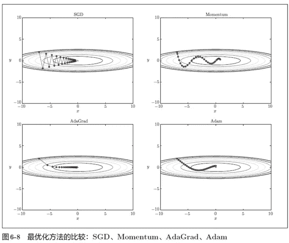

# ML17:调整深层网络

> 原文：<https://medium.com/analytics-vidhya/ml17-a2f9315e5f1a?source=collection_archive---------21----------------------->

## 活化剂、优化剂、时期、小批量、BN、漏失和重量衰减

**关键词**:激活函数、优化器、时期、小批量、批量标准化、漏失、重量衰减

> ***概要*** *(1)* [*激活器(激活功能)*](#6b6b) *(2)*[*优化器*](#9153) *(3)*[*历元和小批量*](#e332) *【4】*[*批量正常化(BN)【说明】*](#5ce3)

# (1)激活剂(激活功能)

*   *sigmoid()、tanh()、ReLU()、PReLU()、LeakyReLU()、eLU()、SELU()、Softmax()【用于分类】*
*   一般来说， *ReLU()* 已经足够好了，尤其是当人们试图减少深度神经网络的训练时间时。
*   *ELU()* 已被证明是卷积层之间使用**的一种有前途的非线性** (Clevert 等人，2015)。

# (2)优化器

*   SGD，Momentum，AdaGrad，RMSprop，Adam，Nadam，AdaMax
*   一般来说，*亚当*就足够好了。

图 1:优化者比较— SGD，Momentum，AdaGrad，Adam。

# (3)时期和小批量

*   我们的算法学习模型的速度之间的关系通常是 **U 形**(批量大小与训练速度)。这意味着最初**随着批量变大，培训时间将减少**。最终，当我们超过某个过大的批量时，我们会看到训练时间开始增加。
*   **更大的小批量**意味着**更平滑的梯度**。
*   为了性能(这在 GPU 的情况下是最重要的)，我们**应该使用 32 的倍数作为批量大小**，或者如果不能使用 32 的倍数，则使用 16、8、4 或 2 的倍数(或者在给定其他要求的情况下导致太大的变化)。简而言之，原因很简单:**内存访问和硬件设计得到了更好的优化**，与其他尺寸相比，可以在尺寸为 2 的幂的数组**上运行。例如，我们应该在尺寸 125 上使用尺寸 128 的层，或者在尺寸 250 上使用尺寸 256 的层，等等。**
*   实际操作中，CPU 训练常见 32 到 256，**GPU 训练常见 32 到 1024**。通常，这个范围内的东西对于较小的网络来说已经足够好了，尽管您可能应该对较大的网络进行测试(在较大的网络中，训练时间可能会受到限制)。
*   小批量和时期之间的关系:如果我们将小批量增加两倍，我们**需要将时期的数量增加两倍**，以便**保持相同的参数更新数量**。每个时期的参数更新次数正好是我们的训练集中的样本总数除以最小批量大小。
*   使用更大的小批量**可能有助于我们的网络在一些困难的情况下进行学习**，例如对于*有噪声的* 或*不平衡的数据集*。

# (4)批量标准化(BN)

*   Ioffe & Szegedy 在 2015 年推出，允许模型对参数****的初始化不太敏感，简化了学习率*** 的调整。*

# *(5)辍学*

*   *由 Geoffrey E. Hinton 等人于 2012 年提出。Nitish Srivastava 等人于 2014 年详细阐述。通常 **10% ~ 50%** 。在 *CNN* ，往往 **40% ~ 50%** 。在 *RNN* ，通常为**的 20% ~ 30%** 。*
*   *丢失和权重衰减都是正则化技术。*
*   *由此产生的神经网络可以被视为所有这些较小的神经网络的**平均集合**。*
*   *有时我们会在输入端使用**无丢失，特别是对于嘈杂或稀疏的数据集。***
*   *在输出层上使用 dropout**并不常见。***
*   *在所有隐藏层中取消比只在一个隐藏层中取消更有效。*
*   *即使没有其他正则化技术，Dropout 也倾向于使隐藏单元**的激活稀疏**，导致**稀疏表示**。*

# *(6)重量衰减*

*   *L1(拉索)或 L2(岭)正则化。在 *torch.optim* 中，参数 *weight_decay (float，可选)*采用 L2。*
*   *丢失和权重衰减都是正则化技术。*
*   *L1: **稀疏模型**。L1 对大权重的惩罚较少，但导致许多权重被驱动到 0(或非常接近 0)，这意味着得到的权重向量可以是稀疏的。*
*   *L2: **密集车型**。L2 对重量大的处罚更重，但不会把重量小的罚到 0。*
*   *在实践中，我们看到 **L2 正则化*在显式特征选择之外给出了优于 L1 的性能*** 。*
*   *我们可以把和放在一个网里，即弹性网(邹和哈斯蒂，2005)。*
*   *对于我们使用早期停止的情况，我们可能根本不想使用 L2 正则化，因为**早期停止*在执行与 L2 相同的机制时更有效***(Bengio，2012)。*

# *(7)参考文献*

*[1] Géron，A. (2019)。使用 Scikit-Learn、Keras 和 TensorFlow 进行机器学习(第二版。).加利福尼亚州:奥赖利媒体。*

*[2] Rao，d .和 McMahan，B. (2019 年)。用 PyTroch 进行自然语言处理。加利福尼亚州:奥赖利媒体。*

*[3]j .帕特森和 a .吉布森(2017 年)。一个实践者的方法。加利福尼亚州:奥赖利媒体。*

*[4] 斎藤康毅 (2016). ゼロから作るDeep Learning ―Pythonで学ぶディープラーニングの理論と実. Japan, JP: O’Reilly Japan.*