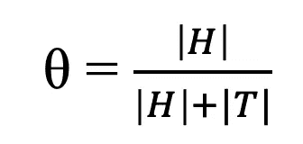

# 最大似然法，朴素贝叶斯分类器的基础

> 原文：<https://medium.com/analytics-vidhya/mle-the-foundation-of-naive-bayes-classifiers-ebb27963c3fa?source=collection_archive---------8----------------------->

埃里克·麦克林在 [Unsplash](https://unsplash.com?utm_source=medium&utm_medium=referral) 上的照片

朴素贝叶斯分类器根据[贝叶斯定理](/datadriveninvestor/back-to-bayes-ics-e5dd4405c927)的原理对数据进行分类。给定先前事件的信息或已知数据点的知识，这些分类器预测后续观察的结果。

想象一下抛硬币。你对这枚硬币一无所知，它可能是一枚公平的硬币(有 50%的机会是正面或反面)，或者它可能偏向一个方向。一次抛硬币不足以预测未来的结果，硬币不可能百分之百是正面的。一百万次翻转似乎太多了。假设你抛硬币十次并记录结果，我们如何用这一系列的抛硬币来估计这个概率参数？

# MLE

**最大似然估计** (MLE)是一种估计参数的方法，这种方法可以最大化一系列事件发生的概率。在我们的硬币例子中，唯一的参数是硬币是正面还是反面的概率，或者硬币有多偏向或公平。例如，在硬币公平的情况下(我们仍然对这枚硬币一无所知)，连续掷出十个头像的几率很小，掷出五个头像的几率很高。假设我们翻转了六个正面和四个反面。在这种情况下，最大似然估计的目标是估计使这个序列最有可能发生的参数，或*硬币偏差*(我们的参数)。

在这种情况下，给定序列的概率表示为各个翻转概率的乘积:

给定对硬币正面结果的未知偏差，一系列硬币投掷的概率

MLE 需要两个假设来简化这个例子。我们的每一次翻转都是**独立的**，即翻转 1 的结果对翻转 2 的结果没有影响。每次投掷也是**独立分布**，即在每次观察中，相同的硬币以相同的方式投掷。这个 **IID** 假设允许我们用相同的参数替换上面等式中的硬币偏差。

抛 a 头的概率是θ，抛 a 尾的概率是(1-θ)。你可以将这些概率相乘，用一个似然函数来表示一个翻转序列。例如，正面-正面-反面序列可以表示为:θ*θ*(1-θ)。

# ARGMAX

给定已知的硬币投掷顺序，我们现在能够从上面的概率函数中推导出θ参数。我们可以选择使用函数的导数，或者我们可以使用对数将它转换成一个单调函数；总是增加或总是减少的函数。

单调函数的可视化，通过[维基百科](https://en.wikipedia.org/wiki/Monotonic_function)

我们的目标是导出参数θ，使得我们的抛硬币序列最有可能发生；也就是寻找最大值或 **argmax** 的**自变量的过程。该对数函数的[导数导致我们得出以下等式:](https://www.youtube.com/watch?v=z3cQpVJZI44)**

θ的估计值，硬币偏向正面。h 代表头翻转的次数，T 代表尾翻转的次数，Patrick van der Smagt 的视频如上所述。

如果你翻转 6 个正面和 4 个反面，你会得到θ = 0.6。

# 结论

这是最大似然估计的一个简单例子，但它可以计算出更高级的例子。最大似然法是朴素贝叶斯分类器的基础。他们的主要缺点是，他们严重基于以前的观察；例如，不太可能的序列会影响分类器的性能。