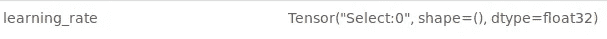
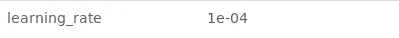

# 张量流的 MLflow 测井

> 原文：<https://medium.com/analytics-vidhya/mlflow-logging-for-tensorflow-37b6a6a53e3c?source=collection_archive---------3----------------------->


这是我的 MLflow 教程系列的第三篇文章:

1.  [在生产中设置 ml flow](/@gyani91/setup-mlflow-in-production-d72aecde7fef)
2.  [MLflow:基本测井功能](/@gyani91/mlflow-basic-logging-functions-e16cdea047b)
3.  [张量流 MLflow 测井](/@gyani91/mlflow-logging-for-tensorflow-37b6a6a53e3c)(你来了！)
4.  [MLflow 项目](/@gyani91/mlflow-projects-24c41b00854)
5.  [使用 Python API 为 MLflow 检索最佳模型](/@gyani91/retrieving-the-best-model-using-python-api-for-mlflow-7f76bf503692)
6.  [使用 MLflow 服务模型](/@gyani91/serving-a-model-using-mlflow-8ba5db0a26c0)

而[基本 MLflow 记录功能](/@gyani91/mlflow-basic-logging-functions-e16cdea047b)是您开始使用 MLflow 所需的全部。本指南将有助于解决将 MLflow 与 TensorFlow 结合使用时可能面临的初始问题。

让我们从一些基本的 MLflow 函数开始，这些函数将帮助您记录各种值和工件。

```
import mlflow
```

日志记录功能需要与特定的运行相关联。将所有内容放入一次运行的最佳方式是在 main 函数(或其他调用函数)的开始处指定运行的开始，在 main 函数的结束处指定运行的结束。

```
if __name__ == '__main__':
  mlflow.start_run()
  #the model code
  mlflow.end_run()
```

`[mlflow.log_param()](https://www.mlflow.org/docs/latest/python_api/mlflow.html#mlflow.log_param)`记录当前运行中的单个键值参数。键和值都是字符串。

在 TensorFlow 中，如果直接记录张量，则只会记录张量的“类型”。例如:



测井张量类型

相反，我们需要记录它的值:



测井张量值

为此，您需要使用功能[。eval()](https://www.tensorflow.org/api_docs/python/tf/Tensor) 在你的张量上。为了能够使用[。eval()](https://www.tensorflow.org/api_docs/python/tf/Tensor) 您需要在一个会话中，张量应该被初始化。如果您不在会话中，或者您不想使用默认会话进行日志记录，您总是可以使用以下语句在代码中的任何位置启动分层会话。

```
with tf.Session(config=tf.ConfigProto(allow_soft_placement=True, log_device_placement=False)) as newsess:
	newsess.run(tf.global_variables_initializer())
	mlflow.log_param('learning_rate', learning_rate.eval())
```

`[mlflow.log_metric()](https://www.mlflow.org/docs/latest/python_api/mlflow.html#mlflow.log_metric)`记录单个键值度量。该值必须始终是一个数字。与`[mlflow.log_param()](https://www.mlflow.org/docs/latest/python_api/mlflow.html#mlflow.log_param)`类似，您需要使用[。eval()](https://www.tensorflow.org/api_docs/python/tf/Tensor) 函数获取张量的值:

```
with tf.Session(config=tf.ConfigProto(allow_soft_placement=True, log_device_placement=False)) as newsess:
	newsess.run(tf.global_variables_initializer())
	mlflow.log_metric('Losses/%s' % loss.op.name, loss.eval())
```

**注意:**从 TensorFlow 2.0 开始，可以使用。numpy()函数而不是[。eval()](https://www.tensorflow.org/api_docs/python/tf/Tensor) 。

`[mlflow.log_artifacts()](https://www.mlflow.org/docs/latest/python_api/mlflow.html#mlflow.log_artifacts)`将一个给定目录中的所有文件记录为工件，可选的`artifact_path`。工件可以是任何文件，如图像、模型、检查点等。MLflow 有一个 [mlflow.tensorflow](https://www.mlflow.org/docs/latest/python_api/mlflow.tensorflow.html) 模块，用于记录模型。由于大多数模型都有自己保存模型和检查点的方式，我们建议让模型保存模型/检查点，并让 MLflow 使用`[mlflow.log_artifacts().](https://www.mlflow.org/docs/latest/python_api/mlflow.html#mlflow.log_artifacts)`简单地记录生成的文件。这个过程相对来说是没有错误的。

如果您想自己记录模型，可以使用以下代码:

```
# get the active mlflow run id
run_uuid = mlflow.active_run().info.run_uuid# modify the default model log path to include a sub-directory named by the mlflow run id
export_path = FLAGS.train_logdir + '/' + run_uuid
print('Exporting trained model to', export_path)#Create SavedModel object
builder = tf.saved_model.builder.SavedModelBuilder(export_path)#Save the model
builder.save(as_text=True)#Log the saved model to the MLflow runs directory on the production server
mlflow.log_artifacts(export_path, "model")
```

**解释:**大多数模型都天真地将检查点转储到一个日志目录中。例如， [Deeplab](https://github.com/tensorflow/models/tree/master/research/deeplab) 将其所有检查点保存到一个名为 *train_logdir* 的目录中。由于天真地将这个目录的所有内容复制到工件的目录中，所以一次运行不仅存储自己的工件，还存储所有以前运行的工件。这里的解决方法是用 MLflow 运行 id 增加模型导出路径，以便它将与特定运行 id 相关联的模型保存在目录中，并且只在生产服务器中记录该模型。

在下一篇文章中，我们将研究 MLflow 项目。