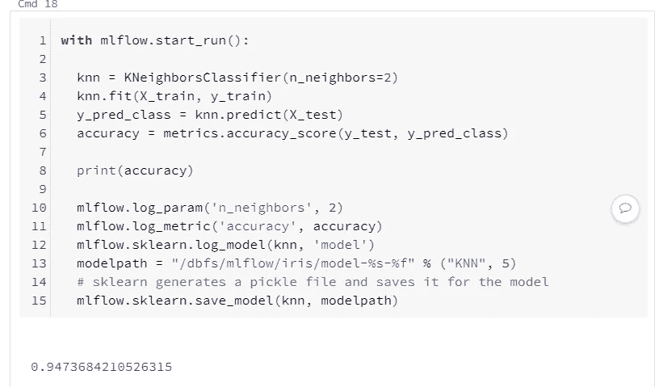
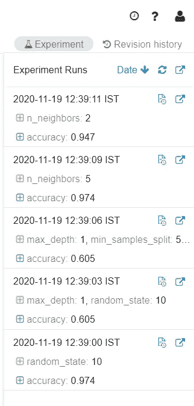
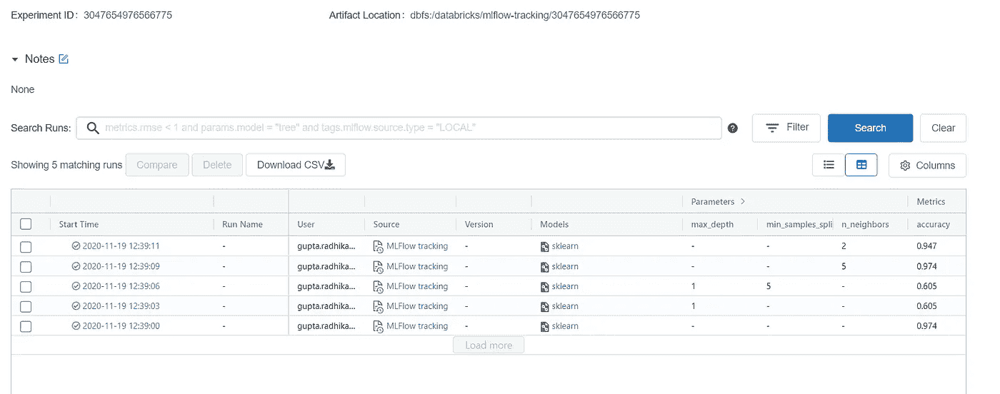

# 物流跟踪

> 原文：<https://medium.com/analytics-vidhya/mlflow-tracking-8e2b8c1fdd48?source=collection_archive---------15----------------------->

## 介绍

在使用不同的机器学习模型时，会出现具有不同参数和不同代码库的模型，这些模型具有如此多的指标，我们需要不断改进以获得最佳模型。人们使用 excel 表格来记录度量和参数，但是很难在 excel 表格中保存每个模型的所有记录，如果不止一个人在模型跟踪上工作将是一个挑战。这是 MLFlow 的跟踪组件。

MLflow 跟踪组件是一个 API 和 UI，用于记录参数、代码版本、测量值和输出文件，同时在以后运行和可视化机器学习代码的结果。

## 物流跟踪的优势

*   有助于跟踪不同数量的实验，数据迭代。
*   帮助获取特定迭代的不同超参数、特性和分析。
*   帮助我们保存模型以及参数和分析。
*   有一个 API 接口来获取所有的实验。

## 物流跟踪中的关键概念

这里的跟踪基于运行的概念，每次运行记录不同的信息，如下所示

1.  代码的版本
2.  参数—您选择的键值输入参数。
3.  度量 MLFlow 记录并使您可以可视化度量的完整历史，因为度量可以在整个运行过程中更新。
4.  工件—可以将图像、模型(例如，腌制的 scikit- learn 模型)和数据文件记录为工件。
5.  Source —文件名、项目名、运行的入口点
6.  标签和注释—关于每次跑步的信息
7.  运行的开始时间和结束时间

## 物流跟踪中的几个重要功能

**mlflow.start_run() —** 开始一个新的运行或执行一个当前活动的运行。

**mlflow.end_run() —** 结束当前活动的运行，如果有的话。

**mlflow.log_artifacts() —** 将目录中给定的所有文件记录为工件。

**mlflow.log_artifact() —** 将本地文件或目录记录为工件。

**mlflow.log_param() —** 记录当前活动运行中的单个键值参数

**mlflow.log_metric() —** 记录单个键值对，需要为数值。

**ml flow . sklearn . log _ model()—**记录 sk learn 拟合的估计器模型。

**ml flow . sk learn . save _ model()—**sk learn 生成一个 pickle 文件，并将其保存到模型的特定路径。

**mlflow.search_runs() —** 搜索当前实验中包含的运行。

图 1:一个样本运行

上图只是一个样本运行的例子。我们可以通过改变参数和使用不同的度量进行多次运行。

图 2:实验中的所有运行

图 2 显示，由于 MLFlow 跟踪，databricks 环境具有显示整个实验中发生的所有运行的功能。

图 3: MLFlow 用户界面

这就是 MLFlow UI 的外观，如果有许多运行，可以通过应用过滤器来搜索运行，可以下载包含运行记录的 csv 文件，并将其发送给负责模型治理的团队。我们甚至可以根据自己的选择来比较运行次数的结果。每次运行的运行 ID、运行名称和开始时间也在那里。

链接到数据砖笔记本-

1.  [https://data bricks-prod-cloudfront . cloud . data bricks . com/public/4027 EC 902 e 239 c 93 eaaa 8714 f 173 bcfc/8231051908381811/3047654976566775/5591676128474300/latest . html](https://databricks-prod-cloudfront.cloud.databricks.com/public/4027ec902e239c93eaaa8714f173bcfc/8231051908381811/3047654976566775/5591676128474300/latest.html)