# 预测媒体偏见

> 原文：<https://medium.com/analytics-vidhya/mlforsocial-predicting-media-bias-8e94d03befb5?source=collection_archive---------14----------------------->

使用机器学习来理解和预测文章中的媒体偏见。

# 背景

**媒体偏见**是指包括社交媒体在内的大众媒体在*选择*报道的事件和故事以及*如何报道这些事件和故事时的偏见或被认为的偏见。*

“媒体偏见”一词意味着违反新闻标准的普遍或广泛的偏见，而不是单个记者或文章的观点。各国媒体偏见的方向和程度存在广泛争议。[维基百科]

最近的一个例子- *穆勒报告*证明，根据你在穆勒报告修订版发布后的阅读和观察，你可能会遇到这两种说法中的一种。但是，除非你特意让自己接触不同的视角，否则你很可能没有遇到这两种观点的完整版本。

这是不幸的。就像这类事情经常发生的情况一样，真相很可能就在中间的某个地方。[发布 _ 话语]

对于我们千禧一代中的少数人来说，只是在最近，事情才开始螺旋式下降，但大众媒体的声誉几乎总是颠倒的。自从古腾堡让他的印刷机运转起来后，人们也开始生产泥浆。

你可以在这里找到几个这样的例子

# 获取数据

为了开始我们的分析，我们需要从各种不同的媒体机构获得一个文章数据集，这些文章已经被预先标记为有偏见或没有偏见。

我将使用的数据集来自[广告丰特斯媒体](https://www.adfontesmedia.com/interactive-media-bias-chart/?v=402f03a963ba)。即使它们不提供文章的实际文本，但是 csv 导出包含文章的 URL。

我用 python 创建了一个简单的脚本[,使用 Beautiful Soup 和请求库来获取实际的文章文本。](https://github.com/abhijeetdtu/indianmedia/blob/master/IndianMedia/load_job/ArticleScraper.py)

要跟踪代码，您可以在这里查看 colab 笔记本

现在数据看起来如下。

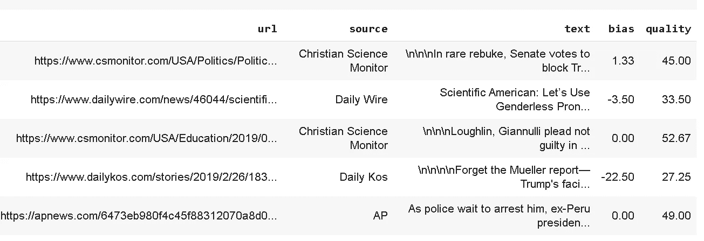

*   url —文章的公共 url
*   来源—媒体之家
*   文本—文章的文本
*   偏差—偏差分数，其中< 0 is left bias and > 0 为右偏差
*   质量——由人工阅读器评分的文章质量。

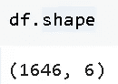

我们总共有 1646 篇文章。

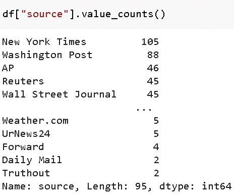

我们来看一下*源列。我们有大约 95 家不同的媒体公司，包括* [*【纽约时报】*](https://www.nytimes.com/)*[*【华盛顿邮报】*](https://www.washingtonpost.com/) *etch。**

*有几个来源的文章很少，像每日邮报，最好是摆脱这样的来源，因为它们增加了偏斜*

*我们有两栏来帮助我们的分析——文本和偏见。*

*现在让我们看看这个偏差变量到底是什么*

*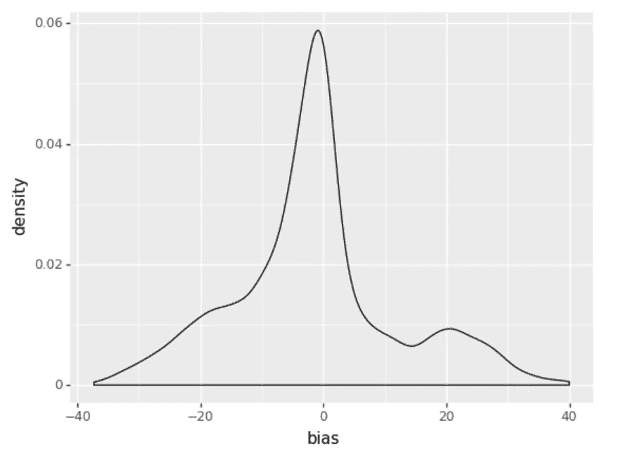*

*我们看到大多数文章的偏差非常接近于零，其值在-40 到+40 之间*

# *回归还是分类？*

*现在，由于我们正在尝试预测偏差，并且偏差是数字列，我们可能希望尝试回归，但在这种方法中，我们首先将偏差列分为 3 个类别—左、中、右，然后尝试进行分类。*

*+5，-5 的截止值是基于对上述偏差密度图的目测。*

*在宁滨之后，我们在下面看到最频繁的 bin 是 *center。**

*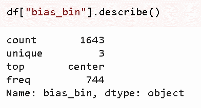*

# *特征抽出*

*现在，为了从文本中提取特征，我们首先加载空间模型，然后对句子进行词汇化，以创建一个新列 *text_pos**

*然后我们玩一个把戏，想出特色。我们的想法是利用这样一个事实，即我们已经标记的数据带有一个可由 TF-IDF 矢量器使用的词汇表，因此 vocab 不是基于单个文章，而是基于已知的偏差标签。*

*因此，我们首先使用“bias_bin”标签对数据帧进行分组，然后为每个标签组合“text_pos”。*

*本质上，我们已经将每个类别的所有文章合并成一篇大文章，然后对其运行 TfIdf 矢量器*

*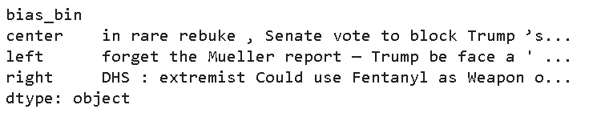*

*请注意，我们指定 min_df = 1 和 max_df=1，以便来自不同类别的短语可以有助于区分特征。*

***max_df***

*构建词汇表时，忽略文档频率严格高于给定阈值的术语(特定于语料库的停用词)。如果在范围[0.0，1.0]内浮动，该参数表示文档的比例，整数绝对计数。如果词汇不是 None，则忽略此参数。*

***min_df***

*构建词汇表时，忽略文档频率严格低于给定阈值的术语。*

*之后，我们可以使用。TfIdf 矢量器上的 get_feature_names 方法。下面是一个随机的特征样本*

*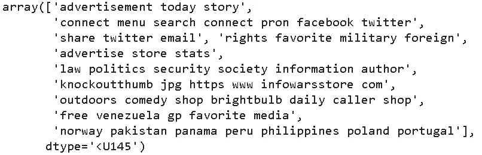*

*我们还删除了 n-gramss 是其他 n-gram 的子集。*

*也就是说，假设我们得到两个特征，比如*

*“政治安全”与“政治安全需求”*

*然后我们去掉“政治安全”以保持词汇量的易处理性。*

*现在，我们可以使用找到的特性，并将它们传递给另一个 TfIdf 矢量器，并对所有可用的文章进行矢量化*

*现在我们有了所有物品的数字表示，我们现在可以开始建模部分。*

# *建模*

*为了进行建模，我们首先将数据分为测试和训练，并依赖交叉验证。我们尝试了两种方法，一种使用高斯过程分类器，另一种使用集成堆叠方法。*

## *高斯过程分类器*

***高斯过程**是一个随机过程，其内核是高斯正态分布。换句话说，在高斯过程中，预测变量的每个(线性)组合都是多元正态分布的。因此，反过来说，任何预测变量基本上接近这一基本分布特性的目标变量都可以使用高斯过程进行建模！高斯过程对回归和分类的这种扩展，在`sklearn`中分别作为`GaussianProcessRegressor`和`GaussianProcessClassifier`存在。[卡格尔 _ 居民 _ 马里奥]*

*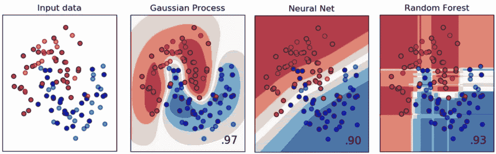*

*高斯过程分类器与其他分类器*

*在 5 重交叉验证中，我们只能得到不错的分数*

*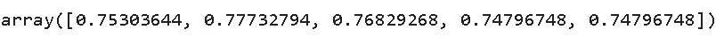*

*如果我们在训练集和测试集上分别运行，我们会得到*

*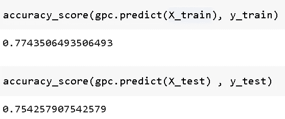*

## *堆积分类器*

*堆叠分类器包括堆叠单个估计器的输出，并使用分类器来计算最终预测。堆叠允许通过使用每个估计器的输出作为最终估计器的输入来使用每个估计器的强度[SKLEARN_STK]*

*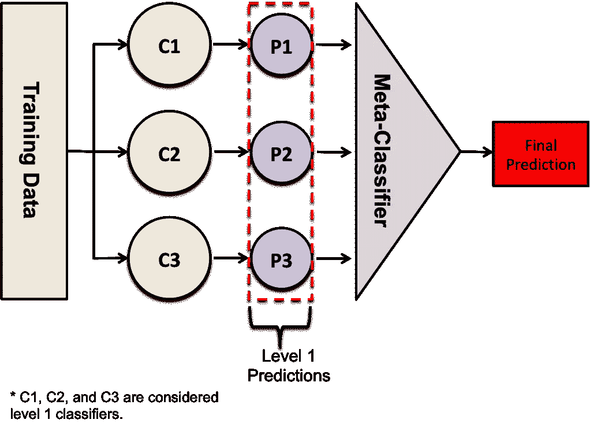*

*因此，我们尝试将高斯过程分类器与 Ada Boost 分类器堆叠在一起。*

*我们的分数只有很小的提高*

*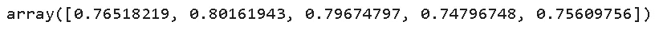*

# *结果和偏差-方差权衡*

*尽管准确性几乎很糟糕，但要注意的一个事实是，训练集和测试集的差异并不是很大，因此我们没有方差问题，而是偏差问题。*

*偏差误差是学习[算法](https://en.wikipedia.org/wiki/Algorithm)中错误假设产生的误差。高偏差会导致算法错过特征和目标输出之间的相关关系(欠拟合)。[维基百科 _ 偏见 _ 差异]*

*因此，在这种情况下，性能不佳的最可能原因是要素或数据的质量。使用简单的文本表示(如 TfIdf)可能会有所贡献，或者它可能是数据中固有的，因为“媒体偏见”是语义性的，而过于语法化的 Tfidf 无法捕捉正确的信号。*

*希望你觉得这篇文章很有见地。在 [@linkedin](https://www.linkedin.com/in/abhijeet-pokhriyal-18a7649a/) 上找我*

# *来源*

*【PUB _ DISCOURSE】-[https://www.thepublicdiscourse.com/2019/05/51698/](https://www.thepublicdiscourse.com/2019/05/51698/)*

*【维基百科】-[https://en.wikipedia.org/wiki/Media_bias](https://en.wikipedia.org/wiki/Media_bias)*

*【ka ggle _ RESIDENT _ MARIO】—[https://www . ka ggle . com/RESIDENT MARIO/Gaussian-process-regression-and-class ification](https://www.kaggle.com/residentmario/gaussian-process-regression-and-classification)*

*【sk learn _ STK】-[https://sci kit-learn . org/stable/modules/generated/sk learn . ensemble . stacking classifier . html](https://scikit-learn.org/stable/modules/generated/sklearn.ensemble.StackingClassifier.html)*

*[WIKIPEDIA _ BIAS _ VARIANCE]-[https://en . WIKIPEDIA . org/wiki/BIAS % E2 % 80% 93 VARIANCE _ trade off #](https://en.wikipedia.org/wiki/Bias%E2%80%93variance_tradeoff#)*