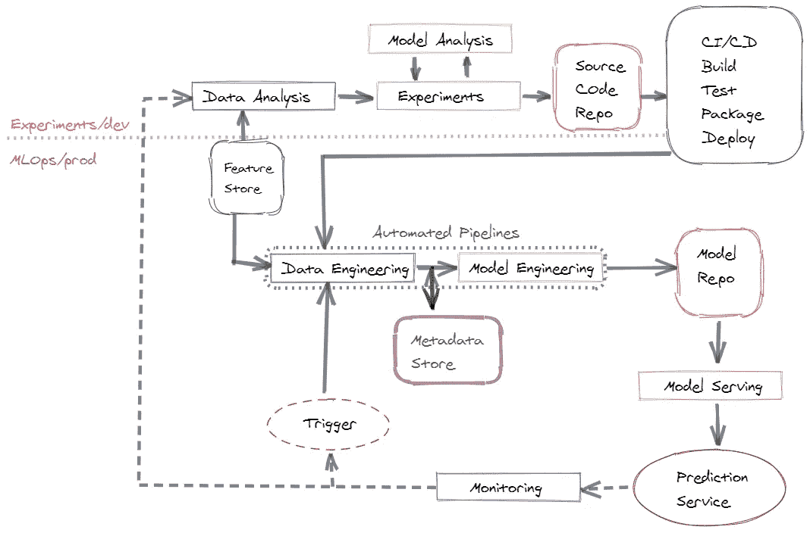

# 德沃普斯更好的表亲

> 原文：<https://medium.com/analytics-vidhya/mlops-devops-fancier-cousin-3b4667e81719?source=collection_archive---------12----------------------->

我们镇上有了一位新警长。DevOps 的老大哥…见见 MLOps。

ML 模型以实验的形式经历多次迭代，数据科学家在一组数据上训练它们，并在其他数据上测试它们。机器学习操作(MLOps)是创建从开发者到产品的管道的实践。DevOps 关注软件的版本，而 MLOps 关注代码、数据和 ML 模型本身的版本。

**目标**:使用完整的监控和再培训管道在生产中部署模型。

借助 MLOps，我们为 CI/CD 实践添加了两个新范例

1.  **持续监控(CM):** 一个 ML 系统就像它的预测一样好。由于数据变化、模型漂移和各种其他因素，经过最严格训练的模型可能会变坏。必须为模型保持一定的阈值，并且需要持续监控系统以捕捉这些变化并触发模型再训练管道
2.  **持续训练(CT)** :一个模型和它被训练的数据一样好。随着时间的推移，输入数据可能会随之改变，这可能会导致错误的预测。该模型可以通过对新获得的数据进行再训练来改进。

**MLOps 管道:**

MLOps 管道

ML 系统的核心在于数据。需要从多个来源收集数据，然后针对 ds 用例进行处理和转换。基于手边的用例，数据收集可以通过多种工具来完成。我使用的一些工具有****[**Dask**](https://dask.org/)**[**Spark**](https://spark.apache.org/)。******

****接下来，在收集数据后，数据科学家必须进行实验，以提取相关特征，然后训练模型。必须调整超参数，并使用不同版本的数据迭代进行模型训练，以获得最佳模型。这里有两件事非常重要:数据版本控制和模型版本控制。对于数据版本化，我更喜欢**，对于模型版本化，我使用 [**MLFlow**](https://mlflow.org/) **。********

****数据提取是一个昂贵的过程，当不同的数据科学团队处理相同的数据以提取相同的特征集时，可能会出现各种各样的问题。为了避免这种情况，使用存储所有最新功能的功能库是可行的。这里一些不错的选项有**[**hops works**](https://www.hopsworks.ai/)。******

****上述数据加载和模型工程是作为流水线步骤创建的。可以用来创建这些的一些工作流工具有: [**气流**](https://airflow.apache.org/) ， [**Kubeflow 管道**](https://www.kubeflow.org/docs/pipelines/overview/pipelines-overview/) ， [**Argo 工作流**](https://argoproj.github.io/argo/) 。****

****代码通常存储在 Git 或 Bitbucket 中。对于构建和部署，我使用了一个 [**Jenkins 管道**](https://www.jenkins.io/) **。******

****一个模型可以有很多种不同的服务方式。可以使用 Flask 或 Gunicorn 这样的服务器，在公开 REST Api 端点的同时部署模型。另一种选择是将其部署在 kubernetes pod 中，使用**或 [**KFServing**](https://www.kubeflow.org/docs/components/serving/kfserving/) 。对于边缘设备，模型需要嵌入到应用程序本身中。例如，在你的手机上，键盘上的自动更正功能是一个驻留在应用程序中的模型。******

****最后是与监控系统挂钩的再培训管道。对于监控，使用 MLFlow 捕获模型输入、输出和各种其他指标。当模型度量超过某个阈值时，模型再训练管道被触发。****

****不仅仅是训练模型，何时停止训练也很重要。对于那些不同意的人，下面这个家伙还在填写他的所得税表格。****

********

****XKCD #2265****