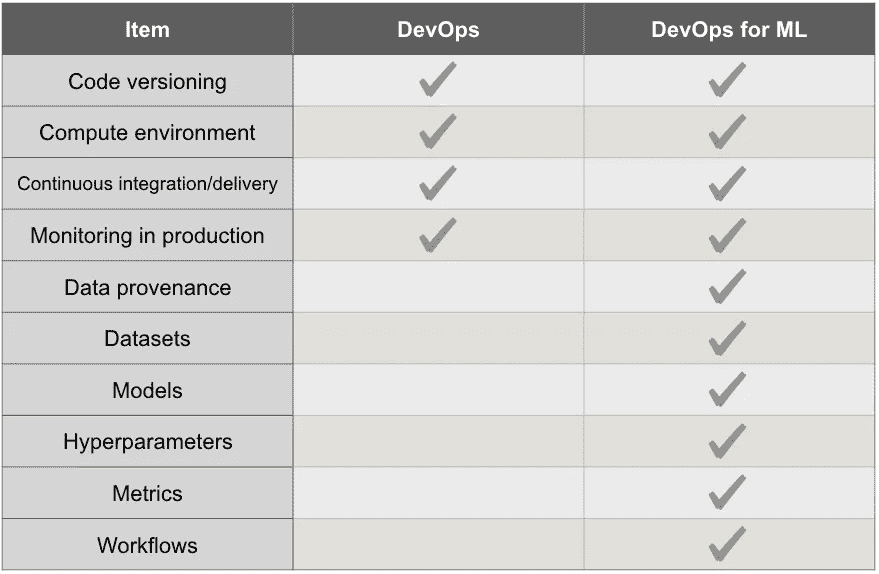

# MLOps:生产 ML 模型的时代

> 原文：<https://medium.com/analytics-vidhya/mlops-the-epoch-of-productionizing-ml-models-4eec06d93623?source=collection_archive---------15----------------------->

如果你有类似的问题，比如“**什么是 MLOps？**“，”*为什么要采用 MLOps？*“，” **DevOps vs MLOps** 有什么区别，什么时候用哪个？”、“**如何采用 MLOps** ？”。

> 那么你就到了正确的地方。

**这个博客我分成两部分**

[**第 1 部分:**源于 MLOps。](/@theadisoni/mlops-the-epoch-of-productionizing-ml-models-4eec06d93623)

[**第二部分:**天蓝色的 MLOps。](/@theadisoni/mlops-in-azure-f6e7c006fe0e)

## 所以让我们从第 1 部分开始:**起源于 MLOps** 。

**MLOps** (机器学习和“信息技术操作”的复合物)是**数据科学家和** (IT)专业人员之间协作和交流的新学科/焦点/实践，同时**自动化**和**生产**机器学习算法。

## **什么是 MLOps？**

简单来说，**m lops**(ML 的 DevOps)就是 DevOps 的机器学习等价物。虽然 DevOps 帮助优化了大数据项目的生产生命周期，但 **MLOps** 试图解决与在生产中实施 **ML 相关的问题。**

## **从 DevOps 到 MLOps:**

## 为什么采用 MLOps？

对于实施 ML 的企业来说， **MLOps** 应该是重中之重。它可以通过以下方式简化业务流程:

*   **MLOps** 可以处理监管和合规问题。虽然它向运营团队介绍了最新的法规和最佳行业实践，但它允许数据科学团队专注于构建和部署创造性的 ML 模型。
*   **机器学习操作化**有助于减少发现见解和将这些见解转化为可操作的商业计划之间的差距。
*   通过让**数据科学家和运营团队**一起工作， **MLOps** 将商业知识的力量与数据结合起来。这鼓励了数据驱动的业务运营。

## MLOps 和 DevOps 有什么不同？

*   数据/模型版本**！=** 代码版本化
*   再训练能力需要随需应变，因为模型会随时间衰减。
*   模型重用完全不同于**软件**重用，因为模型需要基于**场景**和数据进行调整。
*   当重用一个模型时，需要进行微调。将学习转移到 it 上，这就形成了一个**培训管道。**

## 如何领养 MLOps？

对于 ***容错*** 和 ***ML 模型的迭代过滤是必不可少的*** ，为此需要可再现性。**照亮变异源**所需的可重复性，如

*   CPU **多线程**
*   不确定的 **GPU 浮点**点计算
*   不一致的**超级参数**
*   **数据集的混排**
*   嘈杂的隐藏层
*   变更为**型号**架构
*   层权重的随机初始化
*   **ML 框架的变化**

# ML 操作:

## 可控制性

当继续建立**生产更新**时，在 **ML 管道**中确实很困难，因为不仅管道中的原始代码会改变，而且当通过**人工批准**或一些高级自动选择方法选择新的重新训练模型时，新的改变应在适当控制下完成，不能有 **ML 应用**的任何不稳定性或停机时间。

## 自动化

***ML 管道是代码，DevOps 工具链管道在 MLOps 中起着必不可少的作用。*** 由 Jenkins 和 orchestrators 如 [AirFlow](https://airflow.apache.org/) 促成的源代码库自动化就是一个经典的例子。但是当涉及到 ML 流水线时，存在像**模型批准**和漂移检测这样的相互依赖性。这些额外的依赖需要与 **DevOps 工具链管道集成。**

## 模型监督

模型管理是 MLOps 的**核心。当涉及到管理复杂的管道时，其中需要生成大量的模型、对象和**训练管道**。**

## 模型版本控制

为了生产的稳定性和容错性，可逆地进行更改是必要的。与 **ML 模型的源代码版本不同**是传统管道的一个额外步骤。

## 模型跟踪

**模型的复杂管道**导致管道中有许多模型运行，就像集合模型运行的情况一样。创建这么多实验来选择最佳冠军或挑战者模型需要模型跟踪。有不同种类的工具，如 **MLflow** 可用于跟踪模型，或者可以根据用例构建定制的管道。

## ML 监控

***监控 ML 系统中的*** 不仅仅是检查不同服务和资源的正常运行时间/计算其花费。正如在**生产**中一样，ML 将与**业务成果的成功直接相关的事情纳入监控。**

## ML 数据漂移

**输入和输出**数据之间的关系随时间的变化称为数据漂移。数据漂移分析应在 ML 监控中。数据漂移的可观测性对于分析再训练是否需要 ML 模型配置的任何改变是至关重要的。这就是需要推理监控的原因。简单讨论一下**推理监控**。

## 推理监控

**持续监控**推理，观察其是否按照预期界限运行。该**监控告知**检测数据漂移的输入和输出数据的不匹配，并且它还提供 ML 模型的性能，使用该性能分析和模型的**比较**是可能的。

# 支持 MLOps 的优势:

*   它的优势是最大限度地捆绑和增加对现有机器学习和数据科学工具和技术的投资，并创建一个整合，一个维护不同团队和不同项目之间记录的系统
*   它有助于管理和维护数据科学和 IT/Ops 团队的**合作关系，共同努力**提供 ML 驱动的应用程序，这些应用程序可以在结果中提供一些价值。
*   它有助于**最大限度地减少对组织的危害**,方法是规范和引入大量的治理清单和平衡，以及在生产层面使用机器学习模型的**最佳实践**。
*   **通过快速、完美地将机器学习的真正潜力转化为业务流程(已经存在)和**系统**(存在于整个企业)来广泛扩展 ML 模型计划**

> 这就是第二部分:Azure 中的 MLOps 的全部内容

*   简介:[天蓝色的 m lops](/@theadisoni/mlops-in-azure-f6e7c006fe0e)
*   概观
*   Azure MLOps 功能
*   [在 Azure DevOps 中为 MLOps 创建一个带有 CI/CD 的项目](/@theadisoni/mlops-in-azure-f6e7c006fe0e)

让我们在第二部分赶上

> **谢谢**