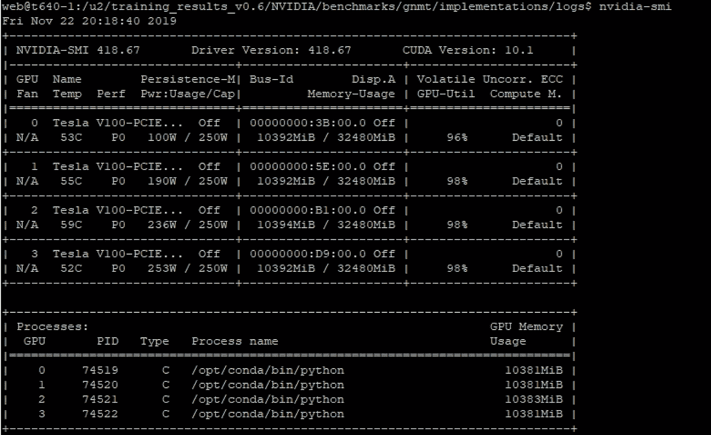
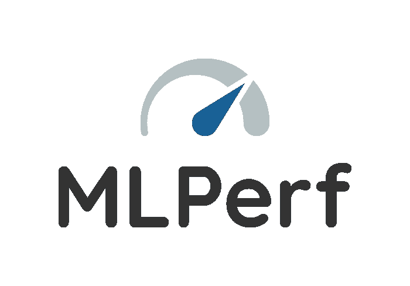

# MLPerf:尝试 ML 工作负载基准测试

> 原文：<https://medium.com/analytics-vidhya/mlperf-getting-your-feet-wet-with-benchmarking-ml-workloads-6ecd57620ac6?source=collection_archive---------2----------------------->


用于测量 ML 硬件、软件和服务的训练和推理性能的基准套件

本文涵盖了设置和运行 MLPerf 培训基准之一所涉及的步骤。这将为读者提供一个基本的理解，即如何通过利用以前的提交者所做的工作来有效地开始使用 MLPerf。MLPerf 正在成为比较不同类型的专用基础设施或软件框架的有趣实验的事实上的 ML 工作负载。这篇文章还将使那些希望提交自己的 MLPerf 结果的人熟悉运行基准测试所涉及的步骤。无论最终目标是什么，让我们从如何开始在您的硬件上执行 MLPerf 基准开始:无论是在本地还是在云中。

在本系列的第一篇文章中，我们将介绍如何在 GPU 服务器上运行 MLPerf 训练基准之一。训练复杂的深度神经网络(DNN)模型需要大量的计算资源才能在合理的时间内完成。MLPerf 培训基准套件、提交和审核流程的全面概述在 MLPerf 社区发布的文章中有所描述。

*被测系统(硬件环境)*:我使用一台配备了 4 个 NVIDIA Tesla V100 PCIe GPU 加速器的 GPU 服务器来演示如何运行其中一个 MLPerf 训练基准。

*软件环境:* MLPerf 要求所有基准提交使用容器来打包所有软件依赖项，并提供脚本来下载和准备数据集。这使得社区可以轻松地在其他系统上复制或运行基准测试。如果你不熟悉 docker，有很多资源和教程可以帮助你开始学习，比如微软 ML 团队的[教程](https://blogs.technet.microsoft.com/machinelearning/2018/03/15/demystifying-docker-for-data-scientists-a-docker-tutorial-for-your-deep-learning-projects/)。

基准测试可以通过以下步骤运行:

1.  设置 docker 和软件对被测系统的依赖性。网上有各种资源可以做这件事，对于 GPU 服务器我必须安装 Docker 和 Nvidia-Docker。一些基准可能有额外的设置，在他们的阅读材料中提到。
2.  从 ml perf GitHub repo:[https://github.com/mlperf](https://github.com/mlperf)下载基准测试软件库，其中包括运行基准测试所需的代码、脚本和文档
3.  使用基准目录中提供的脚本下载并验证数据集。这是在 docker 之外的被测系统上运行的。
4.  使用每个基准测试中包含的脚本和指令，构建并运行 docker 映像。每个基准将运行，直到达到目标质量，然后停止，打印计时结果和附加信息将被捕获在一个日志文件中。

> 运行培训基准的逐步说明

首先，克隆最新的 MLPerf 培训结果存储库，如下所示。对于训练基准，建议使用现有结果提交之一( *training_results_v0.5* 或 *training_results_v0.6* )，而不是 mlperf/training 存储库中提供的参考实现。这是因为参考代码是 alpha 版本，并不打算用于软件框架或硬件的实际性能测量。

```
**git clone** [**https://github.com/mlperf/training_results_v0.6.git**](https://github.com/mlperf/training_results_v0.6.git)
```

接下来，让我们研究下载的代码，并找到下载数据集、构建和运行 docker 容器等的脚本。在顶层，有每个供应商提交(谷歌，英特尔，英伟达等)的目录，其中包含用于生成他们提交的结果的代码和脚本。我们将重点关注 NVIDIA 提交，因为我们希望在 NVIDIA GPUs 上运行基准测试

```
$/home/training_results_v0.6$ **ls**
Alibaba  CONTRIBUTING.md  Fujitsu  Google  Intel  LICENSE  NVIDIA  README.md$/home/training_results_v0.6$ **cd NVIDIA**$/home/training_results_v0.6/NVIDIA$ **ls**
benchmarks  LICENSE.md  README.md  results  systems$/home/training_results_v0.6/NVIDIA$ **cd benchmarks; ls** gnmt  maskrcnn  minigo  resnet  ssd  transformer
```

在 NVIDIA/基准目录中，我们可以看到 6 种不同的培训基准。让我们选择第一个基准“GNMT ”,它是一个递归神经网络模型，类似于 Google 的语言翻译模型。[NVIDIA 提供了关于软件要求、数据集细节、执行的预处理以及在单节点和多节点系统上运行数据集的步骤的文档](https://github.com/mlperf/training_results_v0.6/tree/master/NVIDIA/benchmarks/gnmt/implementations/pytorch)。

由于我们对在单个节点上运行基准测试感兴趣，我们将挑选单个节点( [NVIDIA DGX-1](https://github.com/mlperf/training_results_v0.6/tree/master/NVIDIA/benchmarks/gnmt/dgx1_ngc19.05_pytorch) )的提交结果，并使用其文档在我们的系统上运行 GNMT。

## 下载并验证数据集

下载和验证数据集的脚本可以在*实现*目录中获得。运行脚本以下载和准备数据集，根据您的网络连接，这需要大约 90 分钟，并且需要大约 1.2GB 的文件系统空间。通过执行第二个脚本，验证数据集是否已正确下载。

```
$/home/training_results_v0.6/NVIDIA$ **cd gnmt/implementations; ls**
download_dataset.sh  pytorch  verify_dataset.sh$/home/training_results_v0.6/NVIDIA/benchmarks/gnmt/implementations$ **bash download_dataset.sh**$/home/training_results_v0.6/NVIDIA/benchmarks/gnmt/implementations$ **bash verify_dataset.sh** OK: correct data/train.tok.clean.bpe.32000.en
OK: correct data/train.tok.clean.bpe.32000.de
OK: correct data/newstest_dev.tok.clean.bpe.32000.en
OK: correct data/newstest_dev.tok.clean.bpe.32000.de
OK: correct data/newstest2014.tok.bpe.32000.en
OK: correct data/newstest2014.tok.bpe.32000.de
OK: correct data/newstest2014.de
```

## 启动培训工作

执行培训作业的脚本和代码位于 *pytorch* 目录中。让我们研究一下这个目录中的文件。

```
$/home/training_results_v0.6/NVIDIA/benchmarks/gnmt/implementations$ **ls**
data  download_dataset.sh  logs  pytorch  verify_dataset.sh
$/home/training_results_v0.6/NVIDIA/benchmarks/gnmt/implementations$**cd pytorch; ls -l**
bind_launch.py
config_DGX1_multi.sh
config_DGX1.sh
config_DGX2_multi_16x16x32.sh
config_DGX2_multi.sh
config_DGX2.sh
Dockerfile
LICENSE
mlperf_log_utils.py
preprocess_data.py
README.md
requirements.txt
run_and_time.sh
run.sub
scripts
seq2seq
setup.py
train.py
translate.py
```

**配置 _ <系统>。sh** :由于我们在一个有 4 个 GPU 的系统上执行培训任务，我们必须创建一个新的配置文件来反映我们的系统配置。如果您的系统有 8 或 16 个 GPU，您可以使用现有的 config_DGX1.sh 或 config_DGX2.sh 配置文件来启动培训作业。

我创建了一个新的配置文件 config_SUT.sh(通过复制 config_DGX1.sh)并编辑它以反映我的系统配置。在这种情况下，我只需要将 GPU 的数量从 8 个更改为 4 个。您可能需要更改 CPU 核心和插槽的数量，以反映系统上的可用 CPU 资源。

```
$training_results_v0.6/NVIDIA/benchmarks/gnmt/implementations/pytorch$**cp config_DGX1.sh config_SUT.sh**Edit **config_SUT.sh** to reflect your system config## System config params
**DGXNGPU=4**
DGXSOCKETCORES=20
DGXHT=2         # HT is on is 2, HT off is 1
DGXIBDEVICES=''
DGXNSOCKET=2
BIND_LAUNCH=1
```

现在，您已经准备好构建 docker 容器并启动培训作业了。用 docker hub 注册名替换<docker>,这样就可以在其他系统或多节点运行中重用容器映像。</docker>

**Dockerfile** 这是 docker 容器的构建文件，将用于执行培训任务

```
**docker build -t <docker/registry>/mlperf-nvidia:rnn_translator .****docker push <docker/registry>/mlperf-nvidia:rnn_translator**
```

如果您没有 docker hub 帐户，您可以将其保存在本地系统上，并且不指定

```
**docker build -t mlperf-nvidia:rnn_translator .**
```

启动容器并查看其内容，验证它是否有 config_SUT.sh 文件等

```
**nvidia-docker run -it --rm mlperf-nvidia:rnn_translator** root@4e944d91164e:/workspace/rnn_translator# **ls -l *.sh**
config_DGX1.sh
config_DGX1_multi.sh
config_DGX2.sh
config_DGX2_multi.sh
config_DGX2_multi_16x16x32.sh
config_SUT.sh
run_and_time.sh
```

一旦您验证了正确的配置文件在新创建的 docker 容器中可用，我们现在就可以使用启动脚本**run . sub**执行培训作业，并为数据集、日志文件和配置文件设置环境变量

DATADIR =<path>LOGDIR =<path>PULL = 0 dgx system =<config file="">。/run.sub</config></path></path>

对于我的测试，我将使用 config_SUT.sh，因此将 DGXSYTEM 指定为 SUT。我创建了一个新的目录“logs”来存储基准日志文件，并在启动基准运行时指定路径，如下所示:

```
DATADIR=/home/training_results_v0.6/NVIDIA/benchmarks/gnmt/implementations/data LOGDIR=/home/training_results_v0.6/NVIDIA/benchmarks/gnmt/implementations/logs DGXSYSTEM=SUT PULL=0 ./run.sub
```

如果一切顺利，您应该可以开始比赛了，它将执行 10 次基准测试，并将日志文件存储在指定的目录中。由于我们在配置文件中指定了 4 个 GPU，我们看到所有 4 个 GPU 都被用于训练 GNMT 模型。



基准运行时间可以在日志文件中找到。我的跑步结果显示如下。运行的平均时间是 90 分钟，完成 10 次迭代需要将近 15 个小时。如果您不想运行所有 10 次迭代，可以修改 run.sub 来限制运行次数。

```
$/home/training_results_v0.6/NVIDIA/benchmarks/gnmt/implementations/logs$ **grep RNN_TRANSLATOR *.log**
1.log:RESULT,RNN_TRANSLATOR,,3795,nvidia,2019-11-22 09:25:23 PM
2.log:RESULT,RNN_TRANSLATOR,,4683,nvidia,2019-11-22 10:28:56 PM
3.log:RESULT,RNN_TRANSLATOR,,3807,nvidia,2019-11-22 11:47:17 PM
4.log:RESULT,RNN_TRANSLATOR,,5594,nvidia,2019-11-23 12:51:02 AM
5.log:RESULT,RNN_TRANSLATOR,,6473,nvidia,2019-11-23 02:24:33 AM
6.log:RESULT,RNN_TRANSLATOR,,5576,nvidia,2019-11-23 04:12:43 AM
7.log:RESULT,RNN_TRANSLATOR,,6484,nvidia,2019-11-23 05:45:57 AM
8.log:RESULT,RNN_TRANSLATOR,,4683,nvidia,2019-11-23 07:34:19 AM
9.log:RESULT,RNN_TRANSLATOR,,6481,nvidia,2019-11-23 08:52:40 AM
10.log:RESULT,RNN_TRANSLATOR,,5580,nvidia,2019-11-23 10:40:59 AM
```

其余目录(mask-rcnn、minigo、resnet、ssd 和 transformer)中的其他训练基准可以使用类似的步骤运行——下载数据集、构建和运行 docker 容器。您可以使用 MLPerf 培训基准来比较不同的 GPU 系统或评估不同的软件框架等。例如，您可以使用 MLPerf 评估存储子系统对 ML 工作负载的影响，或者评估如何改进 MLPerf 基准测试 metrics⁴.

```
[1] MLPerf Training Benchmark, Oct 2019 [https://arxiv.org/pdf/1910.01500.pdf](https://arxiv.org/pdf/1910.01500.pdf)[2] Google's Neural Machine Translation System: Bridging the Gap between Human and Machine Translation, Oct 2016
[https://arxiv.org/abs/1609.08144](https://arxiv.org/abs/1609.08144)[3]   Exploring the Impact of System Storage on AI & ML Workloads via MLPerf Benchmark Suite,   Wes Vaske
  [https://www.flashmemorysummit.com/Proceedings2019/08-08-Thursday/20190808_AIML-301-1_Vaske.pdf](https://www.flashmemorysummit.com/Proceedings2019/08-08-Thursday/20190808_AIML-301-1_Vaske.pdf)[4]  Metrics for Machine Learning Workload Benchmarking, Snehil Verma et al
  [https://researcher.watson.ibm.com/researcher/files/us-ealtman/Snehil_Metrics_for_Machine_Learning_Workload_Benchmarking.pdf](https://researcher.watson.ibm.com/researcher/files/us-ealtman/Snehil_Metrics_for_Machine_Learning_Workload_Benchmarking.pdf)
```

