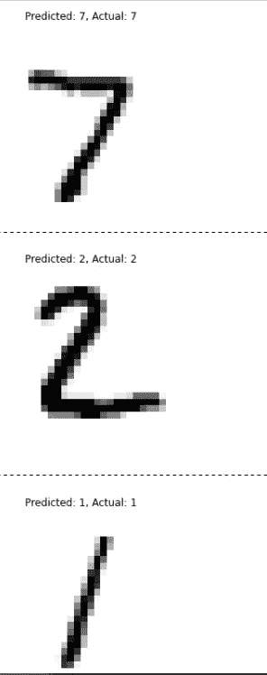
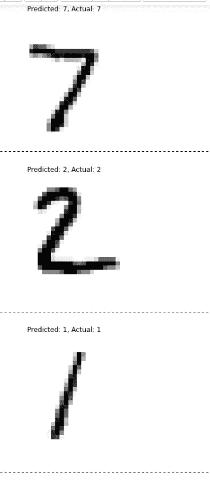
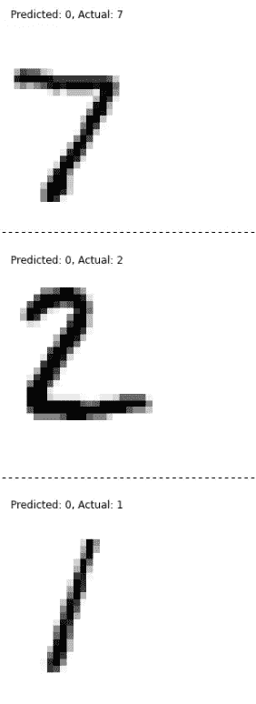

# 使用不同激活函数和优化器的 MNIST 分类及其实现——精度比较

> 原文：<https://medium.com/analytics-vidhya/mnist-classification-using-different-activation-functions-and-optimizers-with-implementation-dc1ed7abc341?source=collection_archive---------3----------------------->

我尝试使用 keras 版本 2.4.0 在 Tensorflow 版本 2.3.1 中创建一个模型，该模型是在 MNIST 数据集上训练的。这个数据集包含 60000 个手写数字的图像，从 0 到 9，每个大小为 28x28。

为此，我在最后一层(输出层)使用了 3 个不同的激活函数，即 softmax、sigmoid 和 tanh。

> **model 1 = TF . keras . models . sequential([
> TF . keras . layers . flatten(input _ shape =[28，28])，
> tf.keras.layers.Dense(300，activation="relu ")，
> tf.keras.layers.Dense(100，activation="relu ")，
> tf.keras.layers.Dense(10，activation = " soft max ")
> )**

从上面的代码来看，最后一层的激活函数是 softmax(推荐用于多类分类)

> **model 2 = TF . keras . models . sequential([
> TF . keras . layers . flatten(input _ shape =[28，28])，
> tf.keras.layers.Dense(300，activation="relu ")，
> tf.keras.layers.Dense(100，activation="relu ")，
> tf.keras.layers.Dense(10，activation = " sigmoid ")
> ])【T13**

从上面的代码来看，最后一层的激活函数是 sigmoid(推荐用于二进制分类)

> **model 3 = TF . keras . models . sequential([
> TF . keras . layers . flatten(input _ shape =[28，28])，
> tf.keras.layers.Dense(300，activation="relu ")，
> tf.keras.layers.Dense(100，activation="relu ")，
> tf.keras.layers.Dense(10，activation = " tanh))
> )【t23**

根据上面的代码，最后一层的激活函数是 tanh(推荐用于二进制分类)

对于以上创建的所有模型，使用相同的“稀疏分类交叉熵”损失函数和“SGD”(随机梯度下降)优化器。

> **LOSS _ FUNCTION = " sparse _ category _ cross entropy "
> OPTIMIZER = " SGD "
> METRICS =[" accuracy "]
> model 1 . compile(LOSS = LOSS _ FUNCTION，
> optimizer=OPTIMIZER，
> metrics=METRICS)**

以上代码保持不变，只有' **model1.compile** '会变成' **model2.compile** '等等。

在这样做之后，该模型被训练 30 个时期

> **EPOCHS = 30
> VALIDATION _ SET =(X _ valid，y _ valid)
> history = model 1 . fit(X _ train，y_train，epochs=EPOCHS，
> VALIDATION _ data = VALIDATION _ SET)**

同样' **model1.fit** '也会改变

30 个纪元后

> **模型 1-损耗:0.0278-精度:0.9936-val _ 损耗:0.0706-val _ 精度:0.9800**
> 
> **model 2-loss:0.0317-accuracy:0.9926-val _ loss:0.0712-val _ accuracy:0.9796**
> 
> **model 3-loss:3.8495-精度:0.0990-val _ loss:3.7865-val _ 精度:0.0958**

这表明 softmax 和 sigmoid(令人惊讶地)表现良好，但 tanh 的精度为 0.0990，这意味着模型几乎没有学到任何东西。当模型在' **X_test** 和' **y_test** 数据上进行测试时。只有**模型 3** ( **tanh** )给出了错误的预测，而 **sigmoid** 给出了低概率，例如

```
array([[0\.  , 0\.  , 0\.  , 0\.  , 0\.  , 0\.  , 0\.  , 0.47, 0\.  , 0\.  ],
       [0\.  , 0\.  , 0.73, 0\.  , 0\.  , 0\.  , 0\.  , 0\.  , 0\.  , 0\.  ],
       [0\.  , 0.26, 0\.  , 0\.  , 0\.  , 0\.  , 0\.  , 0\.  , 0\.  , 0\.  ]],
      dtype=float32) #Here the array has 3 arrays inside it and each array shows the prediction, so the model says that the input data is 47 percent digit 7(based on the position) and so on
```



而 **softmax** 给出了高概率。

```
array([[0., 0., 0., 0., 0., 0., 0., 1., 0., 0.],
       [0., 0., 1., 0., 0., 0., 0., 0., 0., 0.],
       [0., 1., 0., 0., 0., 0., 0., 0., 0., 0.]], dtype=float32)
```



对于 tahn 来说，概率是

```
array([[ 1.,  1.,  1., -1.,  1.,  1.,  1.,  1.,  1.,  1.],
       [ 1.,  1.,  1., -1.,  1.,  1.,  1.,  1.,  1.,  1.],
       [ 1.,  1.,  1., -1.,  1.,  1.,  1.,  1.,  1.,  1.]], dtype=float32)
```



正如你所看到的，model3 在测试阶段表现不佳，它错误地预测了所有的数字 0。

再次进行相同的操作，但是使用的优化器是' **Adam** '，softmax 给出了相同的概率(预测)，但是 sigmoid 给出了比以前的 sigmoid 模型更好的概率，tanh 没有显示出改进

对于**乙状结肠**

```
X_new = X_test[:3]
y_proba = model2.predict(X_new)#where model2 uses sigmoid
y_proba.round(2)
```

Out[67]:

```
array([[0., 0., 0., 0., 0., 0., 0., 1., 0., 0.],
       [0., 0., 1., 0., 0., 0., 0., 0., 0., 0.],
       [0., 1., 0., 0., 0., 0., 0., 0., 0., 0.]], dtype=float32)
```

对于 **softmax**

```
X_new = X_test[:3]
y_proba = model1.predict(X_new) # where model uses sofmax
y_proba.round(2)
```

Out[66]:

```
array([[0., 0., 0., 0., 0., 0., 0., 1., 0., 0.],
       [0., 0., 1., 0., 0., 0., 0., 0., 0., 0.],
       [0., 1., 0., 0., 0., 0., 0., 0., 0., 0.]], dtype=float32)
```

而对于**谭**

```
X_new = X_test[:3]
y_proba = model3.predict(X_new)#where model3 uses tanh
y_proba.round(2)
```

Out[68]:

```
array([[ 1.,  1.,  1., -1.,  1.,  1.,  1.,  1.,  1.,  1.],
       [ 1.,  1.,  1., -1.,  1.,  1.,  1.,  1.,  1.,  1.],
       [ 1.,  1.,  1., -1.,  1.,  1.,  1.,  1.,  1.,  1.]], dtype=float32)
```

理解:
当我们在多类分类的情况下使用 softmax 时，我们获得了非常好的准确性，但是当使用 tanh 时，我们获得了较差的准确性，sigmoid 和 tanh 都主要在面临二分类问题时使用。在这种情况下，当**乙状结肠**与 **SGD** 一起使用时，概率较低，但仍然可以分类，当**乙状结肠**与 **Adam** 一起使用时，概率较高。(不知道这种情况下乙状结肠是怎么工作的)

最终点数
1。多级分类时使用 soft max
2。在二元分类的情况下，使用 sigmoid 或 tanh