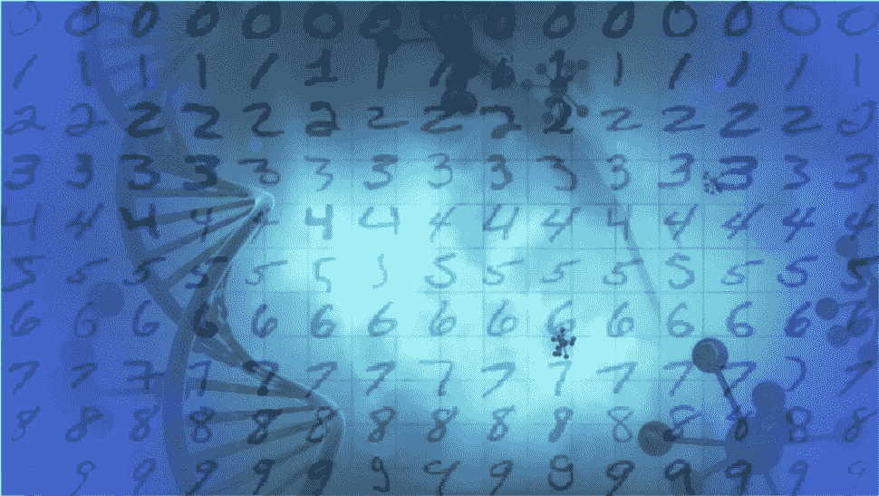

# 基于遗传 CNN 的 MNIST 分类器

> 原文：<https://medium.com/analytics-vidhya/mnist-classifier-using-genetic-cnn-e1e860ecc2e9?source=collection_archive---------6----------------------->

## 卷积神经网络的遗传优化

每个想要从事深度学习工作的人都从 **MNIST** (修改后的国家标准与技术研究所数据库)**手写数据分类**开始。这是一个相当简单的预处理和训练代码，无论你的模型有多好或多坏，精度几乎每次都超过 0.99。所以我们…