# 基于多层神经网络的 MNIST 手写数字识别

> 原文：<https://medium.com/analytics-vidhya/mnist-handwritten-digit-recognition-using-neural-network-2b729bacb0d5?source=collection_archive---------6----------------------->

人类视觉系统是世界的奇迹。人们很容易识别数字。但这并不像看起来那么简单。人类大脑有一百万个神经元和数十亿个神经元之间的连接，这使得这种异常复杂的图像处理任务变得更加容易。人们可以毫不费力地识别数字。

然而，对于计算机来说，识别数字是一项具有挑战性的任务。关于如何识别数字的简单直觉变得难以用算法表达。此外，不同的人在写作上有很大的差异，这使得写作变得非常复杂。

**手写数字识别系统**是一台机器进行自我训练的工作，以便它能够识别来自不同来源的数字，如电子邮件、银行支票、文件、图像等。

## Google Colab

Google Colab 已经被用来实现网络。这是一个免费的云服务，可用于使用 Keras、TensorFlow、PyTorch 和 OpenCV 等流行的库开发深度学习应用程序。Colab 区别于其他免费云服务的最重要的特点是；它提供 GPU，而且完全免费。因此，如果 PC 与硬件要求不兼容或不支持 GPU，那么它是最佳选择，因为稳定的互联网连接是唯一的要求。

# MNIST 数据集

MNIST 代表“修改后的国家标准与技术研究所”。这是一个包含 70，000 张手写图像的数据集。每个图像是 28×28 像素，即大约 784 个特征。每个特征只代表一个像素的强度，即**。从 0(白色)到 255(黑色)。**该数据库进一步分为 60，000 幅训练图像和 10，000 幅测试图像。

# 实施阶段

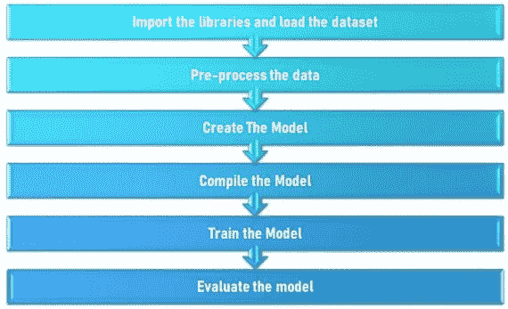

## 导入库

首先，我们导入了我们将要使用的所有库。

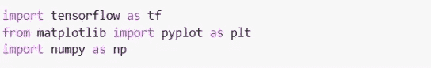

我们导入了 **TensorFlow** ，这是一个*开源免费库*，用于机器学习应用，如神经网络等。此外，我们从用于*可视化*目的的 **matplotlib** 库中导入了 **pyplot** 函数，该函数主要用于*绘图。之后，我们引入了 **NumPy** 即数值 Python，用于*执行各种数学运算。**

## *加载数据集*

Keras 库已经包含一些数据集，如 CIFAR10、CIFAR100、波士顿房价回归数据集、IMDB 电影评论情感分类数据集等。

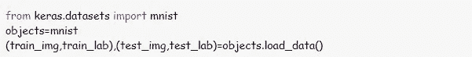

MNIST 数据集也是其中的一部分。所以，我们从 *keras.datasets* 中导入它，并将其加载到变量“objects”*中。**objects . load _ data()*方法返回训练数据(train_img)、其标签(train_lab)以及测试数据(test_img)及其标签(test_lab)。在数据集中提供的 70，000 幅图像中，60，000 幅用于训练，10，000 幅用于测试。

在预处理数据之前，我们首先在循环的*的帮助下显示了训练集的前 20 幅图像。*

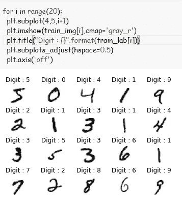

**subplot()** 用于给当前图形添加一个 subplot 或网格状结构。第一个参数用于“*行数”，*第二个参数用于“*列数”*，第三个参数用于网格中的位置索引。

假设我们必须从网格中的第二个位置开始，在 4x5 网格中绘制 10 幅图像。然后，它会像

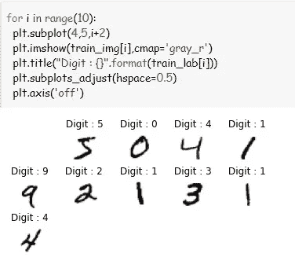

**imshow()** 用于将数据显示为图像，即训练图像(train_img[i])，而 **cmap** 代表彩色地图。 *Cmap* 是可选功能。基本上，如果图像在 shape (M，N)的数组中，那么 **cmap** 控制用来显示值的颜色图。cmap='gray '将图像显示为灰度，而 cmap='gray_r '用于将图像显示为反灰度。

**title()** 为每幅图像设置标题。我们已经将“Digit: train_lab[i]”设置为子情节中每个图像的标题。

**支线剧情 _adjust()** 用于调谐支线剧情布局。为了改变两行之间提供的空间，我们使用了 **hspace。如果你想改变两列之间的间距，你可以使用 wspace。**

默认情况下，子情节布局的参数是，

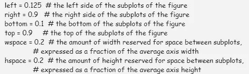

为了隐藏图像的轴，使用了**PLT . axis(‘off’)**。

之后，我们展示了培训和测试部分的形状。

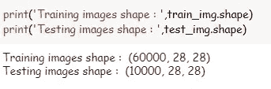

**(60000，28，28)** 表示训练集中有 60000 幅图像，每幅图像的大小为 28×28 像素。类似地，在测试集中有 10，000 个相同大小的图像。

因此，每个图像的大小为 28×28，即 784 个特征，每个特征表示从 0 到 255 的每个像素的强度。

可以使用***print(train _ img[0])***以 28x28 的矩阵形式打印第一张训练集图像。

我们在直方图上绘制了第一幅训练图像。正常化之前，

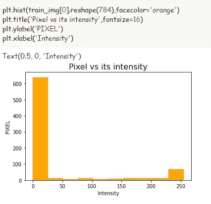

**hist()** 用于绘制第一幅训练图像的直方图，即 train_img[0]。图像被重新塑造成一个大小为 784 的一维数组。 **facecolor** 是一个可选参数，指定直方图的颜色。直方图的标题，Y 轴和 X 轴被命名为“像素与其强度”、“像素”和“强度”。

## 预处理数据

在将数据输入网络之前，我们将对其进行归一化处理。标准化输入数据有助于加快训练速度。此外，它减少了陷入局部最优的机会，因为我们使用[随机梯度下降](https://en.wikipedia.org/wiki/Stochastic_gradient_descent)来寻找网络的最优权重。

像素值介于 0 和 255 之间。因此，当使用神经网络模型时，输入值的缩放是很好的，因为缩放是众所周知的并且表现良好，我们可以通过将每个值除以最大强度 255 来非常快速地将像素值归一化到范围 0 和 1。

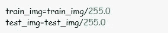

正常化后，

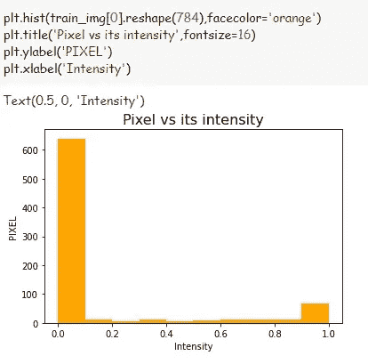

## 创建模型

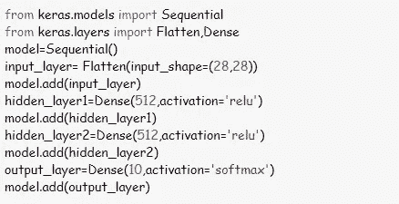

在 Keras 中创建模型有三种方式:

*   ***时序模型*** 非常直观简单。它允许逐层建立模型。
*   ***Functional API***是一个易于使用、功能全面的 API，支持任意模型架构。这就是 Keras 的“行业实力”模型。
*   ***模型子类*** 你可以自己从头开始实现所有的东西。

在这里，我们使用了 ***时序模型*** 。该模型有一个输入层、一个输出层和两个隐藏层。

**Sequential()** 用于按顺序创建一层网络。

**。这里使用 add()** 将图层添加到模型中。

在第一层(输入层)，我们输入图像。由于每个图像的大小为 28x28，因此我们使用了 ***Flatten()*** 来压缩输入。

我们在其他图层 ***中使用了*。**** *它保证上一层的每一个神经元都与下一层的每一个神经元相连。*

*该模型是一个简单的神经网络，具有两个带有 512 个神经元的隐藏层。一个整流器线性单元激活 **(ReLU)** 函数用于隐藏层中的神经元。最棒的是它的梯度总是等于 1，这样我们可以在反向传播过程中通过网络传递最大的误差。*

*输出层有 10 个神经元，即从 0 到 9 的每一类。在输出层使用了一个 **softmax 激活函数**,将输出转化为类似概率的值。*

**注意:你可以在隐藏层中添加更多的神经元。你甚至可以增加模型中隐藏层的数量来提高效率。不过训练的时候会花更多的时间。**

## *编译网络*

*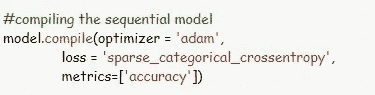*

*接下来，我们需要编译我们的模型。编译模型需要三个参数:优化器、损失和指标。优化器控制学习速率。我们使用**【亚当】**作为我们的优化器。在许多情况下，它通常是一个很好的优化器。它可以在整个训练过程中调整学习速度。*

*我们将使用**‘Sparse _ category _ cross entropy’**作为我们的损失函数，因为它节省了内存和计算的时间，因为它只是对一个类使用单个整数，而不是整个向量。分数越低，表示模型的性能越好。*

*为了确定准确性，我们将在训练模型时使用**“准确性”指标**来查看验证集的准确性得分。*

## *训练模型*

*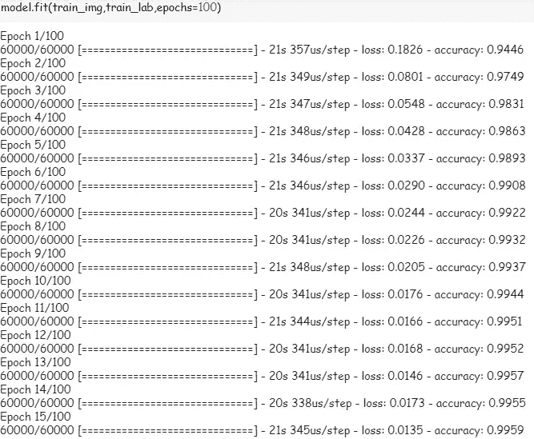*

*我们将借助 **fit()** 函数对模型进行训练。它将具有作为训练数据(train_img)、训练标签(train_lab)和时期数的参数。历元数是模型在数据中循环的次数。在一定程度上，我们运行的时代越多，模型就会改进得越多。此后，模型将在每个时期停止改进。*

*我们将模型保存为 **project.h5***

*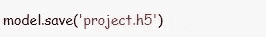*

## *评估模型*

*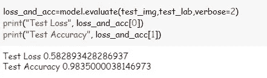*

***model.evaluate()** 方法*在编译模型时计算损失和任何定义的度量*。因此，在我们的例子中，精度是使用由保存的模型给出的网络权重在 10，000 个测试示例上计算的。
Verbose 可以是 0、1 或 2。默认情况下，verbose 为 1。
verbose = 0，表示无声。
verbose = 1，包括进度条和每个时期一行。
verbose = 2，每个纪元一行，即纪元编号/纪元总数。*

*在评估了模型之后，我们现在将检查测试部分的模型。*

*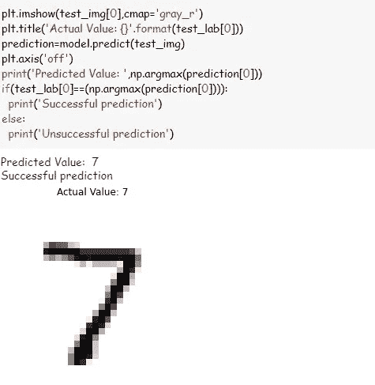*

***model.predict()** 用于对测试集进行预测。*

***np.argmax()** 返回轴上最大值的索引。*

*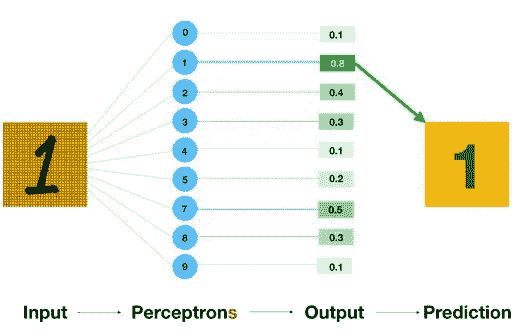*

*图片来自谷歌图片*

*现在，为了对不属于 MNIST 数据集的新图像进行预测。我们将首先创建一个名为“ *load_image* ”的函数。*

*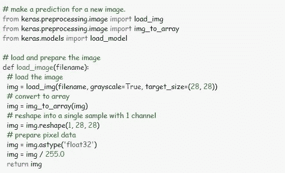*

*上述函数将图像转换为像素数组，作为输入提供给模型。*

*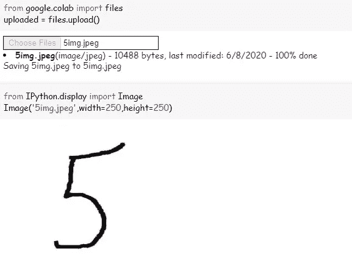*

*为了从本地驱动器上传文件，我们使用了代码:*

**从 google.colab 导入文件
uploaded = files . upload()**

*它将引导您选择一个文件。点击**选择文件**，然后选择并上传文件，等待文件 100%上传。一旦 Colab 上传了这个文件，你就会看到它的名字。*

*为了显示图像文件，我们使用了代码:*

**来自 IPython。显示导入图像 Image('5img.jpeg '，宽度=250，高度=250)**

*【5img.jpeg 是文件名。*

*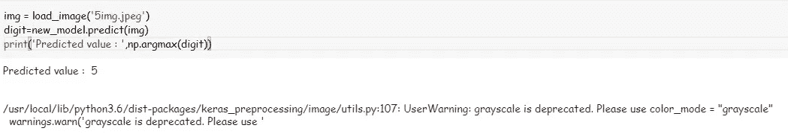*

*正如您所看到的，我们已经成功地预测到值为 5。*

*现在，如果我们想在几天后运行模型，我们将不得不再次运行整个代码，这是非常耗时的。*

*在这种情况下，您可以使用保存的模型，即 **project.h5***

*因此，在关闭 colab 笔记本之前，您可以从文件夹符号中下载模型。*

*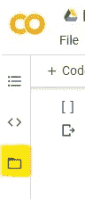*

*突出显示的文件夹*

*因此，当您尝试再次运行该模型时，您所要做的就是使用以下代码从计算机上传 project.h5 文件:*

**从 google.colab 导入文件
uploaded = files.upload()**

*当文件 100%上传时，使用下面的代码&之后，您可以预测新图像的数字，而无需运行整个代码。*

**model = TF . keras . models . load _ model(' project . H5 ')**

****链接供参考***[https://colab . research . Google . com/drive/10 lzhqsljx 4 bn CNT 6 c8 llhuxtduh _ WQPG？usp =共享](https://colab.research.google.com/drive/10LzhqSlJx4bnCNT6C8llhuXTDuh_WQPG?usp=sharing)*

*感谢阅读！*