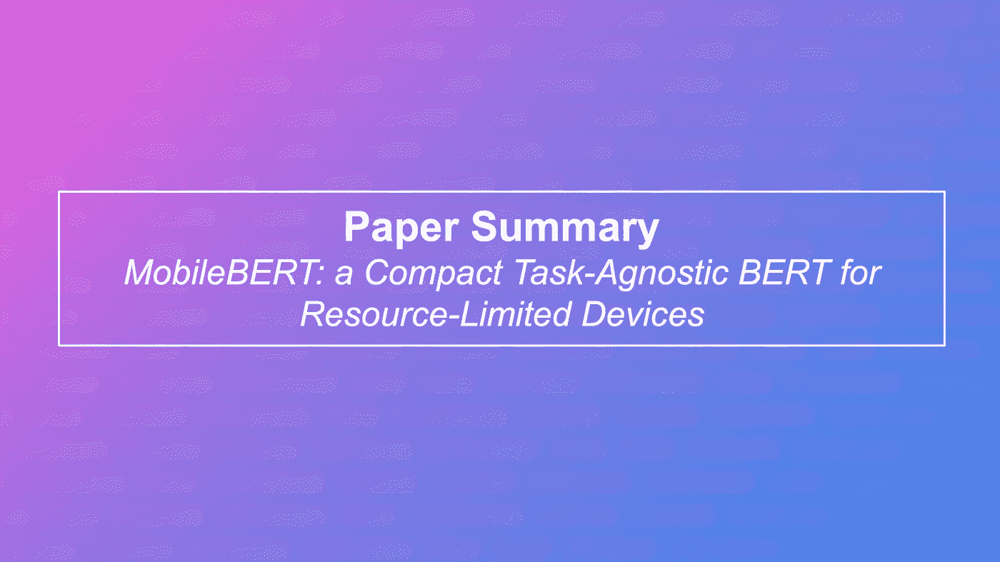

# MobileBERT:用于资源受限设备的 BERT

> 原文：<https://medium.com/analytics-vidhya/mobilebert-bert-for-resource-limited-devices-63a2c7b16d20?source=collection_archive---------16----------------------->

随着 NLP 模型的规模增加到数千亿个参数，能够创建这些模型的更紧凑表示的重要性也增加了。 ***知识提炼*** *已经成功实现了这一点，但是在设计教师模型时仍然被认为是事后的想法。这可能会降低蒸馏的效率，为*留下潜在的性能改进…