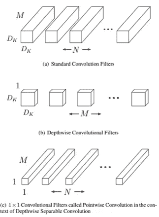
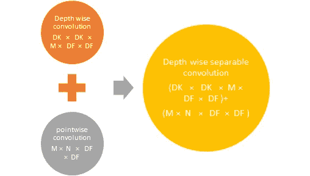
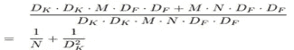
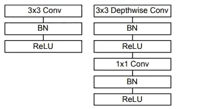
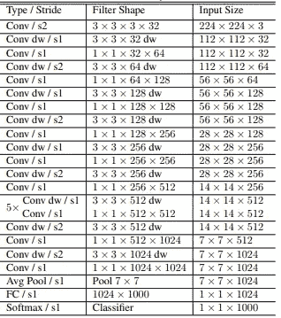
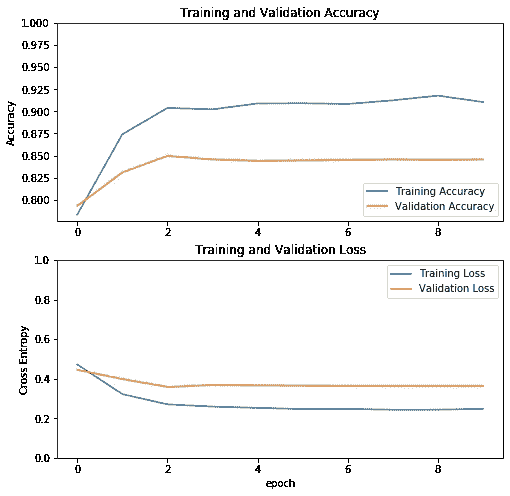
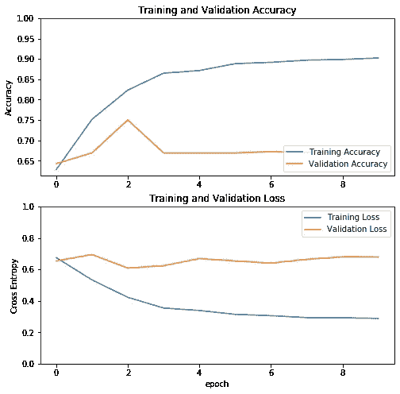

# MobileNet 与标准卷积

> 原文：<https://medium.com/analytics-vidhya/mobilenet-vs-standard-convolution-a35e01fe5662?source=collection_archive---------28----------------------->

比较……..

当你查看预训练模型的实际论文时，你会理解每个预训练模型都具有比标准卷积更特殊的功能。这个特殊的功能对预先训练好的卷积来说是一种祝福吗？。在 Kaggle 竞赛中的大多数图像分类问题中，人们选择这种预先训练好的网络，然后选择标准卷积。所以我决定将一个预先训练的卷积与一个标准卷积进行比较。为此，我选择了一个最好的预训练卷积 MobileNet。我将解释这两种卷积的工作原理和架构，然后用一个例子比较两者在执行问题的准确性和时间方面的效率。

我们知道有许多卷积神经网络已经在许多应用中显示了它们的能力。但是，当我们把计算速度和规模作为一个标准时，准确性不仅仅是一个决定的有效参数。在许多现实世界的例子中，如自动驾驶汽车，增强现实卷积网络应该在时间限制下表现更好。因此，MobileNet 是在时间受限的情况下表现更好的预训练模型之一。

**架构**

MobileNet 的主要特性是深度方向可分离卷积，它是一种分解卷积，将标准卷积分解为深度方向卷积和 1×1 卷积，称为点方向卷积。

标准卷积滤波器(a)由深度方向卷积(b)和点方向卷积(c)代替

**深度卷积-** 对每个输入通道应用单个滤波器的卷积(输入深度**)。**

**逐点卷积-** 一个简单的 1×1 卷积将创建深度层输出的线性组合。

> 要点:MobileNets 对两个层都使用批量归一化和 ReLU 非线性。

标准卷积在一个步骤中将输入要素过滤并组合成输出要素。但是 MobileNet 的深度卷积将输入分解为两层，一层用于滤波，另一层用于合并。Mobilenet 的这种分解特性有助于降低计算速度和规模。

标准卷积网络取 F 的输入 DF × DF × M 特征图，产生 DG × DG × N 特征图 g。

在哪里，

DF 是输入的空间高度和宽度

DG 是输出的空间高度和宽度

m 是输入通道

n 是输出通道

核 K 的标准层的计算成本是，

DK × DK ×M×N×DF × DF

在哪里，

DK×DK-内核大小

测向×测向-特征地图尺寸

在 MobileNet 输出的情况下，要素不是直接从输入生成，而是通过深度方向卷积和点方向卷积生成。因此总计算成本如下所示，

移动互联网的计算成本

与标准卷积相比，MobileNet 的计算成本降低了

> 除了第一层是全卷积外，MobileNet 使用深度方向可分离卷积。

左图:带批范数和 ReLU 的标准卷积层。右图:深度方向可分离卷积，具有深度方向和点方向层，后跟批处理范数和 ReLU。

MobileNet 架构

因此，我们比较了 MobileNet 和标准卷积的架构。现在我们将通过一个例子来比较它们。为此，我使用了 [Kaggle](https://www.kaggle.com/c/plant-pathology-2020-fgvc7) 的数据。完整代码请点击[这里](https://github.com/BSP-SP/MobilNet-vs-Standard-Convolution)。

**对比**

Mobilenet 的验证准确性和验证损失。

标准卷积的验证准确度和验证损失。

> 当我们观察这两个图时，我们可以推断出 MobileNet 在损耗和准确性方面表现良好。与标准卷积相比，MobileNet 中训练和验证损失之间的差异较小。当我们比较两个卷积的精度时，这也是正确的。
> 
> 当我们把时间作为一个参数。MobileNet 需要大约 10 分钟来完成执行，而标准卷积需要半个多小时。所以 MobileNet 又赢了。

因此我们可以推断，正如理论所述，MobileNet 具有更低的计算成本和更高的效率。