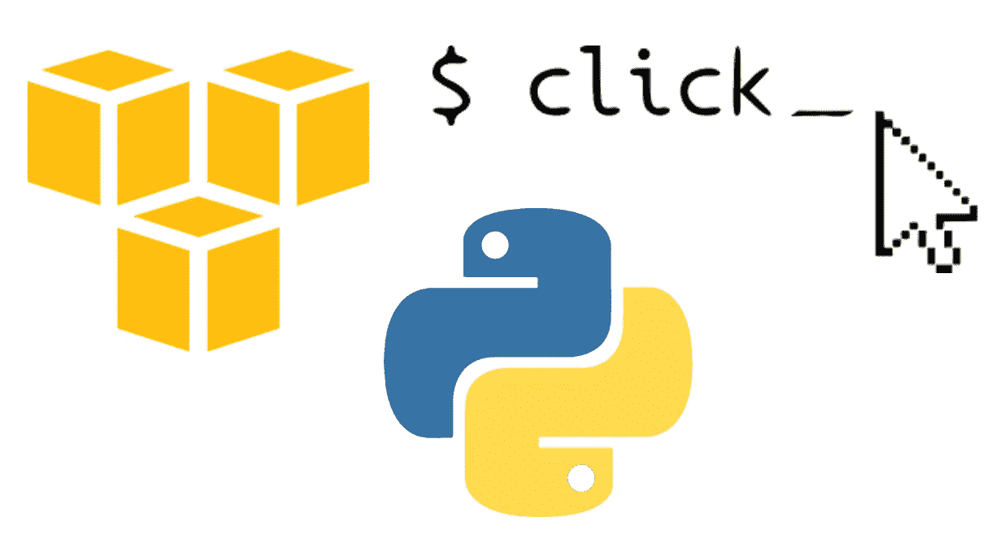

# 模拟 AWS 和 Pytest 点击

> 原文：<https://medium.com/analytics-vidhya/mock-aws-pytest-click-51a2a7b41123?source=collection_archive---------20----------------------->



作为 DevOps 团队的一员，我开始使用多种不同的工具和应用程序。最近，我有机会用 python 开发了一个点击应用程序，它连接到 AWS 来获取数据。我使用 *setup.py* build 进行部署(`setup.py`是 [setuptools](https://packaging.python.org/key_projects/#setuptools) 的构建脚本)。它告诉 setuptools 关于包的信息(比如名称和版本)以及要包含哪些代码文件。我遇到的一个问题是如何编写模拟 AWS 调用的测试用例。每个组件都有很好的文档，比如如何测试 click app，如何测试 setup.py，以及如何模拟 AWS 调用。在这篇博客中，我试图将它们结合起来。

# 从哪里开始？

在这个报告([链接](https://github.com/tomarv2/demo-python-aws-click))中，我放了一小部分文件给某人来测试所有这些组件是如何工作的。

## **主要功能:**

`src/demo/manage-secrets.py`中的`get_value_from_paramter_store()`接受从 SSM 参数库中获取的参数`name`。

## **点击命令行界面:**

`src/demo/cli.py`它接受一个必需的选项`--name`。我们可以根据需要添加更多的参数。我留着它是为了理解。

## **setup.py:**

这花了我一些时间来完成，有多种方法来创建这个文件。

我们来回顾一下:

*   `setup`是`setuptools`包的一部分。
*   **版本:**对于一个项目的版本号，有很多技术可以维护单一的真实来源。我更喜欢这样。您也可以创建一个版本文件并指定它。
*   **ROOT_PATH** :指定 setup.py 文件的父目录。有时，我会面临路径问题。
*   您会注意到两条打印语句，这只是为了确保 setup.py 正常工作。它们可以被移除。
*   **描述**和 **long_description** :你的项目的一个短 desc，而 long_description 指向一个`README.md`文件。
*   **package_dir:**
*   **包:**包括`src`下的所有包
*   **tests_require:** 如果你的项目的测试除了需要安装它之外，还需要一个或多个额外的包。
*   **install_requires:** 一个字符串或字符串列表，指定当这个发行版被安装时还需要安装哪些其他发行版。我放了一个函数来处理这个问题。
*   **入口点:** *入口点*是一种机制，用于已安装的发行版通告它所提供的组件，以便被其他代码发现和使用。基本上，它指定了要运行的命令。

## **test_cli.py:**

`@pytest.fixture` —此范围仅限于此模块，可选:`function`、`class`、`module`、`package`或`session`

根据 moto 的文档，由于 botocore 的变化，建议指定虚拟 AWS 凭证，因此 moto 不使用凭证文件中指定的实际 AWS 凭证。另一个建议是，如果不需要，不要在顶部导入模块。

为了使用`get_ssm`,我需要执行`put_ssm`,因为它不包含现有数据。

**注意:** `response = runner.invoke(entrypoint,["get", "--name", “demo_parameter"])`，entrypoint 是启动 cli 的函数名，get 和 name 是传递给 cli 命令的参数。

## 如何运行:

克隆存储库后，运行:

`python setup.py develop`以开发模式部署。

然后运行:`**demo**`****你应该会看到下面的输出。我使用开发，因为它将创建链接，而不是安装实际的软件包，当你开发时，它真的很方便。关于何时使用`develop`和`install`的良好解释:此处[为](https://stackoverflow.com/questions/20339183/difference-between-setup-py-install-and-setup-py-develop)****

```
****demo**
Usage: demo [OPTIONS] COMMAND [ARGS]...Options:
  --help  Show this message and exit.Commands:
  get  get secrets**
```

## ******如何运行测试:******

****运行测试有多种方式，并且支持多个参数。`pytest`将运行所有测试:`pytest -v -s` `-v`用于详细测试，而`-s`用于打印测试中指定的任何打印语句。****

## ******发布到**[**PyPI**](https://pypi.org/)**:******

****现在如果你需要将你的包发布到 [**PyPI**](https://pypi.org/) 并与其他人分享。在 [TestPyPI](https://test.pypi.org/) 和 [PyPI](https://pypi.org/) 上创建一个帐户。在你的虚拟世界里:****

```
**python3 -m pip install --user --upgrade setuptools wheel
pip install wheel
pip install twine**
```

****从回购的基础上:****

```
**python3 setup.py sdist bdist_wheel**
```

****然后检查捆绳:****

```
****twine check dist/***
Checking dist/demo-0.0.1.dev1-py3-none-any.whl: PASSED
Checking dist/demo-0.0.1.dev1.tar.gz: PASSED**
```

****上传:****

```
****python3 -m twine upload dist/* --verbose**
Uploading distributions to [https://upload.pypi.org/legacy/](https://upload.pypi.org/legacy/)
Enter your username: demo
Enter your password: 
Uploading demo_python_aws_click-0.0.1.dev1-py3-none-any.whl
100%|████████████████████████████████████████████████████████████████████████████████████████████████████████████| 5.99k/5.99k [00:02<00:00, 2.27kB/s]
Uploading demo-python-aws-click-0.0.1.dev1.tar.gz
100%|████████████████████████████████████████████████████████████████████████████████████████████████████████████| 4.63k/4.63k [00:01<00:00, 3.23kB/s]View at:
[https://pypi.org/project/demo-python-aws-click/0.0.1.dev1/](https://pypi.org/project/demo-python-aws-click/0.0.1.dev1/)**
```

## ****如何测试 PyPI 包:****

****创建一个新的 virtualenv，使用 pip 下载并运行`demo`命令:****

```
**- python3 -m venv ~/Documents/virtualenv/demo-venv
- source ~/Documents/virtualenv/demo-venv/bin/activate
- pip install [demo-python-aws-click](https://pypi.org/project/demo-python-aws-click/0.0.1.dev1/)
- demo**
```

## ******注:******

*   ****建议使用 virtualenv****
*   ****使用 Python 3.8 测试包****
*   ****上传到 PyPI 时，包名必须是唯一的。****

# ****结论:****

****Click 是在 python 中创建命令行界面最流行的包之一。当集成多个组件时，有时很难找出什么适合什么。希望有帮助。如有需要，请随时纠正或评论。****

# ****参考资料:****

*   ****[https://github.com/spulec/moto](https://github.com/spulec/moto)****
*   ****[https://packaging.python.org/specifications/entry-points/](https://packaging.python.org/specifications/entry-points/)****