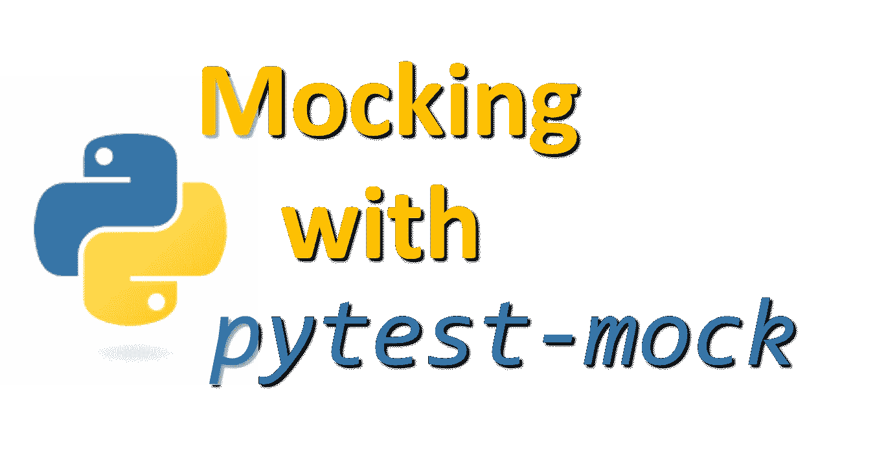

# 模拟函数第一部分|使用 pytest-mock 在 Python 中进行更好的单元测试

> 原文：<https://medium.com/analytics-vidhya/mocking-in-python-with-pytest-mock-part-i-6203c8ad3606?source=collection_archive---------0----------------------->

在单元测试中模仿资源和编写单元测试一样重要和常见。然而，许多人不熟悉如何正确地模拟类、对象或函数进行测试，因为在线可用的文档要么太短，要么不必要的复杂。造成这种混乱的主要原因之一是——做同一件事的几种方法。其他所有的文章似乎都以不同的方式嘲笑事物。通过这一系列关于嘲讽的文章，我希望能让这个话题更加清晰。



## 先决条件

这是一个关于用 pytest 嘲讽的教程。我假设您可以使用`pytest`用 Python 编写单元测试。

## 为什么要嘲笑？

当你在这里读这篇文章的时候，我会假设你对嘲讽很熟悉。如果你不是，让我们来快速概述一下它是什么以及我们为什么需要它。

比方说，您有一个收集股票市场数据并提供某个特定部门中涨幅居前者的信息的服务。您从第三方 API 获取股票市场信息，并对其进行处理以给出结果。现在，为了测试您的代码，您不希望每次都点击 API，因为这会使测试变慢，而且 API 提供者会向您收取额外点击的费用。你想要的是一个嘲笑！mock 用一个虚拟对象代替了一个函数，您可以通过编程来做您想做的任何事情。这也称为“打补丁”。在本系列的其余部分，我将交替使用“模拟”和“修补”。

## 模仿所需的包

与大多数编程语言不同，Python 带有一个内置的库，用于单元测试和模拟。它们功能强大，自给自足，并提供您需要的功能。我们将使用的 Pytest-mock 插件是一个方便的包装器，可以更容易地与`pytest`结合使用。

如果你查找关于嘲讽的文章，或者通读 Stackoverflow 上无休止的问题，你会经常遇到`Mock`、`MagicMock`、`patch`等词。我将在这里揭开它们的神秘面纱。

在 Python 中，无论是函数、对象还是类，你都会用到`Mock`类。`Mock`类来自内置的`unittest.mock`模块。从现在开始，任何时候你遇到`Mock`，知道它来自`unittest`图书馆。`MagicMock`是`Mock`的子类，实现了一些神奇的方法。魔法方法是你常用的方法，如`__str__`、`__len__,`等。

在大多数情况下，使用哪一个并不重要，`Mock`或`MagicMock`。除非你需要像上面实现的神奇方法，你可以坚持使用`Mock`。Pytest-mock 通过一个易于使用的接口让您可以访问这两个类。

`patch`是来自“unittest”模块的另一个函数，它帮助用模拟代替函数。Pytest mock 对此也有一个包装器。

## 安装 Pytest 模拟

在开始使用 pytest-mock 之前，您必须安装它。您可以使用 pip 安装它，如下所示:

```
pip install pytest-mock
```

这是一个 pytest 插件。所以，它也会安装`pytest`，如果你还没有安装的话。

## 模仿一个简单的函数

由于这是第一篇文章，我们将保持简单。我们将从模仿一个简单的函数开始。

比方说，我们有一个函数`get_operating_system`可以告诉我们使用的是 Windows 还是 Linux。

```
# application.py from time import sleep def is_windows():    
    # This sleep could be some complex operation instead
    sleep(5)    
    return True def get_operating_system():    
    return 'Windows' if is_windows() else 'Linux'
```

这个函数使用另一个函数`is_windows`来检查当前系统是否是 Windows。假设这个`is_windows`函数非常复杂，需要几秒钟才能运行。我们可以通过让程序每次被调用时休眠 5 秒来模拟这个缓慢的函数。

`get_operating_system()`的 pytest 如下:

```
# test_application.py

from application import get_operating_system

def test_get_operating_system():
    assert get_operating_system() == 'Windows'
```

由于`get_operating_system()`调用了一个较慢的函数`is_windows`，测试将会很慢。这可以在下面运行 pytest 的输出中看到，它用了 5.05 秒。

```
$ pytest
================ test session starts ========================
Python 3.7.3, pytest-5.4.1, py-1.8.1, pluggy-0.13.1
rootdir: /usr/Personal/Projects/pytest-and-mocking
plugins: mock-2.0.0
collected 1 item

test_application.py .                                    [100%]

================ 1 passed in 5.05s ==========================
```

单元测试应该很快。我们应该能在几秒钟内完成数百项测试。一个需要五秒钟的测试会降低测试套件的速度。进入嘲讽，让我们的生活更轻松。如果我们修补慢速功能，我们可以验证`get_operating_system`的行为，而无需等待五秒钟。

让我们用 pytest-mock 模拟这个函数。

Pytest-mock 提供了一个名为`mocker`的夹具。它在 python 内置的模仿结构之上提供了一个很好的接口。使用`mocker`的方法是将它作为参数传递给测试函数，并从中调用模拟和修补函数。

比方说，你想让`is_windows`函数返回`True`而不占用那宝贵的五秒钟。我们可以如下修补它:

```
mocker.patch('application.is_windows', return_value=True)
```

你必须将这里的`is_windows`称为`application.is_windows`，因为它是*应用*模块中的函数。如果我们只给`is_windows`打补丁，它会尝试给‘test _ application’文件中一个名为`is_windows`的函数打补丁，而这个函数显然是不存在的。格式总是`<module_name>.<function_name>`。知道如何正确地模仿是很重要的，我们将在这个系列中继续研究。

补丁更新后的测试函数如下:

```
# 'mocker' fixture provided by pytest-mock
def test_get_operating_system(mocker):  
    # Mock the slow function and return True always
    mocker.patch('application.is_windows', return_value=True) 
    assert get_operating_system() == 'Windows'
```

现在，当您运行测试时，它将更快地完成。

```
$ pytest
============ test session starts ==================
Python 3.7.3, pytest-5.4.1, py-1.8.1, pluggy-0.13.1
rootdir: /mnt/c/Personal/Projects/pytest-and-mocking
plugins: mock-2.0.0
collected 1 item

test_application.py .                          [100%]

=========== 1 passed in 0.11s ======================
```

正如你所看到的，测试只进行了 0.11 秒。我们已经成功地修补了缓慢的功能，并使测试套件更快。

模仿的另一个优点是——你可以让模仿函数返回任何东西。您甚至可以让它引发错误来测试您的代码在这些场景中的行为。在以后的文章中，我们将看到所有这些是如何工作的。

现在，如果您想测试`is_windows`返回`False`的情况，请编写以下测试:

```
def test_operation_system_is_linux(mocker):
    mocker.patch('application.is_windows', return_value=False) # set the return value to be False
    assert get_operating_system() == 'Linux'
```

注意，所有用`mocker`设置的模拟和补丁都是函数范围的，也就是说，它们只对特定的函数可用。因此，您可以在多个测试中修补同一个函数，并且它们不会相互冲突。

这是你第一次接触 pytest 的嘲讽世界。我们将在接下来的文章中讨论更多的场景。敬请关注，保持安全，在那之前保持敬畏。

本系列文章列表:

[嘲讽功能第一部分](/analytics-vidhya/mocking-in-python-with-pytest-mock-part-i-6203c8ad3606) 🢠当前文章
t13】嘲讽功能第二部分

如果你喜欢这篇文章，你可以喜欢这篇文章，以鼓励我尽快推出下一篇文章。如果你认为你认识的人可以从这篇文章中受益，请与他们分享。

如果你想感谢我，可以在推特上打个招呼 [@durgaswaroop](http://twitter.com/durgaswaroop) 。如果你想支持我，这里有我的贝宝链接:paypal.me/durgaswaroop

归属:Python Logo—[https://www.python.org/community/logos/](https://www.python.org/community/logos/)