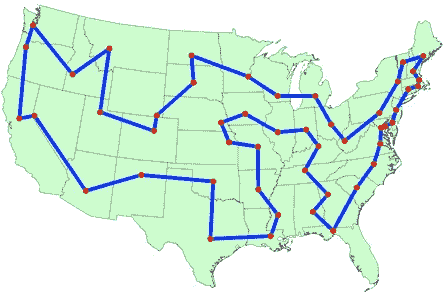
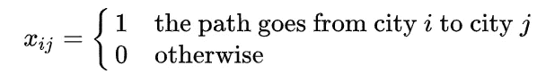
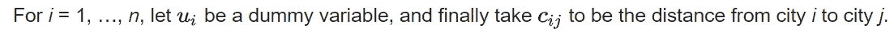
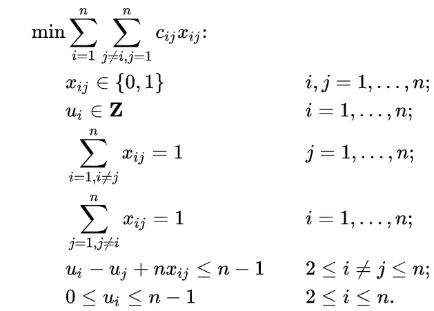
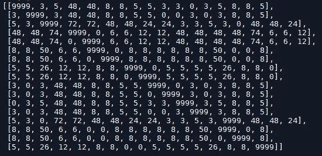
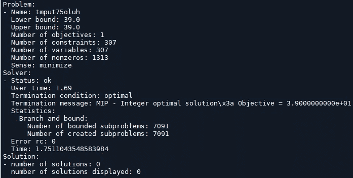
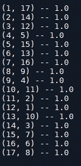

# 基于 Python 和 Pyomo 的旅行商问题模型及求解

> 原文：<https://medium.com/analytics-vidhya/model-and-solution-of-the-traveling-salesman-problem-with-python-and-pyomo-db45f2631e8c?source=collection_archive---------4----------------------->

信用:[https://optimization . McCormick . northwestern . edu/index . PHP/Traveling _ salesman _ problems](https://optimization.mccormick.northwestern.edu/index.php/Traveling_salesman_problems)

使用 Python 和 Pyomo 逐步建模和解决旅行推销员问题。

在这篇文章中，我们将讨论一个最著名的运筹学问题，TSP(旅行推销员问题)。问题提出如下问题:**“给定一个城市列表和每对城市之间的距离，访问每个城市并返回出发城市的最短可能路线是什么？”**。

# **Pyomo**

为了解决这个问题，我们将利用 Pyomo，这是一种基于 Python 的开源优化建模语言，具有多种优化功能。如果你有任何编程语言(尤其是 Python)的经验，用 Pyomo 建模和解决问题将是一项简单的任务。

 [## Pyomo

### Pyomo 的主页，这是一种用于线性编程的基于 Python 的可扩展开源优化建模语言…

www.pyomo.org](http://www.pyomo.org/) 

Pyomo 允许您在各种解决方案中进行选择，包括开源和商业解决方案。

我已经在我的机器上安装了带有 conda 的 Pyomo，但也可以用 pip 来完成。可以在[http://www.pyomo.org/installation](http://www.pyomo.org/installation)上阅读安装说明。

在这篇文章中，我们将利用 CPLEX IBM Solver 来解决一个整数线性规划问题。请随意使用 ILP 的任何其他求解器。

## 问题描述

旅行推销员的任务是找到游览每个城市并返回起点的最短路线。

## 模型组成

TSP 的米勒-塔克-泽姆林(MTZ)公式描述如下:

用 1，...， *n* 标记城市，并定义决策变量:

决策变量

那么 TSP 可以写成如下整数线性规划问题:

信用:[https://en.wikipedia.org/wiki/Travelling_salesman_problem](https://en.wikipedia.org/wiki/Travelling_salesman_problem)

第一组等式要求每个城市都是从恰好一个其他城市到达的，第二组等式要求每个城市都有到恰好一个其他城市的出发。最后一个约束条件是，只能有一个涵盖所有城市的旅游，而不能有两个或两个以上不连贯的旅游，它们只能共同涵盖所有城市。”

## **脓杆菌制剂**

第一步是输入数据，这意味着为模型提供成本矩阵。出于教学和实践的目的，我下载了一个包含 17 个城市成本矩阵的实例。
我用 python 以如下方式读取了该文件:

成本矩阵

变量 **cost_matrix** 和 **n** 包含成本矩阵和城市数量。现在我们将能够在定义约束时调用这些元素。

要使用 Pyomo 并解决这个问题，我们需要进行一次导入。

现在我们可以初始化模型了。

*   ***混凝土模型()* -** 创建模型。
*   ***RangeSet(n)* -** 创建从 1 到 n 的索引
*   ***RangeSet(2，n)* -** 创建一个从 2 到 n 的索引

创建决策变量。

*   `**Var(model.N,model.M, within=pyEnv.Binary)**`创建大小为 **M.** 的 **N** 二元决策变量
*   `**Var(model.N, within=pyEnv.NonNegativeIntegers,bounds=(0,n-1))**`创建 **N** 只能取 0 到 n-1 之间值的非负整数决策变量。

我们必须为模型提供成本矩阵。

*   `**Param(modelo.N, model.M,initialize=lambda model, i, j: cost_matrix[i-1][j-1])**`使用 lambda 函数为模型提供一个 **N** x **M** 参数。

在定义了所有变量并提供了参数之后，我们就能够创建目标函数了。

首先，我们创建一个返回目标函数的 Python 函数。
我使用了一个神奇的 python 资源，叫做 *List Comprehension，*如果你不熟悉它，这个页面给出了一个很好的教程:[https://www . python forbeginners . com/basics/List-comprehensions-in-python](https://www.pythonforbeginners.com/basics/list-comprehensions-in-python)。

*   `**Objective(rule=obj_func,sense=pyEnv.minimize)**` 创建模型的目标函数及其意义(最大化或最小化)。

## **约束**

我们以非常相似的方式提供约束。

确保每个城市只有 1 个叶子的第一个约束可以用下面的方式来表达:

*   `**Constraint(model.M,rule=rule_const1)**` 创建由 rule_const1 定义的 **M** 约束。

确保每个城市仅接收 1 的第二个约束可以由下式表示:

*   `**Constraint(model.N,rule=rule_const2)**` 创建由 rule_const2 定义的 **N 个**约束。

第三个也是最后一个约束，它强制要求只能有一个覆盖所有城市的旅游，而不能有两个或更多不连贯的旅游，这些旅游只能共同覆盖所有城市。

*   `**Constraint(model.U,Model.N,rule=rule_const3)**` 创建由 rule_const3 定义的 **UxN** 约束。

一个*规则*类型的函数必须提供一个 *Pyomo 对象*，这就是为什么我不得不写那个奇怪的 else 条件。

## 解决办法

为了求解我们的模型，我们需要安装一个求解器。

*   `**pprint()**`打印整个模型(如果模型太大，这可能不是一个好主意)。
*   `**pprint(filename=’file.txt’)**`打印特定文件中的模型。

*   `**SolverFactory(‘cplex’)**`我初始化了名为 CPLEX 的 IBM 解算器。
*   `**solve(model, tee= False)**`解决了模型。使用 tee = False，您将看不到求解程序的日志屏幕。如果你想看，就用 tee= True。

问题解决了。

如果您希望查看选择了哪些决策变量，您可以这样做:

(城市 I，城市 j)

这意味着最佳路线是 1–17–8–9–4–5–15–7–16–6–13–10–11–2–14–3–12–1。

## 临时演员

要获得更多 Pyomo 的例子，你可以去他们的 GitHub 页面。

在我自己的 [github 页面](https://github.com/titowoche30/PyomoExamples)中有一些模型示例和更完整的手册(都是葡萄牙语)。

这是我的第一篇文章:)。