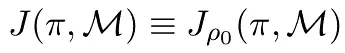
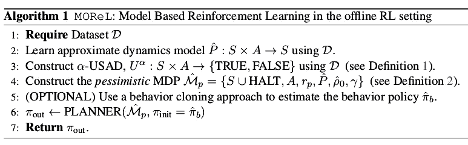

# 基于模型的离线强化学习

> 原文：<https://medium.com/analytics-vidhya/model-based-offline-reinforcement-learning-morel-f5cd991d9fd5?source=collection_archive---------11----------------------->

在这篇文章中，我将简要介绍由**拉胡尔·基丹比** & **阿拉温德·拉杰斯瓦兰**等人于 2020 年发表的论文 [**莫雷尔:基于模型的离线强化学习**](https://arxiv.org/abs/2005.05951)

强化学习通常被认为是一个在线学习过程，在这个过程中，一个智能体反复使用与环境的交互来改进策略，因此数据收集和策略学习同时发生。这通常导致缓慢且简单的低效学习，而这通常只有在模拟器存在的情况下才是可行的。

在离线 RL(也称为批处理 RL)中，目标是仅使用与环境的历史交互的数据集来学习成功的策略，而没有任何进一步的交互。离线强化学习的前期工作几乎仅限于无模型强化学习。

由于新政策的状态-动作访问分布可能与行为政策的显著不同，所以非政策评估可能很困难。这种因政策更新而导致的分布变化通常被称为**分布转变**，构成了离线 RL 的主要挑战。

原则上，可以对离线数据集使用任何非策略 RL 算法(如 Q-learning 或 actor-critic)。然而，[**BCQ**](https://arxiv.org/abs/1812.02900)&[**熊**](https://arxiv.org/abs/1906.00949) 的论文提出，由于前面提到的分布偏移，直接使用这种算法产生的结果很差。为了克服这一挑战，他们提出了修改方案，如使用 Q-网络系综，将学习策略调整为行为策略。

相比之下，**基于模型的 RL (MBRL)** 提出了一组使用离线数据集的替代方法。MBRL 支持在构建模型时使用一般先验知识，以及在学习模型后使用广泛的规划算法的能力，包括模型预测控制( **MPC** )、蒙特卡洛树搜索( **MCTS** )、动态规划和政策优化。这些优势使 MBRL 能够在在线 RL 环境中高效采样。

因此，本文研究的问题是如何在离线学习环境中有效地使用基于模型的学习技术。

MOReL 是一个基于模型的离线学习算法框架，包括两个步骤:

1.  使用离线数据集构建悲观 MDP 模型。
2.  对上述悲观 MDP 的规划或政策优化。

作者声称，MOReL 易于进行详细的理论分析，能够轻松透明地设计实用算法，并在广泛使用的离线基准任务上产生最先进的结果。

# 问题定式化

## 马尔可夫决策过程

我们使用元组 **M={S，A，r，P，ρ0，γ}** 来定义 MDP，其中， **S** 是状态空间， **A** 是动作空间，**r:S×A→【Rmax，Rmax】**是回报函数， **P :S×A→S** 是转移核， **ρ0** 是初始状态分布，而**策略定义了从状态到动作概率分布的映射， **π : S×A→R+** 。任意状态 **s** 下策略 **π** 的值定义为:**

策略和一些开始状态分布的性能 **β** 由下式给出:

通常，我们对根据 MDP 起始状态分布优化性能感兴趣，从而导致优化:

为了避免符号混乱，我们还抑制了从上下文理解时对 **ρ0** 的依赖，即

## 离线 RL

离线 RL 的目标是设计一种算法，该算法将离线数据集 **D** 作为输入，输出具有最小次优的策略 **πout** ，即

即使提供了无限大小的数据集，通常也不可能在离线 RL 中找到最优策略。因此，离线 RL 的目标是设计出尽可能低次优的算法。

## 基于模型的 RL

在 MBRL，我们构造另一个 MDP **M*={S，A，r，P*，ρ0*，γ}** ，它的状态和动作空间与原 MDP 环境 **(M)** 相同。为了简单起见，我们假设报酬函数是已知的，并且在真实 MDP **M** 和模型 **M*** 中是相同的。如果 **J(π，M*)** 紧密跟踪 **J(π，M)** ，我们可以使用模型作为策略搜索的代理。然而，使用静态离线数据集学习这样一个精确的模型可能是困难的。有些策略可能会访问状态空间中我们在 **D** 中没有足够数据的部分。在下一节中，我们将概述为离线 RL 设置构建有效模型的方法。

# 算法框架

在这一节中，我将首先描述一个理想化的 MOReL 框架。然后我将描述我们在实验结果中使用的这个算法框架的实际实例。

## 学习动力学模型

第一步涉及使用离线数据集 **D** 通过使用最大似然估计或来自生成建模的其他技术来学习近似动力学模型。

由于离线数据集可能在状态-动作空间的所有部分都没有足够的支持，我们不能期望模型是全局精确的。一种简单的 MBRL 方法是使用学习到的近似模型直接进行规划。然而，这种没有任何保障的方法可能导致代理人在具有最少数据支持的状态空间的部分中错误地过度预测回报，从而导致非常次优的策略。他们通过如下所述修改 MDP 克服了模型偏差的挑战。

## 未知状态动作检测器(USAD)

为了确保策略不会访问模型不准确的状态，它们根据学习模型的准确性将状态空间划分为已知和未知区域。随后，他们旨在将策略搜索限制在已知状态内的策略。为了进行这种划分，他们使用了如下定义的 used。

## 悲观的 MDP 建筑

接下来，我们使用学习动力学模型
和前面提到的 USAD 构建一个悲观的 MDP。这基于以下定义:

我们用**δ(s’= HALT)**来表示狄拉克δ函数，它迫使 MDP 从每个未知的状态-作用对跃迁到特殊的状态 HALT。对于这种特殊的状态，我们使用**K**的奖励，而其他的状态动作接收与环境中相同的奖励。

## 悲观的 MDP 的规划

莫雷尔的最后一步是计划在构建悲观的 MDP。多种技术可用于此，包括 MPC、基于搜索的规划、动态规划或策略优化，视上下文而定。对于理想化的情况，他们假设了一个规划先知，可以在悲观的 MDP 中返回一个 **∈π次优政策**。

# MOReL 的实现

他们通过基于模型的自然政策梯度提出了一个实际的 MOReL 实现。我们现在将看到详细的步骤:

## 1.动力学模型学习

我们通过最大化对数似然来学习参数，或者等效地，神经网络参数为

其中 **μs，σs，μa，σa** 是从 **D** 计算的状态和动作的平均值和标准偏差。**∈**是数据集中差异的标准偏差，即**∈= s’s**。

## 2.未知状态动作检测器

我们如上面的等式中所概述的那样训练模型的集合，并且针对查询 **(s，a)** 对跨集合计算差异，如下所示

## 3.政策优化

为了在悲观的 MDP 优化政策，作者使用了与[**【TRPO】**](https://arxiv.org/abs/1502.05477)**PPO****密切相关的 [**MJRL 代码库**](https://github.com/aravindr93/mjrl) 。**

# 莫雷尔在不同探索策略下的表现

我们将会看到 MOReL 用最新的离线 RL 设置算法得到的一些结果，比如 BCQ、BEAR 和 BRAC 的一些变体。他们展示了四种环境和五种探索设置的结果，总共 20 种不同的变量。他们复制了先前算法的结果(来自 BRAC ),并将其结果作为最后一行包含在每个表中。他们观察到他们的算法获得了 20 种可能的环境探测配置中的 12 种的最先进的结果。

总之，MOReL 结合了一般化和悲观主义，帮助它在静态离线数据集中可能不会直接出现但可以使用数据集预测的已知状态中执行策略搜索，同时不会漂移到使用静态离线数据无法预测的未知状态。

总的来说，他们的工作证明了对于离线 RL 问题，基于模型的方法优于无模型的方法。特别地，基于模型的方法提供了在已知的状态-动作空间上约束要支持的策略的能力，而不限制它接近行为策略，这可以导致最终策略质量的显著改进。

从实践的角度来看，一个重要的问题是政策评估。所有当前的工作(包括本文)使用来自真实 MDP 的新轨迹执行政策评估，并使用这些评估来决定何时停止训练。真正的离线 RL 算法也必须仅使用静态离线数据集来执行该步骤。

感谢看完:)

建议是最受欢迎的！