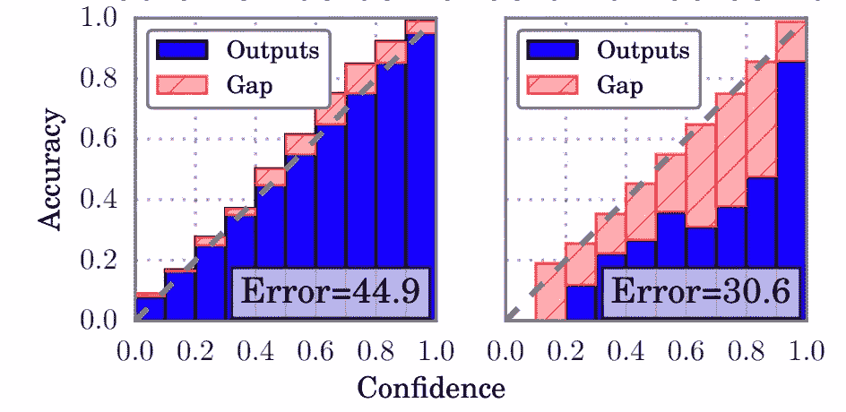
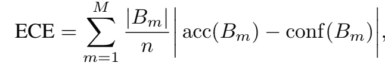
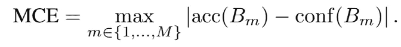

# 模型校准——专家可能忽略的东西

> 原文：<https://medium.com/analytics-vidhya/model-calibration-the-things-that-a-experts-may-miss-62924aef09ed?source=collection_archive---------30----------------------->

自深度学习兴起以来，大量的深度神经网络模型出现在机器学习工程师、数据科学家或研究科学家的眼前。但是似乎没有太多的人意识到这些大而深的模型所带来的风险，可靠性问题。

## 可靠性是什么？

假设有一个受监督的计算机视觉模型， **f(x)** ，我们将其用于自动驾驶汽车。我们在这个模型上定义的任务是识别街道上的行人以及他们相对于摄像机的位置。

由于我们在构建架构、收集数据和优化模型训练过程中做得非常好，在城市的大多数场景中，模型的准确性能够达到非常高的水平，99%。所以在自动驾驶汽车上使用，我们似乎觉得如此安全。

然而，有时我们将它用于一辆真正的自动驾驶汽车后，我们发现它的性能并不像它所说的那样好，尽管模型预测的可信度很高。这个模型的表现不如它告诉我们它所相信的那样好。

上面的例子是一个典型的与监督模型的可靠性有关的问题。可靠性是关于模型置信度和模型真实性能一致性的度量。一个可靠的模型能够通过对样本的置信度来反映其真实性能。因此，我们可以通过评估模型在推理过程中的可信度来直接评估模型的可用性。这给了我们一个非常下降和有效的方法来进行这种评估。

## 可靠性图表

在我们开始量化度量之前，首先我们需要构建一个可靠性图。为了构建它，我们将执行以下操作:

1.  将置信空间分成几个具有恒定间隔的箱。
2.  对测试数据运行模型，并根据它们的置信度对它们进行分配。
3.  计算每个箱的预期精度，并将其绘制为精度与置信度。

监督概率模型的可靠性图。左边的是校准好的，右边的不是。

看一下上面的图表，左边的图表在所有置信水平上都与模型的准确性一致，而右边的图表则不能。一些样本看起来在 0.8 和 0.9 之间有很高的可信度，但是精确度只有大约 0.5。这意味着模型置信度对其性能没有任何意义。

## 可靠性的量化测量

为了测量可靠性，一种直观的方法是将可靠性图转换为度量图，映射到实数线上。由于理想的校准模型是对角线函数，我们可以只测量可靠性空间中模型和单位函数之间的距离，作为测量模型可靠性的度量。

## 预期校准误差(ECE)

公式 ECE，B 表示可靠性图的 bin

这种度量仅仅是找到每个箱的模型精度和置信度之间的差异，并对它们的平均值求和。

## 最大校准误差(MCE)

MCE 的公式。

MCE 与 ECE 具有相同的核心概念，但 MCE 对模型的校准程度更强。如果非常小，则需要对最差情况进行更多校准。

到目前为止，我们刚刚进入模型校准的大门，故事还没有结束。还有很多关键点需要我们展开长时间的讨论。它们将在下一篇文章中展示。

如果你喜欢读这篇文章，如果你有任何问题要问或想说什么，请不要犹豫鼓掌并留下你的评论。

干杯！

参考文件:

[https://arxiv.org/abs/1706.04599](https://arxiv.org/abs/1706.04599)