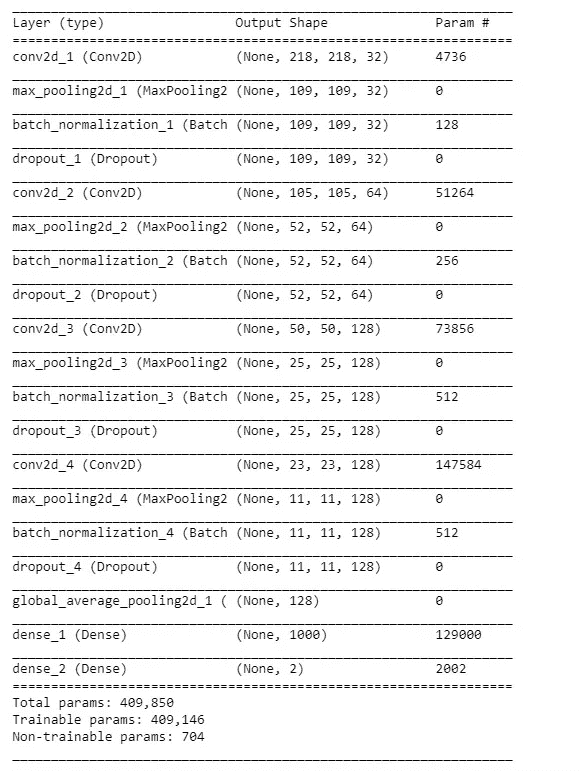
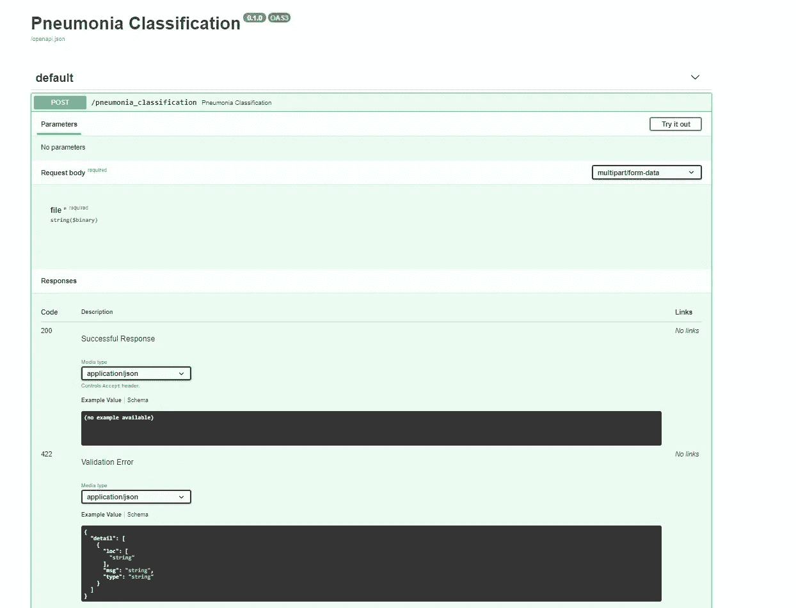
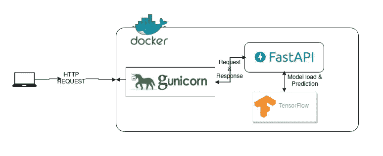
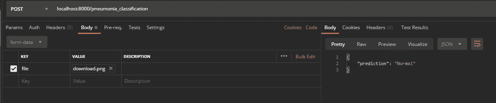

# 模型部署— MLDevOps

> 原文：<https://medium.com/analytics-vidhya/model-deployment-mldevops-f28f107b434b?source=collection_archive---------14----------------------->


[澳门图片社](https://unsplash.com/@macauphotoagency?utm_source=medium&utm_medium=referral)在 [Unsplash](https://unsplash.com?utm_source=medium&utm_medium=referral) 上拍摄的照片

像大多数数据科学家初学者一样，您是否也陷入了困境，并思考如何在系统中部署 ML 模型？

在 ML/AI 领域，几乎所有人都知道如何训练机器学习模型，即使我们有多个库(如 sci-kit-learn、TensorFlow、PyTorch 等)用于模型训练和预测。有时，我们在得到一个好的离开笔记本的预测后，在 jupyter-notebook 中训练那些模型。如果我们在实时系统中部署这些模型，那将是令人兴奋的。

通常，人们将模型放在笔记本中，因为他们发现很难在另一个环境中部署。在本文中，我将解释如何在复杂的应用环境中创建和部署我们的机器学习模型。

为此，让我们以一个用例为例，比如创建一个分类模型，根据胸部 X 射线对肺炎或正常进行分类。是的，它将是一个图像分类模型。

在我们的用例中，我们有 3 个主要任务——

*   模型训练和测试
*   API 开发
*   应用程序部署

先说培训流程。

1.  **模型训练—** 为了训练机器学习模型，我们使用了来自 [kaggle](https://www.kaggle.com/paultimothymooney/chest-xray-pneumonia) 的免费可用数据。该数据集具有大约 6000 幅训练图像、600 幅测试图像和 16 幅验证图像。



训练模型

我们正在训练一个 21 层的 CNN 网络。有关型号详情，请查看[笔记本](https://github.com/ai-bag/Pneumonia-Detection-using-Chest-X-ray/blob/master/Chest%20X-ray%20prediction.ipynb)

**2。API 开发—**
对于应用程序开发，我们需要创建使用数据并做出预测的 API。
对于 API，一般来说，人们使用 FLASK，这是一个轻量级的基于 Python 的 web 框架。Flask 只支持顺序请求(一次一个请求)。
因此，我使用的不是 flask，而是 FastAPI，这是 python 中的一个高性能 restful API 库。



API 的文档

**3。应用程序部署—** 对于应用程序部署，我们使用 Docker 将应用程序容器化。



部署架构

在上面的架构中，我提到了多个组件。我们来讨论一下组件。

*   **FastAPI** — FastAPI 框架，高性能，易学，快速编码，准备生产[ [FASTAPI](https://fastapi.tiangolo.com/) ]
*   **guni corn**—guni corn“绿色独角兽”是一个 Python Web 服务器网关接口 HTTP 服务器。它是一个 fork 之前的工人模型，移植自 Ruby 的 Unicorn 项目。Gunicorn 服务器广泛兼容许多 web 框架，实现简单，占用服务器资源少，速度相当快。[ [Gunicorn](https://en.wikipedia.org/wiki/Gunicorn) ]
    FastAPI 一般支持 Uvicorn，Uvicorn 是 Gunicorn 的异步分支。我们可以使用 Uvicorn worker 类来激活 gunicorn 对 FastAPI 的支持。
*   **Docker** : Docker 是一套平台即服务产品，使用 OS 级虚拟化来交付称为容器的软件包中的软件。容器是相互隔离的，捆绑了它们自己的软件、库和配置文件[ [Wikipedia](https://en.wikipedia.org/wiki/Docker_(software))

Dockerfile 文件

下面的命令将获取 Dockerfile 并构建名为“Classifier:v1”的 docker 映像。然后，我们使用 docker 映像创建容器，并传递多个参数，如

"-d "标记将用于分离正在运行的容器。

“-p”标记是将从容器中暴露端口的端口标记。

“-n”标记将采用容器的名称。

```
docker build -t Classifier:v1 .
docker run -d -p 8000:8000 -n "Pneumonia Classifier" Classifier
```

# 结果

运行 docker 容器后，我们就可以调用 API 了。在我们的例子中，我们只有用于调用的`/pneumonia_classifier` API。

它们的 e 在请求体中传递`form-data`。并在 JSONResponse 中获得响应



API 调用

[](https://github.com/ritikjain51/Chest-X-ray-prediction) [## 胸透预测

### 此时您不能执行该操作。您已使用另一个标签页或窗口登录。您已在另一个选项卡中注销，或者…

github.com](https://github.com/ritikjain51/Chest-X-ray-prediction)