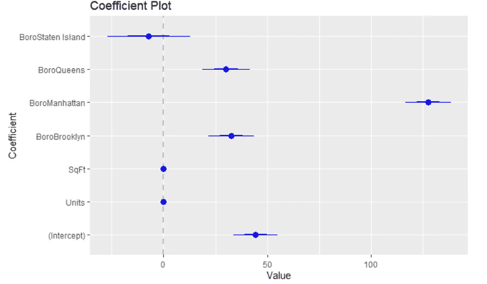
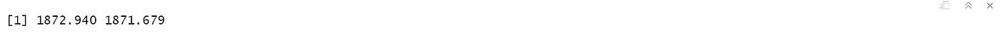

# 模型诊断和选择— 9

> 原文：<https://medium.com/analytics-vidhya/model-diagnostics-and-selection-9-7a79c4d70a24?source=collection_archive---------9----------------------->

> *如果您还没有阅读 R 数据分析系列的第 8 部分，请仔细阅读下面的文章，其中我们讨论了* [多元线性回归— 8 *。*](/@viveksrinivasan/multiple-linear-regression-2f28ad463e68)
> 
> 这篇文章的内容是我在 IIM-B 时代得到的几本书的要点。
> 
> *人人为我——贾里德·p·兰德*
> 
> *实用数据科学与 R — Nina Zumel &约翰·芒特*
> 
> *文中讨论的所有代码块都以 R markdown 的形式出现在* [*Github 链接*](https://github.com/viveksrinivasanss/Data_Science_Using_R) *中。*
> 
> *要看我写的所有文章请使用链接，*[*Vivek Srinivasan*](/@viveksrinivasan)*。*


B 建立一个模型可能是一个永无止境的过程，在这个过程中，我们不断地通过添加交互、去掉变量、进行转换等等来改进模型。然而，在某些时候，我们需要确认我们有当时最好的模型，甚至是一个好模型。这就引出了一个问题:我们如何判断一个模型的`quality` ？

几乎在所有情况下，答案都是:与其他模式相关。这可以是对`residuals`、一个`ANOVA` 测试的结果、`Wald` 测试、`drop-in deviance`、`AIC` 或`BIC` 分数、`cross-validation`错误或`bootstrapping`的分析。

## 残差

评估模型质量的第一种方法是对`residuals`进行分析，T9 是实际响应和拟合值(模型预测值)之间的差异。这是我们上一篇文章中讨论的公式的直接结果，其中误差类似于残差，是`normally` 分布的。基本思想是，如果模型适当地适合数据，残差也应该是正态分布的。为了看到这一点，我们从拟合回归的住房数据开始，并用系数图可视化。

```
housing <- read.table("../data/housing.csv",sep = ",", header = TRUE,stringsAsFactors = FALSE)
names(housing) <- c("Neighborhood", "Class", "Units", "YearBuilt","SqFt", "Income", "IncomePerSqFt", "Expense",
                    "ExpensePerSqFt", "NetIncome", "Value","ValuePerSqFt", "Boro")
housing <- housing[housing$Units <   1000, ]
house1 <- lm(ValuePerSqFt ~ Units + SqFt + Boro, data=housing)
summary(house1)
```


从模型中获取系数的一个快速方法是使用`coef` 函数，或者在模型对象上使用`$`操作符从模型中获取系数，正如我们在上一篇文章中所讨论的。

```
library(coefplot)
coefplot(house1)
```



对于线性回归，三个重要的残差图是`fitted values against residuals`、`Q-Q plots`和`histogram of residuals.`，第一个很容易用 ggplot2 得到。幸运的是，ggplot2 有一个对付`lm` 模型的简便招数。我们可以使用模型作为数据源，ggplot2“强化”它，创建新的列，以便于绘图。

```
library(ggplot2)
# see what a fortified lm model looks like
head(fortify(house1))
```


下图所示的`residuals` 对`fitted values`的曲线乍一看令人不安，因为残差中的模式显示它们并不像期望的那样随机分散。

```
ggplot(aes(x=.fitted, y=.resid), data = house1) +
  geom_point() +
  geom_hline(yintercept = 0) +
  geom_smooth(se = FALSE) +
  labs(x="Fitted Values", y="Residuals")
```


然而，进一步的调查显示，这是由于结构的`Boro` 给数据的模式，它会很好。

```
ggplot(aes(x=.fitted, y=.resid), data = house1) +
  geom_point() +
  geom_hline(yintercept = 0) +
  geom_smooth(se = FALSE) +
  labs(x="Fitted Values", y="Residuals") +
  geom_point(aes(color=Boro))
```


接下来是`Q-Q plot`。如果模型非常适合，则当绘制正态分布的理论分位数时，标准化残差应该都落在一条直线上。

```
ggplot(house1, aes(sample=.stdresid)) + stat_qq() + geom_abline()
```


`Q-Q plot`用于 house1。尾部偏离理想的理论线，表明我们没有最好的拟合。

另一个诊断是`residuals`的`histogram` 。直方图不是正态分布的，这意味着我们的模型不是完全正确的规格。

```
ggplot(house1, aes(x=.resid)) + geom_histogram()
```


## 型号选择

所有这些模型拟合的度量只有在比较多个模型时才有意义，因为所有这些度量都是相对的。因此，我们将拟合一些模型，以便相互比较。

```
house2 <- lm(ValuePerSqFt ~ Units * SqFt + Boro, data=housing)
house3 <- lm(ValuePerSqFt ~ Units + SqFt * Boro + Class,data=housing)
house4 <- lm(ValuePerSqFt ~ Units + SqFt * Boro + SqFt*Class,data=housing)
house5 <- lm(ValuePerSqFt ~ Boro + Class, data=housing)
```

像往常一样，我们的第一步是使用`coefplot` 包中的`multiplot` 一起可视化模型。结果显示`Boro` 是唯一对`ValuePerSqFt` 有显著影响的变量，某些`condominium` 类型也是如此。

```
multiplot(house1, house2, house3, house4, house5, pointSize=2)
```


## 模型选择的方差分析

虽然我们不提倡使用`ANOVA` 进行多样本测试，但我们相信它在测试不同模型的相对优点时是有用的。简单地将多个模型对象传递给`anova` 将返回一个结果表，其中包括残差平方和`(RSS)`，残差平方和是对误差的度量，越低越好。

```
anova(house1, house2, house3, house4, house5)
```


这表明第四个模型`house4`具有最低的`RSS`，这意味着它是该组中最好的模型。`RSS` 的问题在于，当一个额外的变量被添加到模型中时，它总是会得到改善。这可能导致模型过于复杂和过度拟合。

## AIC 和 BIC

另一个惩罚模型复杂性的度量是`Akaike Information Criterion (AIC)`。与`RSS`一样，具有最低`AIC` ——甚至负值——的模型被认为是最优的。 `BIC (Bayesian Information Criterion)`是一个类似的指标，同样，越低越好。AIC 的公式是


其中`ln(L)`是最大化的对数似然，而`p`是模型中系数的数量。随着模型的改进，对数似然变得更大，并且因为该项被取消了，所以`AIC`变得更低。然而，增加系数会增加 AIC；这不利于模型的复杂性。`BIC` 的公式与此类似，只是它不是将系数乘以 2，而是乘以行数的自然对数。这见于


我们模型的`AIC` 和`BIC` 分别使用`AIC` 和`BIC` 函数计算。

```
AIC(house1, house2, house3, house4, house5)
BIC(house1, house2, house3, house4, house5)
```


同样，从上表可以看出，型号`house4` 比其他型号更好，因为它的`AIC` 和`BIC` 得分最低。

## 交叉验证

残差诊断和模型测试，如`ANOVA` 和`AIC` 有点过时，是在现代计算能力之前出现的。评估模型质量的首选方法——至少对大多数数据科学家来说——是交叉验证，有时称为 `k-fold cross-validation`。数据被分成 k 个(通常是五个或十个)不重叠的部分。然后，对数据的 `k − 1`部分拟合一个模型，然后使用该模型根据`kth`部分进行预测。

重复`k`次，直到每个部分都被测试一次并包含在模型拟合 `k − 1`次中。交叉验证提供了对模型预测准确性的一种度量，这在很大程度上被认为是评估模型质量的一种好方法。

有许多帮助执行`cross-validation`的包和函数。每一个都有它自己的局限性或怪癖，所以我们没有仔细研究许多不完整的函数，而是展示了一个适用于`generalized linear models`(包括线性回归)的函数，然后构建了一个通用的框架，可以通用于任意的模型类型。

Brian Ripley 的引导包有用于执行`cross-validation` 的`cv.glm`。顾名思义，它只适用于一般的线性模型，这将满足许多情况。

```
library(boot)
#refit house1 using glm instead of lm
houseG1 <- glm(ValuePerSqFt ~ Units + SqFt + Boro,data=housing, family=gaussian(link="identity"))# ensure it gives the same results as lm
identical(coef(house1), coef(houseG1))
```


来自`cv.glm`的结果包括 delta，它有两个数字，基于所有折叠的成本函数的原始`cross-validation error`(在这种情况下是均方差，这是对估计器正确性的度量)和`adjusted cross-validation error`。第二个数字补偿了没有使用留一交叉验证，这类似于`k-fold cross-validation`，除了每个折叠都是除了一个点之外的所有数据点。这非常准确，但是计算量很大。

```
houseCV1 <- cv.glm(housing, houseG1, K=5)
houseCV1$delta
```



虽然我们得到了一个不错的错误数字，但只有当我们可以将其与其他模型进行比较时，它才会对我们有所帮助，因此我们对我们构建的其他模型运行相同的过程，首先用`glm`重新构建它们。

```
# Building multiple models
houseG2 <- glm(ValuePerSqFt ~ Units * SqFt + Boro, data=housing)
houseG3 <- glm(ValuePerSqFt ~ Units + SqFt * Boro + Class,data=housing)
houseG4 <- glm(ValuePerSqFt ~ Units + SqFt * Boro + SqFt*Class,data=housing)
houseG5 <- glm(ValuePerSqFt ~ Boro + Class, data=housing)# run cross-validation
houseCV2 <- cv.glm(housing, houseG2, K=5)
houseCV3 <- cv.glm(housing, houseG3, K=5)
houseCV4 <- cv.glm(housing, houseG4, K=5)
houseCV5 <- cv.glm(housing, houseG5, K=5)## Creating a dataframe of model Error values and adding model name
cvResults <- as.data.frame(rbind(houseCV1$delta, houseCV2$delta, houseCV3$delta, houseCV4$delta,houseCV5$delta))
names(cvResults) <- c("Error", "Adjusted.Error")
cvResults$Model <- sprintf("houseG%s", 1:5)cvResults
```


再次，第四个型号，`houseG4`，是上级型号。让我们想象一下`ANOVA`、`AIC` 和`cross-validation`对不同模型的相对优点有多认同。比例各不相同，但图的形状是一样的。

```
# measure with ANOVA
cvANOVA <-anova(houseG1, houseG2, houseG3, houseG4, houseG5)
cvResults$ANOVA <- cvANOVA$`Resid. Dev`# measure with AIC
cvResults$AIC <- AIC(houseG1, houseG2, houseG3, houseG4, houseG5)$AIC# make the data.frame suitable for plotting
library(reshape2)
cvMelt <- melt(cvResults, id.vars="Model", variable.name="Measure",value.name="Value")# Plotting Results
ggplot(cvMelt, aes(x=Model, y=Value)) +
  geom_line(aes(group=Measure, color=Measure)) +
  facet_wrap(~Measure, scales="free_y") +
  theme(axis.text.x=element_text(angle=90, vjust=.5)) +
  guides(color=FALSE)
```


`cross-validation error`(原始和调整后)、`ANOVA` 和`AIC` 用于房屋模型的绘图。比例不同，这是应该的，但形状相同，这表明`houseG4` 确实是最好的模型。

确定模型的质量是模型构建过程中的一个重要步骤。这可以采取传统的适合度测试的形式，如`ANOVA` 或更现代的技术，如`cross-validation`。`bootstrap` 是确定模型不确定性的另一种方法，特别是对于置信区间无法计算的模型。在本文中，我们没有讨论 bootstrap 技术。我们将在看到`Random Forest`和`Gradient Boosting`算法时讨论它。这些都可以通过帮助选择模型中包括哪些变量和排除哪些变量来形成。

> 使用 R-10 的逻辑回归将很快发表
> 
> 一定要通过评论和分享文章来分享你的想法和支持。