# 生存预测的模型集成..！！！

> 原文：<https://medium.com/analytics-vidhya/model-ensembles-for-survival-prediction-a3ecc9f7c2ae?source=collection_archive---------30----------------------->

泰坦尼克号生存预测——也许这是每个机器学习爱好者迈向数据科学的第一步。这可能是世界上被利用最多的数据集之一。随着时间的推移，它已经成为机器学习的游乐场，不仅对新手数据科学家来说如此，对有经验的联盟来说也是如此。

尽管有数百个关于同一主题的博客和解决方案，但这篇文章的全部目的是强调方法而不是排名。在本文中，我将给出一个简单的逐步指南来解决这个问题，并将最常用的机器学习模型平均在一起，以获得平均预测。

***请从我的*** [***GitHub 资源库***](https://github.com/raj1611/Titanic) ***下载*** [***代码***](https://github.com/raj1611/Titanic/blob/master/Model%20Ensembles%20For%20Survival%20Prediction.ipynb) ***。本文只展示了几个重要的代码。***

## 背景—


1912 年 4 月 15 日凌晨，由白星航运公司运营的英国客轮泰坦尼克号在从南安普敦到纽约的处女航中撞上冰山后沉没在北大西洋。据估计，船上 2224 名乘客和船员中，超过 1500 人死亡，这使得沉船成为现代史上最致命的和平时期商业海上灾难之一。皇家邮轮泰坦尼克号是当时最大的船只，也是白星航运公司运营的三艘奥运级远洋客轮中的第二艘。她是由贝尔法斯特的哈兰和沃尔夫造船厂建造的。托马斯·安德鲁斯，当时造船厂的首席造船师，在灾难中死亡(来源维基)

Kaggle 竞赛非常简单:使用机器学习来创建一个模型，预测哪些乘客在泰坦尼克号沉船事件中幸存。

工作流程是怎样的？

我会保持简单明了，而不是使用时髦的词语。这将有助于你坚持下去。这是工作流程。

**1。问题识别**

**2。我们有什么数据？**

**3。探索性数据分析**

**4。数据准备包括特征工程**

**5。开发模型**

**6。模型评估**

**7。结论**

这就是解决数据科学问题所需的全部内容。

**1。问题识别**

**最佳实践** —任何项目最重要的部分是正确识别问题。在你像典型的数据科学家一样跳到“如何做到这一点”之前，先理解“做什么/为什么”这一部分。
首先了解问题，然后从在一张纸上起草一个粗略的策略开始。写下诸如你期望做什么&你可能需要什么数据或者说你计划使用什么算法之类的东西。

目标是基于一组描述年龄、性别或船上乘客等级的变量来预测给定乘客的生存或死亡。

所以这是一个分类问题，你应该预测生存为 1，死亡为 0。

**2。我们有什么数据？**

让我们导入必要的库&首先在 Python 环境中引入数据集。一旦我们在 Python 环境中有了数据集，我们就可以对数据进行切片和切块，以了解我们有什么和缺少什么。

```
# Import the basic python libraries
import pandas as pd
import numpy as np
import seaborn as sns
import matplotlib.pyplot as plt 
get_ipython().run_line_magic(‘matplotlib’, ‘inline’)
sns.set(style=’white’, context=’notebook’, palette=’deep’)
import warnings
warnings.filterwarnings(‘ignore’)
# Read the datasets
train = pd.read_csv(“../input/train.csv”)
test = pd.read_csv(“../input/test.csv”)
IDtest = test[“PassengerId”]
train.info()
test.info()
```

我们在训练数据集中有 891 个观察值和 12 列，在测试数据集中有 418 个观察值和 11 列。查看变量类型的组合。

**3。探索性数据分析**

机器学习的一个重要方面是确保变量在训练和测试数据中显示几乎相同的趋势。否则，将会导致过度拟合，因为模型表示的关系在测试数据集中不适用。

我在这里举一个例子。当我们进行变量分析时，试着复制(在任何适用的地方)测试数据的代码，看看在数据分布中是否有任何主要的不同。

示例—让我们从查找缺失值的数量开始。如果您比较输出，您将会看到缺失值百分比在训练和测试数据集之间变化不大。

使用分组/单变量/双变量分析方法比较培训和测试数据的分布。

```
# Check missing values in train data set
train_na = (train.isnull().sum() / len(train)) * 100
train_na = train_na.drop(train_na[train_na == 0].index).sort_values(ascending=False)[:30]
miss_train = pd.DataFrame({‘Train Missing Ratio’ :train_na})
miss_train.head()# Check missing values in train data set
test_na = (test.isnull().sum() / len(test)) * 100
test_na = test_na.drop(test_na[test_na == 0].index).sort_values(ascending=False)[:30]
miss_test = pd.DataFrame({‘Test Missing Ratio’ :test_na})
miss_test.head()# Fill empty and NaNs values with NaN
train = train.fillna(np.nan)
test = test.fillna(np.nan)
```

**PassengerId —** 与建模角度无关，因此我们稍后将删除该变量

**Pclass —** Pclass 是一个分类变量。我们来看看分布。

```
# Analyze the Survival Probability by Pclass
g = sns.barplot(x=”Pclass”,y=”Survived”,data=train)
g = g.set_ylabel(“Survival Probability”)
train[[‘Pclass’, ‘Survived’]].groupby([‘Pclass’]).mean().sort_values(by=’Survived’, ascending=False)
```

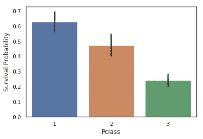

大约 62%的乘客幸存，其次是 47%的乘客 2

**名称—** 与分析&建模角度无关。在创建一个新变量作为标题后，我们将放弃这个特性。

**性别-** 根据以下分析，女性乘客比男性乘客有更大的生还机会。

```
# Analyze the Survival Probability by Gender
g = sns.barplot(x=”Sex”,y=”Survived”,data=train)
g = g.set_ylabel(“Survival Probability”)
train[[“Sex”, “Survived”]].groupby([‘Sex’]).mean().sort_values(by=’Survived’, ascending=False)
```

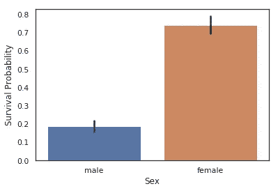

**年龄-** 下面的洞察力连接回电影的“女士和小孩优先”场景。这表明很多婴儿和小孩存活了下来。

```
# Let’s explore the distribution of age by response variable (Survived)
fig = plt.figure(figsize=(10,8),)
axis = sns.kdeplot(train.loc[(train[‘Survived’] == 1),’Age’] , color=’g’,shade=True, label=’Survived’)
axis = sns.kdeplot(train.loc[(train[‘Survived’] == 0),’Age’] , color=’b’,shade=True,label=’Did Not Survived’)
plt.title(‘Age Distribution — Surviver V.S. Non Survivors’, fontsize = 20)
plt.xlabel(“Passenger Age”, fontsize = 12)
plt.ylabel(‘Frequency’, fontsize = 12);
```

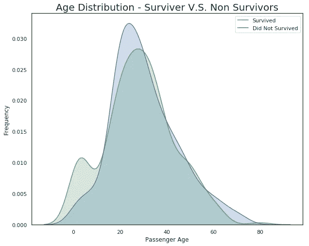

**SibSP** —该变量指船上兄弟姐妹/配偶的数量。SibSP = 1 和 SibSP = 2 显示更高的存活机会。

```
# Analyze probability of survival by SibSP
g = sns.factorplot(x=”SibSp”,y=”Survived”,data=train,kind=”bar”, size = 7 ,palette = “muted”)
g.despine(left=True)
g = g.set_ylabels(“survival probability”)
train[[“SibSp”, “Survived”]].groupby([‘SibSp’]).mean().sort_values(by=’Survived’, ascending=False)
```

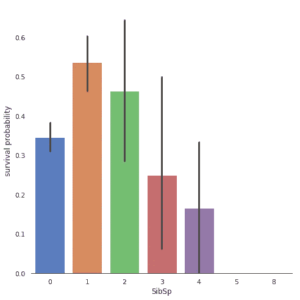

Parch 表示泰坦尼克号上父母/孩子的数量。请注意，Parch = 3 和 Parch = 1 显示了更高的生存概率。

```
# Analyze the Survival Probability by Parch
g = sns.factorplot(x=”Parch”,y=”Survived”,data=train,kind=”bar”, size = 7 ,palette = “muted”)
g.despine(left=True)
g = g.set_ylabels(“Survival Probability”)
train[[“Parch”, “Survived”]].groupby([‘Parch’]).mean().sort_values(by=’Survived’, ascending=False)
```

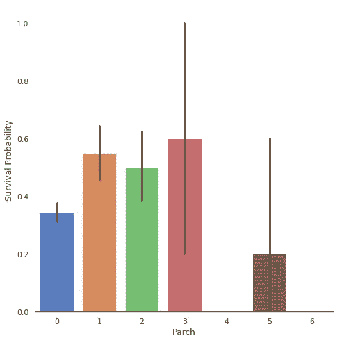

**门票** -这个变量有一个字母数字值，可能与生存没有直接关系，但我们可以使用这个变量来创建一些额外的功能。

**票价**——我们先看看分布情况。

```
from scipy import stats
from scipy.stats import norm, skew #for some statistics
sns.distplot(train[‘Fare’] , fit=norm);
# Get the fitted parameters used by the function
(mu, sigma) = norm.fit(train[‘Fare’])
print( ‘\n mu = {:.2f} and sigma = {:.2f}\n’.format(mu, sigma))
#Now plot the distribution
plt.legend([‘Normal dist. ($\mu=$ {:.2f} and $\sigma=$ {:.2f} )’.format(mu, sigma)],loc=’best’)
plt.ylabel(‘Frequency’)
plt.title(‘Fare distribution’)
```

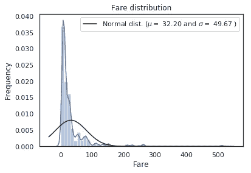

票价变量是右偏的。我们需要使用 log 函数来转换这个变量，并使其更符合正态分布。我们将在特征工程过程中完成这项工作。

**舱室** —字母数字变量。687 序列中的缺失值& 327 测试数据中的缺失值—需要处理。我们可以使用这个 Cabin 变量创建更多的功能。

**登船** — C =瑟堡，Q =皇后镇，S =南安普顿

让我们用存活率来探讨这个变量。上船代表上船的港口。正如下面的分析输出所表明的，Emabrked C 显示出很高的生存概率。

```
# Analyze the Survival Probability by Embarked
g = sns.factorplot(x=”Embarked”,y=”Survived”,data=train,kind=”bar”, size = 7 ,palette = “muted”)
g.despine(left=True)
g = g.set_ylabels(“survival probability”)
train[[“Embarked”, “Survived”]].groupby([‘Embarked’]).mean().sort_values(by=’Survived’, ascending=False)
```

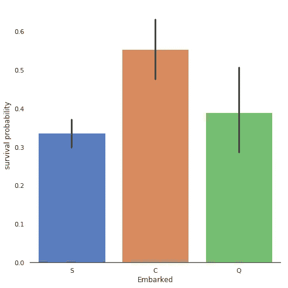

**附加分析** —让我们创建几个附加图表，看看不同变量之间的关系。我们称之为多元分析。

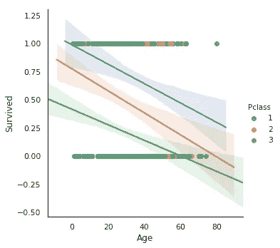

```
# Age, Pclass & Survival
sns.lmplot(‘Age’,’Survived’,data=train,hue=’Pclass’)
```

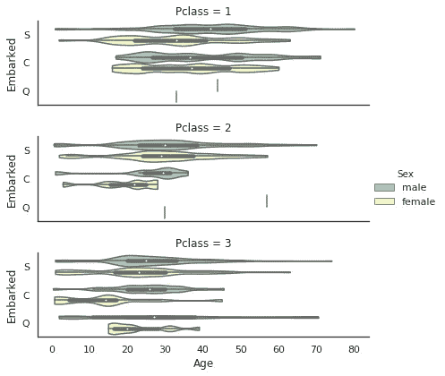

```
# Age, Embarked, Sex, Pclass
g = sns.catplot(x=”Age”, y=”Embarked”, hue=”Sex”, row=”Pclass”, data=train[train.Embarked.notnull()], 
orient=”h”, height=2, aspect=3, palette=”Set3", kind=”violin”, dodge=True, cut=0, bw=.2)
```

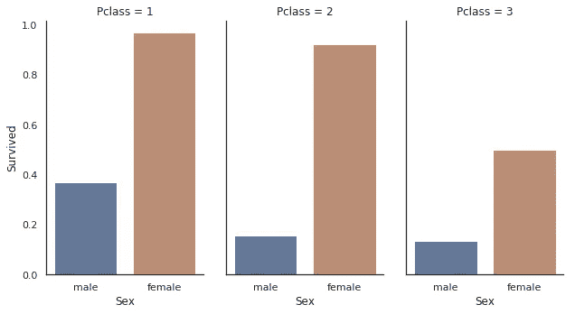

```
# Relation among Pclass, Gender & Survival Rate
g = sns.catplot(x=”Sex”, y=”Survived”, col=”Pclass”, data=train, saturation=.5, kind=”bar”, ci=None, aspect=.6)
```

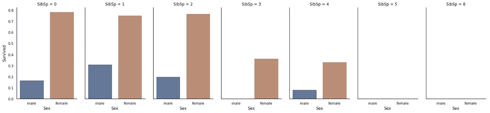

```
# Relation among SibSP, Gender & Survival Rate
g = sns.catplot(x=”Sex”, y=”Survived”, col=”SibSp”, data=train, 
saturation=.5,kind=”bar”, ci=None, aspect=.6)
```

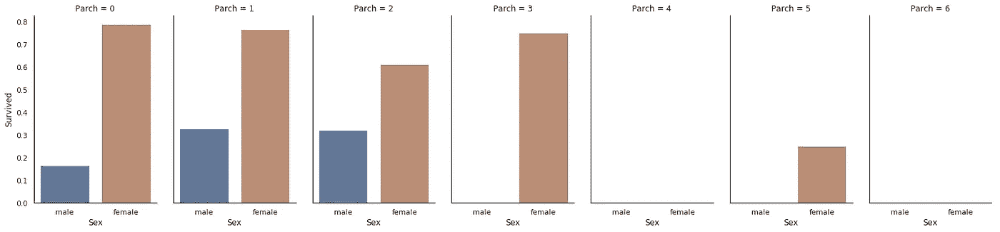

```
# Relation among Parch, Gender & Survival Rate
g = sns.catplot(x=”Sex”, y=”Survived”, col=”Parch”, data=train, saturation=.5,kind=”bar”, ci=None, aspect=.6)
```

**4。包括特征工程在内的数据准备**

创建一个组合数据集，一次性复制训练和测试数据集的特征工程。我们需要做的是处理以下变量-

**乘客 ID** —无需任何操作。我们可以去掉这个变量。

```
# PassengerID — Drop PassengerID
combdata.drop(labels = [“PassengerId”], axis = 1, inplace = True)
```

**PClass** —只有 3 个数值。我们将照原样使用它。

```
# Pclass — Use as it is
combdata[‘Pclass’].unique()
```

**名称** —可用于通过从名称中提取称呼来创建新的变量标题。

```
# Name — Extract Salutation from Name variable
salutation = [i.split(“,”)[1].split(“.”)[0].strip() for i in combdata[“Name”]]
combdata[“Title”] = pd.Series(salutation)
combdata[“Title”].unique()# Convert other salutations to fixed Title 
combdata[“Title”] = combdata[“Title”].replace([‘Lady’, ‘the Countess’,’Countess’,’Capt’, ‘Col’,’Don’, ‘Dr’, ‘Major’, ‘Rev’, ‘Sir’, ‘Jonkheer’, ‘Dona’], ‘Rare’)
combdata[“Title”] = combdata[“Title”].map({“Master”:0, “Miss”:1, “Ms” : 1 , “Mme”:1, “Mlle”:1, “Mrs”:1, “Mr”:2, “Rare”:3})
combdata[“Title”] = combdata[“Title”].astype(int)
combdata[“Title”].unique()
```

性别——创造虚拟变量

```
# Sex — Create dummy variables
#combdata[“Sex”] = combdata[“Sex”].map({“male”: 0, “female”:1}) or
combdata = pd.get_dummies(combdata, columns = [“Sex”])
```

**年龄** —缺失值处理，随后创建虚拟变量

```
## Fill Age with the median age of similar rows according to Sex, Pclass, Parch and SibSp
# Index of NaN age rows
missing_index = list(combdata[“Age”][combdata[“Age”].isnull()].index)for i in missing_index :
 median_age = combdata[“Age”].median()
 filled_age = combdata[“Age”][((combdata[‘Sex’] == combdata.iloc[i][“Sex”]) & 
 (combdata[‘SibSp’] == combdata.iloc[i][“SibSp”]) & 
 (combdata[‘Parch’] == combdata.iloc[i][“Parch”]) & 
 (combdata[‘Pclass’] == combdata.iloc[i][“Pclass”]))].median()
 if not np.isnan(filled_age) :
 combdata[‘Age’].iloc[i] = filled_age
 else :
 combdata[‘Age’].iloc[i] = median_age
```

**SibSP** —创建虚拟变量

```
# SibSp — Create dummy variables
combdata = pd.get_dummies(combdata, columns = [“SibSp”])
```

**烤盘** —创建虚拟变量

```
# Parch — Create dummy variables
combdata = pd.get_dummies(combdata, columns = [“Parch”])
```

**标签** —创建虚拟变量发布特征工程

```
# Ticket — Extracting the ticket prefix. This might be a representation of class/compartment.
# If there is no prefix replace with U (Unknown).Ticket = []
for i in list(combdata.Ticket):
 if not i.isdigit() :
 Ticket.append(i.replace(“.”,””).replace(“/”,””).strip().split(‘ ‘)[0])
 else:
 Ticket.append(“U”)

combdata[“Ticket”] = Ticket
combdata[“Ticket”].unique()combdata = pd.get_dummies(combdata, columns = [“Ticket”], prefix=”T”)
```

**Fare** —缺失值处理后的日志归一化

```
# Fare — Check the number of missing value
combdata[“Fare”].isnull().sum()# Only 1 value is missing so we will fill the same with median
combdata[“Fare”] = combdata[“Fare”].fillna(combdata[“Fare”].median())# Use the numpy fuction log1p which applies log(1+x) to all elements of the column
combdata[“Fare”] = np.log1p(combdata[“Fare”])#Check the new distribution 
sns.distplot(combdata[‘Fare’] , fit=norm);
```

**舱室**——创建虚拟变量后特征工程

```
# Cabin — Replace the missing Cabin number by the type of cabin unknown ‘U’ and create dummy variables
combdata[“Cabin”] = pd.Series([i[0] if not pd.isnull(i) else ‘U’ for i in combdata[‘Cabin’] ])
```

**已装载**——创建虚拟变量

```
# Embarked — Find the number of missing values
combdata[“Embarked”].isnull().sum()# Fill Embarked missing values of dataset set with mode ‘S’
combdata[“Embarked”] = combdata[“Embarked”].fillna(“S”)# Create dummy variables
combdata = pd.get_dummies(combdata, columns = [“Embarked”], prefix=”Emb”)
```

**5。开发模型**

导入所需的库&分离训练和测试数据集。建立交叉验证策略。在所有特征工程步骤之后，训练和测试总共将有 75 列(特征)。

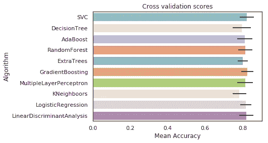

平均准确度的交叉验证分数

**6。模型评估**

**Adaboost** —准确率 81.81%

```
# Adaboost
DTC = DecisionTreeClassifier()adaDTC = AdaBoostClassifier(DTC, random_state=7)ada_param_grid = {“base_estimator__criterion” : [“gini”, “entropy”],
 “base_estimator__splitter” : [“best”, “random”],
 “algorithm” : [“SAMME”,”SAMME.R”],
 “n_estimators” :[1,2],
 “learning_rate”: [0.0001, 0.001, 0.01, 0.1, 0.2, 0.3,1.5]}gsadaDTC = GridSearchCV(adaDTC,param_grid = ada_param_grid, cv=kfold, scoring=”accuracy”, n_jobs= 4, verbose = 1)
gsadaDTC.fit(X_train,Y_train)
ada_best = gsadaDTC.best_estimator_
gsadaDTC.best_score_
```

**额外树分类器** —准确率 83.16%

```
#ExtraTrees 
ExtC = ExtraTreesClassifier()## Search grid for optimal parameters
ex_param_grid = {“max_depth”: [None],
 “max_features”: [1, 3, 10],
 “min_samples_split”: [2, 3, 10],
 “min_samples_leaf”: [1, 3, 10],
 “bootstrap”: [False],
 “n_estimators” :[100,300],
 “criterion”: [“gini”]}gsExtC = GridSearchCV(ExtC,param_grid = ex_param_grid, cv=kfold, scoring=”accuracy”, n_jobs= 4, verbose = 1)
gsExtC.fit(X_train,Y_train)
ExtC_best = gsExtC.best_estimator_# Best score
gsExtC.best_score_
```

**随机森林分类器** —准确率 83.38%

```
# RFC Parameters tunning 
RFC = RandomForestClassifier()## Search grid for optimal parameters
rf_param_grid = {“max_depth”: [None],
 “max_features”: [1, 3, 10],
 “min_samples_split”: [2, 3, 10],
 “min_samples_leaf”: [1, 3, 10],
 “bootstrap”: [False],
 “n_estimators” :[100,300],
 “criterion”: [“gini”]}
gsRFC = GridSearchCV(RFC,param_grid = rf_param_grid, cv=kfold, scoring=”accuracy”, n_jobs= 4, verbose = 1)
gsRFC.fit(X_train,Y_train)
RFC_best = gsRFC.best_estimator_# Best score
gsRFC.best_score_
```

**梯度增强** —准确率 83.50%

```
# Gradient boosting 
GBC = GradientBoostingClassifier()
gb_param_grid = {‘loss’ : [“deviance”],
 ‘n_estimators’ : [100,200,300],
 ‘learning_rate’: [0.1, 0.05, 0.01],
 ‘max_depth’: [4, 8],
 ‘min_samples_leaf’: [100,150],
 ‘max_features’: [0.3, 0.1] 
 }
gsGBC = GridSearchCV(GBC,param_grid = gb_param_grid, cv=kfold, scoring=”accuracy”, n_jobs= 4, verbose = 1)
gsGBC.fit(X_train,Y_train)
GBC_best = gsGBC.best_estimator_# Best score
gsGBC.best_score_
```

**SVC 分类器** —准确率 83.61%

```
#  SVC classifier
SVMC = SVC(probability=True)
svc_param_grid = {‘kernel’: [‘rbf’], 
 ‘gamma’: [ 0.001, 0.01, 0.1, 1],
 ‘C’: [1, 10, 50, 100,200,300, 1000]}
gsSVMC = GridSearchCV(SVMC,param_grid = svc_param_grid, cv=kfold, scoring=”accuracy”, n_jobs= 4, verbose = 1)
gsSVMC.fit(X_train,Y_train)
SVMC_best = gsSVMC.best_estimator_# Best score
gsSVMC.best_score_
```

让我们找出这些算法使用的关键特征

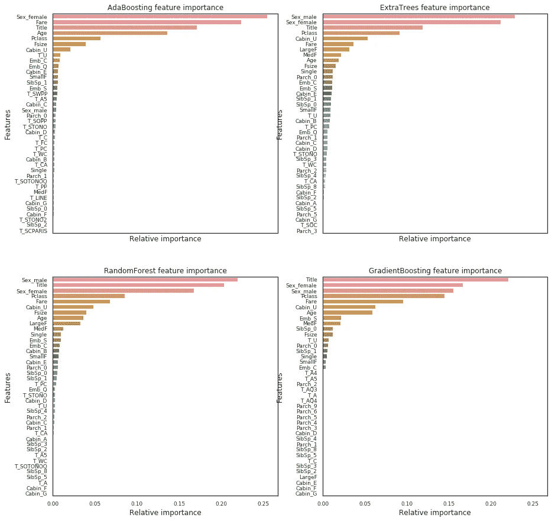

让我们看看这些模型在测试数据集上的表现

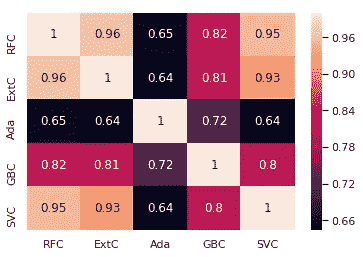

使用投票分类器组合所有模型的预测能力。

```
votingC = VotingClassifier(estimators=[(‘rfc’, RFC_best), (‘extc’, ExtC_best),
(‘svc’, SVMC_best), (‘adac’,ada_best),(‘gbc’,GBC_best)], voting=’soft’, n_jobs=4)
votingC = votingC.fit(X_train, Y_train)# Predict and export the results
test_Survived = pd.Series(votingC.predict(test), name=”Survived”)
results = pd.concat([IDtest,test_Survived],axis=1)
results.to_csv(“Final Submission File.csv”,index=False)
```

**7。结论**

头衔、性别 _ 女性、费用和阶级似乎是分类的首选共同特征。

虽然标题和年龄特征表示乘客的年龄类别，但是诸如票价、等级、客舱等特征。代表经济地位。基于我们的发现，我们可以得出结论，年龄、性别和代表社会/经济地位的特征是影响乘客生存的主要因素。

这种方法在排行榜上给出大约 0.80 的分数，这可以通过特征选择和/或神经网络来进一步改善。

更多敬请期待，喜欢就鼓掌:)！！！