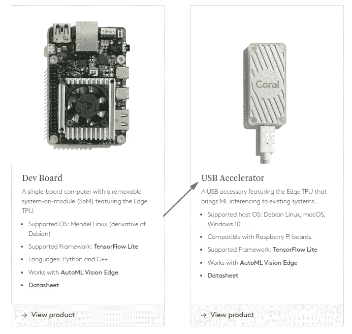
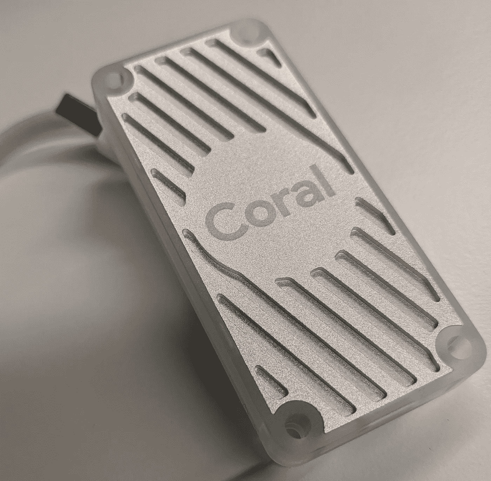
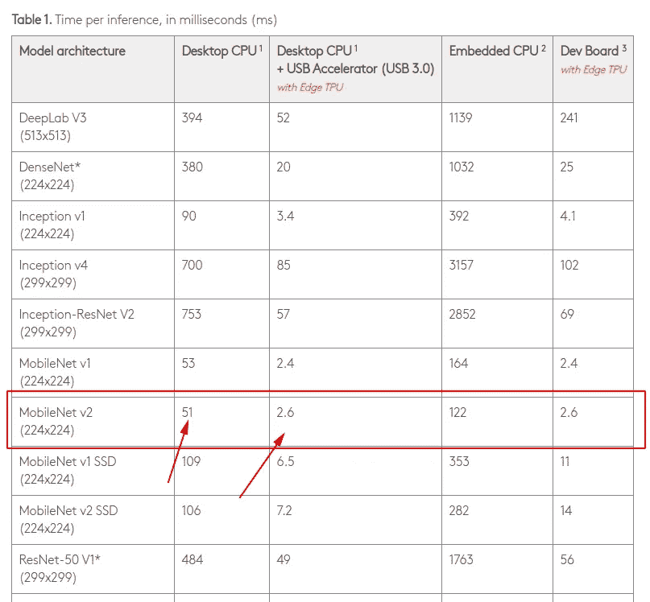

# 与 TFlite 和 Coral USB 加速器设备的模型推理比较

> 原文：<https://medium.com/analytics-vidhya/model-inference-comparison-with-tflite-coral-usb-accelerator-device-f639e13d6e49?source=collection_archive---------12----------------------->

如果我们准备一个实验，比较一个具有相似特征的模型，一个使用传统的台式机 CPU，另一个使用 EDGE TPU，会怎么样？

> 单个 Edge TPU 每秒能够执行 4 万亿次运算(万亿次运算)，每个 TOPS 使用 0.5 瓦(每瓦 2 TOPS)。这如何转化为应用程序的性能取决于多种因素。每个神经网络模型都有不同的需求，如果您使用 USB 加速器设备，总性能也会因主机 CPU、USB 速度和其他系统资源而异。[参考](https://coral.ai/docs/edgetpu/benchmarks/)

今天让我们探索一下选择使用 USB 加速器的体验，

触摸设备

## 开始实验分析

探索[“每次推理的时间”表](https://coral.ai/docs/edgetpu/benchmarks/)，我很好奇使用桌面 CPU 和相同的主机 CPU 来试验模型推理，将推理委托给 Coral accelerator。因此，这里的最初挑战是使用最同质的实验来探索两种环境之间的差异。

## **最初的问题是关于推理方法的**

> Edge TPU 仅与 TensorFlow Lite 型号兼容。因此，通常我们必须训练一个 TensorFlow 模型，将其转换为 TensorFlow Lite，并为 Edge TPU 编译它。[参考](https://coral.ai/docs/edgetpu/inference/)

对于这个实验，我将选择一个通用模型和等效的量化…方法，为整个 python 实现中的边缘 TPU 做准备。

## 哪里可以下载模型？

我们当然可以使用 TF Hub 并探索不同版本的模型，也可以在 [Coral 页面](https://coral.ai/models/)中看到许多量化模型。

现在让我们开始实验，我决定探索与 MobileNet v2 模型架构和 224 作为图片大小。
我会试着遵循两个简单的步骤:

*   创建一个使用桌面 CPU 分析图片的实现
*   创建一个实现来使用边缘 TPU 珊瑚加速器和分析图像。

最后，我们应该将结果与建议的初始表进行比较，注意我们将使用不同的 CPU 类型主机。

## 履行

对于最初的场景，我创建了一个简单的 [python 脚本](https://github.com/nbortolotti/tflite-tpu-experiences/tree/master/inference_exploration/cpu)来探索桌面 CPU 推理，作为替代，我还在 Colab 中提出了一个[等价实现](https://github.com/nbortolotti/tflite-tpu-experiences/tree/master/inference_exploration/colab)。(与 TensorFlow Hub 集成以获取模型的解决方案)

对于 Edge TPU 应用程序，我使用了 Coral 加速器，这里的是为进行推理而创建的解决方案。*在代码库中，我添加了一个" *。sh”文件来完成初始要求并简化实验的表示。

 [## nbortolotti/tflite-TPU-体验

### 使用 Coral edge tpu 加速器执行的示例记住:tflite_runtime 是对 tflite 的依赖…

github.com](https://github.com/nbortolotti/tflite-tpu-experiences/tree/master/inference_exploration) 

## 结论

最后，正如我提到的那样，推理的性能取决于 CPU 类型、USB 和主机性能，但一般来说，边缘 TPU 的执行速度要快 10 倍以上。

图片 224x224，架构 MobileNet v2 带 CPU
* i7–7500 u CPU 2.70 GHz×2
* Linux 内核:5 . 3 . 0–28-通用
* **推理平均:50 毫秒**
图片 224x224，架构 MobileNet v2 用 Coral Edge TPU 加速器量化。
* **平均推断时间:2.6 毫秒**

很好很类似于最初的性能表:)。现在你可以使用[版本提供的](https://github.com/nbortolotti/tflite-tpu-experiences/tree/master/inference_exploration)自己进行实验。

这只是一个简单的例子，但是…你想看到更多使用 Coral 设备的项目吗？看看这个[可教分类器](https://coral.ai/projects/teachable-sorter/)