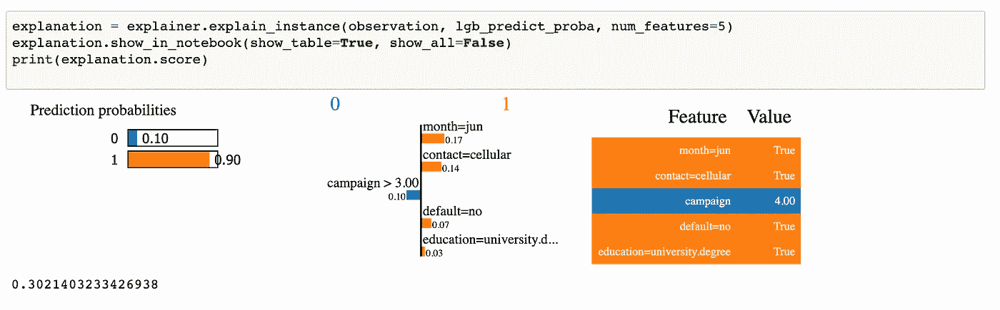

# ML 模型可解释性—石灰

> 原文：<https://medium.com/analytics-vidhya/model-interpretability-lime-part-2-53c0f5e76b6a?source=collection_archive---------5----------------------->


格伦·卡丽在 [Unsplash](https://unsplash.com?utm_source=medium&utm_medium=referral) 拍摄的照片

# 介绍

在我早先的[文章](/@sand.mayur/why-should-i-trust-your-model-bdda6be94c6f)中，我描述了为什么更需要理解机器学习模型以及其中的一些技术。我还详细解释了如何使用 ELI5 来更深入地了解模型。

在本文中，我将详细讨论另一种技术— [石灰](https://github.com/marcotcr/lime)

# LIME(局部可解释的模型不可知解释)

莱姆被提议作为论文“我为什么要相信你？”:解释任何分类器的预测”发表于 2016 年 8 月，作者:*马尔科·图利奥·里贝罗、萨米尔·辛格、卡洛斯·盖斯特林。它有两个 Python 的库。*

## 直觉

> 局部:解释为什么单个数据点被分类为特定的类
> 
> 模型不可知:将模型视为黑盒。不需要知道它是如何预测的

所有处理大数据的深度学习模型都需要处理大量特征才能准确预测。深度学习模型生成的 n 维曲线非常复杂，难以理解和解释。

LIME 建议专注于局部解释，而不是提供全局模型解释。我们可以放大模型中的数据点，然后可以详细地找到哪些特征影响了模型，从而得出某些结论。


LIME 是模型不可知的

LIME 不关心你正在使用的 ML 模型(现在或将来)。它会将其视为黑盒，并专注于解释本地结果。

## 石灰是如何工作的

对于给定的观察值:

1.  置换数据-通过从在训练数据上学习的分布中取样，在观察值周围创建新的数据集(在扰动的数据集中，基于分布挑选数字特征&基于出现的分类值)
2.  计算排列和原始观察值之间的距离
3.  用模型预测新点上的概率，那就是我们新的 **y**
4.  从置换数据中挑选最能描述复杂模型结果的 m 个特征
5.  对通过相似性加权的 m 个维度中的数据拟合线性模型
6.  线性模型的权重用于解释决策

**如何在 python 中使用这个库**

我们将使用银行营销数据集— [链接](https://archive.ics.uci.edu/ml/datasets/bank+marketing)。所有数据分析步骤都在[前一篇文章](/@sand.mayur/why-should-i-trust-your-model-bdda6be94c6f)中提到。使用这个数据集，我们将为线性回归、决策树、随机森林& Light GBM 建立模型(参考 [GitHub](https://github.com/mayur29/Machine-Learning-Model-Interpretation) 上的代码)。

在创建了我们的模型之后，我们将通过使用`LimeTabularExplainer`实例化一个新的`explainer`来开始使用 LIME。这些论点是

*   将带有分类值的训练数据转换为 LIME 格式
*   指定一个`mode`回归或分类
*   `feature_names`:您的列的名称列表
*   `categorical_names`:我们的字典将分类特征映射到它们可能的值
*   `categorical_features`:分类特征索引列表

```
explainer = LimeTabularExplainer(
convert_to_lime_format(X_train,categorical_names).values,
                   mode="classification",
                   feature_names=X_train.columns,
                   categorical_names=categorical_names,
                   categorical_features=categorical_names.keys(),
                   random_state=42)
```

我们将选择一行来解释结果

```
i = 4
print(X_test.iloc[i])
```


为本地解释选择的行

现在，我们将在这一行上为我们的 4 个模型中的每一个运行解释

```
explanation = explainer.explain_instance(observation, lr_predict_proba, num_features=5)explanation.show_in_notebook(show_table=True, show_all=False)
```


逻辑回归因素的解释

中心图显示了与线性模型的权重相对应的顶部特征对预测的贡献。因此，对于这位客户来说，subscribed 的值是真实的，因为他是在 6 月份通过电话联系的。事实上，他在这次竞选中接触了 3 次以上，这可能是一个负面因素。

LIME 正在对本地数据集拟合线性模型。通过调用以下函数，可以找到线性模型的系数、截距和 R 平方

```
print(explanation.local_exp)
print(explanation.intercept)
#R2 score
print(explanation.score)
```


线性模型信息

人们可以注意到上图中描述的权重是 local_exp 的值。线性回归模型的 R2 分数相当糟糕。

我们还尝试了 LightGBM 模型，下面是结果



LightGBM 结果

## 石灰的缺点

1.  **依赖于随机抽样的**新点，所以它可能不稳定
2.  线性模型拟合可能不准确
3.  图像处理速度很慢

# 结论

LIME 是理解黑盒模型的好工具。人们不需要花费太多精力来寻找影响模型决策的特征的细节。它独立于现在或将来使用的模型运行。你可以在我的 [GitHub](https://github.com/mayur29/Machine-Learning-Model-Interpretation) 上找到代码

如果你有任何关于酸橙的问题，让我知道乐意帮忙。如果你想收到我博客上的更新，请在 [Medium](/@sand.mayur) 或 [LinkedIn](https://www.linkedin.com/in/mayursand/) 上关注我！