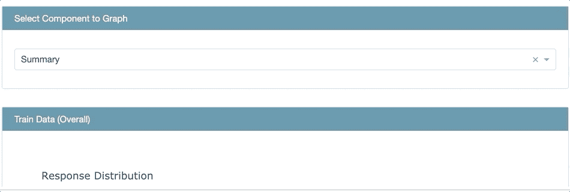
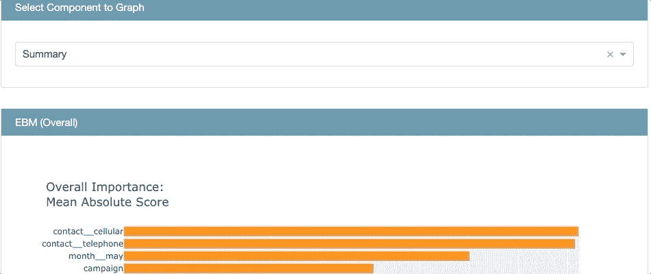
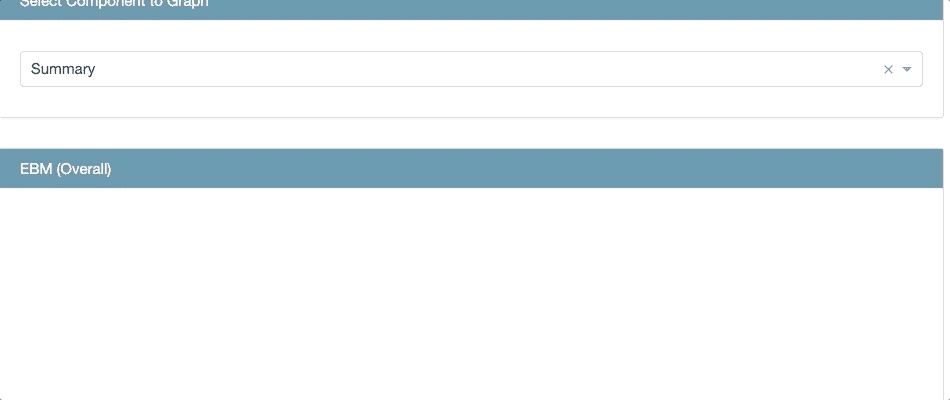
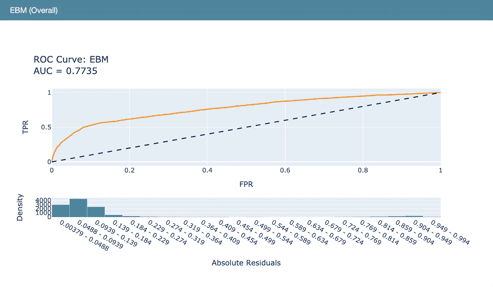
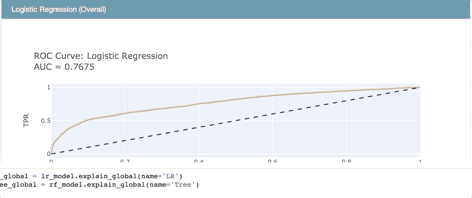
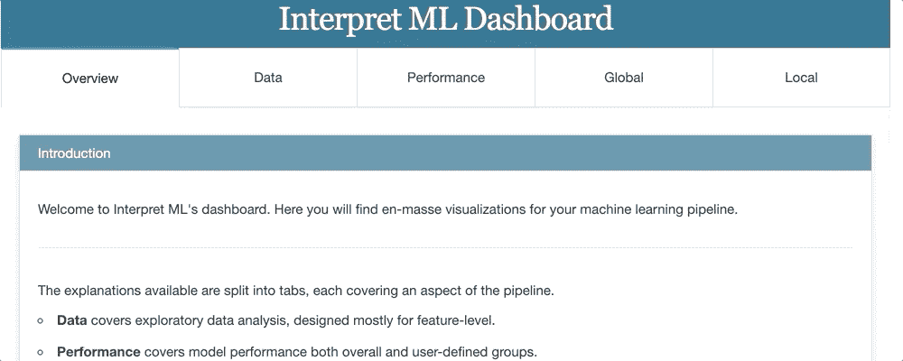
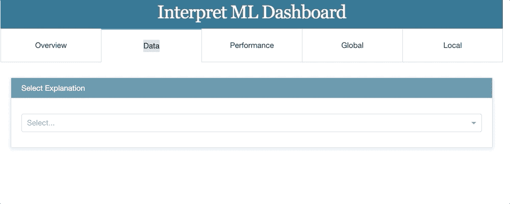
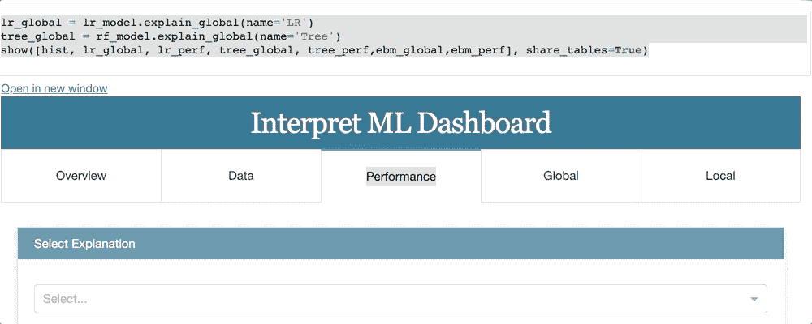
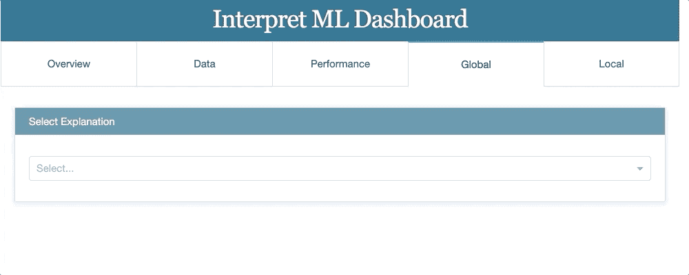

# 用微软的解释器 ML 进行模型解释

> 原文：<https://medium.com/analytics-vidhya/model-interpretation-with-microsofts-interpret-ml-85aa0ad697ae?source=collection_archive---------5----------------------->


Mauro Sbicego 在 [Unsplash](https://unsplash.com?utm_source=medium&utm_medium=referral) 上拍摄的照片

机器学习模型的预测能力和它的可解释性长期以来被认为是对立的。但现在不是了！在过去的两三年里，研究人员、行业以及更广泛的数据科学界重新对机器学习产生了兴趣，让它变得更加透明，甚至让它成为“白盒”..我已经写了一系列关于模型解释的文章— [ELI5 &排列重要性](/analytics-vidhya/why-should-i-trust-your-model-bdda6be94c6f)&时间解释了模型解释需要用到的&技术。在这篇文章中，我将讨论微软的新软件包

# 介绍

[**Interpret ML**](https://github.com/interpretml/) 是一个开源包，在一个屋檐下集成了最先进的机器学习可解释性技术。有了这个包，你可以训练可解释的玻璃盒子模型和解释黑盒系统。它是以解释为重点的工具和软件包的集合，包含了许多关键的可解释技术。 [**解释-文本**](https://github.com/interpretml/interpret-text) 支持一组针对文本数据训练的模型的可解释性技术。[**Azureml-Interpret**](https://docs.microsoft.com/en-us/azure/machine-learning/how-to-machine-learning-interpretability)**提供了一个 azure ml 包装器，用于在 azure 上运行所有的解释技术。**

# **可解释性方法**

**在《解释》中，可解释性算法分为两个主要部分——玻璃盒子模型和黑盒解释。**

## **玻璃盒子模型**

**玻璃盒模型是指设计成可解释的学习算法，即线性模型、决策树。Glassbox 模型通常提供精确的可解释性，也就是说，您可以跟踪和推理任何 Glassbox 如何做出决策。除了常规的 scikit 学习模型，Glassbox 还包含一个新的模型，叫做可解释的增强机器(EBM)**

## **可解释增压机(EBM)**

**EBM 是微软研究院开发的一个可解释的模型。它使用现代机器学习技术，如装袋、梯度增强和自动交互检测以及 GAMs(广义加法模型)。这使得 EBMs 与随机森林和梯度增强树等最先进的技术一样准确。然而，与这些黑盒模型不同，EBM 产生可解释的解释。**

****概念****

**线性模型是高度可解释，但是通常不提供复杂模型所提供的高精确度。**

> **Y = B1X1 + B2X2+ ……。+ BnXn + ϵ.(1，2，n 都是下标)**

**为了解决这个问题，统计学家创建了 gam(广义可加模型),它保持了可加结构(线性模型的互概率),但使它们更加灵活和准确。**

> **Y= f1(X1) + f2(X2)+f3(X3)…。fn(Xn)。(1，2，n 都是下标)**

**微软的研究人员用 Boosting & Bagging 等技术进一步增强了 GAM。EBM 继续像线性模型一样可解释，同时它在复杂模型(如 XgBoost 等)的水平上提供准确性。**

> **Y=∑i fi(Xi)+∑ij fij( Xi，Xj)。(I、j 均为下标)**

**基本上，EBM 以如下方式工作。假设数据集有“n”个特征。EBM 将只基于特征 1 创建一棵树&使用 boosting 算法将残差传递给下一棵树。现在训练一棵可以看特征 2，传递残差的小树。这将持续到特征 N。对于每个特征的树建模和传递残差的这种迭代可以进行例如 5000 次。在每个特性的迭代结束时，每个特性上训练了 5000 棵树。通过这种方式，它可以为每个特征找到最佳特征函数 *f()* ，并显示每个特征如何有助于模型对问题的预测。所有这些模型都是并行训练的，因为我们一直在模型中循环。**

## ****实现** ( **预测&解释**)**

**我在 Github 笔记本中提供了 EBM 分类器的详细实现。我将使用银行营销数据集— [LINK](https://archive.ics.uci.edu/ml/datasets/bank+marketing) 。该数据与一家葡萄牙银行机构的直接营销活动相关。我们需要预测产品(银行定期存款)在此次活动中是否会被客户认购(“是”)。我们从安装 InterpretML 库开始**

```
pip install interpret
```

**在对数据进行预处理(在笔记本中描述)之后，我们将首先使用有用的`ClassHistogram()`来理解数据，这使得在数据集上做 EDA 成为可能。为了使用它，数据集不应该有丢失的值，所以要确保预先执行预处理**

```
from interpret import show
from interpret.data import ClassHistogramhist = ClassHistogram().explain_data(X_train, y_train, name = 'Train Data')show(hist)
```

**这将创建一个带有 Plotly 直方图的仪表板，其中颜色表示客户是否订购(1)产品。**

****

**所有维度的培训数据汇总**

**现在，让我们试试循证医学。我们将根据训练数据进行拟合**

```
from interpret.glassbox import ExplainableBoostingClassifier
ebm = ExplainableBoostingClassifier(random_state=42)
ebm.fit(X_train, y_train)
```

**拟合后，用循证医学检查 G **叶解释**的时间到了**

```
ebm_global = ebm.explain_global(name='EBM')
show(ebm_global)
```

****

**基于循证医学的全球解释**

**特征重要性总结表明，两个分类特征`contact_celluar`和`contact_telephone`是非常重要的特征。人们也可以研究个人特征，以了解其影响，例如:年龄特征表明，该活动在老年人(60 岁以上)中更为成功。**

**EBM 也可以用于**局部讲解**。在下面的代码片段中，我们将看到对前 4 条记录的解释。我们可以注意到，对于记录 3，预测值是 0.085，而实际值是 0。尽管 6 月份的贡献是积极的，但不打手机和打电话似乎对结果有负面影响。**

```
ebm_local = ebm.explain_local(X_test[:4], y_test[:4], name='EBM')
show(ebm_local)
```

****

**EBM 本地解释**

****用 EBM 预测****

**我们将用 ROC 曲线来说明循证医学的预测质量。下面的代码可以用来绘制 ROC 曲线**

```
from interpret.perf import ROCebm_perf = ROC(ebm.predict_proba).explain_perf(X_test, y_test, name=’EBM’)
show(ebm_perf)
```

****

**循证医学的 ROC 曲线**

**我们可以用逻辑回归、分类树和轻型 GBM 来比较循证医学的预测质量。EBM 的准确度(AUC = 0.77)非常接近于轻型 GBM (AUC = 0.78)。结果如下**

```
lr_perf = ROC(lr_model.predict_proba).explain_perf(X_test, y_test, name=’Logistic Regression’)
tree_perf = ROC(rf_model.predict_proba).explain_perf(X_test, y_test, name=’Classification Tree’)
lgbm_perf = ROC(lgb_model.predict_proba).explain_perf(X_test, y_test, name=’Light GBM’)
ebm_perf = ROC(ebm.predict_proba).explain_perf(X_test, y_test, name=’EBM’)show(lr_perf)
show(tree_perf)
show(ebm_perf)
show(lgbm_perf)
```

****

**循证医学与其他模型的比较**

****仪表板****

**Dashboard 是 Interpret ML 的一个很棒的特性，它允许你在一个视图中看到所有的结果。可用的解释被分成选项卡，每个选项卡涵盖管道的一个方面。**

*   ****数据**涵盖探索性数据分析，主要为特性级设计。**
*   ****绩效**涵盖整体和用户定义组的模型绩效。**
*   ****全局**全面解释模型决策。**
*   ****局部**解释每个实例/观察的模型决策**

```
lr_global = lr_model.explain_global(name=’LR’)
tree_global = rf_model.explain_global(name=’Tree’)show([hist, lr_global, lr_perf, tree_global, tree_perf,ebm_global,ebm_local,ebm_perf], share_tables=True)
```

****

**仪表板概述**

**数据选项卡:提供概要视图和要素级别视图。深入了解数据**

****

**数据汇总视图**

**Performance 选项卡:这可以用来查看正在使用的所有模型的准确性指标。**

****

**性能视图**

**全局选项卡:可用于在一个视图中查看所有用于预测的模型的全局解释。**

****

**全局解释视图**

**局部选项卡:可用于在一个视图中查看所有用于预测的模型的局部解释。**

****

**局部解释视图**

# **结论**

**微软的 Interpret ML 提供了一种最新的造型手法可解释增强机器(EBM) &统一 API 下的最新可解释性算法。这个 API 提供了对用户来说内在可理解和可解释的玻璃盒模型&黑盒模型使用解释技术，如莱姆、SHAP、部分相关图等，为任何机器学习生成解释，而不管其复杂性如何。仪表板提供了很好的交互式可视化和可解释性算法比较。现在 r 中也支持这个包了。**

**你可以在我的 [GitHub](https://github.com/mayur29/Machine-Learning-Model-Interpretation) 上找到代码。在下一篇文章中，我将介绍 Interpret ML 提供的黑盒模型功能。**

**如果你有任何关于模型解释的问题，让我知道乐意帮忙。如果你想收到我的博客更新，请在 [Medium](/@sand.mayur) 或 [LinkedIn](https://www.linkedin.com/in/mayursand/) 上关注我！**