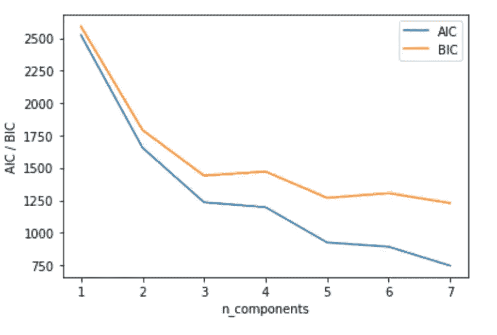

# 型号选择:Cp、AIC、BIC 和调整后的 R

> 原文：<https://medium.com/analytics-vidhya/model-selection-cp-aic-bic-and-adjusted-r2-6a0af25945b6?source=collection_archive---------1----------------------->

## Cp、AIC、BIC 和调整后的 R 的意义和意义

在进行时间序列分析项目时，我发现了使用 statsmodels 库，它与 sklean 相似，我使用了他们的 ARIMA 和萨里玛模型。当我使用它时，有一个步骤，他们给出了模型的摘要，并且有…