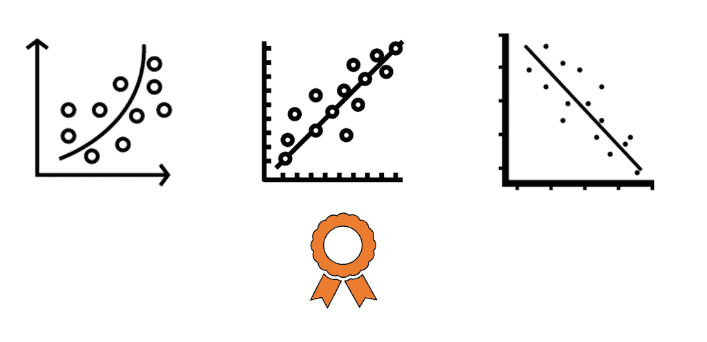

# 线性回归的模型选择

> 原文：<https://medium.com/analytics-vidhya/model-selection-for-linear-regression-b4bed678d37?source=collection_archive---------19----------------------->

无论何时你想要建立一个机器学习模型，你都有一组 *p* 维度的输入作为起点。然而，并非所有这些输入都是获得最佳预测模型所必需的。此外，使用所有的 *p* 预测器可能会导致过度拟合问题，尤其是如果观察值 *n* 的数量并不比 *p* 大很多的话。