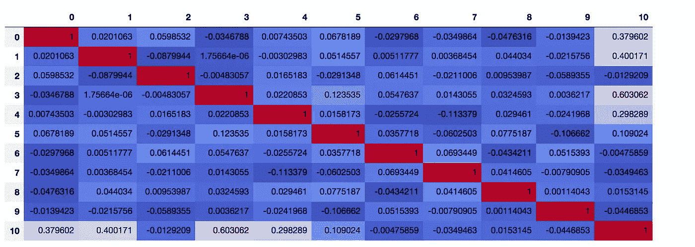

# 模型选择系列第二部分-在 Python 中执行模型选择

> 原文：<https://medium.com/analytics-vidhya/model-selection-series-part-ii-perform-model-selection-in-python-d5f11c1877e6?source=collection_archive---------21----------------------->

你好。在这篇文章中，我将讨论如何使用 Python 进行模型选择。首先，有三种不同的模型选择(或特征选择)技术:向前选择、向后消除和逐步模型选择。它们都迭代地包括/排除特征，直到获得最佳模型。不同的是，正向选择从一个特征开始，迭代地向模型添加更多的特征，而反向消除从整个特征集开始，并在每次迭代中删除不重要的特征。逐步选择类似于正向选择，但是一旦某个特征在当前最佳模型中变得不重要，它也可以离开模型。

接下来，我将使用一个样本数据集，展示如何使用 Sklearn 执行特征选择。

首先，让我们使用 Sklearn 数据集函数 make_friedman1 生成样本数据集。此函数输出具有[0，1]内独立输入要素的数据集，以及使用这些输入要素的子集构建的响应变量。这里我选择独立特征的数量为默认值 10，样本数量为 500。

```
from sklearn.datasets import make_friedman1
X, y = make_friedman1(n_samples=500, n_features=10, random_state=0)
```

现在让我们看一下我们刚刚生成的数据。

```
print('The dimension of independent features is {}'.format(X.shape))
print('The dimension of response variable is {}'.format(y.shape))
The dimension of independent features is (500, 10)
The dimension of response variable is (500,)
```

转换到 Pandas 数据框并可视化相关矩阵。

```
import pandas as pd
df = pd.DataFrame(np.concatenate((X, y.reshape(-1,1)), axis=1))
corr = df.corr()
corr.style.background_gradient(cmap='coolwarm')
```



相关矩阵的可视化(注意最后一列表示独立特征和响应变量之间的相关系数)

正如我们可以看到的，特征之间的相关性非常低，因为这就是我们如何生成它们的。并且特征 3、1、0、4 和 5 与响应变量相关。现在，我们使用 Sklearn 中的 RFE 函数，通过向后消除来拟合线性回归模型。首先，让我们把要选择的特性数量设置为 4，看看输出是什么。

```
from sklearn.feature_selection import RFE
from sklearn.linear_model import LinearRegression
reg = LinearRegression()
selector = RFE(reg, n_features_to_select=4, step=1)
selector = selector.fit(X, y)
print(selector.support_)
[ True  True False  True  True False False False False False]
```

因此，选择了与响应变量相关的所有前 4 个特征。现在，特征 5 怎么样，它具有大约 0.1 的最低相关系数。让我们来看看。

```
selector = RFE(reg, n_features_to_select=5, step=1)
selector = selector.fit(X, y)
print(selector.support_)
[ True  True False  True  True False False False False  True]
```

不幸的是，功能 5 这次没有被选中。然而，考虑到相关性相对较弱，在模型中保留 4 个特征似乎是一个合理的选择。RFECV 可以给出最佳数量的特征。

```
from sklearn.feature_selection import RFECV
selector = RFECV(reg, step=1, cv=5)
selector = selector.fit(X, y)
print(selector.support_)
[ True  True False  True  True False False False False False]
```

特征 3、1、0 和 4 是要保留的最佳特征，符合我们的直觉。

一旦选择了最佳特征，就可以使用这些特征来改装模型，并获得更详细的推断。

就是这样。我展示了一个非常快速简单的例子，展示了如何在 Python 中使用向后消去法。在实践中，这个步骤总是与预处理步骤相结合，例如检查相关性、处理缺失值等。

还有其他 python 包可以执行向前/向后要素选择，例如 mlxtend。对于 stepwise，可能需要扩展当前的函数来自行构建。

在下一个系列中，我将谈论正则化回归方法。