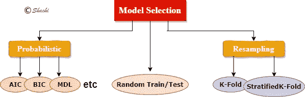
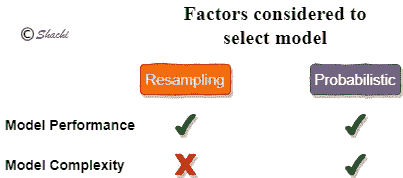
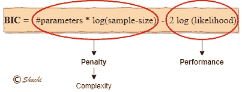
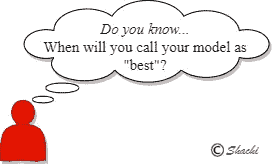

# 基于 Python 的 ML/AI 模型选择技术

> 原文：<https://medium.com/analytics-vidhya/model-selection-techniques-in-ml-ai-with-python-fdf308d9fa10?source=collection_archive---------14----------------------->

在寻找 ML 相关问题的解决方案中，各种 ML 模型被建立和评估。通常，模型是基于您的数据集通过训练然后评估看不见的数据来决定的。但是有其他更好的选择总是明智的，因此模型选择就成了问题。
模型选择可以像选择
-具有不同超参数的模型
或
-候选模型中的最佳模型

这篇博客讨论了选择最佳模型的各种方法。选择您的模型包括选择在精确度、auc 等方面表现最好的**模型**，以及不太复杂的**模型**。某些技术只关注模型的性能，而不考虑其复杂性，这可能导致过拟合和欠拟合的情况。此外，在概率模型选择方面给予了更多的关注。

# 选择您的型号

对多个模型进行拟合和评估，以选择最佳模型。我的研究启发了我这张图表。

图 1

有三种选择 ML 模型的方法，其中两种是概率和抽样领域。让我们了解一下他们。

1.  **随机训练/测试分割:**

要在模型中传递的数据按比例分为训练和测试。这可以通过使用 scikit-learn python 库的 *train_test_split* 函数来实现。

在重新运行 train_test_split 数据代码时，每次运行代码的结果都不同。所以，你不确定你的模型在看不见的数据上会有怎样的表现。
**该技术中模型性能的不确定性介绍了以下技术。**

**2。重采样:**

*   在模型选择的重采样技术中，对于一组迭代，**数据被重采样**到训练/测试中，随后是对训练的训练和对测试集的评估。
*   从该技术中选择的模型是基于性能的**评估，**而不是模型的复杂性。
*   **性能**是根据样本外数据**计算的。重采样技术通过评估样本外数据(即看不见的数据)来估计误差。
    -重采样策略有 K 倍、分层 K 倍等。**

> 要深入了解重采样策略，建议访问 ML/AI 中的[深入解释的交叉验证。](/analytics-vidhya/deeply-explained-cross-validation-in-ml-ai-2e846a83f6ed)

**3。概率模型选择:**

概率模型选择是质量可以用 ***信息准则***【IC】***来衡量的统计方法。*** 其技术涉及**评分方法**，该方法使用最大似然估计(MLE)的**对数似然**的概率框架在候选模型中选择最佳模型。

考虑到性能和复杂性，一个非常有用的选择模型的方法，不太可能的重采样技术。

图 2

*我们来看更深入的。*

*   IC 是统计数据的一种度量，它**导致一些分数**。得分**最低的模型**意味着**丢失的信息**较少，被认为是**最佳模型**。一个单一的分数是没有用的，直到你画出多个模型的分数的一些比较。
*   采用评分法选择模型，评分基于:
    - **使用来自 MLE 概念的**对数似然**对训练数据的性能**进行评估，以优化模型参数。它显示了你的模型与你的数据的吻合程度。
    - **模型复杂度**使用模型中的参数数量(或自由度)进行评估。
*   性能是根据样本内数据计算的，这意味着不需要测试集，分数是直接根据整个训练数据计算的。
*   较低的复杂性意味着模型简单，参数较少，易于理解和维护，但它不能捕捉影响模型性能的变化。

> Score 奖励达到较高拟合度分数的模型，如果它们变得过于复杂，则惩罚它们。

*   常用的统计方法如下:
    ~ **AIC** (阿凯克信息准则)从*频数概率*
    ~ **BIC** (贝叶斯信息准则)从*贝叶斯概率
    -* 这些是用*对数似然* 计算的**，其中包括 *MSE(回归)*和 log_loss 如 cross_entropy**
*   当模型与 AIC/BIC 拟合时，当通过添加更多参数来增加可能性时，过度拟合就出现了。因此，方程中加入了惩罚项。
    第二项是一个似然函数，它确定了拟合模型的最佳参数，并测量拟合优度，从而测量性能。

图 3

> AIC/BIC 在[与 AIC/BIC](https://medium.com/p/f8471d6add32/edit) 的概率模型选择中有深入的解释和实现。

# 什么时候你可以称你的模型为最好的

图 4

对于上面的好奇问题，下面是答案。
*你听说过偏差-方差权衡吗？嗯，这里有一个答案。* 模型不太复杂(或太简单)意味着参数少导致高偏差——低方差导致欠拟合。而更多的参数导致低偏差-高方差导致过拟合。无论哪种方式，参数太少或太多都意味着模型性能差。因此，添加惩罚项以保持平衡，就像当添加更多的参数时，模型会受到巨大的惩罚，从而导致更简单的模型。
*当你的模型变得能够平衡偏差和方差时，那么你就很好地实现了进一步的目标。*

如果你喜欢这个博客，你可以自由关注这个作者，因为这个作者保证会带来更多有趣的人工智能技术。
感谢，
阅读愉快！:)

***可以通过***[***LinkedIn***](https://www.linkedin.com/in/kaul-shachi)***取得联系。***