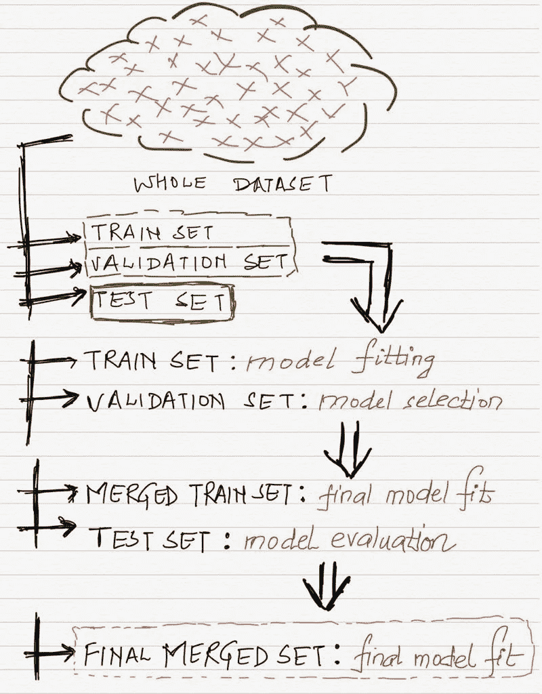
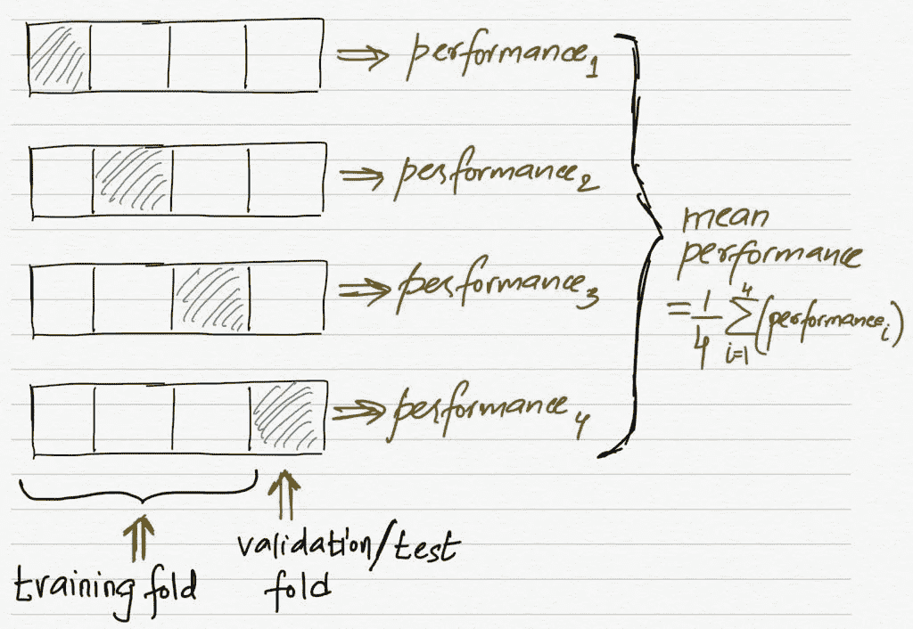
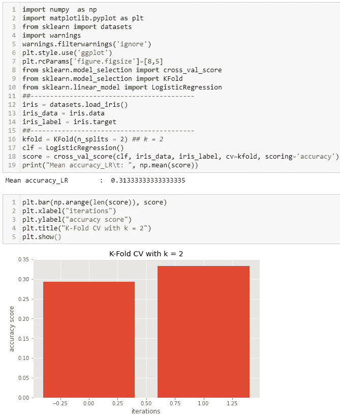
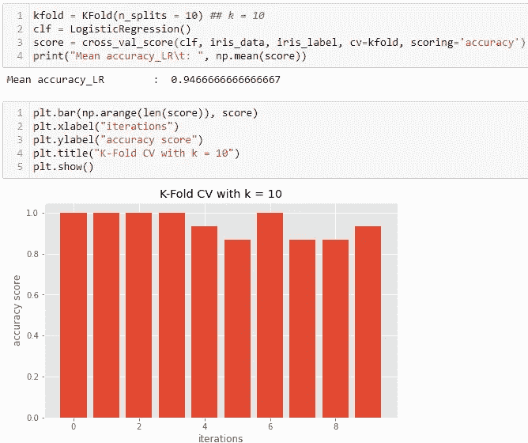
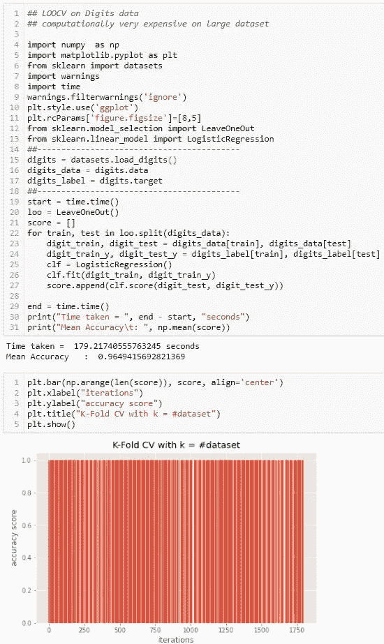
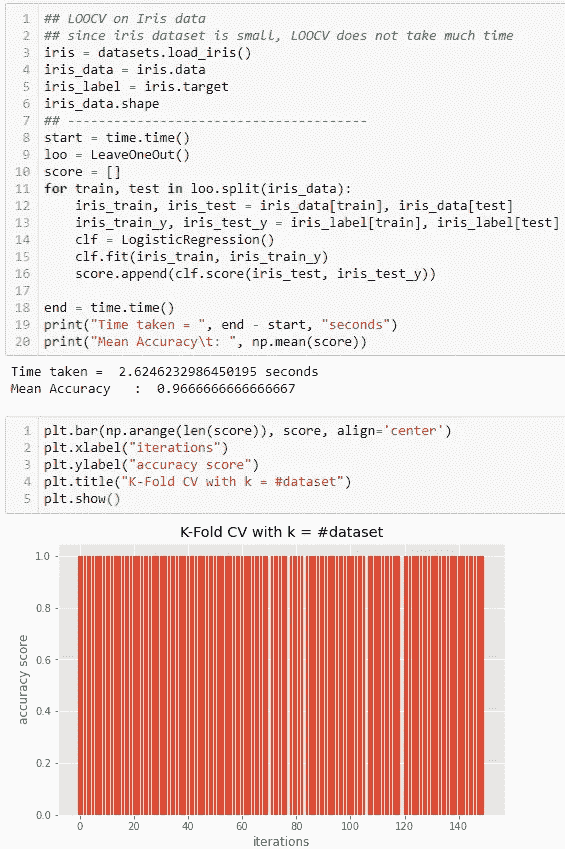
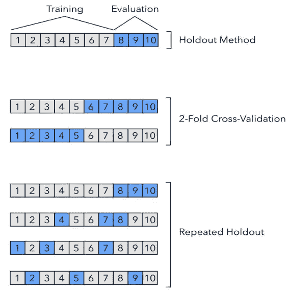

# 模型选择技术—第 3 部分

> 原文：<https://medium.com/analytics-vidhya/model-selection-techniques-part-3-d5ebb6ea4c77?source=collection_archive---------19----------------------->

照片由昆泰·德威迪拍摄

这么久，我们经历了不同的 [**模型评估技术(第二部分)**](/@kountaydwivedi/different-model-evaluation-methodologies-part-2-679fcb064c55) ，我们已经看到了 [**基本概念**需要**(第一部分)**](/@kountaydwivedi/why-is-model-evaluation-a-crucial-step-in-machine-learning-part-1-eeb4882e7c8a) 。

现在让我们进入故事的最后一部分— **模型选择技术。**

> 回顾:超参数的需求

*   如本[论文](https://arxiv.org/abs/1811.12808)所述， ***超参数*** (如历元数、正则化参数等。)是学习算法用来计算最佳 ***模型参数的变量。*** 它们需要由实验者先验地、外在地加以规定。
*   超参数不受任何固定协议或算法的控制。实验者或数据科学家需要用完全的试凑法彻底探索，以便为这些变量找到合适的值。
*   现在，需要注意的一点是，当我们改变超参数值时，我们会得到一个新的模型表现。因此， ***在所有这些模型中找出最佳模型的过程称为模型选择。***
*   ***模型选择*** 无非是 ***超参数优化过程。*** 由于我们选择了适当的超参数，这间接意味着我们正在探索超参数的值，这将有助于算法找到最佳的模型参数，这是模型拟合的全部要点！

> 模型选择技术

> **三路保持方法**

*   我们已经研究了伟大的**保持方法。**有没有可能把它的思路也延伸到型号选择上？让我看看。
*   在维持方法中，我们通常将数据集分为两部分—训练集和测试集。这已经完成了，所以我们可以先验地获得一些看不见的数据，然后我们可以根据这些数据来评估我们的模型的性能。
*   如果我们**进一步将训练集**分成 2 个子部分——一个训练集和一个验证集。这个训练集将用于拟合我们的模型(像往常一样)，测试集将是我们评估拟合模型的性能的测试集(也像往常一样)。但是**这个**的验证集是什么？
*   这个**验证集**实际上是用来选择最佳模型的。使用验证集，我们将优化超参数，从而选择最合适的值，为我们提供最佳的模型参数(从而获得最佳的模型性能)。我们将在各种超参数值上运行算法，并且我们将在验证集上评估模型的性能(考虑所有这些值)。我们获得最大性能的值将最终被选择。
*   ***因此，我们比较模型的性能估计，并选择有助于最大性能的最佳超参数值。***
*   随后，我们合并训练集和验证集，以消除任何悲观偏见(由于缺乏数据集而导致)。我们再次使用这个合并的集合和获得的超参数值来拟合模型。
*   最后，我们使用单独保存的测试集来评估模型的性能。
*   或者，我们可以将训练集、验证集和测试集合并在一起，以便获得最大的可用数据集。

用于型号选择的三路保持方法流程图(照片由 Kountay Dwivedi 提供)

> **k*-折叠交叉验证*方法**

*   可以说，在数据集不足的情况下，这是最有效的模型选择方法。
*   关键思想是:
    **给每个数据例子一个测试的机会。**
*   一个伪代码程序如下:
    For ***k*** 迭代次数:
    *****步骤 1:*** 将数据集分成 ***k*** 部分。保留一部分用于测试，合并剩余的 ***k*** -1 部分用于训练。
    *****步骤 2:*** 使用合并的训练集和任何适当的学习算法来拟合模型。
    *****第三步:*** 模型拟合后，在独立测试集上评估其性能，并计算性能准确度得分。
    *****第四步:*** 存储这个准确率分数。
*   在 ***k*** 次迭代后，计算最终准确度，作为所有存储的准确度分数的平均值 ***。***

***k 倍交叉验证*** *与****k = 4****流程图(Kountay Dwivedi 拍摄)*

*   ***【k】***-Fold CV 看起来像重复保持方法，但实际上，**b/w*k*-Fold CV 和重复保持方法的区别在于，在前一种方法中，测试集从不重叠，而在后一种方法中，它们有时可能会重叠。**正如我们所知， ***k-* Fold CV** 承诺每个数据点成为一个测试点，因此，它也不同于简单的维持方法，在简单的维持方法中，由于单次迭代，所有的数据点都没有机会得到测试。
*   **两种特殊情况的*k*——折 CV:**
    ***** 2 折 CV:*** 这相当于简单的**墨守法，**自 ***k=* 2** 。但是有一个条件:应该通过在第二次迭代中轮换训练集和验证集来执行两次。
    *****留一法交叉验证(LOOCV):*** 当***【k】*= n**时，即折叠数设为训练样本数，则称为*。如果训练集的大小非常大，这在计算上可能是昂贵的。假设我们在训练集中有一千个数据点。那么在 LOOCV，迭代的次数将是 1000，并且在每次迭代中，将有 1 个测试点和 999 个训练数据点。这也是为什么 **LOOCV 方差很高而偏差**很低的原因；因为不存在训练集的不足(因此，偏差被消除)，但是明显缺乏未看到的/测试数据，正好 1 个测试点(引入了高方差)。
    如果我们看流程图(如上)，我们就能非常清楚地理解 LOOCV。它用一个规模为 4 的训练集说明了 LOOCV 方法。*
*   *下面是***k*-折叠交叉验证的一些常见趋势的实现:***

**

*图示**二折 CV。**注意平均准确度分数。(Kountay Dwivedi 摄)*

**

*用 **k = 10** 说明 **k 倍 CV**(koun tay DWI vedi 摄影)*

**

*用数据集的 **k =** **大小来说明 **LOOCV** 。注意 LOOCV 的准确性是三者中最高的。但需要记住的一点是，数据集越大，LOOCV 就越耗时。因此，当数据集很大时，不建议使用 **k 倍**。(Kountay Dwivedi 摄)***

**

*我们可以看到，虽然准确性得分最高的是 LOOCV，但在前一幅图像中，所用的时间约为。 **3 分钟**，而在后一张图片中只花了 **2 秒**！！我们得到这种结果是由于数据集的大小*

*   *经验表明， **k 的最佳值是 10(“最佳点”)。**但是，应注意数据集的大小。*

**

*这是取自[论文](https://arxiv.org/abs/1811.12808)的图像。它显示了不同的模型评估和选择过程如何将数据集分割成训练/测试集。注意在**重复维持中，**测试集是如何重叠的，不像 **k-Fold CV** (图片来源:Sabastian Raschka)*

*   ****通过 k-Fold CV 进行模型选择:
    **第一步:*** 类似于三向维持方法，将数据集分成两部分——训练集和测试集。进一步将训练集分为训练集和验证集。
    *****第二步:*** 尝试各种超参数值。对于每个超参数配置，在训练集上应用 ***k* -Fold CV** 方法，拟合模型并在验证集上验证其性能。这将导致多个模型和性能评估。最后，选择产生最佳模型的超参数值。
    *****步骤 3:*** 采用在上面的***k*-折叠 CV** 过程中产生最佳结果的超参数设置，合并训练和验证集，并最终使用该合并的训练集以及所获得的超参数和模型参数值来拟合模型。
    *****步骤 4:*** 现在，对 ***步骤 1 中保留的独立测试集进行模型评估。
    **步骤 5:*** 可选地，将完整的测试集与训练集合并以避免任何悲观偏见，并在完整的可用数据集上拟合最终模型。*

> *摘要*

*   *维持方法通常被认为是基于 K-Fold CV，尤其是在今天的人工智能世界中。为什么？*
*   *我们仍然缺乏庞大的数据集，但我们有大量的数据，像数百万和数十亿。随着时间的推移，解决机器学习问题的新算法和方法每时每刻都在增长。例如**深度神经网络，生成对抗算法**等。这些算法旨在解决非常大的问题，因此需要花费大量时间进行模型拟合。*
*   *因此，我们无法承受在整个数据集上重复 **k** 次。其中一些模型甚至需要几周的时间来优化。因此，使用 ***k-* Fold CV** 进行庞大数据集和复杂算法的模型拟合实际上是不可行的。*
*   *此外，正如我们已经看到的，从理论上讲，大型数据集有益于模型的性能。假设我们的数据集中有一百万个数据点。因此，在这种情况下，如果我们将数据集划分为 70/30 比率或 80/20 比率，这根本不会损害性能，因为我们将有足够的训练数据点来使模型适应其容量，以及足够的测试数据点来适当地评估模型的性能。因此，我们将实际关注**大型数据集和维持方法的偏差和方差问题**。*

> *结论*

*因此，我们终于结束了这个关于**模型评估和模型选择概念和技术的 3 部分故事。**这一步在建立模型时非常关键，因为如果我们不调整我们的模型参数，如果我们不选择最合适的超参数值，那么我们可能会以 ***不太好的模型结束。****

*我们看到了不同的 ***模型评估方法*** ，从简单的**替代方法开始，**由于其过拟合的性质，不推荐使用。然后，我们研究了**维持方法**的不同方面(最适合大型数据集)。之后，我们看了看 **Bootstrap 方法**背后的直觉，以及它的变体 **LOOB(省去一个 Bootstrap)。**使用**采样和替换**来建立我们自己的数据集是一个很棒的想法，但由于计算效率低，只能用于小数据集。*

*然后我们来到 ***型号选择标准*** ，在这里我们看一下**三路维持方法**，一种简单维持方法的扩展，用于型号选择。这里，我们将数据分成 3 个部分——训练集、验证集和测试集。最后，我们看了最有前景的方法，***-*交叉折叠验证，**广泛用于小型数据集，因为它可以处理任何类型的悲观偏差以及方差问题。但是我们也认为它的缺点是— **如果在大型数据集上使用，计算量非常大。***

*我希望你们真的喜欢这个故事，并且它符合你们的期望。请以任何你喜欢的方式支持我，这样我会有越来越多的动力去进步。谢谢大家。敬请关注，学习愉快。😊*

*:-}*