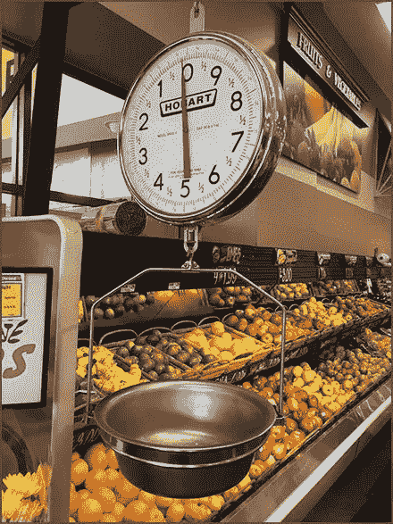
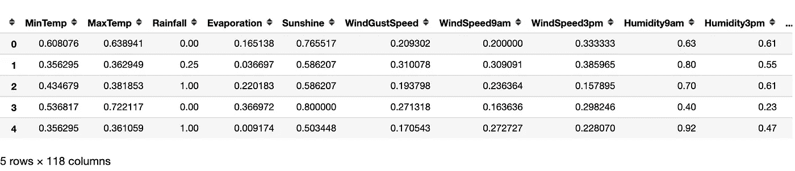
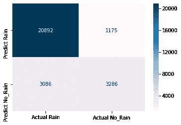
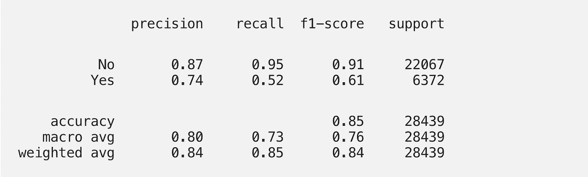
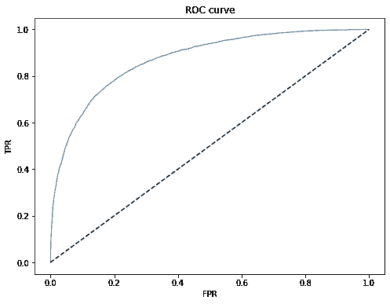

# 了解分类的模型验证

> 原文：<https://medium.com/analytics-vidhya/model-validation-for-classification-5ff4a0373090?source=collection_archive---------2----------------------->



在这篇博客中，我们将通过不同的技术来验证分类模型的性能。

**定义问题**:预测明天会不会下雨。

在以前的博客中，你已经看到了不同的监督算法来解决这个问题。

考虑任何监督算法，比如简单的逻辑回归。

**数据集描述**:降雨数据包含 118 个特征和一个因变量(y_test)是否会下雨。

X_test 样本



```
***Features***
Index(['MinTemp', 'MaxTemp', 'Rainfall', 'Evaporation', 'Sunshine',
       'WindGustSpeed', 'WindSpeed9am', 'WindSpeed3pm', 'Humidity9am',
       'Humidity3pm',
       ...
       'NNW.2', 'NW.2', 'S.2', 'SE.2', 'SSE.2', 'SSW.2', 'SW.2', 'W.2',
       'WNW.2', 'WSW.2'],
      dtype='object', length=118)
```

y_test 样本

```
0     No
1     No
2     No
3     No
4     No
5     No
6    Yes
7    Yes
8     No
9     No
Name: RainFall, dtype: object
```

最佳做法是保存模型，以便将来直接用于预测。

下面的代码片段可以用来保存模型。

让我们加载模型。

预测的时间到了

我们拥有烹饪各种评估菜肴所需所有材料。

**Metric** 是一种评估模型性能的技术。

我们将在这个博客中讨论的各种度量标准的列表。

1.  *精度*
2.  *零精度*
3.  *精度*
4.  *召回*
5.  *f1 得分*
6.  *ROC — AUC*
7.  ***准确度*** : *这是分类上下文中最幼稚、最常用的度量。这只是正确预测的平均值。*

我们刚刚定义了一个简单的函数来计算精度，并根据我们的测试数据对其进行了评估。

*精度*= 0.8558658658656

除此之外，还可以使用 sklearn 内置的分数函数来评估准确性。因此，我们将使用 sklearn 进行计算，并验证我们使用上述函数获得的精度。

所以两个结果都吻合。

***2。空精度:*** *定义为总是预测最频繁类时获得的精度。*这对于检查模型准确性的绝对性非常有用。

零精度是 0.7759414888005908，低于模型精度，所以我们是好的。

一个人头脑中立即出现的问题是关于模型善良的完整信息。这是相当主观的，例如，如果我们想减少对降雨的错误预测。

任何分类模型都将预测空间分成不同的子空间。

最好的概念化方法是通过混淆矩阵。

让我为我们的二元分类问题画一个混淆矩阵。



20892 是我们预测会下雨而实际上会下雨的次数。这叫真正，快速定义其他变量

*   `True Positives`实际降雨量和预测降雨量
*   `True Negatives`实际无雨和预测无雨
*   `False Positives`实际无雨和预测有雨
*   `False Negatives`实际降雨和预测无雨

在我们的情况下

*   TP = 20892
*   TN = 3286
*   FP = 1175
*   FN = 3086

准确度=(总正确预测)/总预测

= (TP + TN)/( TP + TN + FP + FN)

让读者来验证准确性是否与我们计算的相符。我们转向其他一些指标。

***3。精度:*** *定义为所有预测中正确预测的阳性结果的比例。*换句话说，在所有预测的积极结果中，有多少实际上是积极的。

因此，

精度= TP /(TP + FP)

在我们的例子中，precision = 20892/(20892+1175)= 0.95678678671

这在医疗场景中非常重要👩‍⚕️开药给正常的病人治病，这可能导致严重的健康危害。

为了详细说明这一点，当我们想要最小化 FP 时，如果👩‍⚕️计划生育错误地预测了疾病。

***4。回忆:*** *定义为所有实际阳性中正确预测阳性结果的比例。*换句话说，在所有实际的积极结果中，我们能够预测多少是积极的。

召回= TP/(TP + FN)

在这里，回忆= 20892/(20892+3086)= 0.87667676687

当你想最小化 FN 的情况时，回忆是相当重要的。

考虑检测冠状病毒🦠的试验，当个体呈阳性而试验未能检测时，不要错过这种情况是非常重要的。

再说一遍，

精度= TP /(TP + FP)

召回= TP/(TP + FN)

如果样本大小是固定的，比如说(n)，那么

TP + TN + FP + FN =n

为了具有高精度和召回率，FP 和 FN 负值应该尽可能低。这是有限制的，因为降低两者意味着这是一个理想的场景。

我们如何将两者结合起来？

在我们继续之前，

> 回忆也称为真阳性率或灵敏度
> 
> 作为真阴性率或特异性的精确度

***4。f1 评分:*** *是精度和召回率的调和平均值。*显而易见的问题是为什么调和平均值(HM)而不是算术或几何平均值或其他某种变换。我已经写了一个单独的博客来解释 HM 来结合这两个指标。

*f1 = 2 *精度*召回/(精度+召回)*

这里，*f1*= 2 * 0.9467 * 0.8713/(0.9467+0.8713)= 0.9074

这种测量比准确性更有上下文关系，只是它需要正确地解释，不像准确性那样容易解释。

上述措施概述:

在 python 中，我们在 sklearn 中有一个模块，classification_report，它生成所有的度量。



*支持度是每类中的观察次数。*

***5。ROC :*** *接收机工作特性曲线针对不同的阈值绘制 TPR 对 FPR。换言之，它显示了不同阈值水平下的模型性能。*

为了理解这一点，我们需要理解训练分类器的输出。

```
Idx No_rain_prob Rain_prob
0      0.987328   0.012672
1      0.840071   0.159929
2      0.976743   0.023257
3      0.798552   0.201448
4      0.307343   0.692657
```

因此，逻辑回归或大多数分类器的输出是以概率表示的。

有一个名为 C( *阈值*)的默认超参数，根据该超参数将该问题转换为“否”或“是”。

1 或否:否 _ 雨

0 或是:下雨

如果 C = 0.5

predict _ label =[不不不不是] == [1，1，1，1，0]

如果 C = 0.8

predict _ label =[不不不是是] == [1，1，1，0，0]

ROC 曲线通过绘制 TPR 对不同阈值的 FPR 而产生。



**ROC AUC** 即*受试者操作特征——曲线下面积，测量曲线下面积。*

该值越高，模型越好，最佳值为 1。

ROC _AUC 得分为 0.8729。

> *希望这对您有所帮助，欢迎评论。*