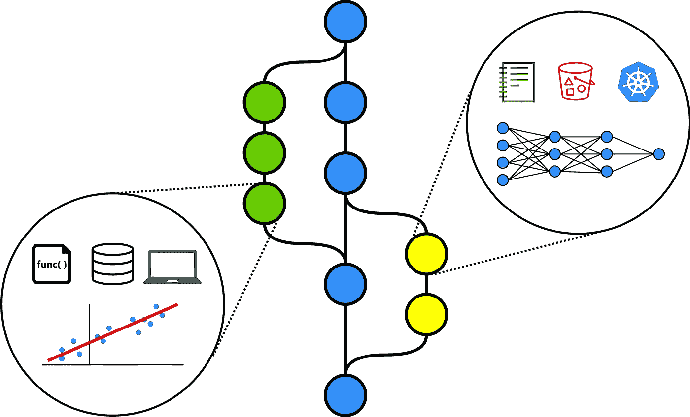
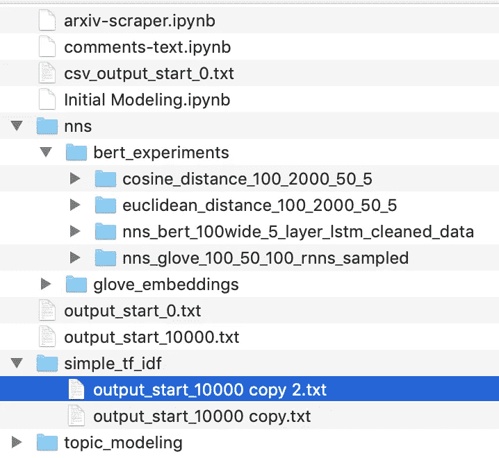
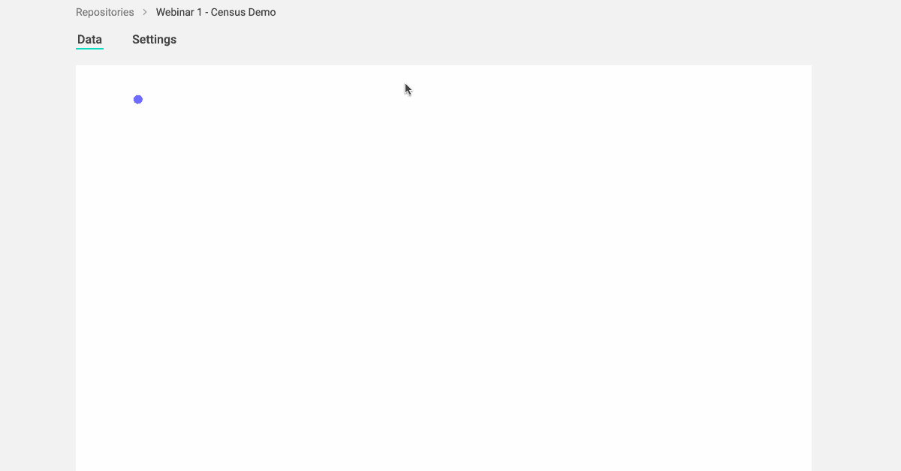
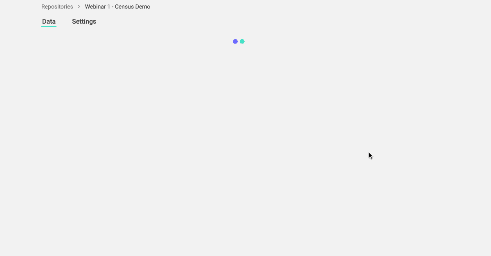

# 正确的模型版本化:使用 ModelDB 2.0 使您的 Scikit-learn 模型可重现

> 原文：<https://medium.com/analytics-vidhya/model-versioning-done-right-making-your-scikit-learn-models-reproducible-with-modeldb-2-0-dda163ebd8ce?source=collection_archive---------21----------------------->

在 Verta，我们上周举办了第一次 ModelDB 2.0 网络研讨会，非常有趣。这篇博文是对网上研讨会实践指导部分的**回顾。欲了解网上研讨会的完整内容，请查看 [Verta Youtube 频道](https://youtu.be/U0lyF_lHngo)上的网上研讨会记录和 [Slideshare](https://www.slideshare.net/ManasiVartak1/model-versioning-done-right-a-modeldb-20-walkthrough) 上的幻灯片。**

# 什么是 ModelDB？

[**ModelDB**](https://github.com/VertaAI/modeldb) 是一个开源的模型版本化、元数据和实验管理系统，最初由麻省理工学院计算机科学系开发，现在由 [Verta.ai](https://verta.ai) 维护。

ModelDB 的最新版本 ModelDB 2.0 为 ML 模型(以及所有类型的分析产品)带来了类似 git 的版本控制。通过对 ML 模型的*成分*应用版本控制，特别是*代码、数据、配置和环境，* ModelDB 捕获了**重现模型**所需的所有组件。最重要的是，ModelDB 不需要改变你的数据科学/ML 工作流程。它可以集成到 Jupyter 笔记本中，也可以从命令行使用。

在这里阅读更多关于 ModelDB 的架构及其设计背后的动机[。](https://blog.verta.ai/blog/modeldb-2.0-is-here)

# 任务:模拟人口普查收入数据集

对于我们的第一个 ModelDB 演练，我们使用了一个简单的表格数据示例。具体来说，我们使用[人口普查收入数据集](http://archive.ics.uci.edu/ml/datasets/Census+Income)，该数据集已经过轻微预处理，使建模变得容易。这里的任务是建立一个模型，在给定年龄、性别、教育程度、邮政编码等人口统计信息的情况下，预测一个人的收入水平(< $5 万或> $5 万)。

我们将构建几个简单的模型，并通过 ModelDB 对它们进行版本控制，使我们所有的模型都是可复制的。

# 1.无版本控制的基本笔记本

对于本教程，我们将一个简单的笔记本放在一起，在人口普查收入数据集上构建不同的模型。让我们来复习一下这个[笔记本](https://github.com/VertaAI/modeldb/blob/master/demos/webinar-2020-4-1/census-s3-oss-versioning.ipynb)的关键部分。

## a)我们下载人口普查数据并检查其内容。

## b)我们构建一些 scikit-learn 模型，并在超参数网格中循环。

然后我们挑选最好的模型。就是这样——简单明了。

# 2.有什么问题？

现在，如果你像大多数数据科学家一样(包括我自己！)除了用笨拙的方式命名不同的笔记本，或者至多是一个包含实验细节的电子表格，你没有对你的模型进行版本化。

但是，当构建数百个模型、回答监管问题或共享工作时，这种解决方案是不够的。这就是像 ModelDB 这样的专门构建的模型版本化系统真正闪光的地方。

# 3.设置模型 DB

ModelDB 可以在 Apache 2 开源许可下获得，并且可以通过这里的[和 ModelDB](https://docs.google.com/document/d/1j-wEd44Zdgz8Mwfk1ddiqKEhSAAyjvYpW2uN6wsKUEk/edit) [Git Repo](https://github.com/VertaAI/modeldb) 中描述的多种方式进行设置。

设置 ModelDB 最简单的方法是通过 Docker。就是这样！

# 4.用 ModelDB 版本化我们的模型

现在 ModelDB 已经设置好了，只需几行代码，您就可以使您的模型完全可复制。让我们看看怎么做。

## a)首先，安装 verta Python 库，并通过创建一个项目和一个关联的 ModelDB 存储库来执行基本的 ModelDB 设置。

## b)接下来，通过一个库，在笔记本上安装工具，为我们的模型的组成部分版本化，特别是代码、数据、配置和环境。

**我们完成了。**

# 5.这对我有什么好处？

有了这几行代码，您的模型现在是可复制的。您可以随时返回到模型的任何版本并重新创建它。您可以看到您所做的更改，与朋友协作，并共享您的模型。

查看您的模型经历的不同迭代。

**查看对您的模型组件所做的更改，包括代码、数据、配置和环境。**

**以类似 Git 的流程管理您的工作，包括分支、合并和恢复。**

最后，与同事分享您的工作，让他们能够完全重现模型！

# 好奇吗？

这是对 ModelDB 2.0 提供的功能以及如何使用它来使模型(或分析)具有可重复性的一个快速浏览。想了解更多信息吗？

*   在 [GitHub](https://github.com/VertaAI/modeldb) 上查看 ModelDB 项目——启动它，派生它，并使用它！
*   请在 [modeldb@verta.ai](mailto:modeldb@verta.ai) 或我们下面的 Slack 频道分享您的反馈。
*   点击加入我们 Slack 上的模型版本社区[。](http://bit.ly/modeldb-mlops)
*   请通过我们的[时事通讯](https://www.verta.ai/newsletter/)关注更多教程和网络研讨会。

# 关于玛纳斯:

Manasi Vartak 是用于整个模型生命周期的麻省理工学院衍生 MLOps 软件 [Verta](https://conferences.oreilly.com/strata-data-ai/stai-ca/public/schedule/speaker/www.verta.ai) 的创始人兼首席执行官。Verta 源于 Manasi 在麻省理工学院从事 ModelDB 的博士工作，这是第一个广泛用于研究实验室和财富 500 强公司的开源模型管理系统。此前，Manasi 在 Twitter 从事内容推荐的深度学习，在 Google 从事动态广告定位。Manasi 在一些顶级研究和工业会议上发表过演讲，如 O'Reilly AI Conference、SIGMOD、VLDB、Spark + AI Summit 和 AnacondaCON，并撰写了一门模型管理课程。

# 关于 Verta:

[Verta.ai](https://verta.ai/) 为整个模型生命周期构建开源 MLOps 软件。这包括模型版本控制，模型部署发布，到模型监控，所有这些都与企业治理特性联系在一起。我们是麻省理工学院 CSAIL 的一个分支，在那里我们建立了 [ModelDB](https://github.com/VertaAI/modeldb) ，第一个开源模型管理系统之一。