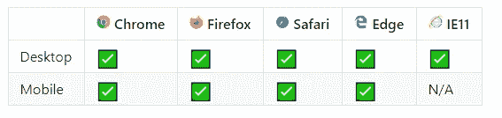
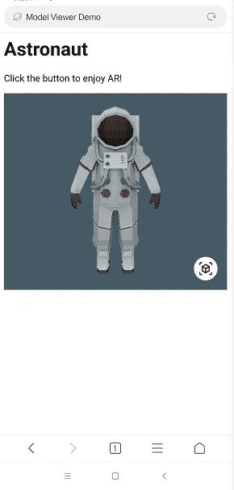
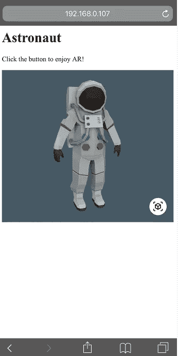
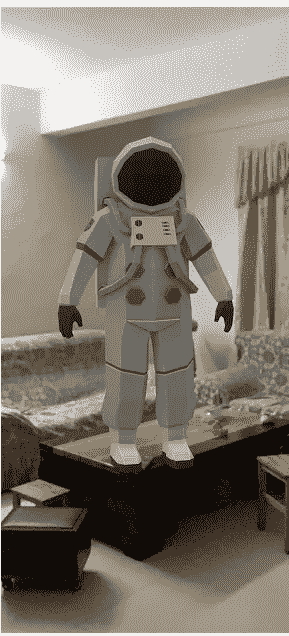

# 由<model-viewer>构建 webAR</model-viewer>

> 原文：<https://medium.com/analytics-vidhya/building-webar-by-model-viewer-ef432a66c348?source=collection_archive---------4----------------------->

今天构建 webAR 是一项困难的工作。实现的方法有很多，但是每种方法都有优缺点，比如 AR.js，tensorflow.js，webXR 设备 api 等等。

今天我想分享一个简单快速的搭建 webAR 的方法。那就是[模特-观众](https://github.com/topics/3d)！😄

# 什么是模型查看器？🤔

正如官方所说，<model-viewer>是 Google 发布的 webComponent，旨在渲染交互式 3D 模型，力求在渲染质量和性能上给你极大的默认。听起来不错~</model-viewer>

也许你会担心它的兼容性，那么它的兼容性怎么样呢？

看起来不错~在大多数桌面和移动浏览的最近 2 个主要版本上都支持。

# 它在 AR 中能做什么？👀

我们知道它的作用和良好的兼容性。但是它在 AR 中能做什么呢？有几个关于 ar 的功能，比如 AR，ios src，快看浏览器，magic-leap 和 unstable-webxr。

每个属性都有不同的作用。

比如 ***ios-src*** 就是你在 ios 中加载的东西。通常，您应该在。usdz 格式。USDZ 是苹果公司创建的图像格式，我们可以用它来享受苹果公司的 AR 快速外观。实际上，这就是 ios 中模型视图工作方式。当您在 ios 中运行应用程序时，模型视图将使用。usdz 文件，Apple' AR Quick Look 将在您的。usdz 文件。如果你想了解更多关于 Apple' AR Quick Look 的信息，可以点击[这个链接](https://developer.apple.com/augmented-reality/quick-look/)。

属性 ***ar*** 表示允许模型视图启动场景查看器。安卓经常会出现这种情况。因为与 ios 不同，android 没有 AR quick look，它在这种情况下依靠 sence-viewer 来实现 web 上的增强现实。Sence-viewer 是一个身临其境的查看器，可以在您的网站上实现 AR 体验。它让 Android 移动设备用户可以在他们的环境中轻松放置、查看和交互 web 托管的 3D 模型。如果你想了解更多关于 Sence-viewer 的信息，你可以点击[这个链接](https://developers.google.com/ar/develop/java/scene-viewer)。

属性 ***不稳定-webxr*** 表示通过 webxr 设备 api 启用 AR 体验，但就像它的名字一样，它是不稳定的，因为正在定义 webXR 设备 Api 规范。此外，现在很少有浏览器支持这个功能。你可以在这里得到更多的信息。

属性***-Magic-Leap***，让你 AR 上Magic Leap 的 Helio 浏览器。并且要求主模型是 GLB 文件和@ magic leap/prism 库。

# 让我们构建一个 webAR 演示！😍

现在，您已经对模型查看器有了很多了解，是时候用模型查看器来构建一个 webAR 演示了。这很容易。

# 结果😕

这个演示在 iOS 中运行良好，但在一些 Android 设备中运行不佳。因为不是所有的 android 设备都支持 sence-viewer，它依赖于 ARCore 1.9 和更高版本。iOS 设备是我的 iphone xr，android 设备是我妈的小米。不幸的是，演示不能在我母亲的手机上使用。这是一个关于哪些 android 设备支持 ARCore 的列表。

感谢阅读！如果你发现这篇文章很有帮助，如果你分享来帮助其他人找到它，那将意味着很多！并欢迎在下方发表评论。