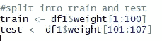

# 塑造你的健身方式

> 原文：<https://medium.com/analytics-vidhya/model-your-way-to-fitness-2282e815e54a?source=collection_archive---------17----------------------->

或者如何预测你的体重！

你点击这个是因为，谁知道呢，这是因式分解机输出的最佳时机，也是你碰巧查看新文章的时候。也许你对适应度和时间序列的文氏图感兴趣。对我来说，这就是在手腕上佩戴物联网设备的乐趣所在。我可以制作模型、预测，并尝试新的库。如果你不喜欢把健身和时间序列结合起来，你现在可以放弃了。但是在我们继续之前，另一个标题是“你的时间序列裸体看起来像什么”，一语双关“你的医生裸体看起来像什么？”作者沃伦·威利。这实际上是一本很好的读物。缺点:全健康，无时间序列。

为什么要把这些都写出来？作为一个时间序列鉴赏家，我会阅读任何教程，参加任何课程，阅读任何书籍等等。(你去拿钻头)就算我知道材料。时间序列就是好玩。我看到很多教程要么是“这里有一些数据，区别它，现在做一个预测”，要么是“加载 Keras，建立一些递归神经网络的味道，现在做一个预测”。结束。就是这样。这是一个很好的开始方式，但是总觉得缺少了一些东西。亲爱的读者，你可能已经知道完美的时间序列教程或课程。太好了！现在，把它应用到你自己收集的数据中去。我在阅读时没有看到包括传统方法，如容格检验、频域分析或 VAR 模型。所以，让我们看看我们能从中得到什么。希望你能从这里找出一些有价值的东西供你自己分析。

在我们进入正题之前，让我们先陈述一下显而易见的事实。这里的数据变化不大。如你所见，我的因变量是体重。这是我选择的标准，我感兴趣的问题。如果你想跟踪其他的东西，尝试推断(预测)，数据提取部分会提供更多的选择。如果你只是关注你健康的整体趋势，我想你可以从你手腕上的物联网设备中获取默认图表并运行它。此外，我不是在建议或评论你应该做什么锻炼计划。全由你选择。你训练的方式是你的事。我产生了这些数据，并不作为任何健身“建议”有很多资源可以帮助你了解你的身体。

现在无聊的东西已经过时了，摇滚吧；我们走吧。

CRISP-DM 应该指导你对建模的任何尝试的思维过程。假设这是大部分的回顾，但让我们击中亮点。

CRISP-DM

这五个阶段是:1 .)业务理解 2。)数据理解 3。)资料准备 4。)造型 5。)评价 6。)部署。(希勒 c .，*《CRISP-DM 模型:数据挖掘的新蓝图》*，J《数据仓库》(2000)；5:13–22).不需要把这个打死，但是我是我自己的客户和自己的建模者。我希望能够用七天的预测范围来预测我的体重。业务理解—检查。数据理解。假设你有一个 FitBit 设备，有几种方法可以获取你的数据。您可以通过 Python 或 GUI 来实现这一点。我两个都帮你搞定了。两者都有利弊。除了部署之外，我将介绍所有其他步骤。我可以推荐一个闪亮的应用吗？

如果你想走 Python 路线，从这里的[开始。](https://davgibbs.com/how-to-get-fitbit-with-python/)

首先，我们将使用 Fitbit API 检查提取时间序列数据。为了获得数据传输设置，这里有一个伟大的教程:[点击这里](https://towardsdatascience.com/collect-your-own-fitbit-data-with-python-ff145fa10873)。这将带您完成身份验证和日期时间格式化。回想一下感兴趣的问题(权重)以及可能与拉动相关的内容。你可能会认为卡路里会起作用，你是对的。然而，我对记录我的饮食不感兴趣，建议你参考任何营养方面的好文章。*现代健美新百科*是营养方面要考虑的东西。学习血糖指数的基础知识，这就足够了。我推荐的一些时间序列是卡路里，步数，距离(小心高 vif！)，体重，脂肪，以及最容易误导人的数据:身体质量指数。加入一些其他的因素来检验这种关系:睡眠分钟数、不安分钟数和醒着数。所有这些都遵循几乎相同的语法。这里举个例子来拉一年。

Python 示例

您需要将结果转换成熊猫数据帧。

Python 示例继续

其他特征的提取过程与此类似。作为参考，这里还有一个使用权重的例子。

另一个 Python 例子

如果您现在有一些数据帧，您将需要连接以创建一个由日期时间索引的数据帧，瞧，您有一个可能显示自相关迹象的数据集。但是等等，缺失值怎么办？假设有一天晚上你没有戴上你的 FitBit 来充电。时间序列插补有几种选择。这取决于你有多少缺失数据来指导你的选择。如果你坚持佩戴你的 FitBit，你在这里应该会过得相对轻松。结转的最后一个值是处理遗漏观察值的最佳选择。您可以尝试一些其他选项，但在继续之前只需检查每一列缺少的%。熊猫 fillna 函数使这变得容易。指定“ffill”方法。假设您正确地进行了连接，并且对缺失值做了功课，那么数据应该已经准备好了。提醒对相关日期范围进行过滤，然后写 csv。是的，这是一条很长的路，但我只是想让这一步明显清晰。

过滤器示例

酷，这是一个简单的数据拉。GUI 也提供了一个快捷的路线。我们现在就去看看。几个先决条件:一个 FitBit 账户和足够的数据(显然是为了使这些工作)。导航到您的 FitBit 帐户并选择“数据导出”

FitBit 数据拉取

使用单选按钮选择时间范围，并选择您想要包括的所有功能:身体、食物、活动和睡眠。警告:确保您完成了跨字段的时间对齐。基本的 Excel 排序应该可以帮你实现。还要确保你的睡眠时间与正确的一天相一致。

这应该结束了数据争论和准备。你也可以去镇上进行探索性的数据分析。总体趋势非常有助于跟踪你的健身进度。你甚至可能想扩展这个项目，制作自己的闪亮应用。目前，预测才是王道。在我们开始建模和评估之前，这里有一些很好的资源可以指导您进行时间序列建模:

1.)应用时间序列分析与 R(第二版)。

[点击这里购买](https://www.amazon.com/Applied-Time-Analysis-Wayne-Woodward/dp/1498734227/ref=sr_1_9?dchild=1&keywords=wayne+woodward&qid=1606960246&sr=8-9)

2.)实用时间序列分析:用统计学和机器学习进行预测。

[点击这里购买](https://www.amazon.com/Practical-Time-Analysis-Prediction-Statistics/dp/1492041653/ref=sr_1_2?crid=685NXYVPDC0T&dchild=1&keywords=time+series+analysis&qid=1606960377&sprefix=time+series+%2Caps%2C198&sr=8-2)

**单变量建模**

虽然开始寻找领先指标并进入可能充当体面预测者的领域很有吸引力，但假设你的时间序列不是白噪声，单变量模型应该始终是你的基线。一个好的探索性分析可以解开很多东西。一些事情总是被推荐:绘制数据，永盒测试，扩展的迪基-富勒测试，ACF/PACF 等。此外，对于时间序列异常值检测，有一些很好的选项可供选择。用于离群点检测的 Twitter 库对于离群点识别是值得一试的。我们需要分析一些库:tswge、nnfor、forecast、vars、dplyr、VIF、prophet、lubridate、astsa 和 tseries。回到感兴趣的问题:体重。

读入 CSV 后，检查元数据。你的应该是这样的:

功能和元数据

在某一点上，我们需要将“日期”列更改为日期。如果功能名称不适合您，现在是改变的好时机。一旦您纠正了元数据中的任何内容，就绘制出感兴趣的变量。

绘制数据

数据集看起来有一些徘徊行为，我的第一反应是这不是一个长记忆过程。绘制后的下一步应该是永盒测试。毕竟，你为什么要试图模拟白噪声呢？这个测试的零假设是数据是白噪声。另一个假设是数据不是独立分布的:

永盒试验

换句话说，序列相关性是存在的。建议您在 K 样本自相关的情况下运行此测试。tswge 封装用于测试。我将使用等于 6、12 和 48 的最大样本自相关。语法如下:

永框语法

**每次运行测试的结果显示一个 p 值< .01** 。我们将拒绝零假设，并得出结论，这个数据集可能不是白噪声。此外，ACF 似乎与白噪声不一致。

ACF —重量数据

酷，我们有证据表明我们不是在处理白噪音。接下来，我们应该回答这个时间序列是平稳的吗？在得出这是否是平稳时间序列的结论之前，需要检查三个条件。

1.  )均值不依赖于时间。*这个条件似乎得到了满足。徘徊的行为表明你可能高于平均值，也可能低于平均值。*

2.)方差不依赖于时间。*尽管有一些突然的变化，这个条件似乎已经满足。*

3.)观测值之间的相关性仅取决于观测值相距多远，而不是它们在时间上的位置。*一种直观的方法是将时间序列分成两半，比较 ACF 图。*

检查条件#3 —比较 ACF

从两个 ACF 的相似性来看，我们可以断定这个条件已经满足。然而，让我们再抛出几个检查平稳性的选项。首先，可以使用扩展的 Dickey-Fuller 检验。另一个方便的方法是使用汽车。预测包中的 Arima 函数。虽然不是一个完美的解决方案，汽车。Arima 可以帮助你决定是否有差异，季节性等等。试试 auto.arima 就够简单了，语法如下:

自动。Arima 语法

虽然看起来很多，但回想一下，我们可以通过调用 auto.arima(df$weight)来回答静态问题。返回的参数是我所期望的:(1，0，0)。简单的 AR(1)是最合适的。似乎有 2/3 的测试表明该系列是稳定的。永远保持你的武器库中也有 Dickey-Fuller:零假设是存在一个单位根，或者级数是平稳的。最后，我们发生了冲突！Dickey-Fuller 检验(语法为 adf.test(df$weight，k =要计算的滞后阶数)表示高 p 值！我们将得出结论，不能拒绝零假设。当你不确定的时候，尝试两种建模方法是可以的；在我们的情况下，ARMA 或 ARIMA，并评估这两个持有套。只要确保它是一个诚实的坚持设置！当学习参数时，模型不应该看到测试数据。因为我的“proc 眼球”和 Auto.arima 函数都指向静止，所以我不会对数据进行区分。Dickey-Fuller，*虽然有用*，却是一个低功耗测试。

我们可以用于单变量分析的另一个有用的函数是 tswge 中的 plotts.sample.wge:这将给出时间序列可视化、ACF、周期图和谱密度(时间序列分析中经常被忽略的部分)。每日记录重量的该数据集可能在 0 处具有谱密度峰值。我预计不会出现任何主峰。对于其他时间序列项目，我一次又一次地引用这个函数。通过评估时间序列的谱密度，然后与估计参数的谱密度进行比较，您将很快意识到您是否在正确的轨道上。

4 重量观

我们现在知道了一些事情。该序列不是白噪声，并且很可能是平稳的。前进到基线模型。现在开始迭代相关的预测器并应用相同的诊断方法是很诱人的:Ljung-Box，Dickey Fuller 等。现在，我们需要使用一个函数来进行模型识别。一个有用的方法是 aic5.wge 函数。AIC5 很有用，因为给定一系列 AR 和 MA 值，该函数将返回考虑中的前五个模型，按 AIC、AICC 或 BIC 排序。由于我们已经完成了尽职调查，并意识到这不是一个很长的内存过程，因此没有必要通过指定较大的 AR 阶数来占用计算时间。这可能适用于任何以时间为因素的分析:按时间划分。不要忘记仅根据列车数据调整参数；你需要对自己的预测有信心，开始这个过程的最好方法是不要向前看。

训练/测试分割

AIC.5 函数非常灵活，当您花时间了解时间序列的表现时，应该非常容易使用。如果我有长记忆过程，我会调整 AR 项的范围。下面是我如何使用这个函数来识别型号的。

AIC.5 功能

输出告诉我们最佳候选模型。毫不奇怪，徘徊行为符合 AR (1)模型，这也是首选模型。其他候选人的 AIC 差距不大。我们可以用作基线的前两个模型最终将与多元模型竞争，它们的顺序是(1，0，0)和(1，0，1)。

AIC.5 结果

接下来，我们将需要使用一个函数来计算最大似然估计。为此，请使用 est.arma.wge 函数。在这个函数中，您需要输入您的时间序列、自回归订单、MA 订单，并指定您是否需要一个因子表(剧透:您需要)。这个功能非常简单:

参数估计

我对前两个竞争者的基准测试感兴趣，所以我们将评估两者。从 est.arma 函数中，我们得到了很多有用的数据。最重要的是，Phi 和 Theta 项都被返回。在(1，0，1)模型中，Phi = 0.7527745 (AR)，Theta = -0.03829065 (MA)。如果你需要写你的时间序列模型，你应该准备好所有你需要的。

在 est.arma 之后需要采取的一个有用步骤是使用 plotts.true.wge 函数。Plotts.true.wge 为我们提供了“真实的”自相关和光谱密度。所以，很自然地，你希望你的估计是一致的。首先，我在寻找 est.arma 中给出的因子表和谱密度之间的匹配。没有必要把这个打死，所以让我们只选择一个模型进行演示，并确保估计值通常与视觉输出相匹配。

因子表

真实 ACF 和光谱密度

很高兴看到估算中的峰值系统频率与频谱密度相匹配。如果这里有不匹配的地方，回到 AIC.5 步骤或者花更多的时间在探索部分。你希望能够模拟这种行为。回想一下我们之前看 ACF 时，自相关是如何出现的。上面的 B 部分会告诉我们，我们在正确的轨道上，因为两者非常匹配。

所以，我们想提前七天预测。让我们开始吧:两个竞争者来试试。如果你一周又一周地与实际和预测保持一致，也许你会在周末运行它，并根据需要进行改装。模型 1 是 a (1，0，1)，模型 2 是 a (1，0，0)。在 tswge 中，使用 fore.armga.wge 函数。从上面得到的 est.arma.wge 中获取 Phi 和 Theta。

预测功能

如果您的体重时间序列不是稳定的，您只需将函数更改为 fore.aruma.wge，并指定差值的次数。

模型 1——预测，不接受

模型 2——预测，不接受

在坚持组的结果不应该是一个惊喜；平稳的时间序列将回复到平均值。所以，你做了一些模型。还有一些其他单变量的方法可以尝试，如神经先知和先知。我使用多层感知器进行预测也取得了一些成功。这种对经典线性模型的尝试仅仅触及了表面。然而，阿玛或 ARIMA 模型是很好的起点。当您开始为其他模型编写脚本时，您会希望使用一个指标来比较预测准确性。RMSE、MAPE 和日月光都是不错的选择。为此，我将使用 ASE。计算 ASE 的方法如下；如果您想每周跟踪预测性能，我建议您将 ASE 存储在数据框中。仪表板是跟踪模型退化的好方法。

ASE 计算

模型 1 的 ASE 为 1.36，模型 2 的 ASE 为 1.41。看起来(1，0，1)模型是具有稍低 ASE 的赢家。既然我们已经对模型进行了训练和测试，那么是时候预测“最终”模型了，至少现在是这样。由于一个平稳的时间序列将回归均值，我预计预测将指向权重的增加。

最终预测构建如下:

最终预测函数

我可以期待体重增加！

最终 7 天预报

目前的字数正在增加，也许你已经做到了。我们通过练习提取所有可能的数据，以便可以探索多变量模型。我将把所有多变量的东西移到第 2 部分，在那里我们将讨论 VAR 模型和神经网络。剧透:我们也会寻找领先指标，可能至少会找到一个。

这就是了。通过你选择的方法提取数据。探索时间序列，进入有趣的部分:建模！预测可以是跟踪你体重趋势的有效方法，甚至可以帮助你坚持下去。预测和实际之间的巨大差异可能意味着需要根据你的目标进行调整。预测愉快。

摇滚。