# 疫情— SIR 模型的建模

> 原文：<https://medium.com/analytics-vidhya/modeling-a-pandemic-sir-model-18a8c76034a1?source=collection_archive---------18----------------------->

> “时间表不是我们决定的，而是病毒决定的”。

封锁。股票图像-像素

当传染病(疫情病毒或流行病)来袭时，呆在室内、隔离和检疫是非常有意义的。道理很简单，如果一种疾病是传染性的(感染尚未感染的人)，目前没有治愈方法或疫苗，控制它的最好方法是避免接触。

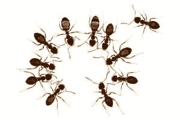

图片来自 https://www.newscientist.com/

事实上，社交距离并不是一个新现象。蚂蚁、猴子和蝙蝠已经做了很久了。生病和受伤的人要再次留下来，以避免疾病的传播。([蚂蚁](https://www.newscientist.com/article/2186140-sick-ants-stay-clear-of-their-co-workers-to-stop-disease-spreading/))。

这种逻辑很容易表达和理解，因此也很容易交流(尽管在世界范围内很难实现)。但是决策者、流行病学家、统计学家如何决定隔离的参数呢？他们如何决定封锁的范围和时间表？

**1。锁定的持续时间:**

决定天数。5 天 vs 10 天 vs 一个月？或者可能是 21 天的禁闭，然后是 5 天的放松，接着又是 10 天的禁闭。哪个更适合？

**2。** **锁定扩展:**

完全关闭或选择性关闭(学校、公共交通、城市的某一部分等。)

如你所知，这两个参数对于不同的流行病和地方是不同的。例如，在印度，在当前的 COVID19 期间，关闭了 21 天，封锁的扩展(几乎)完成。在阿联酋的迪拜，停工期为 10 天，延长时间是选择性的(晚上 8 点到早上 6 点完全停工，早上 6 点到晚上 8 点公共交通正常，人们可以搬出去，尽管必须避免)。

我们如何得出这些参数？与我最初的想法相反，这些值不是随机的，也没有单一的公式，而是一系列的建模、推理和外部因素(经济和政治)帮助我们做出决定。

对于这个博客，我们将只看建模部分，也只看一种叫做 **SIR** ( **易感感染者康复**)的建模。我们将着重于经典的 SIR 模型(Kermack 和 McKendrick 1927)。

SIR 模型(SIR Model):*SIR 模型是一种流行病学模型，它计算一段时间内封闭人群中感染传染病的理论人数。*

以下是 SIR 模型的一些值得注意的方面:

1.人口中的任何人属于三个阶层中的任何一个，并且只属于其中的一个。

2. **S:易感**是可以被感染但还没有被感染的人。这通常是总人口数*减去*感染、治愈、免疫和死亡人数。

3. **I:感染者**是被感染并有机会使其他人被感染的人。我们至少要有 1 个感染者才能引发疫情。

4. **R:康复(移除)**是指不再被感染，也不能感染任何人的人。这包括已经康复、产生免疫力或已经死亡的人。因此这个类有时被称为 removed。这通常在开始时是 0，但它也在不断变化，见下文。

5.我们可以看到人们从一个地方走到另一个地方。

6.我们必须确定人们从 S 到 I 和 I 到 R 的变化率

7.我们也可以把新生儿加入的新个体从“别处”加入到类 s 中。

8.我们可以把死于其他原因的人包括在内，而不是流行病从一个地方流向另一个地方。

出于教学目的，我们现在将忽略 7 和 8，并假设总体是恒定的。我们也将在非常基本的意义上研究这个模型。

首先，我们需要以下变量的值:

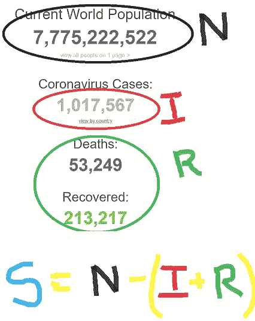

来自 Worldometer 的截图

1.  易感者
2.  已感染(一)
3.  恢复(R)
4.  总人口(N)
5.  总时间(t) —这是一个独立变量
6.  **传染率**(b)——易感者被感染的比率。我们必须假设并在以后完善这一点。
7.  **恢复率**(k)——感染者每天移动到恢复(或死亡)并因此变得无效的速率。我们必须假设并在以后完善这一点。

1 到 4 的值很容易获得。上面的屏幕截图是截至 2020 年 4 月 3 日的 COVID19 状态示例。值 6 和 7 是最初的猜测、专业知识、过去的案例研究、经验、机器学习和其他因素的来源。简而言之，b 和 k 共同决定了我们最初看到的两个因素(锁定的持续时间和范围)。

最简单的形式是，微分方程看起来像这样:

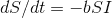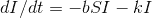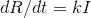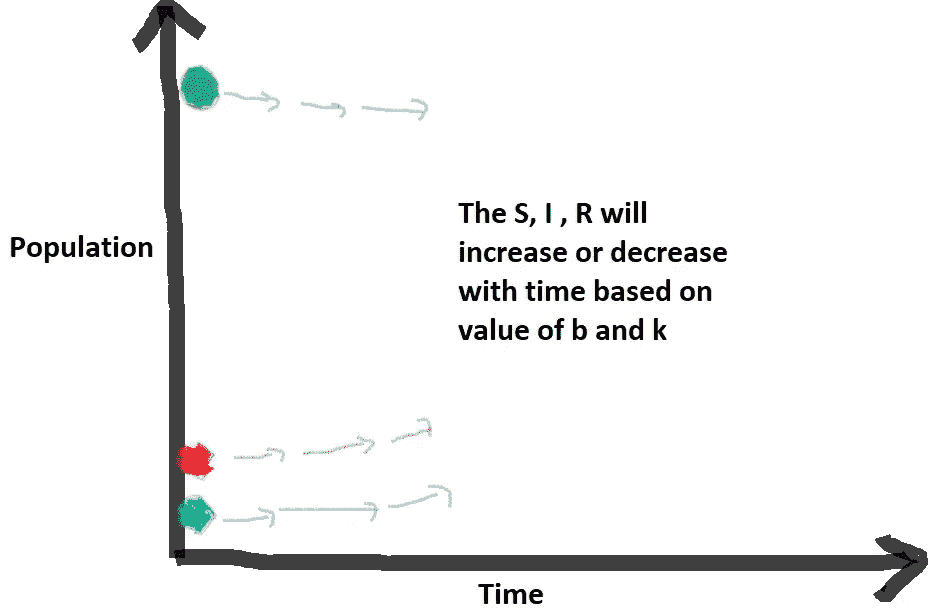

让我们在参数中输入一些值。我们把它画在一张图上，X 轴是时间，Y 轴是人数。

首先，我们假设一个国家，记下它的以下值。

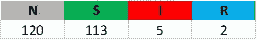

我们还对 b 和 k 值进行随机猜测，并开始评估。

**案例 01** :随机值。感染正在扩散，没有封锁也没有治愈。

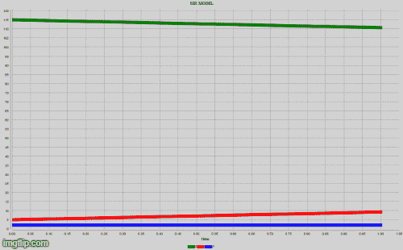

b= 0.9，k=0.01

**观察**:

在不到 10 天的时间里，所有人都会受到影响。

感染人数下降需要 200 多天

**案例 02** :部分封锁。恢复更快，因为医院有足够的时间清理现有的

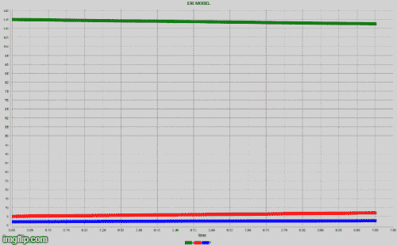

b= 0.5，k=0.1

**观察**:

整个人口在 20 天左右就会受到影响。

整个种群恢复需要不到 50 天的时间。

**案例 03** :完全封锁。恢复与案例 02 相同

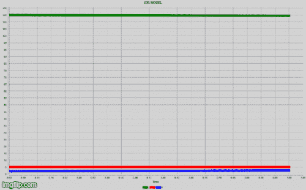

b= 0.1，k=0.1

**观察**:

只有 40%的人会受到影响！

整个人群大约需要 125 天才能康复，不会出现新的感染。

**案例 04** :部分锁定。我们现在有了治疗方法或疫苗。

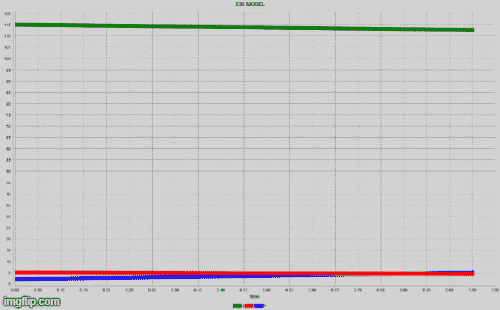

b= 0.5，k=0.6

**观察**:

只有 10%的人会受到影响！

整个人群大约需要 30 天才能康复，不会出现新的感染。

正如你所观察到的，如果遵循的话，锁定的效果是巨大的。恢复率也影响曲线，因此找到疫苗或治疗方法至关重要。

不用说，这些都是非常简单的例子，忽略了很多细节，但可以是一个良好的开端。

注意:这些模型是使用 [GAMA 平台](https://gama-platform.github.io/)创建的，这是一个非常棒的开源建模工具。如果你感兴趣，他们正在对 COVID19 进行一些出色的建模。在这里检查。