# 芝加哥犯罪数据集建模

> 原文：<https://medium.com/analytics-vidhya/modeling-chicago-crime-data-set-a90f8eafecb2?source=collection_archive---------4----------------------->

这篇博文旨在探索芝加哥的犯罪数据，并展示芝加哥逮捕预测模型的实现。这可以在三个主要方面帮助公共机构:

1.  更好地为惩教机构制定公共政策
2.  根据预测，帮助将对策集中于负面影响的犯罪类别
3.  根据犯罪类别指导资源分配

# 了解芝加哥的犯罪

美国第三大城市芝加哥在 2016 年以 749 起谋杀案(见下图)占全国增长的 22%，超过了第一大城市纽约(334 起)和第二大城市洛杉矶(294 起)同年谋杀案的总和。2016 年芝加哥凶杀案的估计数量增加了 52%。

美国凶杀案数量上升 8.6%*(*[*1*](https://ucr.fbi.gov/crime-in-the-u.s/2016/crime-in-the-u.s.-2016/topic-pages/murder)*)*，让芝加哥成为一个异数，一个值得分析的有趣案例。这些杀人事件中的绝大多数发生在南部和西部的五个主要是黑人和拉丁美洲人的社区，那里居住着 270 万人口中的 9%

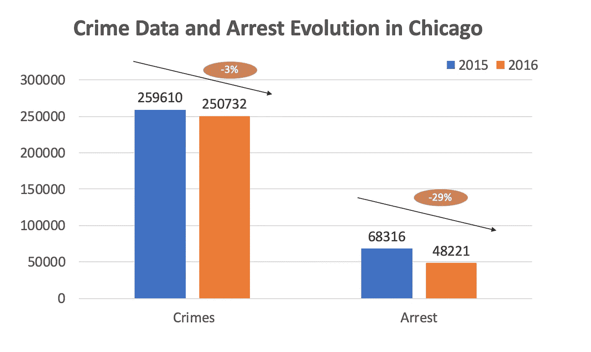

# 过程

## 描述:

*   数据是从芝加哥警察局的 CLEAR(公民执法分析和报告)系统中提取的。
*   为了进行分析，我选择了**2015–2017**数据。
*   该数据集包含 **539，814 个观测值**和 **23 个特征**

## 特点:

我的分析集中在 12 个关键特征上:

1.  **案件编号** —芝加哥警察局研发编号(记录部门编号)，该编号是该事件的唯一编号。
2.  **日期** —事件发生的日期。
3.  **主要类型**—IUCR 码的主要描述。
4.  **逮捕** —表示是否进行了逮捕。
5.  **家庭** —根据伊利诺伊州家庭暴力法案的定义，表明事件是否与家庭有关。
6.  **节拍** —表示事件发生的节拍。一个巡逻区是最小的警察地理区域，每个巡逻区都有一辆专用的警车。三到五个节拍组成一个警区，三个警区组成一个警区。芝加哥警察局有 22 个警区。参见*(*[*3*](https://data.cityofchicago.org/d/aerh-rz74)*)*的节拍
7.  **区** —表示事件发生的警区。参见*(*[*4*](https://data.cityofchicago.org/d/fthy-xz3r)*)*的分区
8.  **选区** —事件发生的选区(市议会区)。参见*(*[*)5*](https://data.cityofchicago.org/d/sp34-6z76)*)*
9.  **联邦调查局代码** —表示联邦调查局国家事故报告系统(NIBRS)中概述的犯罪分类。参见芝加哥警察局这些分类的清单*(*[*6*](http://gis.chicagopolice.org/clearmap_crime_sums/crime_types.html)*)*
10.  **年** —事件发生的年份。
11.  **纬度** —事件发生地点的纬度。此位置偏离了部分修订的实际位置，但仍在同一个块上。
12.  **经度** —事件发生地点的经度。此位置偏离了部分修订的实际位置，但仍在同一个块上。

# 模型

## 特征工程:

我从数据集的特征工程开始。清理数据的方法有 7 个步骤:

1.  检查每个要素中有多少个缺失值。如果丢失的值少于该特性中总值的 10%,则被删除
2.  检查特征类型，并在必要时进行更正
3.  删除重复的行
4.  检查位置异常值，并根据需要消除它们
5.  用零和一代替假和真
6.  通过从“日期”列中提取月、日和小时来创建新功能
7.  删除“ID”和“更新于”等特征，因为它们没有任何与分析和“日期”相关的信息，以避免重复(见步骤 n6)

## 目标选择:

我定义了用这些数据预测的三件有趣的事情:

1.  将会发生犯罪的病房
2.  犯罪类型(列“主要类型”)
3.  如果犯罪最终会被逮捕

由于 Ward 和 Primary 类型的高基数性(见下表)，**我决定使用‘逮捕’特性作为目标**

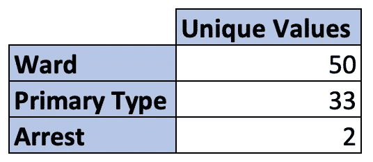

## 数据分割:

分割数据集的过程分两步完成:

1.  从我的数据框中提取 X 要素和 y 目标
2.  使用 Scikit Learn 中的 train_test_split 拆分数据

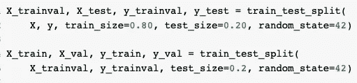

## 基线定义:

基线的目的是创建一个初始预测，并计算一个准确的百分比。这将是未来预测模型的基准。在这种情况下，我使用模式作为预测，因为我的目标是明确的。

**结果:**基线准确率为 77.19%

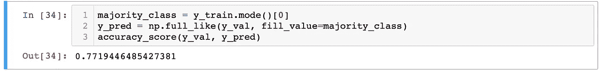

我的 ROC 曲线告诉我，这个模型没有区分积极阶层和消极阶层的能力

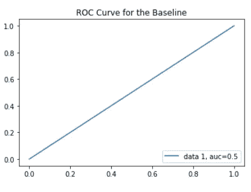

## 型号选择:

在这个过程中，我使用了三种相关的方法，并比较了它们的结果，以便选择最佳的方法进行更准确的预测

1.  **逻辑回归-** 因变量(目标)为分类变量时使用

*   验证数据的准确度= 0.7722
*   测试数据的精确度= 0.7708

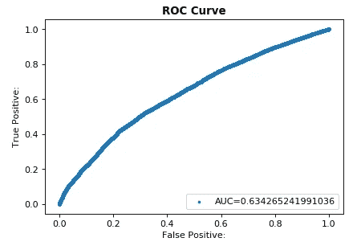

**2。XGBoost-** 一种基于决策树的机器学习算法，GBT 一次构建一棵树，其中每棵新树都有助于纠正先前训练的树所犯的错误

*   验证数据的准确度= 0.8833
*   测试数据的精确度= 0.8831

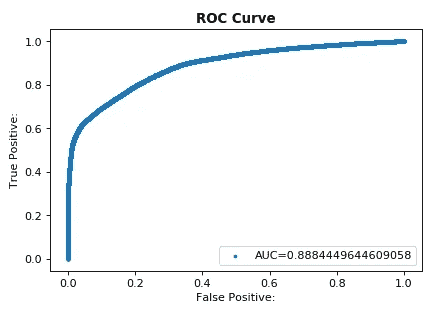

**3。****RandomForestClassifier-**RFs 使用数据的随机样本独立训练每棵树。这种随机性有助于使模型比单个决策树更健壮，并且不太可能过度适应训练数据 [*5](/@aravanshad/gradient-boosting-versus-random-forest-cfa3fa8f0d80)

*   验证数据的准确度= 0.8891
*   测试数据的精确度= 0.8904

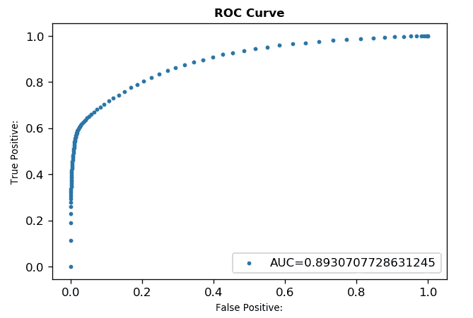

**选择:** *随机森林分类器的性能最好，准确率达到 89%*

## 随机森林分类器的混淆

正确和错误预测的数量用计数值汇总，并按每个类别细分

如下表所示，它正确预测了验证集的 81，660 个预测中的 72，840 个(对角线之和),准确率为 89%

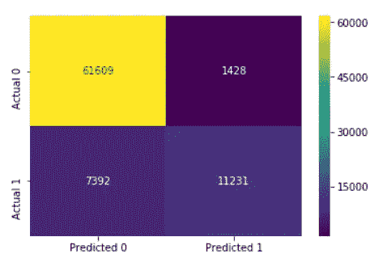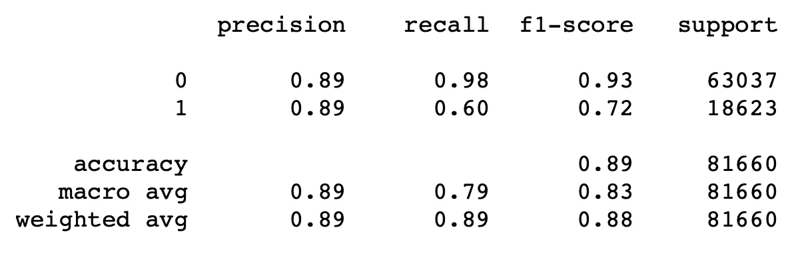

## 特征重要性

使用以下方法检查了功能的重要性

*   **手动删除**:基于树的特征重要性对特征进行排序

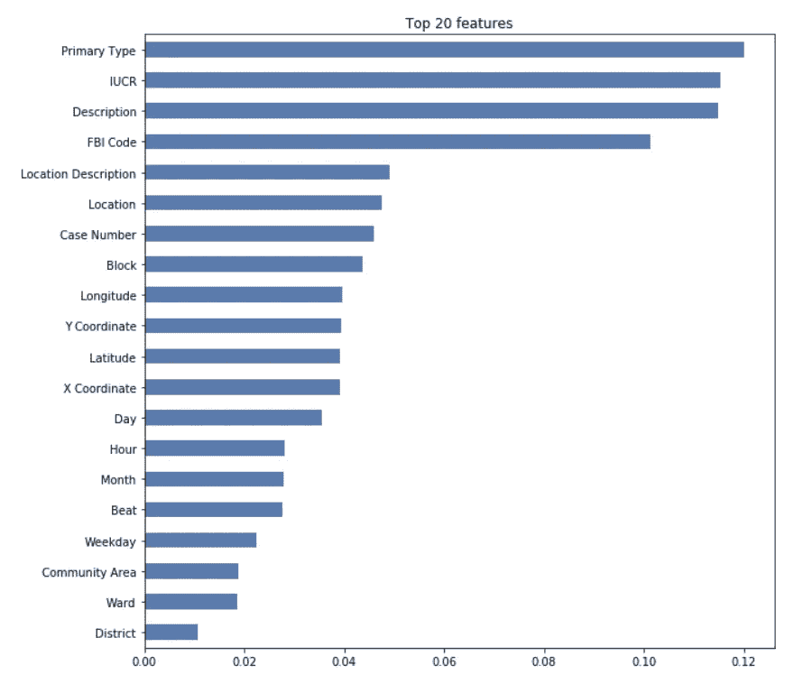

*   **使用 Eli5** :通过测量当一个特性不可用时分数如何降低，为任何黑盒评估者提供一种计算特性重要性的方法 [*6](https://eli5.readthedocs.io/en/latest/blackbox/permutation_importance.html)

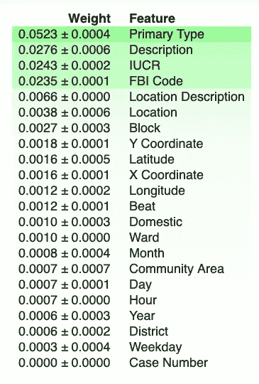

## 示例说明:

SHAP 是一种解释个体预测的方法。

“SHAP 值归因于每个特征在以该特征为条件时预期模型预测的变化。它们解释了在我们不知道当前输出的任何特征的情况下，如何从预测的基值获得。此图显示了单一订购。然而，当模型是非线性的或者输入特征不是独立的时，特征被添加到期望值的顺序是重要的，并且 SHAP 值是通过对所有可能的排序进行平均而产生的"*(*[*7*](http://gis.chicagopolice.org/clearmap_crime_sums/crime_types.html)*)*

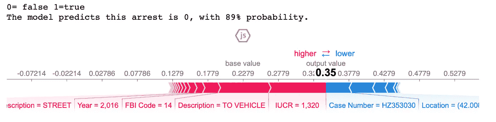

预测的三大理由:

1.  IUCR 是 1320
2.  描述为“至车辆”
3.  联邦调查局的代码是 14

# 部分依赖:

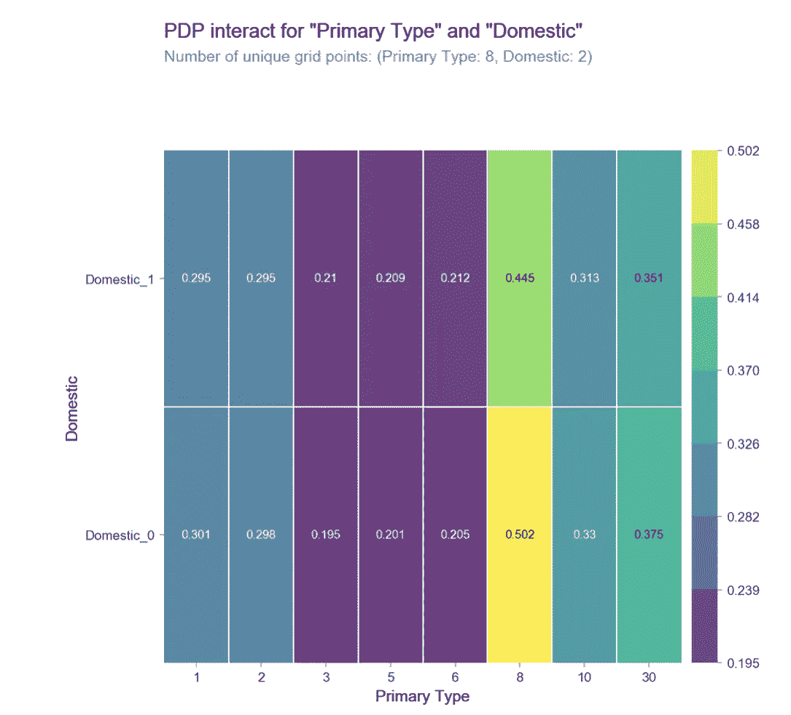

**主要类型代码:**

1)袭击

2)电池

3)刑事损害

5)盗窃

6)盗窃

8)麻醉品

10)欺骗性做法

30)非刑事

**PDP** 显示逮捕中主要类型和家庭特征的概率和相互作用。该图显示了当主要类型是毒品时逮捕概率的增加。另一方面，刑事损害、盗窃和入室盗窃等犯罪的预计逮捕率较低。

为了澄清，PDP 显示特征和目标之间的相关性，并且不假装解释因果关系。

[文档和笔记本在此处](https://github.com/johanaluna/Chicago)