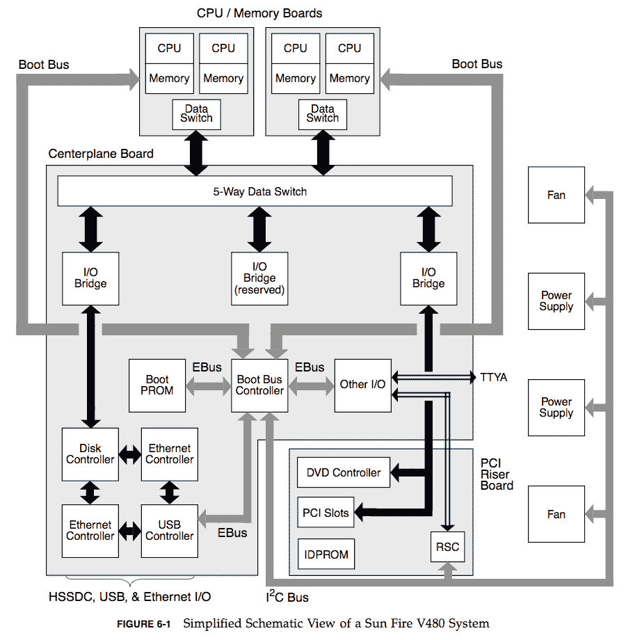
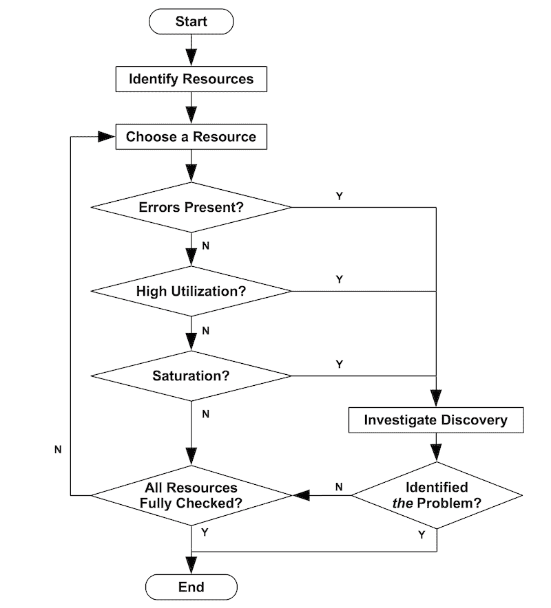
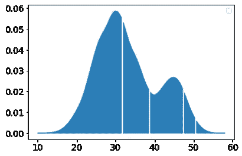
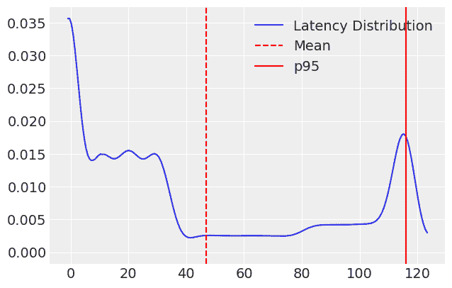
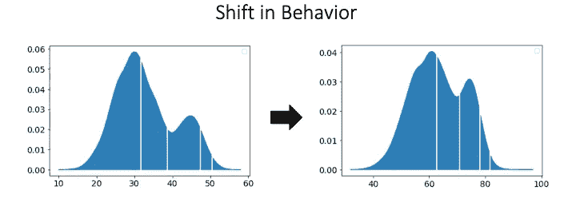

# 分布式系统建模:概念背景和度量

> 原文：<https://medium.com/analytics-vidhya/modeling-complex-systems-part-1-distributions-850d3591b8f8?source=collection_archive---------14----------------------->

这是使用 ML 和统计学为复杂分布式系统的故障场景建模的系列文章的第一篇。作为本系列的一部分，我们将逐步介绍如何构建能够在根本原因分析和性能调整方面超越人类的机器学习模型。为了理解如何通过自动化处理流程，首先理解人类专家在故障排除或进行性能分析时会使用的流程是很重要的。

# 一点背景知识

在过去的 10 年里，我一直以用户和顾问的身份从事大型分布式系统的工作。作为顾问，我参与了 500 多个部署，通常是 Cassandra、Kafka、Spark、ElasticSearch、Solr、Kubernetes 和 Hadoop 的组合。顾问通常有两个角色，在公司构建应用程序时帮助他们制定策略和提供建议，然后在一切出错或出现重大性能问题时接听电话。在这两种情况下，您执行或多或少相同的工作流程:

1.  收集用户的目标和意图；
2.  收集相关指标或日志；和
3.  系统地研究各种工作负载和子系统，以确定瓶颈或问题可能源自何处。

有两篇已出版的作品展示了如何最好地完成这个过程:布兰登·格雷戈的《使用方法》和谷歌出版的 There 的《使用方法》。

# 使用方法

计算机不是一个整体，相反，它是一个子系统的集合，这些子系统协同工作来完成一项任务。这些子系统包括 CPU、内存、磁盘和网络接口。这些系统中的每一个都有其自身的局限性和故障条件。当一个计算机程序出现性能或可靠性问题时，它通常是一个系统压力过大或出现故障的结果。理解为什么一个系统很慢或者解开警报和错误的洪流是困难的，并且经常需要大量的基于经验的模式匹配和关联。为了使这个过程对新来的人来说更容易，Brendan 发明了一个基本的程序来系统地将一个系统分解成它的组成部分，并隔离问题的根源。

> **对每个资源，检查利用率、饱和度和错误**

示例系统框图取自 Brendan 的网站，最初来自 Sun Fire V480 指南

[使用](http://www.brendangregg.com/usemethod.html)是一个首字母缩写词，代表**利用率**、**饱和度**和**错误**，该方法一半是在发现错误时寻找什么，一半是程序。诀窍是看一看你的系统，把它分解成所有不同的子组件，然后“对每个资源，检查利用率、饱和度和错误”。如果你系统地这样做，那么你应该能够理解哪些系统处于压力之下，哪些系统正在经历错误，并形成关于系统为什么失败的假设。一旦你有了一个假设，你就可以执行进一步的检查来验证你的想法或者提出实验，比如增加 IO，或者缓存某些值来解决问题。

[使用方法工作流程](http://www.brendangregg.com/usemethod.html):识别系统，对于每个系统，识别利用率、错误和饱和度，如果您发现任何有趣的事情，请进行调查。重复进行，直到找到瓶颈或错误源。

当您尝试对专用服务器上的单个应用程序进行故障诊断时，USE 方法很有效，但是如果您尝试对更大的系统(如分布式数据库或包含许多微服务的应用程序)进行故障诊断，会发生什么情况呢？

# 谷歌，四个黄金信号和长尾理论

在大型分布式系统中，事情变得稍微复杂一些。例如，您正在处理成百上千的机器。您如何知道哪种资源出现了瓶颈？你检查每台机器吗？您如何知道一台机器上的错误是否导致了用户看到的延迟峰值？分布式系统是嘈杂和动态的，这一事实使问题变得更加复杂。在一个足够大的集群中，总会有一些地方出错。机器经常发生故障，应用程序异常从来不会降到零，并且集群会根据负载频繁地改变大小。如果你要回应每一个警告，你会很快变得不知所措。为了处理这种复杂性

您的应用程序不再是运行于单个机器的单个程序。它是数百或数千台机器的集合，而不是像磁盘或 CPU 这样的子系统，您监视像队列或数据库这样的底层服务的特征，每个服务可能由许多机器支持。更复杂的是，分布式系统不是一成不变的。机器会定期发生故障，系统会根据负载进行伸缩，子系统之间的通信通过网络进行，这就引入了噪声源。如果您要对延迟中的每个错误或变化发出警报，您很快就会不知所措。

# 衡量什么

[SRE 的书](https://landing.google.com/sre/sre-book/toc/)的第 6 章，通过给出测量什么和如何测量的指导来处理监控分布式系统的复杂性。它们经历了许多在使用方法中强调的相同指标，但是它们用**延迟**和**吞吐量**代替了利用率。延迟和吞吐量是具体的概念，很可能已经由您的系统导出，而利用率则有些抽象，在一个不断变化的系统中很难测量。综上所述，我们通常关注 4 组指标(**延迟、吞吐量、饱和度和错误**)，我们将使用这些指标来描述我们正在监控的每个系统或子系统的工作和压力。

# 担心你的尾巴

从监控这一章学到的另一个要点是，你应该担心你的尾巴。什么是尾巴？尾部是[概率分布](https://en.wikipedia.org/wiki/Probability_distribution)中较高的[百分位数](https://en.wikipedia.org/wiki/Percentile)。**发行版**是全面了解你的系统正在做什么的关键。不幸的是，大多数人和系统( [JVM 垃圾收集](https://docs.oracle.com/cd/E17802_01/j2se/j2se/1.5.0/jcp/beta1/apidiffs/java/lang/management/GarbageCollectorMBean.html)， [ElasticSearch](https://www.elastic.co/guide/en/elasticsearch/guide/master/_monitoring_individual_nodes.html) )经常会犯这样的错误，只报告他们的平均值(average ),这样几乎不可能排除故障。

# 这是关于分配

发行版很重要，因为它们描述了系统的整体行为，并为您提供了对正在发生的事情的更丰富的理解。

理论延迟分布在 30 和 45 毫秒左右有两个峰值

只需浏览一下上面的延迟分布图，我就能够非常详细地了解我的系统的行为。我可以看到平均延迟大约为 32 毫秒，我还知道我 95%的请求都在大约 55 毫秒内完成。这是一个非常紧密的分布，在现实世界中几乎没有变化。此外，我看到两个峰值，这意味着此图中可能包含两组不同的行为或请求延迟分布。如果我将延迟减少到单个数据点，所有这些信息都将丢失。让我们来看一些现实世界中的例子，看看我们如何在故障排除时使用这些信息。

# 嘿！你说谁有一条“肥尾巴”？

作为第一个说明分布为什么重要的例子，让我们回到对长尾理论的讨论。当处理一段时间内的请求分布时，如果您测量一分钟的平均响应速度，90%的请求可能是 3 毫秒，10%可能是 300 毫秒，您的平均响应速度是 32.7 毫秒。这看起来很棒，但是如果你的 [SLO](https://en.wikipedia.org/wiki/Service-level_objective) 是 100 毫秒的 [p95](https://en.wikipedia.org/wiki/Percentile) ，那么你就违规了，而且永远不会知道。如果你只记录平均值，你就失去了重要的信息，包括发现异常值的能力。

仅使用指标的平均值可能会掩盖重要的行为。在这种情况下，一小部分高延迟请求导致系统违反其 SLO。

> 如果你只记录平均值，你就失去了重要的信息，包括你发现异常值的能力。

# 神圣的 s*%#，为什么东西会着火？

我们已经认识到，分布让我们对系统的行为有了更深入的了解，但最重要的是，它们给了我们一个工具，让我们可以调查出问题时发生了什么变化。如果您随着时间的推移跟踪您的分布，您可以很容易地比较从中断前到触发警报期间的基线分布。

该度量的分布向右移动了大约 30 毫秒，表明行为的总体变化。

> 分布中的变化为您提供了执行下一级分析所必需的线索

如果分布向右移动，可能是一般的[变化点](https://en.wikipedia.org/wiki/Change_detection)(新版本，数据集增加超过内存大小)或负载的一般增加。如果是这样，您可以恢复构建或扩展集群。如果一个指标突然出现峰值，就像上面的延迟图一样，这可能是一个间歇性故障，或者是行为的一个子集有问题。该子集可能是一个有问题的用户、一系列昂贵的请求或者一台经历硬件故障的机器。尽管如此，分布中的变化为您提供了执行下一级分析所必需的线索。

# 总结和后续步骤

概括地说，我们已经建立了测量什么(吞吐量、延迟、饱和度、错误)、如何测量(分布)以及使用方法的粗略故障排除工作流。然而，要将这一点付诸实践，还需要一件东西，那就是[**DAGs**](https://en.wikipedia.org/wiki/Directed_acyclic_graph)**(**Directed**A**cyclic**G**raphs)。在下一部分中，我们将讨论如何为已知系统构建 Dag，以及用于隔离和归因于服务中断的因果关系的通用试探法。