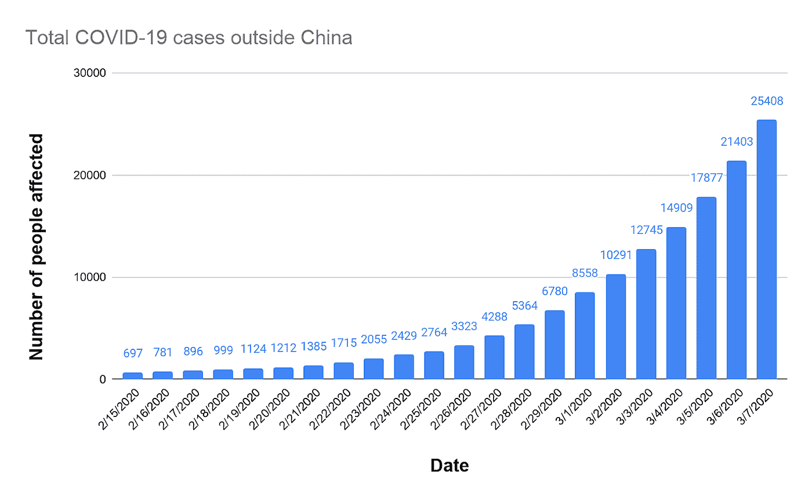
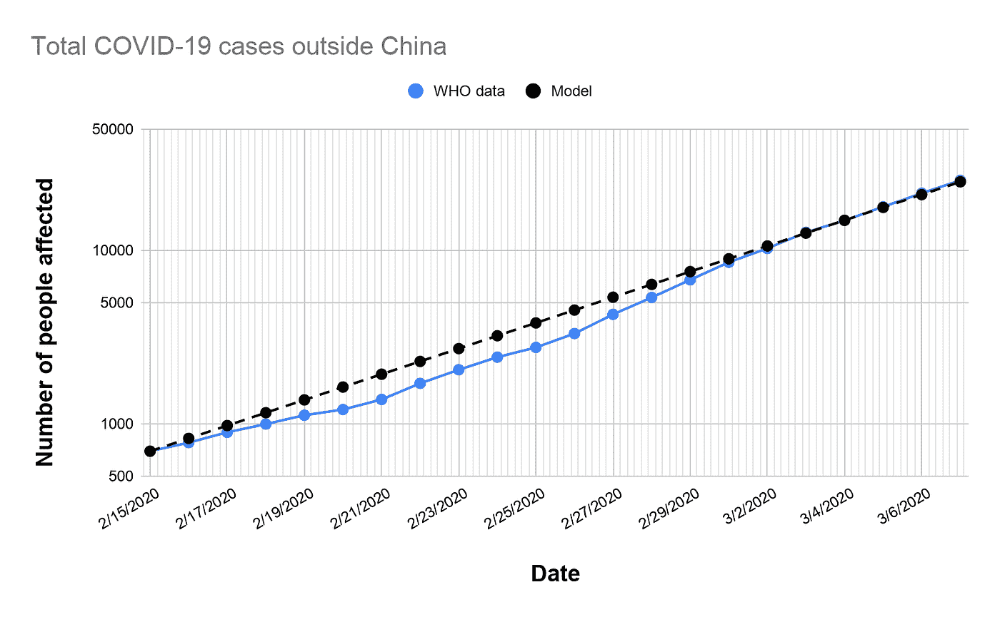
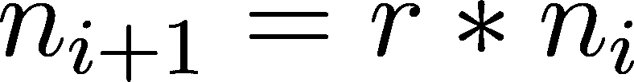
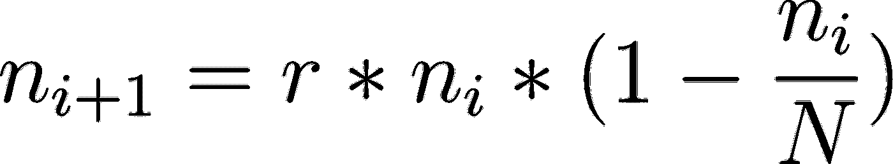
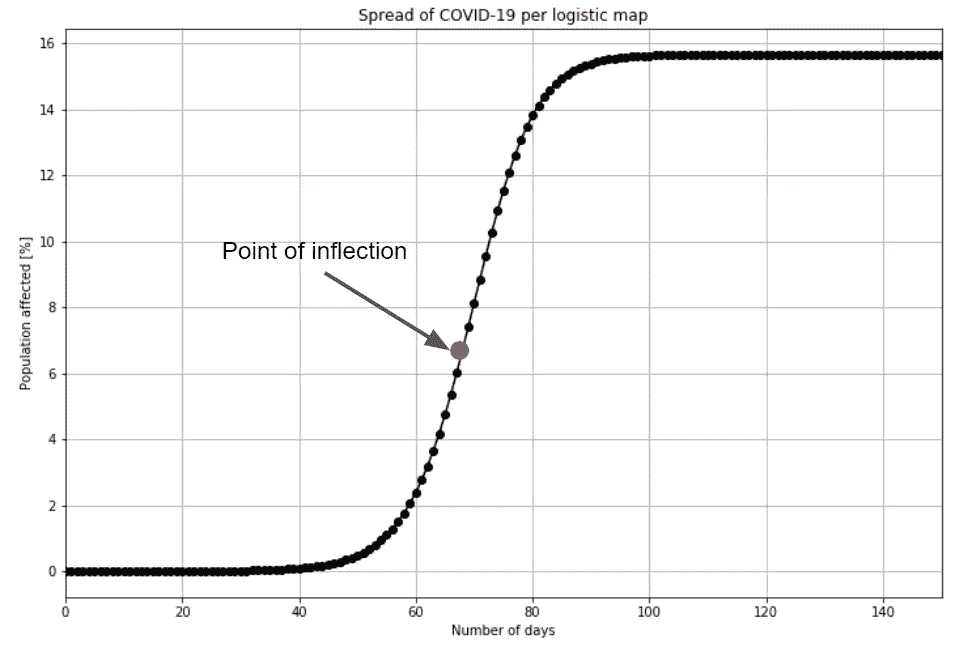
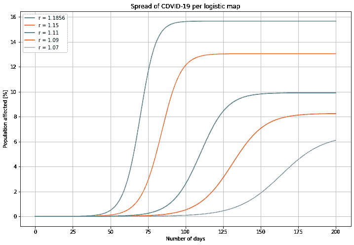

# 基于数据科学的新冠肺炎投影——基于 logistic 映射的流行病建模案例

> 原文：<https://medium.com/analytics-vidhya/modeling-covid-19-spreading-using-data-science-and-logistic-map-8b11cf46c0a8?source=collection_archive---------5----------------------->

如果任其发展，像新冠肺炎这样的流行病会在感染人群中呈指数增长。利用数据科学和数学，人们可以得出高度传染性疾病在人群中传播的简单预测。

图 1:中国境外新冠肺炎感染总人数

这是一张图表，显示了 2020 年 2 月中旬至 3 月初中国以外受新冠肺炎影响的总人数，使用的是世界卫生组织的数据库。它显示了新冠肺炎在人口中的传播速度有多快。这是病毒感染在人群中呈指数增长的典型例子。当特定一天的感染数与前一天的感染数直接相关时，病毒感染呈指数增长。

图 2:新冠肺炎在中国以外的指数增长

当病例总数以对数标度作图时，我们可以看到新冠肺炎病例的指数增长。使用简单的回归分析(一种使用最小平方误差法获得数学函数的统计方法)，通过对数标度的世卫组织数据拟合模型。事实证明，每天的新冠肺炎病例总数可以使用指数增长方程(下面给出的方程 1)很容易地建模。第二天的新冠肺炎病例数可以用一个常数(***【r】***)乘以当天的病例数得到，这个常数就是通常所说的增长率。

方程式 1:指数增长方程式

根据世卫组织对中国境外病例数据拟合的模型，增长率(***【r)***)约为 1.18564。但是，由于这个模型是指数型的，随着时间的推移发散到无穷大，这在物理上是不正确的。随着越来越多的人被感染，他们周围都是已经被感染或已经产生免疫力的人。所以在感染人群中有一个饱和点。通常，为了预测增长，将另一个因子乘以该指数增长方程的右侧，该因子约束指数增长并识别饱和点。

等式 2:逻辑映射等式

因此，等式 1 被修改以说明基于人口总数的饱和度( ***N*** )。这个修改后的方程被称为**逻辑图**。它是由生物学家罗伯特·梅在 1976 年推广的。该方程旨在捕捉受控人群中生殖和死亡率的影响。这是一个很好的模型，可以用来预测像新冠肺炎这样的传染病的传播。

图 Logistic 映射方程的级数特征

假设新冠肺炎在人口中心的小块区域传播(如一个城市或省份)，使用**逻辑图**建模的进程将捕捉到感染在该人群中的传播。上图 3 使用 1.18564 的预计增长率显示了新冠肺炎作为受影响人口一部分的进展情况(基于符合中国以外新冠肺炎世卫组织数据的模型)。这里很少有重要的外卖。

起初，感染呈指数级传播。这是传染病传播的第一阶段。从第一个病例到感染约 0.8 %的总人口之间的第一阶段约为 50 天。指数增长率几乎是恒定的，感染的传播在很大程度上是不受限制的。在此期间，几乎所有新病例都是由于感染者与未感染者之间的人际接触而发生的。

第二阶段发生在发现首例病例后的第 50 天至第 70 天。这是当等式 1 中的增长率( ***r*** )开始从其大约 1.185 的初始稳定值下降到小于 1 时。这是非常关键的，因为就在第 70 天前后，新感染增长速度稳定下来并从最初的高峰开始下降。这就是所谓的拐点。这是感染呈“线性”增长的时候。虽然这可能是增长率停滞的第一个迹象，但新病例仍会出现，但速度更容易控制。

从第一个病例开始大约 80 天后，这种感染的增长率停止，新感染率明显小于 1。在新冠肺炎病毒传播的第三阶段，新感染病例的增长或多或少呈对数增长。

当累计感染病例总数达到袋中总人口的约 15.5 %，且不再出现新病例时，即为最后阶段。这是总新冠肺炎在人群中达到平衡的时候。这发生在第一个病例后约 100 天。

现在**逻辑图**是一种非常简化，但是非常强大的方法来模拟像新冠肺炎这样的传染病的传播。在这种模拟复杂自然现象的背景下，有必要提醒一下著名的威斯康星大学麦迪逊分校统计学家乔治·博克斯教授的话。

> …所有模型都是近似值。本质上，所有的模型都是错的，但有些是有用的。然而，必须始终牢记模型的近似性质。

尽管这个模型非常简单，而且在大范围内可能不准确，但它传达了一个非常强有力的信息。它表明，该疾病将在头 50 天左右呈指数传播，然后大约 70 天，将出现一个拐点。最后，在第 100 天将达到饱和点(或平衡点)。初始增长率(***【r***)是一个非常强大的数学工具，它在模型中封装了疾病传播对人与人之间的相互作用的影响以及从积极的相互作用中被感染的概率。它提醒我们减少人际交往的重要性，更好的个人卫生和一点点运气都有助于阻止这种致命感染的增长。更重要的是，使用这个强大而简单的模型，我们可以玩*假设*场景。例如，如果我们大规模隔离受新冠肺炎感染的人群，那么我们就有可能降低初始增长率( ***r*** )。

图 4:指数增长率各种情况下的逻辑示意图

为了证明像新冠肺炎这样的疾病传播对初始增长率( ***r*** )有多敏感，在不同的初始增长率情景下，使用**逻辑图**对感染进展占人口中心总人口的百分比进行建模。在这种情况下，通过稍微减少人类交互，可以实现病例总数的大量减少。例如，如果增长率( ***r*** )从基线 1.185 降至 1.11，那么受影响人口中的饱和病例数将减少 33 %，如果( ***r*** )降至 1.07，疾病传播率将大幅降低，以至于在 120 天结束时，不到 1 %的人口将受到影响。

访问 my [GitHub code repo](https://github.com/sidbannet/math-projects) 与物流地图互动。

访问我的 [GitHub Gist](https://gist.github.com/sidbannet/641cb50e371b1b73b0d539495bedae60) 与用于撰写本文的物流地图进行互动。