# 建模、评估和组装

> 原文：<https://medium.com/analytics-vidhya/modeling-evaluation-and-ensembling-f00fe1de6470?source=collection_archive---------24----------------------->

## 泰坦尼克号(二元分类法)和爱荷华州房价预测(回归)

这是我的数据科学系列的第三部分。

*   [第一部分——关于泰坦尼克号生存问题的 EDA](https://vrevathi.medium.com/exploratory-data-analysis-of-titanic-survival-problem-e3af0fb1f276)
*   [第二部分——爱荷华州房价预测 EDA](https://vrevathi.medium.com/exploratory-data-analysis-of-iowa-housing-price-prediction-problem-3d50a016797a)
*   第三部分——模型构建、评估和组装

第一部分和第二部分包括目标变量“幸存”是二元的泰坦尼克号幸存问题的探索性数据分析和目标变量“销售价格”是连续变量的爱荷华州房价预测。我的分析包括数据清理、特征工程、相关性研究、单变量、双变量和多变量分析，使用了一些基本统计数据、一些 pandas 操作和 seaborn 的一整套可视化工具。在本系列的第三部分中，我将讨论模型构建、评估和集成。

# 泰坦尼克号生存预测

首先，让我们导入笔记本中使用的库。

```
import pandas as pdfrom sklearn.model_selection import cross_val_score
from sklearn.ensemble import (RandomForestClassifier, AdaBoostClassifier, GradientBoostingClassifier, ExtraTreesClassifier)
```

现在，我们读取数据集(从以前的笔记本中清除数据),并将目标变量从数据集中分离出来。

```
df = pd.read_csv('../data/titanic_clean_data.csv')
target = 'Survived'
features = [ col for col in df.columns if col != target ]
X, y = df[features], df[target]
```

现在是时候初始化我们的模型了。初始化之后，我正在计算每个模型预测的特征重要性。

注意，我将一个固定的种子值作为随机状态传递给所有的模型。但是为什么呢？

设置手动种子参数可以确保任何重新运行您的代码的人都将获得完全相同的输出。像 sklearn 这样的库使用的随机数生成器并不生成真正的随机值。它们是伪随机数生成器，这意味着生成数字有一个逻辑/顺序。这个顺序可以通过设置特定的种子来控制。不管实验做了多少次，当种子设定为一个特定的值，比如说 2，结果总是一样的。再现性是数据科学中一个极其重要的概念。

```
seed = 2
rf = RandomForestClassifier(random_state=seed)
et = ExtraTreesClassifier(random_state=seed)
ada = AdaBoostClassifier(random_state=seed)
gb = GradientBoostingClassifier(random_state=seed)models = [rf, et, ada, gb]
model_names = ['RandomForest', 'ExtraTrees', 'Ada', 'GradientBoost']
[ m.fit(X, y) for m in models ]
feature_importances = { name: m.feature_importances_ for name, m in zip(model_names, models) }
```

现在我们取每个模型计算出特征重要性的平均值。

```
feature_df = pd.DataFrame(feature_importances)
feature_df.insert(0, 'features', features)feature_df['mean'] = feature_df.mean(axis=1)
feature_df
```

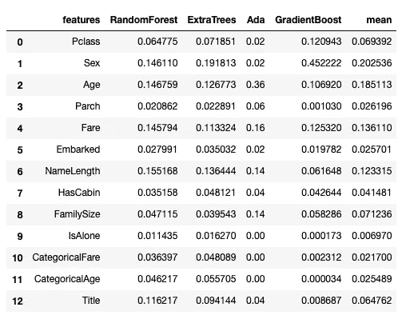

从上述数据中，我们可以看出，性别、年龄和票价在预测目标变量“存活”方面发挥了重要作用。

现在我们从 sklearn 包中导入一个助手方法`train_test_split` ,用于将数据分成训练集和测试集。

在这里，我将 20%的数据用于测试，其余的 80%用于训练。

```
from sklearn.model_selection import train_test_splitX_train, X_test, y_train, y_test = train_test_split(X, y, test_size=0.2)
```

投票分类器是一种机器学习模型，它从一系列机器学习模型中集成预测，并通过对预测进行投票来预测输出。

让我们导入包并初始化模型，然后在数据上安装分类器。

```
from sklearn.ensemble import VotingClassifiervc = VotingClassifier(estimators=[(name, m) for name, m in zip(model_names, models)
])vc.fit(X, y)
```

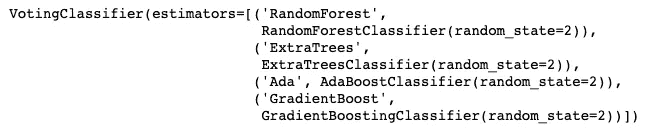

基于投票分类器预测，让我们计算交叉验证分数。

```
scores = cross_val_score(vc, X, y, cv=5, scoring='accuracy')
scores
```

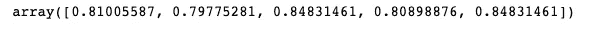

现在，我们拟合数据，然后将我们的预测与实际数据进行比较，以获得准确性。

```
vc.fit(X_train, y_train)
```

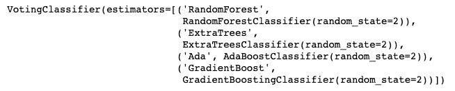

```
pred = vc.predict(X_test)
100\. * (pred == y_test).mean()
```

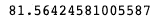

我们得到了 81.56%的准确率，这不是很好。不过没关系。进步是一点一点地发生的。

> "移山的人是从搬走小石头开始的."~孔子

# 爱荷华房价预测

泰坦尼克号的生存是一个二元分类问题。我们的下一个模型是一个回归模型，用于预测来自 Kaggle 的爱荷华州房价预测问题。数据清理和可视化部分已经在我以前的文章中分享过了。

二元分类和回归的模型建立和评估更加相似。

让我们导入用于构建回归模型的库。

```
from sklearn.linear_model import ElasticNet, Lasso
from sklearn.ensemble import GradientBoostingRegressor
from sklearn.model_selection import cross_val_score, train_test_split
import xgboost as xgb
import lightgbm as lgb
import pandas as pd
from scipy import stats
from scipy.stats import norm, skew
```

现在，让我们阅读在以前的笔记本中整理过的训练和测试数据集。

```
train = pd.read_csv('../data/clean_train-hpp.csv')
y_train = pd.read_csv('../data/clean_y_train-hpp.csv')
```

现在让我们使用 sklearn 包中的`LabelEncoder`将分类变量转换成数字形式。

```
from sklearn.preprocessing import LabelEncoder
cols = ('FireplaceQu', 'BsmtQual', 'BsmtCond', 'GarageQual', 'GarageCond', 
        'ExterQual', 'ExterCond','HeatingQC', 'PoolQC', 'KitchenQual', 'BsmtFinType1', 
        'BsmtFinType2', 'Functional', 'Fence', 'BsmtExposure', 'GarageFinish', 'LandSlope',
        'LotShape', 'PavedDrive', 'Street', 'Alley', 'CentralAir', 'MSSubClass', 'OverallCond', 
        'YrSold', 'MoSold') for c in cols:
    lbl = LabelEncoder() 
    lbl.fit(list(train[c].values)) 
    train[c] = lbl.transform(list(train[c].values)) print('Shape of train data: {}'.format(train.shape))
```

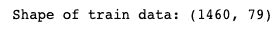

# **歪斜**

在正态分布中，图表看起来是对称的，这意味着右侧数据点的数量或多或少等于左侧数据的数量。在这种情况下，数据的平均值、中值和众数或多或少是相同的。

如果曲线左侧较大，这意味着数据是正偏的。在这种情况下，平均值和中值大于众数，平均值大于中值。同样，如果曲线右侧较大，则数据是负向倾斜的。

如果数据是倾斜的，图形的尾部将包含异常值，这将影响模型的性能，尤其是在回归问题中。首先，让我们计算数据集的偏斜。

```
numeric_feats = train.dtypes[train.dtypes != "object"].index# Check the skew of all numerical features
skewed_feats = train[numeric_feats].apply(lambda x: skew(x.dropna())).sort_values(ascending=False)
print("\nSkew in numerical features: \n")
skew = pd.DataFrame({'Skew' :skewed_feats})
skew.head(10)
```

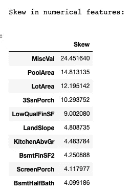

# **Box-Cox 变换**

为了修复数据集中的偏差，我们通常使用几种方法。使用的一些方法有:
1。缩放比例
2。日志转换
3。立方根归一化
4。博克斯-考克斯变换。

在使用上述方法之前，需要记住一些重要的事情:

1.对数转换用于将数据集转换成更小的值
2。如果数据有太多的极值，我们就使用这些技术。
3。这些技术并不总是能给出最佳结果
4。使用这些方法不会丢失数据

在所有上述方法中，Box-Cox 变换给出了最好的结果。因此，我们在这个问题中使用 Box-Cox 变换。

```
skew = skew[abs(skew) > 0.75]
print("There are {} skewed numerical features to Box Cox transform".format(skew.shape[0]))from scipy.special import boxcox1p
skewed_features = skew.index
lam = 0.15
for feat in skewed_features:train[feat] = boxcox1p(train[feat], lam)
```

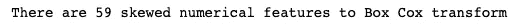

*get_dummies()* 方法将分类变量分成多个变量，每个变量用 1 和 0 表示特定类的存在或不存在。

```
df = pd.get_dummies(train)
print(df.shape)
```

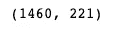

现在是初始化回归模型的时候了。如前所述，我将一个通用的随机状态传递给所有模型，以确保可重复性。

```
seed=3
lasso = Lasso(random_state=seed)
ENet = ElasticNet(random_state=seed)
GBoost = GradientBoostingRegressor(random_state =seed)
model_xgb = xgb.XGBRegressor(random_state =seed)
model_lgb = lgb.LGBMRegressor(random_state =seed)
```

现在，我们将只利用训练集进行模型训练和评估。所以我们对从磁盘读取的清理后的训练数据进行适当的重命名。

```
X, y = train, y_train
```

现在，让我们计算每个模型的平均交叉验证分数，并将结果可视化。

```
from sklearn.model_selection import cross_val_score
import seaborn as sns
import matplotlib.pyplot as plt
plt.style.use('ggplot')model_names = ['Lasso', 'ElasticNet', 'GradientBoostingRegressor', 'XGBRegressor', 'LGBMRegressor']
models =  [lasso, ENet, GBoost, model_xgb, model_lgb]
mean_score = []
for model in models:
    scores = cross_val_score(model, X, y.SalePrice, cv=10, scoring='neg_mean_squared_error')
    mean_score.append(-1 * scores.mean())plt.figure(figsize=(15, 7))
g = sns.scatterplot(x=model_names, y=mean_score, hue=mean_score, s=200)
plt.xticks(rotation=45);
plt.show();
```

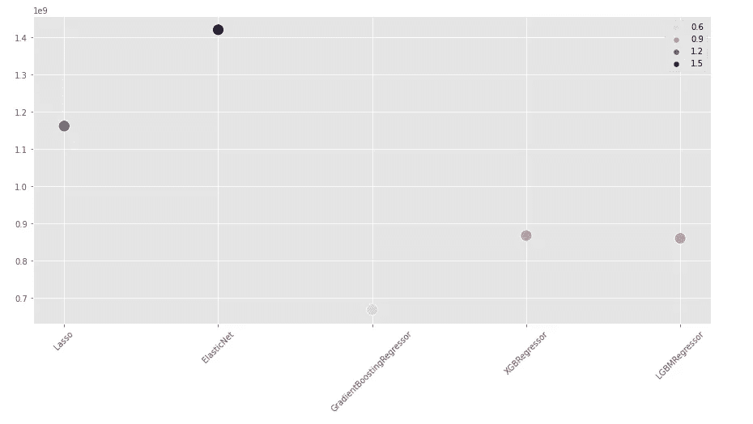

从上图可以看出，梯度推进回归器比其他模型表现更好。因此我们选择这个模型进行预测。

```
from sklearn.model_selection import train_test_splitX_train, X_test, y_train, y_test = train_test_split(X, y, test_size=0.3)
GBoost.fit(X_train, y_train)
y_pred = GBoost.predict(X_test)
y_real = y_test.SalePrice
MAPE = abs((y_real - y_pred) / y_real).mean()
```

我们已经计算了 MAPE(平均绝对百分比误差)。MAPE 是回归问题的另一种性能指标，它用百分比表示结果，比均方误差(MSE)更容易解释。

让我们通过反演 MAPE 来计算精度。

```
100\. - (100\. * MAPE)
```

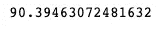

梯度推进回归器达到了 90.39%的准确率。非常好。但仍有很大的改进空间。

这正式结束了我的“开始数据科学”系列，开始了我的数据科学之旅。在过去的两个月里，我解决了几个数据科学问题，包括:

*   [森林覆盖类型预测](https://www.kaggle.com/c/forest-cover-type-prediction) —多级分类
*   [电信客户流失预测](https://www.kaggle.com/blastchar/telco-customer-churn) —二元分类
*   [网络流量时间序列预测](https://www.kaggle.com/c/web-traffic-time-series-forecasting) —时间序列预测

作为本系列的后续，我将写一些关于这些问题以及我是如何处理它们的。时间序列预测特别吸引我，因为它不像其他问题那样简单。虽然深度神经网络和机器学习模型的集成主导了结构化数据、图像和文本的领域，但 ARIMA 及其变体等统计方法仍然统治着时间序列的领域。我花了相当多的时间来理解时间序列预测概念，如自相关(ACF)、部分自相关(PACF)、趋势、熵等。它值得拥有自己的博客系列。很快会看到更多令人兴奋的东西。

我很重视您的反馈，很想知道您对这个系列的想法。