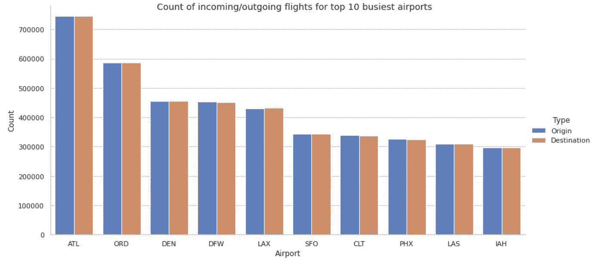

# 通过模拟美国飞行数据预测飞行延误

> 原文：<https://medium.com/analytics-vidhya/modeling-flight-delays-through-u-s-flight-data-2f0b3d7e2c89?source=collection_archive---------4----------------------->

## 2017-2018 年美国航班延误数据分析。使用线性回归和 XGboost 等建模技术来预测航班的到达延迟。

[https://soar.edu.au/blog/top-5-craziest-plane-landings/](https://soar.edu.au/blog/top-5-craziest-plane-landings/)

# **简介**

对于任何乘飞机旅行的人来说，你可能都经历过飞行中不可避免的痛苦之一:延误。有时你的飞机晚点，其他时候可能需要排队等待起飞，偶尔天气迫使飞机延误一小时(甚至取消)；不管延误的原因是什么，它们都给旅行者带来了巨大的不便。

因此，考虑到关于航班旅行的大量数据(仅在美国每年就有 1600 多万次航班)，可以从这些数据中得出有价值的见解，使我们能够更好地了解航班延误。此外，随着数据的丰富，机器学习模型可以被训练成可能预测这些延误——这可能证明对个人旅行者和企业等非常有价值。因此，这是一个我希望通过从可用数据中提取潜在的有意义的见解，并构建和比较机器学习模型来预测航班延误的主题。

# 数据源

我将在 is 分析中使用的数据源是来自 Kaggle 的[数据集](https://www.kaggle.com/yuanyuwendymu/airline-delay-and-cancellation-data-2009-2018)，其中包含 2009 年至 2018 年的美国飞行数据。数据集的行表示该年的特定航班，而列包含航班的大量信息，如航空公司、航班日期、出发延迟、到达延迟等。

整个数据集包含每年的 CSV 文件，总计约 7GB。此外，每个文件大约有 600 万行。由于我将在有内存和 GB 限制的 Google Colab 上运行我的分析，我选择只使用 2017 年和 2018 年的数据。我相信这个数据集(1200 万行)对于我的 EDA 和建模来说已经足够了；使用更大的组合数据集将显著降低模型的训练速度，并且可能只会略微提高整体性能。

下图显示了数据帧读取后的样子。

**注意:**没有显示所有的列。

# 探索性数据分析

## 延迟分析

首先，在读入两个 CSV 文件并将其合并到一个合并的 pandas 数据框架中之后，我计算了所有航班的出发和到达延迟的汇总统计数据，以获得对数据的大致理解。

*   **离港延误**是航班的正式离港时间和实际离港时间之差，以分钟计。
*   **到达延误**是航班官方到达时间与实际出发时间之差，以分钟为单位计量。
*   正值表示航班延误，负值表示航班提前起飞/抵达

令人惊讶的是，平均到达延迟只有 5 分钟左右。此外，我们可以看到中值为-6 分钟，这表明大多数航班实际上比预期的到达时间提前到达。

为了进一步捕捉这一点，我创建了一个饼图，描绘每个到达延误间隔的航班百分比。

**2017-2018 年航班延误程度分布**

如图所示，大约 63%的航班提前到达，只有大约 12%的航班晚点超过 30 分钟。这让我非常惊讶，因为绝大多数航班都提前到达。此外，只有 12%左右的航班晚点超过 30 分钟，这远远少于我个人的预期。

## 起点/终点分析

接下来，我决定对始发地和目的地机场进行一些分析。首先，我找到了航班频率最高的 10 个最繁忙的机场。令我惊讶的是——尽管事后看来这并不令人意外——在计算始发地和目的地时，机场的排名是一致的，每个机场的进出航班数量大致相等。

Hartsfield-Jackson 亚特兰大国际机场(ATL)是最繁忙的机场，两年内有超过 700，000 次进出航班。

我还查看了始发地-目的地配对，以了解哪些配对具有最高和最低的平均延迟。为此，我只考虑了两年内至少有 48 次航班的配对(平均每月 2 次航班)，因为我想考虑相对频繁的航班。

> **最高平均延误:**TVC 至 EWR 61.9 分钟
> 
> **最低平均延迟:** -从 OMA 到 SAN 35.3 分钟

## **时间序列分析**

接下来，我将 FL_DATE 字符串对象转换为 datetime 对象，提取 2017 年 1 月到 2018 年 12 月每个月的航班总数。

**2017-2018 年每月航班频率时间序列**

如上所述，春夏季节的航班有所增加，而秋冬季节则明显减少。此外，随着时间的推移，总飞行次数呈明显上升趋势。

然后，我选择查看美国四大航空公司一段时间内的航班频率:美国航空公司(American Airlines)、达美航空公司(Delta Airlines)、联合航空公司(United Airlines)和西南航空公司(south west Airlines)(WN)。

**2017-2018 年前四大航空公司每月航班频率时间序列**

我们观察到，对于这 4 家航空公司来说，它们在过去 2 年中似乎都遵循相同的波峰和波谷趋势。此外，它们并没有像所有航班的时间序列一样呈上升趋势，这表明较小的航空公司已经扩大了它们服务的航班数量。

## 相关分析

最后，在进入建模阶段之前，我想观察数据帧中各行之间的相关性。下面是我用来绘制相关矩阵的代码。它显示大多数列与到达延迟的相关性相对较低(接近零)，除了预期的离开延迟。虽然通常高度相关的列会被删除，但我决定将它包括在内，因为我认为在知道出发已经延迟的情况下预测到达延迟是有价值的。

# 数据建模

## 基线模型

我们首先构建一个基线模型，可以用来与其他模型进行比较。我选择使用的基线模型只是简单地预测每个航班的到达延迟是其航空公司的平均到达延迟。

avg_delay 已经是一个列，因为我们计算了每个航空公司的平均延迟，然后在 EDA 期间在我们的组合数据帧上执行了一个内部连接。

接下来，我们可以将其用作预测器，并评估数据集上的 R2 和 RMSE。

显然，从 R2 和 RMSE 的情况来看，这不是一个很好的预测。RMSE 与数据的标准偏差大致相同，表明它不是一个好的预测器。

我们现在将使用它作为以下模型的基线。

## 线性回归

接下来，我决定使用线性回归模型，因为我们希望输出一个连续的值(以分钟为单位的延迟)。我也选择使用它，因为我假设在特征和标签之间可能存在线性或更简单的关系；因此，线性回归可能是一个合适的模型。此外，考虑到数据的相对大小和 Google Colab 上有限的 RAM，我选择使用 Spark ML 而不是 Scikit-learn。

首先，我创建了一个向量组装器来创建一个 features 列。这些特征不包括诸如非数字列或提供到达延迟的直接指示的列(即 AIR_TIME 或 ACTUAL_ELAPSED_TIME)。我保留了诸如 DEP _ 延迟和出租车 _ 出去的列，因为我相信在知道出发已经延迟的情况下预测 ARR_DELAY 仍然是有意义的。

**注意:**我做的一个重要更改是，我使用 one-hot 编码将 flight_weekday 转换为 7 个单独的 0/1 编码列，以便更好地简化建模，因为这是一个分类数据。

我首先在没有正则化的线性回归模型上拟合训练数据集。然后，我用该模型评估了训练和测试数据集，以获得以下 RMSE 和 R2 值。

这显然是对我的基线模型的一个重大改进。现在，在此基础上，我想尝试使用正则化来开发一个更精确的模型。下面是我使用 CrossValidator 调优超参数的代码。

经过几次试验后，很明显，当用于预测测试数据集时，默认值(无正则化)实际上产生了最高的 R2 和 RMSE 分数。

## XGBoost 回归器

我决定为这个数据集测试的下一个模型是 XGBoost 回归器。近年来，XGBoost 算法因其精确性、高效性和可扩展性而成为一种广泛流行的机器学习算法。此外，它可以用于分类和回归问题。因此，我想尝试一下这个数据集的增强模型，看看我是否能开发出一个更精确的模型。

对于 XGBoost，我使用 Scikit-learn，因为它支持这种算法。对于调优，我使用了一个更小的数据集(大约一百万行)，因为我希望加快调优过程，因为有许多超参数组合需要测试。我使用的代码如下所示:

我获得的“最好”结果是使用具有大量估计器(大约 700 个)的深度树，并且具有相对较高的学习率(0.09)。它们如下所示。

如果我将参数调整为 0.04 的学习率和 400 个估计量，测试集上的预测得分具有更高的 RMSE 和更低的 R2。

与线性回归模型相比，精确度惊人地相似。XGBoost 回归变量持续获得略高的 R2 分数，尽管其 RMSE 也略高。也许随着更多的时间和超参数的调整，模型可能会稍微更准确，但这似乎是 R2 和 RMSE 值的平台。

与 RMSE 约为 46 的原始基线模型相比，这是一个显著的改进。此外，根据有限的信息和～46 的标准差，可以认为～10 的 RMSE 是相当准确的。考虑到航班的情况，实际到达时间和预期到达时间之间 10 分钟的差异应该不会对旅客产生重大影响。

# 挑战

在这个数据项目中，我遇到了几个关键挑战。

首先是数据集的庞大规模，因为即使只使用 2 年的数据，它也已经达到了 1600 万行。这方面的主要挑战是，当调整超参数时，在多个折叠中运行所有组合所花费的时间花费了大量的时间，大大降低了我的进度。我认为这是主要的挑战，因为我很难调整 XGBoost，就像我试图同时调整各种参数一样，组合的数量太大，所需的时间也太长(即使在使用小得多的训练数据集之后)。

此外，我认为数据集的一个固有挑战是，可用于训练模型的信息量有限。许多列不适用于预测(即 AIR_TIME、TAXI_IN ),因此用于预测的实际要素数量有限。伴随该数据集的可能有用的信息可以是天气数据，例如是否下雨、降雨量等。然而，我也省略了一些列，比如航空公司、始发地/目的地机场，这些我可能会用到；我省略了它们，因为大量的实例会导致大量的虚拟列。这可能是将来要探索的事情。

# 反思和后续步骤

总的来说，分析这个数据集非常令人兴奋，因为我经常发现自己对某些结果感到惊讶。我也能够更好地理解如何训练和数据集，并理解每一步的意义。此外，我能够获得使用新的可视化工具(如 Seaborn)和 ML 算法(如 XGBoost)的经验。

至于潜在的后续步骤，正如我之前提到的，我认为将这个数据集与外部数据集(如天气数据)结合起来以进一步增强建模方面会很好。我相信随着其他数据集的加入，将有更多的信息用于预测，这有望使模型获得更好的结果。此外，我认为以某种方式将航空公司和始发地/目的地整合到建模中会很有趣，因为我确实相信预测某些始发地-目的地配对的延误是有价值的。

我希望这是值得一读的，很高兴分享了我的项目！