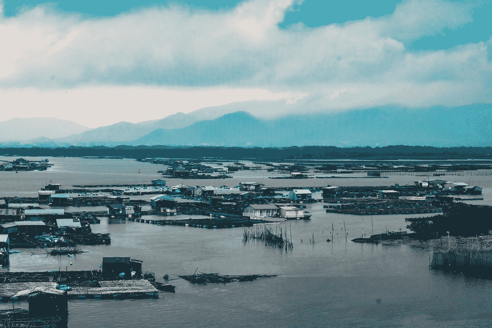
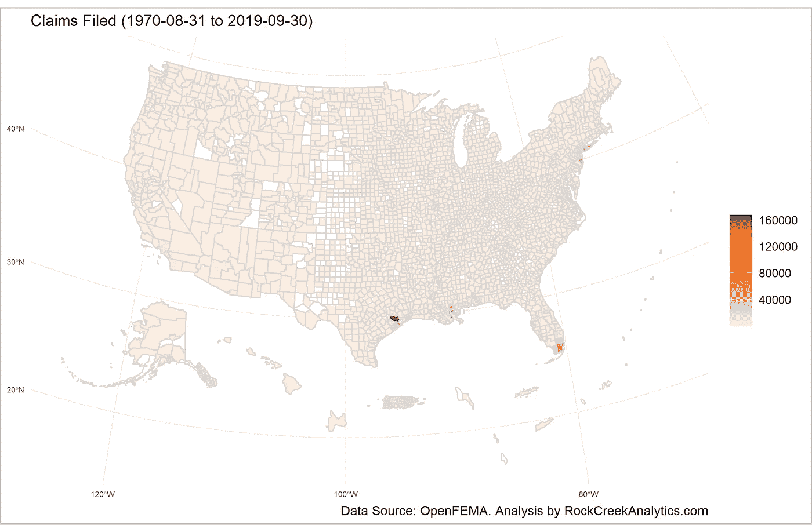
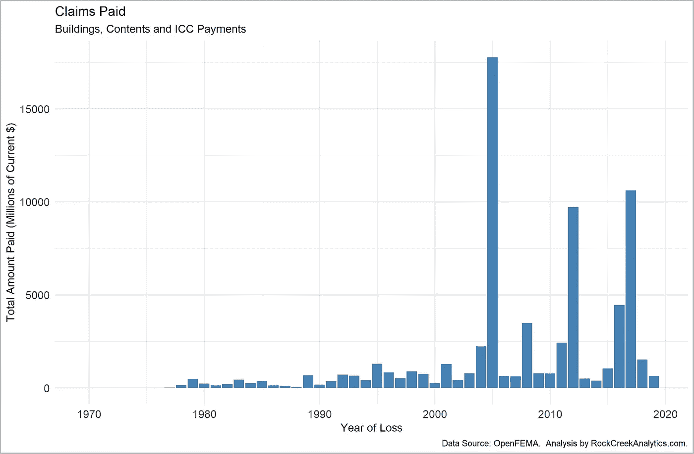
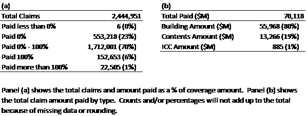
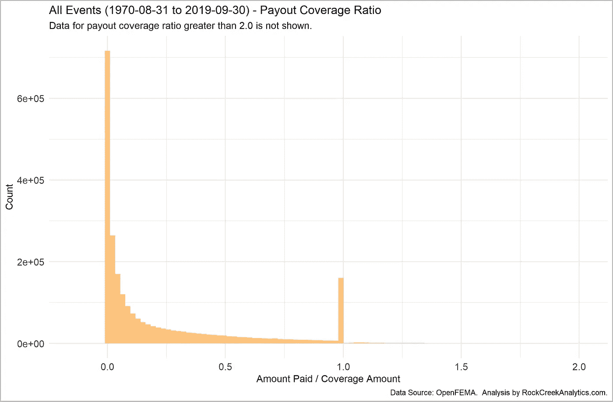
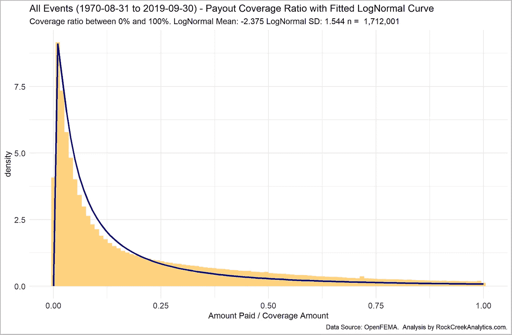
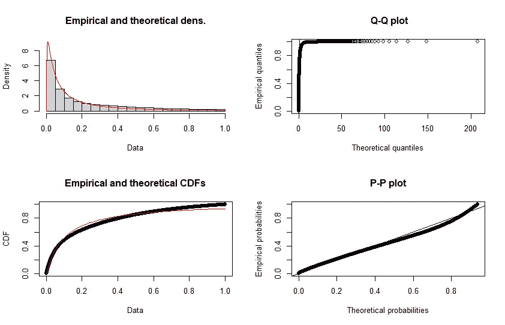

# 洪水保险索赔支出建模

> 原文：<https://medium.com/analytics-vidhya/modeling-flood-insurance-claim-payouts-2b549fe72eda?source=collection_archive---------14----------------------->

美国的洪水保险计划由联邦紧急事务管理局通过国家洪水保险计划进行管理。在本文中，我们回顾了 1970 年至 2019 年期间提交的索赔，并研究了如何对索赔支付进行建模。我们从全球层面和单个事件层面来看待索赔。我们提出了一种方法来模拟赔付率，并表明对数正态分布提供了一种合理的选择来模拟总保单承保水平的 0%和 100%之间的赔付。

照片由[阮杰](https://unsplash.com/@kietbeo778?utm_source=medium&utm_medium=referral)在 [Unsplash](https://unsplash.com?utm_source=medium&utm_medium=referral) 上拍摄

# 一.导言

这篇文章介绍了在美国提出的洪水保险索赔。美国的洪水保险计划由联邦紧急事务管理局(FEMA)通过国家洪水保险计划(NFIP)进行管理。个人保单的管理是通过一个由大约。60 家保险公司和 NFIP 直接[1]。在本文中，我们回顾了 1970 年至 2019 年期间提交的索赔，并研究了如何对索赔支付进行建模。

我们从全球层面和个别事件层面来看待索赔。而单个财产可能由于多种原因(常规降雨、与飓风相关的降雨、河流或海岸洪水等)而遭受洪水损坏。)，大规模洪水破坏通常是由极端天气事件引起的，如飓风或暴雨导致河流泛滥。在本文中，在分析离散事件的同时，我们将重点关注与单个飓风相关的事件。

虽然本文中提供的示例和网站参考是以美国为中心的，但这里提出的想法是通用的，可以应用于所有地方。在其他地区和国家，分析师需要用适当的数据源替代洪水保险索赔数据。

# 二。数据源

NFIP 在其网站上提供了优秀的汇总级数据作为可下载的电子表格[2]。更详细的数据集可从 OpenFEMA 网站[3]获得。本文中的分析主要依赖于两个数据集:

*   OpenFEMA 数据集:灾难声明摘要-v2[4]。该数据集提供了与单个宣布的灾害相关的日期。
*   OpenFEMA 数据集:FIMA·NFIP 编辑索赔-v1[5]。

来自 OpenFEMA 的数据集是 *csv* 格式，可以使用统计软件轻松处理。OpenFEMA 还在其网站上提供了数据字段的详细描述。请注意，FEMA 和联邦政府不能担保从该机构的网站和/或 Data.gov 检索到的数据或从这些数据中得出的分析。

FIMA·NFIP 修订的索赔数据集提供了每个个人索赔的细节。但是，它没有将索赔与任何具体的灾害事件(如飓风或严重的洪水)联系起来。灾难事件信息可从灾难声明摘要数据集中获得。我们通过将索赔数据集中的县和索赔损失日期与灾难声明数据集中的县和事故开始/结束日期相关联来组合这两个数据集。我们认识到，这一过程可能会遗漏特定灾难事件的一些索赔，或者包含一些不应与特定事件相关联的索赔；然而，我们相信我们仍然能够为绝大多数情况下的索赔分配正确的事件名称。

# 三。分析

在接下来的小节中，我们将概述已提交的索赔、已支付的金额，并考虑一种统计方法来模拟赔付率。该分析基于前面讨论的数据集，并由作者在 2020 年 9 月下载。

## 3.1 概述

自 1970 年以来，美国已经提交了超过 240 万份洪水保险索赔，NFIP 已经为这些索赔支付了超过 700 亿美元。这些索赔已在美国所有州提出，覆盖 95%以上的县。图 1 显示了索赔的地理分布。不出所料，墨西哥湾沿岸和大西洋沿岸的县拥有最多的索赔申请。

图 1:各县提交的洪水保险索赔。

在附录中，我们提供了几个不同飓风事件的类似信息，反映了非常大程度的损害(卡特里娜飓风、桑迪飓风和哈维飓风)、大程度的损害(伊尔玛飓风、艾克飓风和艾琳飓风)和中等程度的损害(马修飓风和艾萨克飓风)。

图 2 显示了过去 50 年来索赔付款总额的演变情况。直到 2000 年代初，支付金额都很低。2005 年出现了一个非常大的峰值，反映了卡特里娜飓风造成的破坏。自那以后，2008 年发生了大规模付款(飓风艾克、飓风汉娜等。)，2012 年(飓风桑迪，飓风艾萨克等。)，2016 年(飓风赫尔明，飓风马修等。)和 2017 年(飓风哈维、飓风伊尔玛等。)

图 2:按年度支付的索赔。

表 1 概述了提出的索赔和为索赔支付的金额。从表中的子图(a)可以看出，大约 23%的索赔没有得到任何赔偿，因为索赔被拒绝或者是重复索赔，或者出于其他原因，大约 6%的索赔得到了 100%的保险金额，少数(大约 1%)得到了超过 100%的保险金额。大多数(大约。70%)获得 0%到 100%的保额。我们将建筑保险范围和内容保险范围相加，以反映总的保险范围。

表 1 的分图(b)显示了按付款类型支付的金额。NFIP 支付的费用有三种类型:建筑费、内容费和增加的合规费用(ICC)费。ICC 保险适用于一些需要“洪水后重建额外帮助的投保人…并提供高达 30，000 美元的费用来帮助支付将降低洪水风险的缓解措施的费用”[5]。如该表所示，大部分付款用于建筑索赔。

附录为单个飓风事件提供了类似的表格——大多数显示了类似的趋势。一个明显的例外是卡特里娜飓风。40%的索赔获得 100%或以上的保险金额。

表 1:所有事件-1970 年 8 月至 2019 年 9 月期间提交的索赔和支付的金额

# 3.2 对支付率建模

就预测未来事件的索赔支付而言，总支付额与总保单承保额的比率(*赔付率*)是一个关键组成部分，因为它定义了索赔人可能从其索赔中获得的金额。使用支付率而不是总支付额，分析师可以将不同时期的多个事件的数据结合起来，因为这可以使房地产价值和通货膨胀的影响正常化。

图 3 显示了所分析的所有索赔的赔付率(为了清楚起见，图中没有显示赔付率超过 2.0 的数据)。与表 1 所示的数据一致，有大量赔付率为 0.0 的索赔，还有大量赔付率为 1.0 的索赔。附录中提供了单个飓风事件的数字，它们显示了类似的模式(卡特里娜飓风除外)。

图 3:所有事件—赔付率。

鉴于数据的特殊性，在 0%和 100%水平上有两个峰值，很难用一个标准的统计分布来拟合数据。解决这一问题的一种方法是只考虑获得 0%到 100%保险金额的索赔。图 4 所示的结果数据遵循一种更易识别的统计分布模式，类似于对数正态分布、威布尔分布或伽马分布。

在测试了一些不同的选项后，我们发现对数正态分布相当好地拟合了数据。对数正态分布是对数正态分布的连续分布(即，如果 *ln(x)* 具有正态分布，则 *x* 具有对数正态分布)。)对数正态分布适用于许多总是为正且具有长的上尾部的量，如降雨量、股票价格、故障次数等。

拟合的对数正态曲线如图 4 所示，拟合结果的细节如图 5 所示。我们还将对数正态分布与单个飓风事件进行了拟合——这些结果显示在附录中——在大多数情况下，曲线拟合得相当好。

图 4:所有事件—符合对数正态分布的赔付范围。

图 5:所有事件—对数正态分布拟合结果。

# 四。关闭

这篇文章概述了美国的洪水保险索赔。我们提出了一种对赔付率进行建模的方法，并表明对数正态分布提供了一种合理的选择，可以对 0%到 100%的保单承保金额之间的赔付进行建模。

这一发现与保险索赔模型的研究是一致的。Hewitt 和 Lefkowitz [6]描述了使用五种不同的分布(伽玛、对数伽玛、对数正态、伽玛+对数伽玛和伽玛+对数正态)来拟合保险损失数据。Zuanetti *等*【7】*描述了保险理赔数据的对数正态模型的统计细节。Tiwari [8]提供了使用广义线性模型对索赔频率建模的概述。David 和 Jemna [9]展示了泊松和负二项分布如何用于汽车保险索赔建模。常*等人*【10】建议使用泊松分布来模拟单个台风/洪水事件的发生。*

*请注意，洪水索赔建模中的一个重要考虑因素是，对于大规模事件(如飓风后发生的事件)，单个索赔不一定相互独立(例如，整个社区的洪水)。因此，分析师应该小心使用一些假设独立索赔的统计分布(如泊松分布)。*

# *参考*

*[1] *国家洪水保险计划*。联邦紧急事务管理局。https://www.fema.gov/flood-insurance[。
【2】*洪水保险分析报告和数据*。美国国家洪水保险计划。](https://www.fema.gov/flood-insurance)[https://nfipservices . flood smart . gov/reports-flood-insurance-data](https://nfipservices.floodsmart.gov/reports-flood-insurance-data)。
【3】*open FEMA*。联邦应急管理局首席信息官办公室。[https://www.fema.gov/about/reports-and-data/openfema](https://www.fema.gov/about/reports-and-data/openfema)
【4】*open FEMA 数据集:灾难声明摘要— v2* 。联邦应急管理局首席信息官办公室。[https://www . FEMA . gov/open FEMA-data-page/disaster-declarations-summaries-v2](https://www.fema.gov/openfema-data-page/disaster-declarations-summaries-v2)。2020 年 9 月接入。
[5] OpenFEMA 数据集:FIMA·NFIP 修订声明— v1。联邦应急管理局首席信息官办公室。[https://www . FEMA . gov/open FEMA-data-page/fima-nfip-redated-claims-v1](https://www.fema.gov/openfema-data-page/fima-nfip-redacted-claims-v1)。2020 年 9 月接入。
[6]小查尔斯·休伊特和本杰明·莱夫科维茨。*保险损失数据的分布拟合方法*。在 1979 年 11 月的伤亡保险精算学会会议上发表的论文。[https://www.casact.org/pubs/proceed/proceed79/79139.pdf](https://www.casact.org/pubs/proceed/proceed79/79139.pdf)[7]祖阿内蒂、迪尼茨和莱特。保险索赔数据的对数正态模型。统计杂志。第 4 卷第 2 期，2006 年 6 月。[https://www.ine.pt/revstat/pdf/rs060203.pdf](https://www.ine.pt/revstat/pdf/rs060203.pdf)。
【8】阿贾伊·蒂瓦里。*建模保险索赔频率*。[https://medium . com/swlh/modeling-insurance-理赔-频率-a776f3bf41dc](/swlh/modeling-insurance-claim-frequency-a776f3bf41dc) 。2020 年 9 月接入。
[9]戴维和杰姆纳。*通过泊松和负二项式模型对汽车保险索赔频率进行建模*。经济和商业科学年鉴 62(2):151–168。2015 年 7 月。[https://content . science do . com/view/journals/ai cue/62/2/article-p151 . XML](https://content.sciendo.com/view/journals/aicue/62/2/article-p151.xml)。
[10]陈清，许文子，和苏明道。*台湾洪水风险与洪水保险项目建模*。农业与应用经济学协会 2008 年年会。[https://ideas.repec.org/p/ags/aaea08/6141.html](https://ideas.repec.org/p/ags/aaea08/6141.html)。*

*从这里下载论文的完整副本(包括附录):[http://www . rockcreekanalytics . com/analysis-of-flood-insurance-claims/](http://www.rockcreekanalytics.com/analysis-of-flood-insurance-claims/)*