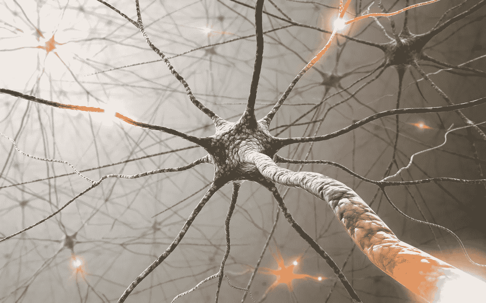

# 基于潜在狄利克雷分配的主题建模

> 原文：<https://medium.com/analytics-vidhya/modeling-with-latent-dirichlet-allocation-3b198f1a7bae?source=collection_archive---------2----------------------->

在现代互联网和社交媒体时代，人们的意见、评论和建议已经成为政治科学和商业的宝贵资源。由于现代技术，我们现在能够最有效地收集和分析这些数据。



我们将深入研究**情感分析**，并学习如何使用主题建模将电影评论归类到不同的类别。我们将使用来自互联网的 50，000 条电影评论的数据集**电影数据库(IMDb)** 。

*本文节选自 Sebastian Raschka 和 Vahid Mirjalili 的《Python 机器学习* [*第三版*](https://www.amazon.com/Python-Machine-Learning-scikit-learn-TensorFlow/dp/1789955750?utm_source=AnalyticsVidhya&utm_medium=referral&utm_campaign=Outreach_PEN) *一书。这本书是用 Python 进行机器学习和深度学习的综合指南。这个新的第三版针对 TensorFlow 2.0、GANs、强化学习和其他流行的 Python 库进行了更新。在本文中，我们将讨论一种流行的主题建模技术，称为潜在狄利克雷分配(LDA)。*

**主题建模**描述了将主题分配给未标记文本文档的广泛任务。例如，一个典型的应用是对报纸文章的大型文本语料库中的文档进行分类。在主题建模的应用中，我们的目标是为这些文章分配类别标签，例如，体育、金融、世界新闻、政治、本地新闻等等。因此，在机器学习的广泛类别的背景下，我们可以将主题建模视为聚类任务，这是无监督学习的一个子类。

# 用 LDA 分解文本文档

由于 LDA 背后的数学是相当复杂的，并且需要贝叶斯推理的知识，我们将从从业者的角度来处理这个话题，并且用外行的术语来解释 LDA。然而，感兴趣的读者可以在下面的研究论文中读到更多关于 LDA 的内容:Latent Dirichlet Allocation，David M. Blei，Andrew Y. Ng 和 Michael I. Jordan，Journal of Machine Learning Research 3，pages:993–1022，Jan 2003。

LDA 是一个生成概率模型，它试图找到在不同文档中频繁出现的单词组。这些频繁出现的单词代表我们的主题，假设每个文档都是不同单词的混合。LDA 的输入是我们在本章前面讨论的单词袋模型。给定一个单词袋矩阵作为输入，LDA 将其分解成两个新矩阵:

文档-主题矩阵

词到主题矩阵

LDA 以这样一种方式分解单词袋矩阵，如果我们将这两个矩阵相乘，我们将能够以尽可能低的误差再现输入，单词袋矩阵。实际上，我们感兴趣的是 LDA 在词袋矩阵中发现的那些主题。唯一的缺点可能是我们必须预先定义主题的数量——主题的数量是 LDA 的一个超参数，必须手动指定。

# 带 scikit 的 LDA 学习

在这一小节中，我们将使用 scikit-learn 中实现的***LatentDirichletAllocation***类来分解电影评论数据集，并将其分类到不同的主题中。在下面的示例中，我们将分析限制在 10 个不同的主题，但是鼓励读者试验算法的超参数，以进一步探索可以在该数据集中找到的主题。

首先，我们将使用本章开始时创建的电影评论的本地 ***movie_data.csv*** 文件将数据集加载到熊猫 ***DataFrame*** 中:

```
import pandas as pd
df = pd.read_csv(‘movie_data.csv’, encoding=’utf-8')
```

接下来，我们将使用已经熟悉的 ***计数矢量器*** 来创建单词袋矩阵作为 LDA 的输入。为了方便起见，我们将通过***stop _ words = ' English '***使用 scikit-learn 的内置英语停用词库:

```
from sklearn.feature_extraction.text import CountVectorizercount = CountVectorizer(stop_words=’english’, max_df=.1, max_features=5000)
X = count.fit_transform(df[‘review’].values)
```

注意，我们将要考虑的单词的最大文档频率设置为 10%(***max _ df = . 1***)，以排除在文档中出现频率过高的单词。移除频繁出现的单词的基本原理是，这些单词可能是出现在所有文档中的常见单词，因此不太可能与给定文档的特定主题类别相关联。此外，我们将被考虑的单词的数量限制为最频繁出现的 5000 个单词(***max _ features = 5000***)，以限制该数据集的维度，从而改进 LDA 执行的推理。但是 ***max_df=.1*** 和***max _ features = 5000***都是任意选择的超参数值，鼓励读者在比较结果的同时进行调优。

下面的代码示例演示了如何将***LatentDirichletAllocation***估计器拟合到单词袋矩阵，并从文档中推断出 10 个不同的主题(注意，在笔记本电脑或标准台式计算机上，模型拟合可能需要 5 分钟或更长时间):

```
from sklearn.decomposition import LatentDirichletAllocation
lda = LatentDirichletAllocation(n_components=10,
random_state=123, learning_method=’batch’)
X_topics = lda.fit_transform(X)
```

通过设置***learning _ method = ' batch '***，我们让 ***lda*** 估计器在一次迭代中基于所有可用的训练数据(词袋矩阵)进行估计，这比替代的' ***在线*** '学习方法慢，但可以导致更准确的结果(设置***learning _ method = ' online '***类似于在线或小批量学习)。

在拟合 LDA 之后，我们现在可以访问 ***lda*** 实例的 ***components_*** 属性，该属性存储了一个矩阵，其中包含按升序排列的 10 个主题中的每一个主题的单词 importance(此处为 ***5000*** ):

`lda.components_.shape` *(10，5000)*

为了分析结果，让我们为 10 个主题中的每一个打印五个最重要的单词。请注意，单词重要性值按升序排列。因此，要打印前五个单词，我们需要以相反的顺序对主题数组进行排序:

```
n_top_words = 5
feature_names = count.get_feature_names()
for topic_idx, topic in enumerate(lda.components_):
  print(“Topic %d:” % (topic_idx + 1))
  print(“ “.join([feature_names[i]
  for i in topic.argsort()
    [:-n_top_words — 1:-1]]))
```

*话题 1:
最差分钟烂剧本蠢
话题 2:
家庭母亲父亲孩子女孩
话题 3:
美国战争 dvd 音乐电视
话题 4:
人类观众影院艺术感
话题 5:
警察小伙汽车撞死人命案
话题 6:
恐怖屋云雨女
话题 7:
角色表演喜剧演员表演
话题 8:
系列剧集战争插曲*

根据阅读每个主题的五个最重要的单词，您可能会猜测 LDA 确定了以下主题:

1.  一般来说，糟糕的电影(不是真正的主题类别)
2.  关于家庭的电影
3.  战争电影
4.  艺术电影
5.  犯罪电影
6.  恐怖电影
7.  喜剧电影
8.  与电视节目有某种联系的电影
9.  根据书改编的电影
10.  动作电影

为了确认基于评论的分类是有意义的，让我们从恐怖电影类别中绘制三部电影(恐怖电影属于索引位置 ***5*** 处的类别 6):

```
horror = X_topics[:, 5].argsort()[::-1]
for iter_idx, movie_idx in enumerate(horror[:3]):
  print(‘\nHorror movie #%d:’ % (iter_idx + 1))
  print(df[‘review’][movie_idx][:300], ‘…’)
```

*恐怖电影#1:
《德拉库拉之家》与前年的《弗兰肯斯坦之家》的基本前提相同；即宇宙中最著名三个怪物；德古拉、弗兰肯斯坦的怪物和狼人一起出现在电影中。自然，这部电影因此相当混乱，但事实是…*

*恐怖电影#2:
好吧，我现在到底在看什么狗屁垃圾？《魔女之山》是有史以来最不连贯、最疯狂的西班牙剥削电影之一，然而，与此同时，它也奇怪地引人注目。这里绝对没有任何有意义的东西，我甚至怀疑那里……*

*恐怖电影# 3:
<br/><br/>恐怖电影时间，日式风格。Uzumaki/Spiral 从开始到结束完全是一场闹剧。这是一个有趣的节日，但有时它太依赖于媚俗而不是恐怖。这个故事很难简明扼要地概括:一个无忧无虑的普通少女开始走向 fac …*

使用前面的代码示例，我们打印了前三部恐怖电影中的前 300 个字符。这些评论——尽管我们不知道它们具体属于哪部电影——听起来像是对恐怖电影的评论(然而，有人可能会认为 ***恐怖电影#2*** 也很适合主题类别 1:一般是糟糕的电影)。

# 摘要

在这篇文章中，我们看了机器学习的一个特殊应用，情感分析，这已经成为互联网和社交媒体时代的一个有趣的话题。我们被引入主题建模的概念，使用 LDA 以无监督的方式将电影评论分类到不同的类别中。 [*Python 机器学习，第三版*](https://www.packtpub.com/in/data/python-machine-learning-third-edition?utm_source=AnalyticsVidhya&utm_medium=referral&utm_campaign=Outreach_PEN) 是用 Python 进行机器学习和深度学习的综合指南。

**关于作者**

Sebastian Raschka 拥有多年的 Python 编码经验，他举办过几次关于数据科学、机器学习和深度学习的实际应用的研讨会，包括在 SciPy(Python 科学计算的领先会议)上的机器学习教程。他目前是 UW 大学统计学助理教授，专注于机器学习和深度学习研究。

他的工作和贡献最近获得了 2016-2017 年度部门杰出研究生奖以及 ACM Computing Reviews 的 2016 年度最佳奖。在空闲时间，Sebastian 喜欢为开源项目做贡献，他实现的方法现在已成功用于机器学习竞赛，如 Kaggle。

Vahid Mirjalili 获得了机械工程博士学位，研究大规模分子结构计算模拟的新方法。目前，他正在密歇根州立大学计算机科学与工程系重点研究机器学习在各种计算机视觉项目中的应用。

虽然 Vahid 的广泛研究兴趣集中在深度学习和计算机视觉应用上，但他特别感兴趣的是利用深度学习技术来扩展生物数据(如人脸图像)的隐私，以便信息不会超出用户打算透露的范围。此外，他还与一个研究自动驾驶汽车的工程师团队合作，在那里他设计了用于行人检测的多光谱图像融合的神经网络模型。