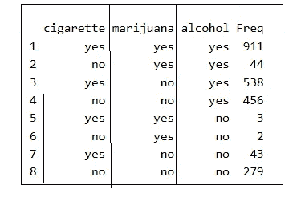
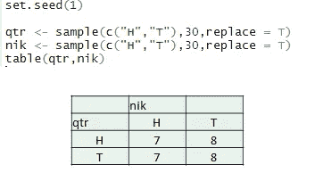
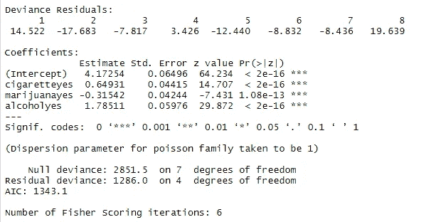
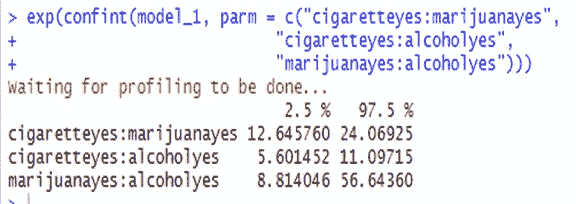

# 建模计数

> 原文：<https://medium.com/analytics-vidhya/modelling-counts-4da041c12583?source=collection_archive---------36----------------------->

如何对调查响应(计数)数据进行建模？

调查是数据收集的重要方式之一，有助于评估目标用户的想法、意见和感受。我们可以用列联表的形式来表示这一点。

列联表也称为双向频率表，在统计学中用于总结几个分类变量之间的关系。它是一种表格机制，在统计中至少使用两行和两列，以频率计数的形式呈现分类数据。更准确地说，r×c 列联表显示了两个变量的观测频率，它们的观测频率排列成 r 行和 c 列。列联表的一行和一列的交集称为一个单元。

2*3 列联表示例

例如，上面的列联表有两行和三列(不包括标题行/列),显示了 2000 名成年人随机抽样的结果，按两个变量分类，即性别和最喜欢的冰淇淋口味。列联表的好处是它允许我们容易地进行基本的概率计算。

如何对这些信息建模？

对数线性模型可用于对此类数据建模。对数线性模型属于计数数据的广义线性模型(GLMs)家族。它与其他建模方法有点不同，因为它们不区分目标/响应和解释/独立变量。对数线性模型中的所有变量本质上都是响应。

它用于列联表中单元计数的建模。这些模型指定了单元格计数的大小如何依赖于该单元格的分类变量的级别。它们有助于描述一组分类反应变量之间的关联模式。

为了更好地理解对数线性模型，我们将探究来自 Agresti (1996)的以下数据。它总结了在一个特定城市进行的关于他们是否曾经使用过酒精、香烟或大麻的调查的回答。

调查答复摘自 Agresti (1996 年)

如果我们想将大麻的使用建模为酒精和香烟使用的函数，我们可以使用逻辑回归。但在这种情况下，我们想要了解所有三个变量之间的关系，而没有一个被标记为响应变量，那么我们可以尝试对数线性模型。

数据探索:

在进行建模之前，我们将研究这些数据。共有 2276 人参加了调查，其中大多数人都尝试过饮酒。我们看到，在那些尝试过烟酒的人中，62%也尝试过大麻。同样，没有尝试香烟或酒精的人，99%也没有尝试大麻。这里显然有某种关系。

数据探索

如何应用对数线性模型？

现在我们可以应用对数线性模型。我们可以在 R 中使用 glm 函数，为此我们需要将数据转换成数据帧，如下所示

在继续之前，我们将借助一个小例子来了解边际概率和联合概率，以及为什么该模型被称为对数线性模型:

如果我们将一枚 25 美分硬币翻转 30 次，将一枚 5 美分硬币翻转 30 次，并将结果记录在下面的 2 x 2 列联表中。

2*2 翻转列联表

由于硬币是公平和独立的，因此可以合理地预期细胞计数将大致相等(每个细胞大约 7.5)。事实上，当两个分类变量独立时，我们可以使用它们的边际概率来计算它们的联合概率。在我们的例子中，每个硬币正面和反面的边际概率是 0.5。联合概率是表中特定结果的概率。比如两个硬币落地头的概率都是 0.5 * 0.5 = 0.25。为了得到预期的细胞计数，我们将该概率乘以试验次数。在我们的例子中，就是 30 * 0.25 = 7.5。在我们的模拟中，我们有 8 个。

我们可以用符号来概括:μij=nπiπj

这表示第 I 行和第 j 列中的细胞数等于边际概率和观察次数的乘积。我们这里有一个很好的小模型，它描述了一个单元格计数如何依赖于行和列变量，前提是行和列变量是独立的。如果我们取两边的对数，它就成了加法(线性)

log⁡μij=log⁡n+log⁡πi+log⁡πj

这种特殊的模型被称为双向列联表的对数线性独立模型。如果我们的两个变量不是独立的，这个模型就不能很好地工作。在我们的模型中，我们需要一个额外的参数来允许这两个变量相互作用。我们通常称之为相互作用项或高阶项。在对数线性模型中，这些通常是我们感兴趣的。它们允许我们确定这两个变量是如何相互关联的。

让我们继续我们的调查数据，这是一个三向列联表

应用模型的 r 代码

输出

这里我们使用 Freq 作为 3 个变量和 family = poisson 的函数，因为我们正在模拟计数。

这就是所谓的独立模式。它假设这三个变量相互独立，这似乎不太可能。查看摘要，由于系数非常重要，该模型看起来不错。但是对于对数线性模型，我们需要检查剩余偏差。根据经验，我们希望它的值接近自由度。这里我们有 4 个自由度的 1286。这表明不适合。通过比较拟合值和观测值，我们可以更直观地进行分析。

拟合值与观察值

拟合的模型与观测值不接近。我们看到 2 个人尝试过大麻，但我们的模型显示是 47 人。

我们可以拟合一个允许变量相互作用/关联的复杂模型，如下所示

变量双向交互的模型

这种模式似乎更适合。拟合这个模型意味着我们为变量的每一个两两组合添加交互作用。与自由度 1 相比，剩余偏差为 0.37399。我们可以再次比较拟合值和观察值。

拟合值与观察值(双向互动模型)

现在，拟合值更接近观察值。

如何描述变量之间的关联？一个变量对另一个变量的影响是什么？

我们可以看看相互作用的系数来理解这种联系。通过对系数求幂，我们得到优势比。例如，让我们看看“香烟:酒精”的系数。尝试过香烟的人估计尝试过酒精的几率是不尝试香烟的人的 8 倍。

让步比

我们也可以用约束函数来计算这些估计的置信区间。

置信区间

这些关联都非常强烈。我们发现，尝试过香烟的人尝试大麻的几率比没有尝试过香烟的人尝试大麻的几率至少高 12 倍，反之亦然。

我们还可以建立一个三方互动的模型。这允许成对关联根据第三个变量的水平而改变。

变量三向交互的模型

这个模型的偏差基本上是 0 自由度上的 0。拟合计数与观察计数相匹配。我们可以再次比较拟合值和观察值

拟合值与观察值(三向互动模型)

现在，拟合值与观察值完全相同。结果可能会过拟合，因为这是一个饱和模型。然而，拟合饱和模型来验证高阶相互作用在统计上不显著是有用的。我们可以使用方差分析来比较不同模型之间交互作用的显著性

对数线性模型也可以扩展到更多的维度。当相互作用涉及 3 个或更多变量时，对它们的解释就变得复杂得多。

参考资料:

*   [https://mathworld.wolfram.com/ContingencyTable.html](https://mathworld.wolfram.com/ContingencyTable.html)
*   [https://data . library . Virginia . edu/an-introduction-to-log linear-models/](https://data.library.virginia.edu/an-introduction-to-loglinear-models/)
*   分类数据分析导论