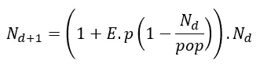
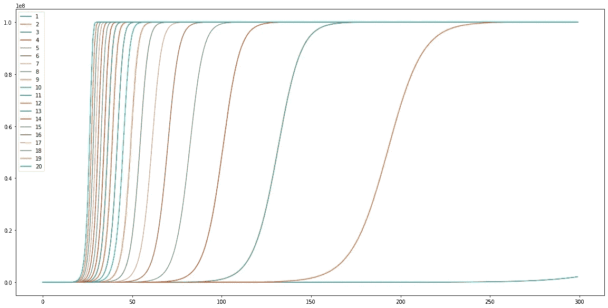
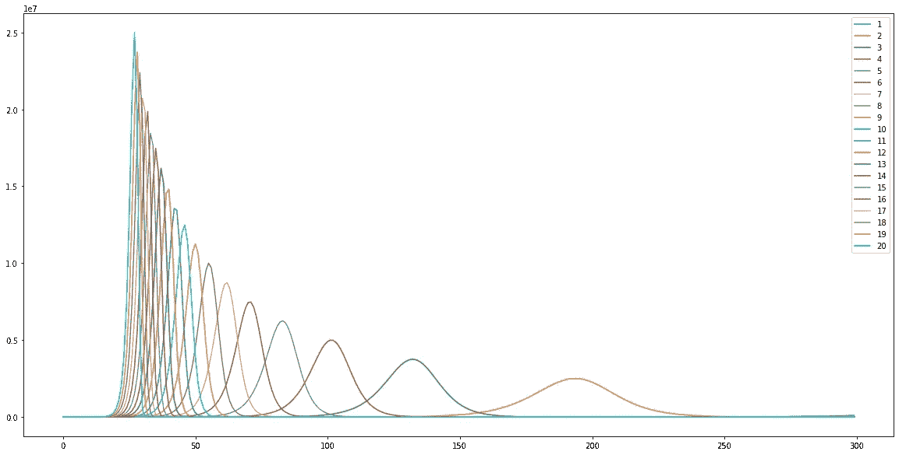
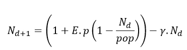
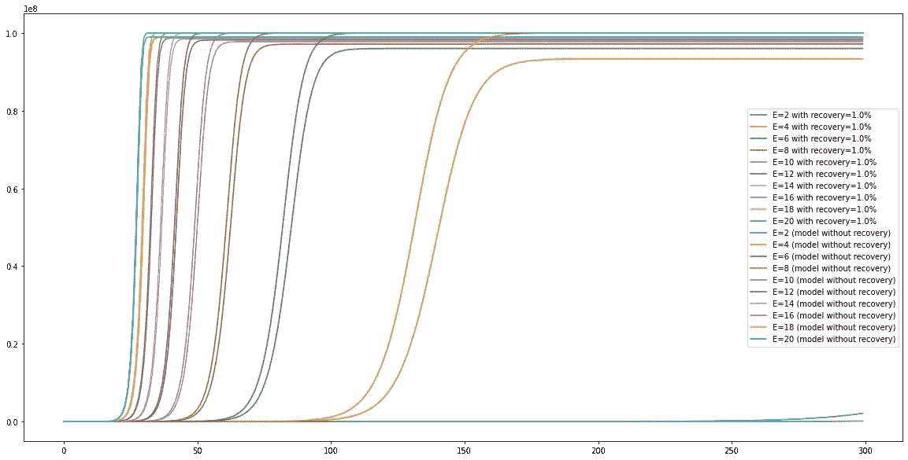

# 使用 Python 中的逻辑模型模拟疾病传播

> 原文：<https://medium.com/analytics-vidhya/modelling-disease-spread-using-a-logistic-model-in-python-c14e5755efc?source=collection_archive---------26----------------------->

# COVID 19 的简化流行病模型

第 n+1 天的感染计算如下



*N_d* 为当前感染人群，pop 为总易感人群， *E* 为每天接触感染者的人数， *p*
为接触者染上该病的概率。

(1-N_d/pop)因子表明，随着越来越多的部分被暴露，被暴露的新人“未被感染”的概率下降。

假设以下情况:

```
*# Number people exposed to an infected person (E)*
E = 1
*# Probablity that an exposed person catches on the disease*
p = 0.05
*# Total population Size (set at 100 million)*
pop = 1e8
*#Total Infections by day (starts by 1 person getting infected)*
```

# 绘制暴露的影响

这些是“暴露人数，E”的各种数值。每条线代表一定的 E 值，最左边的是 20 个人每天相互接触，最右边的是 1 个人每天接触。巨大的差异。

```
E = 1
**for** j **in** range(20):
    **for** i **in** range(1,300): *#100 days*
        N_d[i] = (1+ E*p*(1-N_d[i-1]/pop))*N_d[i-1]
    E= E+1
    plt.plot(N_d, label= E-1)
*#plt.yscale('log')*
plt.legend()
plt.show()
```



# 每天新增病例的数量

这可以建模为上面曲线的梯度。这就是“拉平曲线”的含义。比较 E =1(最右边)和 E = 20(最左边)

```
E = 1
del_d = np.zeros(300)
**for** j **in** range(20):
    **for** i **in** range(1,300): *#100 days*
        N_d[i] = (1+ E*p*(1-N_d[i-1]/pop))*N_d[i-1]
        del_d[i] = N_d[i] - N_d[i-1]
    E= E+1
    plt.plot(del_d, label= E-1)
*#plt.yscale('log')*
plt.legend()
plt.show()
```



# 以 1%的人口回收率建模

这也模拟了康复(每天有 1%的受感染人群康复/死亡，因此不再被感染)。设γ为回收率。



```
R = 0.01
E = 1
p = 0.05
**for** j **in** range(10):
    **for** i **in** range(1,300): *#100 days*
        N_d[i] = (1+ E*p*(1-N_d[i-1]/pop))*N_d[i-1] - R*N_d[i-1]
    E= E+2
    plt.plot(N_d, label= "E=" + str(E-1)+" with recovery="+str(100*R) +"%")
*#plt.yscale('log')*

R = 0.01
E = 1
p = 0.05
**for** j **in** range(10):
    **for** i **in** range(1,300): *#100 days*
        N_d[i] = (1+ E*p*(1-N_d[i-1]/pop))*N_d[i-1] *#- R*N_d[i-1]*
    E= E+2
    plt.plot(N_d, label= "E=" + str(E-1)+" (model without recovery)")

plt.legend()
plt.show()
```



大家注意安全。保持 E 低，那是你唯一能控制的变量。