# 模拟疫情

> 原文：<https://medium.com/analytics-vidhya/modelling-the-pandemic-bc7766d47f9?source=collection_archive---------32----------------------->

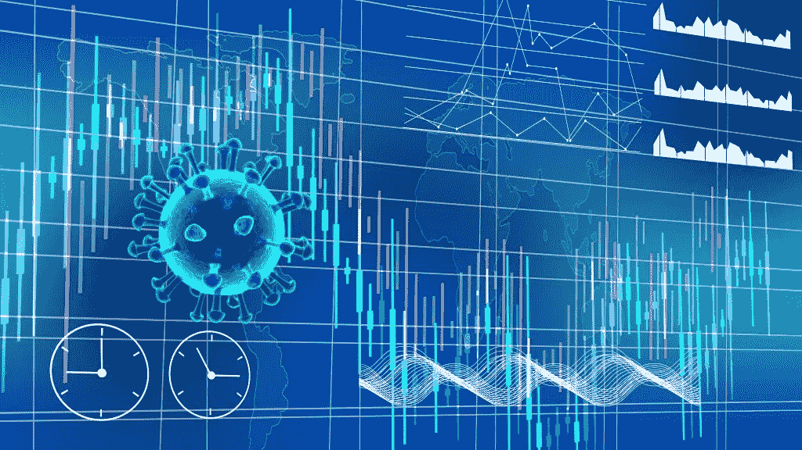

# **简介**

对像新冠肺炎这样的大流行的预测是基于疫情房室模型，该模型描述了传染病的传播机制。虽然有人试图使用流行病学方法提出病毒产物扩散模型，但这里所做的尝试是使用产物扩散模型来预测新冠肺炎疫情在印度的传播。

印度于 2020 年 1 月 30 日报告了首例 2019-20 冠状病毒或新冠肺炎疫情病例，该病例来自武汉。该国报告了喀拉拉邦的头三例病例，他们都是从中国武汉返回的学生(*天气频道，* 2020)。在全国各地报告了几起病例后，传播在 3 月份升级，其中大多数病例与有受影响国家旅行史的人有关。3 月 10 日，病例总数达到 50 例。3 月 12 日，一名从沙特阿拉伯返回的 76 岁男子成为该国第一个病毒受害者。(*《印度斯坦时报》*，2020)确诊病例 3 月 15 日突破 100 例，3 月 24 日突破 500 例，3 月 28 日突破 1000 例，4 月 2 日突破 2000 例(*今日印度*，2020)。

截至 2020 年 4 月 3 日 IST 时间 09:00(格林尼治时间+5:30)，印度政府卫生和家庭福利部已确认该国共有 2，301 例病例，157 例康复(包括 1 例迁移)和 56 例死亡。(*卫生和家庭福利部*，2020)。一些专家认为，感染人数可能被大大低估了，因为印度的检测率是世界上最低的。( *BBC* ，2020)。

2020 年 3 月 22 日，应总理纳伦德拉·莫迪的全国电视请求，印度实行了 14 小时自愿公共宵禁。政府采取后续行动，封锁了发生 COVID 病例的 75 个县以及所有主要城市。此外，3 月 24 日，总理下令全国封锁 21 天，影响到印度全部 13 亿人口。(*独立*，2020)

世界卫生组织(who)执行董事迈克尔瑞安(Michael Ryan)表示，印度拥有应对冠状病毒爆发的“巨大能力”，作为人口第二多的国家，将对世界应对冠状病毒的能力产生巨大影响。(*《经济时报》*，2020 年)

# **建模传播**

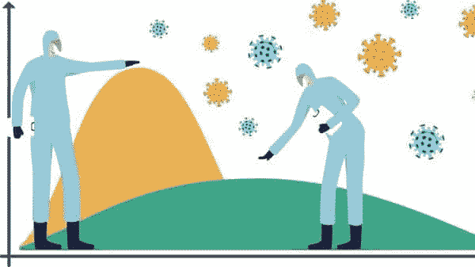

新冠肺炎病毒的传播是一个复杂的过程。大多数预测都是基于 Kermack 和 McKendrick (1927)提出的描述传染病传播机制的流行病房室模型。

实际上，应该用更多的指标来评估新冠肺炎感染的传播，例如新冠肺炎感染的传播和为控制新冠肺炎感染而采取的预防措施。这可以更准确地评估新冠肺炎感染在该国的传播情况。然而，随着模型中使用的变量增加，评估、理解和使用模型的复杂性也增加。

市场营销有相当多的预测模型(Mahajan，Muller 和 Wind，2000)，但没有什么能打败 Bass 模型(Bass，1969；巴斯，克里希南和贾恩，1994；Bass，2004)——在预测耐用消费品的采用方面，它优雅、简单且准确。关于 Bass 模型及其扩展，有数百篇学术文章。事实上，这篇发表于 1969 年的论文是《管理科学》上发表的被引用次数最多的十篇文章之一。

虽然有人试图使用流行病学方法提出病毒产品扩散模型(蒋，阎和王，2017)，但本文尝试使用产品扩散模型来预测疫情在印度的传播。

# 人口规模、感染人数和累计感染人数

印度有 13 亿人口，理论上，他们每个人都是新冠肺炎感染的潜在受害者。因此，我们将假设有一个固定的潜在感染人口规模。我们将这个受害者的尺寸称为 m。

当传染病第一次袭击所有 T2 人时，他们都是潜在的受害者。随着越来越多的人被感染，越来越少的人会被感染。(这里我们假设没有人会感染新冠肺炎病毒两次，每个人最多会感染一次。)为了对这种影响进行建模，我们将感染定义为 *S* ，并认识到感染将作为时间的函数而变化 *t* 。我们还将累积感染定义为 *Y* ，并认识到它也是时间的函数。那就是:

m =能抓到新冠肺炎的总人数

S ( *t* ) =第*t*天抓到新冠肺炎的人数

Y ( *t* ) =截至第*t*天(含)抓到新冠肺炎的总人数

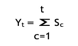

我们有以下简单的结构定义。到第 *t* 天为止(包括第 *t* 天)的累计感染人数是所有感染人数的总和。

我们可以用下面的等式来计算尚未被感染的人数。还没有被感染的，简单来说就是人群中的人， *m* ，减去已经被感染的， *Y* ( *t* )。

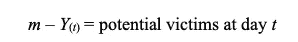

# **感染和易感性**

当新冠肺炎病毒第一次发作时，有些人非常接近感染源。由于无知而暴露于新冠肺炎病毒感染的这些人，将会自己感染，而不知道其他感染者。我们称这些人为“无知易感性”数学上，我们说存在某种“无知-易感性”比率。我们可以通过隔离等遏制措施来影响 T2。因此，我们有:

无知导致的感染率占尚未感染人群的百分比

然而，“无知易感性”并不是人们被感染的唯一途径。潜在的受害者与感染者接触并感染。这种感染被认为主要是在人与人之间传播——在彼此密切接触的人之间(约 6 英尺内)和/或通过感染者咳嗽或打喷嚏时产生的呼吸道飞沫传播。这些飞沫可以落在附近的人的嘴里或鼻子里，或者可能被吸入肺部。有些人尽管意识到与受感染者进行社会交往的危险，但仍选择放纵鲁莽和粗心的行为，让自己暴露于新冠肺炎病毒。这种“易受影响的”类被称为“易受白痴影响的”类。

注意,“无知易感性”类和“白痴易感性”类中的个体有明显的差异，尽管这些个体都是易感性个体。这些类的主要区别体现在两个方面。首先，前者的形成源于意外事故，后者是粗心行为的结果。第二,“无知-易感”类的个体可能有也可能没有关于感染原因和危害的信息,“白痴-易感”类的个体肯定有更多的信息；他们是否理解是另一回事。

流通中的感染者越多，这些“传播”力量就越强。类似于流行病的传播，我们称这种效应为传染。这里我们称之为“白痴易感性”

为了对“白痴易感性”建模，我们定义了“白痴易感性”效应。特别是， *q* 乘以当前被感染人数占未感染人数的比例决定了新受害者通过“白痴易感性”感染的比率特别是，如果我们将已经感染的人口比例乘以 q，我们就会得到“白痴易感性”比率:

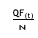

=感染率占尚未感染人群的比例(白痴易感性效应)

我们可以通过社交距离、隔离和孤立等遏制措施来影响 q。

我们简单地将无知导致的感染率和白痴导致的感染率相加，得到总感染率如下:

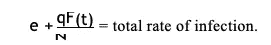

等式 2

# 低音模型

基本的低音模型非常简单。新感染人数就是感染率乘以潜在受害者人数。这给了我们一个新感染的简单等式。我们简单地将等式(1)和(2)结合起来。

第 *t* 天的感染人数=感染率 X 第 *t* 天的潜在受害者人数

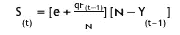

一开始，当感染人数 *Y* ( *t* )与总受害人口 *m* 相比较少时，感染人数会有所增加。受感染的人越多，就意味着“易患白痴症”的可能性越大，因此也就意味着更多的感染。疫情爆发，每个人都过度悲观。

然而，随着累计感染人数 *Y* ( *t* )接近可能被感染的总人数 *m* ，疫情饱和，感染减缓为涓涓细流。

# 适应的低音模型

上面用于模拟传染传播的 Bass 模型假设一旦传染，就永远是传染。这在采用新产品的情况下是正确的，但在像新冠肺炎这样的传染病传播的情况下却不是。

一旦一个人被感染，感染就会有一个结果——从感染中康复或因感染而死亡。因此，在他康复之前，传染病仍然是传染病。每个被感染的人都会有一个结果——治愈或死亡，但结果的比率会受到治疗、医疗护理和从感染之日起达到结果所需时间的影响。

从数学上来说，我们说有一个结果率，这个结果率又可以分为治愈率和死亡率。

因此，我们有:

受感染者达到某一结果的比率

感染结果治愈的速度

感染导致死亡的比率

*O* ( *t* ) =截至第 *t* 天(含)感染新冠肺炎并达到结果(治愈或死亡)的总人数

我们有以下简单的结构定义-

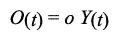

这种公式的效果是，新的受害者通过“白痴易感性”效应感染的比率、已经被感染的人的比例将需要被适当地修改，并由在 *t* 期间被感染的人的比例代替。

特别是， *q* 乘以当前被感染人数占未感染人数的比例，决定了新受害者通过“白痴易感性”感染的比率我们得到了“白痴易感性”的比率:

q(F(t-1)–O(t-1))=感染率占尚未感染人群的比例

n–F(t-1)

被感染(白痴易感性效应)

第 *t* 天的感染人数=感染率 X 第 *t* 天的潜在受害者人数

s =[e+q(Y(t–1)—O(t–1))][n—Y]

(t)n(t–1)

或者

(4) S = [en + (1 — o)qY( )] [1 — F(t — 1)]

(t)t–1 牛

一开始，当感染人数 *Y* ( *t* )与总受害人口 *m* 相比较少时，感染人数会有所增加。受感染的人越多，就意味着“易患白痴症”的可能性越大，因此也就意味着更多的感染。流行病爆发了，每个人要么过于偏执，要么拒绝承认。

然而，过了一段时间后，感染者开始治愈或被感染。因此，每个感染者都有一个结果。“净感染人数”继续增加，但速度在下降，偏执让位于悲观。

然而，随着累计感染人数 *Y* ( *t* )接近可能被感染的总人数 *m* ，疫情饱和，感染减缓。

# 估计自适应 Bass 模型的参数

为了定量地使用 Bass 模型，在预测消费产品的采用时，必须从市场研究数据中估计模型中的三个未知参数， *m* 、 *p* 和 *q* 。在采用 Bass 模型预测流行病传播时，我们引入了一个额外的未知参数 *o* 。

为了定量地使用改进的 Bass 模型，我们必须从实际生活数据中估计出模型中的四个未知参数， *m* 、 *p* 、 *q* 和 *o* 。过去 60 天的感染观察已经可用，因此，回归或最大似然模型提供了参数的估计。

对印度来说，潜在的受害者总数等于其人口总数。因此，

m = 1300000000

在第一例感染发生之前，没有可能开始学术研究。由于新冠肺炎病毒是一个从动物到人类的跳跃，这是一个偶然事件，只是发生了罕见的机会。因此，在感染开始的当天，感染者只有 1。对于 *t* =1

*S*(*t*)=*S*(*1*)= 1，Y ( *t-1* ) = 0

根据等式 4，*S*(*1*)= 1 =*pm*

*或 p =*1/1300000000 =*~*0.000000001。

这可以从数据中重新推断出来，因为印度于 2020 年 1 月 30 日报告了第一例病例，并且感染在 2 月份持续发展。印度政府卫生和家庭福利部更新其网站[www.mohfw.gov.in](http://www.mohfw.gov.in/)

每天至少两次提供新冠肺炎相关病例的最新数据；IST 时间 09:00(格林尼治时间+5:30)和 IST 时间 18:00(格林尼治时间+5:30)。为保持一致性，使用了 IST 时间 09:00(格林威治时间+5:30)更新的数据。

**表 1:在印度感染的早期**

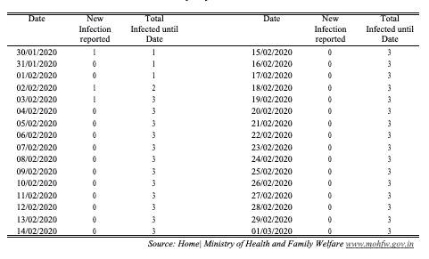

在全国各地报告了几起病例后，传播在 3 月份升级。3 月 10 日，病例总数达到 50 例。3 月 12 日，该国出现了首例因该病毒死亡的病例。

**表 2:印度感染人数首次出现峰值**

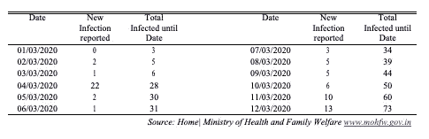

因为在 2020 年 3 月 12 日之前没有“治愈”和“死亡”的报告，所以结果 *O* 没有起作用。等式 3 可以很好地用于估计参数。

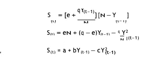

然后使用**表**中的数据通过 OLS 回归估计参数 *a* 、 *b* 和 *c*

**2** 。非线性最小二乘(NLLS)回归模型可以用来拟合数据，但被认为是不必要的。参数 *m* 、 *p* 和 *q* 由下式确定

–b√B2–4ac a

其中，n =

2a e = n，q = — nc = 0.176

**表 3:印度的感染人数**

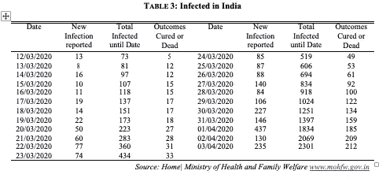

印度的感染人数增加了约 1800 人，其中约 180 例在 3 月 1 日至 31 日期间治愈或死亡。2020 年 3 月 12 日报告了第一个结果。感染、治愈或死亡的人数呈曲线线性增长。从数据中可以看出，每天的死亡率是感染人数的函数，约为 2%。因此，

o =感染者达到结果的比率= 0.020，作为推论，

感染治愈率= 0.015

感染导致死亡的比率= 0.005

# 验证模型

**表 3** 中包含的历史数据用于检查建议模型的有效性。获得的结果列表如下:

**表 4:印度预测和报告的感染人数**

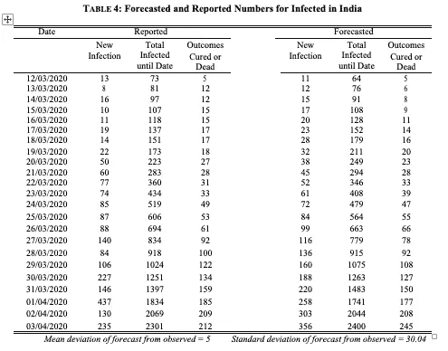

# 讨论

从图 1 中，我们可以看到，在某种意义上，调整后的低音模型已经过测试和验证。随着额外的数据随着时间的推移变得可用，可以通过重新计算微调参数 *q* 和 *o* 以及 *c* 和 *d* 的值来重新校准模型。

该模型设计为保持 *t* = 1 天。这种对可能影响 13 亿人的流行病的微观预测有其自身的缺陷。由于这种疾病在世界其他地区的快速传播以及对每天死亡人数的关注，已经尝试了这种预测。保持 *t* 为一周或者一个月可能更合适。

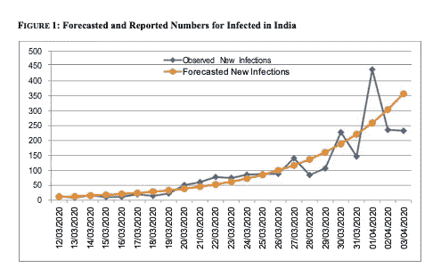

此外，等式 4 是具有离散的、相等的和有限的时间间隔的离散模型。就像 *t* 可以放大一样，也可以缩小到一小时或者一秒。当 *t* 变小时，S(t)和 S(t-1)之间以及 Y(t)和 Y(t-1)之间的差异变得不明显。因此，用 Y(t)代替等式 4 中的 Y(t-1 ),我们得到一个离散的模拟函数:

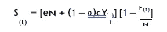

# 收场白

关于各种网络如何影响扩散，已经有了一些有趣的研究。Bass 模型假设了一个被称为随机网络的特别简单的网络——传染效应仅仅基于已经被感染的总人数。然而，还有其他网络，如“无标度”网络和“小世界”网络。在无标度网络中，一些人与许多其他人联系在一起。这些人被称为“节点”，对扩散有重大影响。小世界网络认识到人与人之间有许多“交叉”联系。有一个六自由度的概念，即任何人与其他人之间只有六个连接。这只是一个近似值，但却是一个有趣的效果。

# **参考文献**

注:本文最初由穆库尔·P·古普塔发表