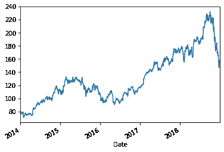
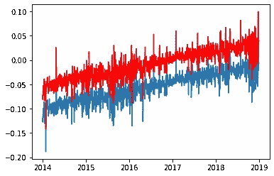

# 股票市场波动模型

> 原文：<https://medium.com/analytics-vidhya/modelling-volatility-for-stock-markets-32d23c502c9f?source=collection_archive---------14----------------------->

现实世界中的金融数据非常不稳定，这意味着方差是变化的，因此我们的 ARIMA 模型不能适用(假设同方差)。自回归条件异方差(ARCH)和广义自回归条件异方差(GARCH)模型克服了这一困难。

具体来说，ARCH 方法将时间步长的方差建模为均值过程(例如零均值)的残差函数。在 GARCH 技术中，必须指定滞后参数来定义要包括在模型中的先前残差的数量。

# 拱形模型

基于长期平均方差和 *m* 观测值的方差估计值。较老的观察值被给予较低的权重。

# GARCH 模型

就像 *ARCH(p)* 是 *AR(p)* 应用于时间序列的方差一样， *GARCH(p，q)* 是 *ARMA(p，q)* 模型应用于时间序列的方差。

移动平均分量的引入允许该模型既模拟随时间变化的条件变化，也模拟随时间变化的变化。例子包括方差的有条件增加和减少。

该模型引入了一个新参数“p ”,用于描述滞后方差项的数量:

**p** :包含在 GARCH 模型中的滞后方差的数量。

**q** :包含在 GARCH 模型中的滞后残差的数量。

G ARCH 模型的一个普遍接受的符号是用参数 GARCH(p，q)指定 GARCH()函数的 *p* 和*q*；例如，GARCH(1，1)将是一阶 GARCH 模型。

GARCH(1，1)模型，

其中 V_L 是长期方差

# GARCH 的应用

在这里，我们试图用 python 对苹果公司过去 5 年(2014 年至 2019 年)的股票市场数据的波动性进行建模。我们正在对可用数据的回报进行预测。

我们可以将这个系列建模为:

其中 *rt* 是一只股票(因变量)在时间 *t* 上的收益。
*σt* 是 *rt* 在时间 *t* 的标准差， *ϵt* 是时间 t 的误差项

对手头数据的一瞥

我们对水平和趋势不感兴趣，使数据保持稳定。

为了识别 GARCH 模型的参数，我们对数据执行自相关和部分自相关。

从图中我们可以假设 p 和 q 的值可以取为 1，分别是图中的第一个峰值。

早些时候发现差异因子 d 为 1。因此，现在我们准备用 GARCH 绘制我们的模型。

拟合模型后的结果

所以现在我们可以从上面的结果中做一些观察。β系数非常接近于 1，但稍低一些。这是我们的硕士学期，因此这是意料之中的。如果β大于 1，小噪声会随着时间的推移而放大。在这种情况下，方差会爆炸到一个无穷大，使得回归变得不可能。因此，就我们模型的波动性而言，我们希望β的绝对值小于 1，但你不能孤立地看待这一项，因为 AR 项也有类似的效果。

ω是模型的基线方差。当过去的方差没有传递给模型时，它是模型的预期方差。所以ω的平方根就是收益的标准差。这个系数表明，回报率的标准差应该在每天 11.09%左右，这是相当不稳定的。

最后，阿尔法项告诉我们前一时期的波动要加到今天的波动中。事实证明，我们不应该期望有太多的结块发生。据此，只有大约 10%的前一天的波动会延续到第二天。

如 mu 系数所示，我们预计每天的回报率约为-4.67%

在数据集上拟合模型之后，可以获得结果。我们可以借助残留物来检查准确性。

上面的图表明我们的模型很好地拟合了数据，红色的残差与实际数据相符。

现在我们的模型已经准备好预测苹果股票的未来价值了。

# 结论

我们现在已经对如何使用 GARCH 技术建模有了一个简单的了解。

点击[此处](https://github.com/Aiswarya-Alapuzha/Time_Series)获取 python 笔记本

本文是孟加拉国普拉西斯商学院 PGPDS 项目的一部分。

暂时就这样吧！

# 参考

1.  https://pyflux.readthedocs.io/en/latest/garch.html
2.  [https://r studio-pubs-static . S3 . Amazon AWS . com/258811 _ b43d 4c 7 bb 2c 74851 b5 b95 f 29 a 09 C5 b 30 . html](https://rstudio-pubs-static.s3.amazonaws.com/258811_b43d4c7bb2c74851b5b95f29a09c5b30.html)
3.  [https://machine learning mastery . com/develop-arch-and-GARCH-models-for-time-series-forecasting-in-python/](https://machinelearningmastery.com/develop-arch-and-garch-models-for-time-series-forecasting-in-python/)
4.  [https://stats . stack exchange . com/questions/61824/how-to-interpret-GARCH-parameters](https://stats.stackexchange.com/questions/61824/how-to-interpret-garch-parameters)