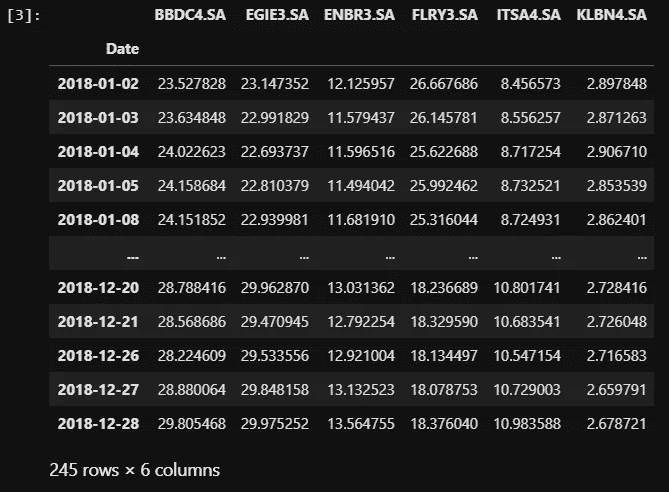
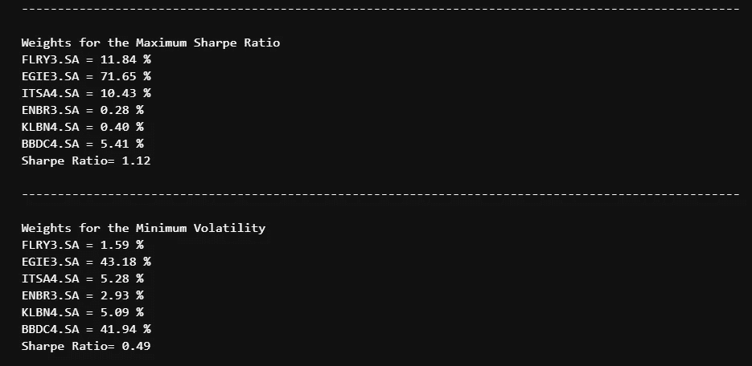

# 现代投资组合理论

> 原文：<https://medium.com/analytics-vidhya/modern-portfolio-theory-fa0706d40e5c?source=collection_archive---------16----------------------->

我对金融的兴趣始于 2019 年下半年。我和一个朋友聊天，他告诉我金融市场，告诉我人们如何从中赚钱，从那时起，我开始了自己的学习，买书，看大型对冲基金经理在 youtube 或电视上的演讲，并在 youtube 和他自己的网站上观看 Damodaran 在线课程。(他的网站链接在这个故事里面)

事实上，我创建了一个 twitter 来关注一些金融人士，我们称之为“fintwit”(很多人发表他们的观点，有时解释一些有趣的东西)，有一天，这个被 [femisapien](https://medium.com/u/96eefece1b3f?source=post_page-----fa0706d40e5c--------------------------------) 称为的用户回答了一些人的以下研究:

[用 Python 实现高效前沿投资组合优化](https://towardsdatascience.com/efficient-frontier-portfolio-optimisation-in-python-e7844051e7f)作者 Ben Kim

事实上，我发现这项研究非常有趣，并且对创建投资组合非常有用，因为我喜欢挑战自己，而且我在第一学期实际上过 Python 课，我决定尝试看看我是否能应用我所学的知识，所以我开始编写程序。

## 现代投资组合理论定义

现代投资组合理论是 Harry Markowitz 在他的论文《投资组合选择》中提出的理论。这是一种关于风险厌恶型投资者如何构建期望回报最大化的投资组合的理论。所以基本上它表明，投资者可以建立一个多种资产的投资组合，最大化他的预期收益，或者给定一定的风险水平，他如何建立风险最小的投资组合。

## 理解风险和回顾问题

Aswath Damodaran 教授展示了一个中文单词，它实际上意味着危机，但对我来说它很好地描述了风险的定义

**“风险”** it means danger and opportunity.

做我们将要做的事情是有问题的。问题是我们在比较过去，而我们的风险与未来相关。

## 构建代码

*   首先让我们导入一些库:

```
import yfinance as yf
import numpy as np
import matplotlib.pyplot as plt
import pandas as pd
```

我们将从雅虎财经中为我们的股票提取数据。我使用了 6 只在巴西 B3 上市的股票。

```
data = yf.download(“FLRY3.SA EGIE3.SA ITSA4.SA ENBR3.SA KLBN4.SA BBDC4.SA ”, start=”2018–01–01", end=”2019–01–01)
returns = data['Adj Close'].pct_change()
```

在我们的研究中，我们只需要每只股票的收盘价。

```
data[‘Adj Close’]
```



## 无风险折现率

衡量一些国家的无风险利率实际上并不容易，因为他们实际上没有无风险债券。如果该国没有无违约实体，估算无风险的一种方法是使用长期债券减去 *cds* (信用违约利差)。由于我无法访问更复杂的平台，我正在使用一个名为 trading economics 的网站来获得我的 10y 债券，对于我的 *cds* ，由于巴西拥有 Baa2 评级，我正在使用 Damodaran 教授的网站来选择他发现的默认利差。以下是他的网站链接:

[http://pages.stern.nyu.edu/~adamodar/](http://pages.stern.nyu.edu/~adamodar/)

10 年期债券= 7.60%

信用违约互换= 3.53%

```
rf = 0.0407
```

## 蒙特卡罗法

蒙特卡罗方法是任何一种基于大量随机样本的统计方法。在*现代投资组合理论*中，我们将模拟 5 万个不同权重的投资组合，看看哪一个具有最好的夏普比率和最低的波动性。

```
num_portfolios = 50000#WR (Weights record)
WR = []
for i in range(0,(num_portfolios)):
 weights = np.random.random(6)
 weights /= np.sum(weights)
 WR.append(weights)
```

## 夏普比率

夏普比率(Sharpe Ratio)是由威廉·夏普(William F. Sharpe)提出的，用于衡量一项投资相对于其风险的回报。它的公式如下:


为了更容易理解，我举一个例子:

假设你有两个投资组合 A 和 B，回报率都是 20%，但是 A 的波动率是 10%，B 是 15%。想象一下 5%的无风险率(此处纯属想象)。根据夏普比率，A 的夏普比率为 1.5，B 的夏普比率为 1，这意味着投资组合 A 的回报更好地取决于其风险。

## 如何衡量投资组合的波动性

投资组合中的波动性可以由每项资产的标准差、它们的权重以及资产之间的相关性来给出。在我的代码中，我需要将它放入一个矩阵结构中，所以我找到了一篇文章，名为:

[用 python 中的事件概率评估风险和回报](/python-data/assessing-risks-and-return-with-probabilities-of-events-with-python-c564d9be4db4)

在这篇文章中，他实际上展示了我们如何将投资组合的波动性写成矩阵结构。可以这样写:

> *权重转置*(协方差矩阵*权重)*

```
mean_returns = returns.mean()cov_matrix = returns.cov()
```

## 创建一个空列表并填充它

对于我们的代码，我们将使用列表，所以我们将创建一个有 3 行和 5 万行的空列表。我们使用一个简单的 for 来完成这项工作:

```
portfolio = np.zeros((3, num_portfolios))
#vol (volatility)
#PER (Portfolio expected return)
for i in range(num_portfolios):
    vol = np.sqrt(np.dot(WR[i].T, (np.dot(cov_matrix,WR[i]))))*np.sqrt(245)
    PER = np.dot(mean_returns, WR[i])*245
    sharpe =  (PER-rf)/vol
    portfolio[0][i] = vol
    portfolio[1][i] = PER
    portfolio[2][i] = sharpe
```

*   投资组合的预期回报是由一年的平均回报给出的，对于年化平均回报，我们乘以 245(或多或少是市场开放的日子)，我们做同样的事情来获得年化波动率。

## 回到代码

```
min_vol_indice = np.argmin(portfolio[0])VOLXmin, PERYmin = portfolio[0][min_vol_indice], portfolio[1][min_vol_indice]max_sharpe_indice = np.argmax(portfolio[2])VOLX, PERY = portfolio[0][max_sharpe_indice], portfolio[1][max_sharpe_indice]plt.figure(figsize=(15, 7))
plt.scatter(portfolio[0,],portfolio[1,],c=portfolio[2,:],cmap='YlGnBu',marker='o', s=15, alpha=0.4)
plt.scatter(VOLX,PERY,marker='*',color='y',s=500, label='Maximum Sharpe ratio')
plt.scatter(VOLXmin,PERYmin,marker='*',color='r',s=500, label='Minimum Volatility')
plt.legend(labelspacing=0.8, fontsize= 15)
plt.ylabel('annualised return', fontsize=12)
plt.xlabel('annualised volatility', fontsize=12)maxsharpeallocation = WR[max_sharpe_indice]
minvolallocation = WR[min_vol_indice]
print("-"*100)
print(" ")
print("Weights for the Maximum Sharpe Ratio")
print("FLRY3.SA =", "{:.2f}".format(maxsharpeallocation[0]*100),'%')
print("EGIE3.SA =", "{:.2f}".format(maxsharpeallocation[1]*100),'%')
print("ITSA4.SA =", "{:.2f}".format(maxsharpeallocation[2]*100),'%')
print("ENBR3.SA =", "{:.2f}".format(maxsharpeallocation[3]*100),'%')
print("KLBN4.SA =", "{:.2f}".format(maxsharpeallocation[4]*100),'%')
print("BBDC4.SA =", "{:.2f}".format(maxsharpeallocation[5]*100),'%')print("Sharpe Ratio=","{:.2f}".format(portfolio[2][np.argmax(portfolio[2])]))print(" ")
print("-"*100)
print("")
print("Weights for the Minimum Volatility")
print("FLRY3.SA =", "{:.2f}".format(minvolallocation[0]*100),'%')
print("EGIE3.SA =", "{:.2f}".format(minvolallocation[1]*100),'%')
print("ITSA4.SA =", "{:.2f}".format(minvolallocation[2]*100),'%')
print("ENBR3.SA =", "{:.2f}".format(minvolallocation[3]*100),'%')
print("KLBN4.SA =", "{:.2f}".format(minvolallocation[4]*100),'%')
print("BBDC4.SA =", "{:.2f}".format(minvolallocation[5]*100),'%')
print("Sharpe Ratio=","{:.2f}".format(portfolio[2][np.argmin(portfolio[0])]))
print(" ")
print("")
```



感谢您的阅读！如果你想要代码或者有任何问题，请留下你的评论。