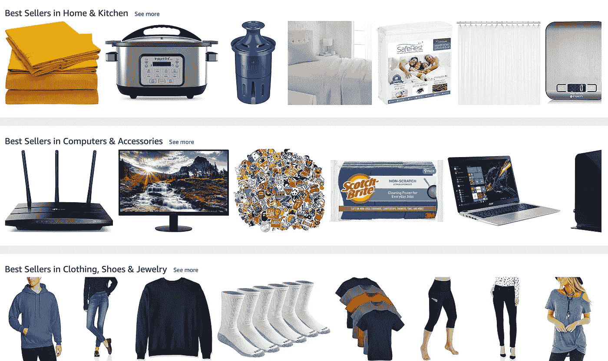
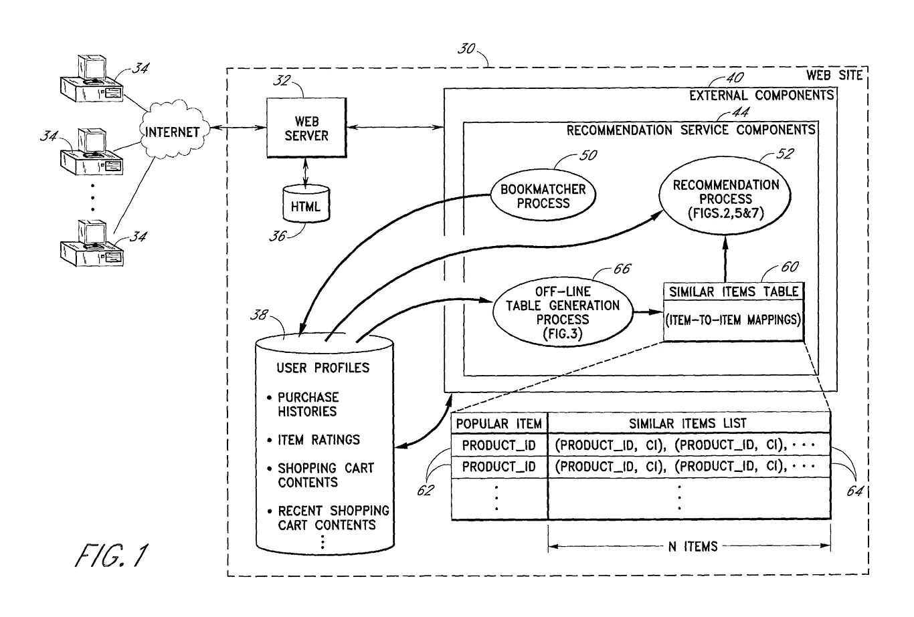
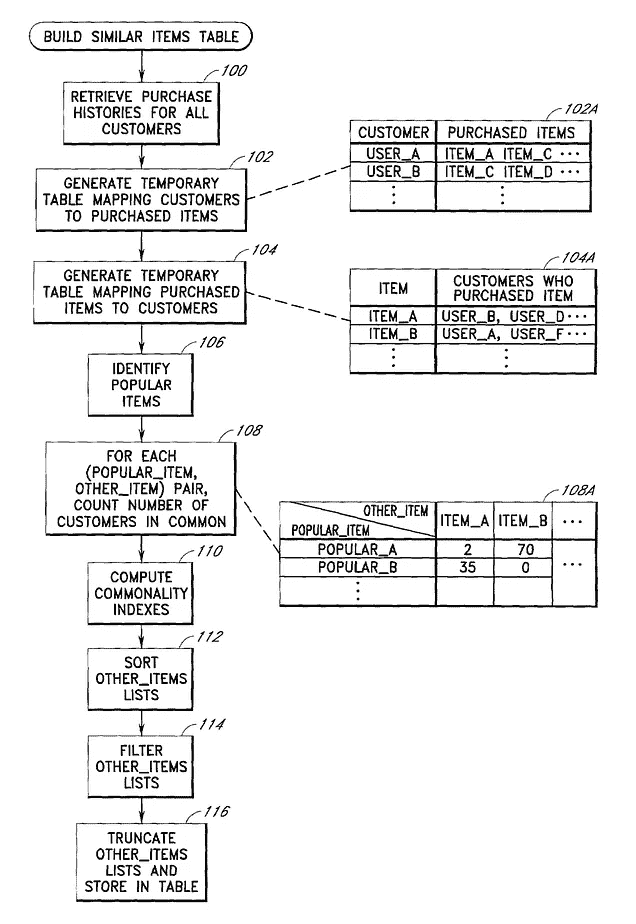
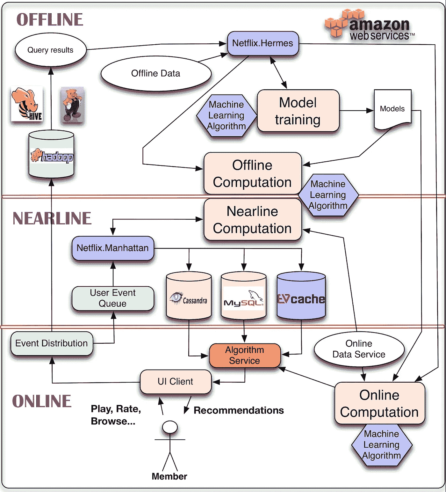
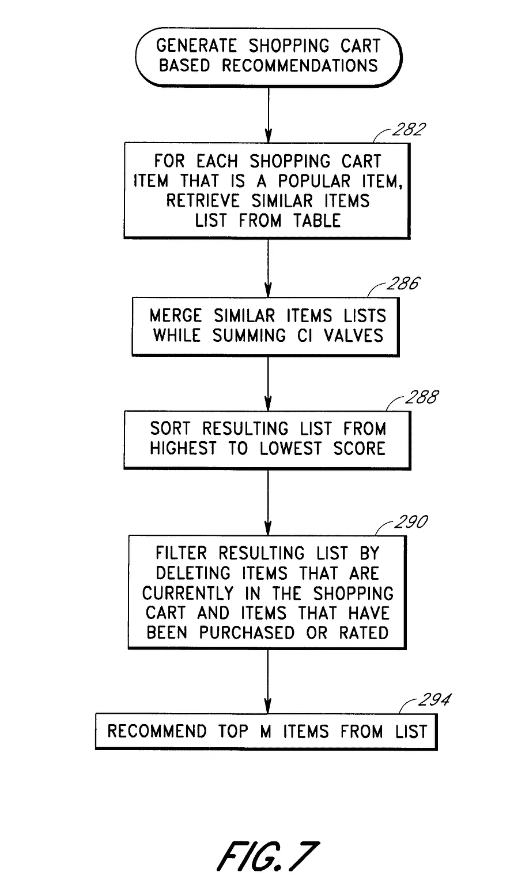
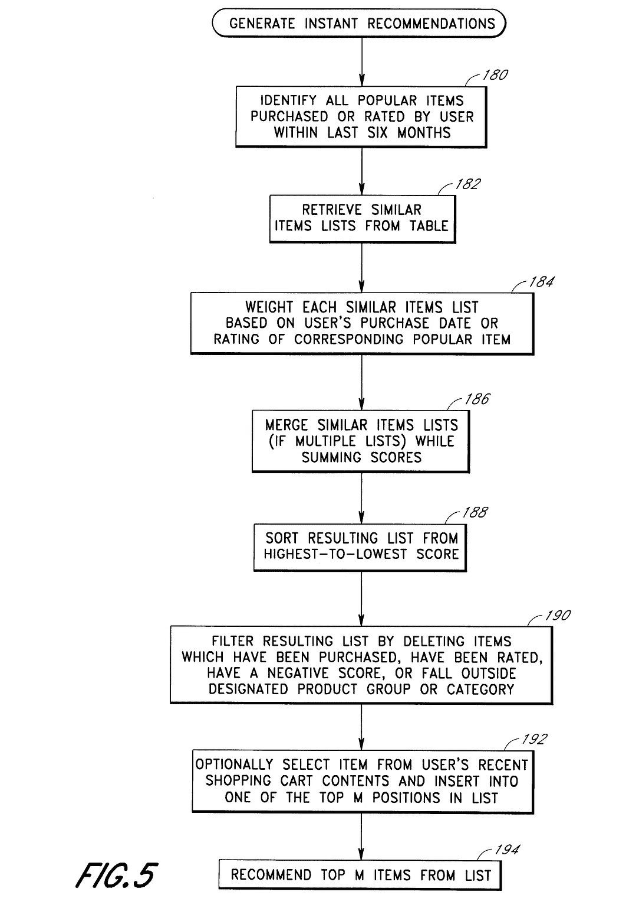

# 如何设计推荐人？

> 原文：<https://medium.com/analytics-vidhya/modern-visual-recsys-part2-the-recsys-design-framework-30d2352fff34?source=collection_archive---------19----------------------->

## 现代 RecSys

## 对于这一章，我将通过亚马逊的案例研究来介绍 RecSys 设计框架。

这是我的现代视觉 RecSys 系列的一部分；请在文章末尾随意查看该系列的其余部分。

# RecSys 框架—亚马逊案例研究

我的亚马逊主页上的推荐

像亚马逊这样的电子商务网站很大程度上依赖于良好的 RecSys。毕竟，**的用户不可能浏览平台上数以百万计的商品**，而**的卖家会喜欢曝光他们的商品**。再者，网站/app 上**空间有限**；一个好的 RecSys 应该能够将用户的偏好与最相关的产品匹配起来，并按照一定的顺序显示结果，以鼓励用户点击或购买该商品。

我们如何从头开始设计 RecSys？我跟大家分享一个我用的框架。

**第一步:定义业务案例**

RecSys 没有明确的“正确答案”。从上面的亚马逊推荐中，你如何判断 RecSys 是否做得很好？如果我过去买了袜子和显示器，再给我推荐更多的袜子和显示器还有意义吗？RecSys 致力于改善用户体验和业务 KPI。因此，理解以下指标至关重要:

***RecSys 指标:***

*   “与历史趋势的匹配程度”:[准确性/相关性/覆盖面](https://towardsdatascience.com/evaluation-metrics-for-recommender-systems-df56c6611093)
*   “建议的多样性如何”:[多样性/意外收获/新奇感](https://gab41.lab41.org/recommender-systems-its-not-all-about-the-accuracy-562c7dceeaff#.5exl13wqv)
*   [尊重用户隐私](https://www.youtube.com/watch?v=Yz7fKIHfFW8)
*   [冷启动问题](/@InDataLabs/approaching-the-cold-start-problem-in-recommender-systems-e225e0084970)(向新用户推荐的挑战)

***业务指标:***

*   点击率
*   购买率
*   介绍新产品/销售人员

虽然准确性/相关性提供了一个大概的数字来了解我们的 RecSys 与历史趋势的匹配程度，**但它们并没有显示全貌。**

> 用户无法判断他们尚未看到的项目。从本质上讲，一个 RecSys 可以在向用户推出大量新产品并提高整体购买率的同时，在历史指标上表现不佳。通过对不同人口统计的用户进行 [**AB 测试，将历史、多样性和业务指标结合起来进行衡量，这一点至关重要。**](https://www.coursera.org/lecture/recommender-metrics/a-b-studies-field-experiments-W8dHo)

**第二步:准备数据**

让我们来看看亚马逊在 1998 年申请的专利，它包含了 RecSys 的基础，直到今天仍然相关。

来源:专利 US 6，266，649 B1: [亚马逊使用项目到项目相似性映射的协作推荐](https://insight.rpxcorp.com/pat/US6266649B1)

从上面的专利图像中，我们可以勾勒出所有现代 RecSys 中的各种数据:

*   用户交互(在图像中显示为 web 服务器 html)。这些通常是点击流数据，存储为日志文件，并通过 Kafka 等[发布-订阅消息系统进行访问。跟踪用户的一种常见技术是](https://www.confluent.io/blog/using-apache-kafka-drive-cutting-edge-machine-learning/)[浏览器指纹识别，](https://pixelprivacy.com/resources/browser-fingerprinting/)随之而来的是[用户隐私问题](https://blog.mozilla.org/internetcitizen/2018/07/26/this-is-your-digital-fingerprint/)。
*   用户资料(包括购买历史、评分、购物车、愿望清单、评论、最近浏览等。).这些通常是存储在大多数客户数据库中的事务性和结构化数据。一个基线数据为 [***人物角色创建***](https://buffer.com/library/marketing-personas-beginners-guide)*[***分割***](https://mixpanel.com/blog/2018/05/09/user-segmentation-guide-understanding-customers/)*[***定位***](https://business.twitter.com/en/resources/holiday-guide/remarketing-tips.html)*[***保留和重新激活***](https://blog.hubspot.com/service/customer-retention) 。很多工作都是在 [**用户欺诈**](https://www.printful.com/blog/the-basics-of-ecommerce-fraud-what-is-it-and-how-to-manage-it/) 中进行的。***
*   **卖家资料(评级、销售、价格范围、促销、合作关系、新颖度、目录等)。).上图中没有这些，但在任何现代 RecSys 设计中都是必不可少的。卖家是平台的命脉和内容合作伙伴。这些数据对于产品**促销**，推出**新产品**，以及**排名**/产品在网站上的放置都至关重要。**
*   **项目属性(价格历史，类别，销售，库存数量，跨多个卖家合并，图像，假冒产品检查等。).这些数据对项目相似性模型至关重要。产品形象相似度将是这一系列文章的核心部分。**

> **结合使用数据——当您将数据和见解结合起来时，它们的力量会呈指数级增长。该图概述了大多数 RecSys 下面的三个关键关系:[流行商品+类似商品](https://es.coursera.org/lecture/machine-learning-applications-big-data/collaborative-filtering-recsys-user-user-and-item-item-X7tMz)，客户+商品，[购物篮分析](https://towardsdatascience.com/a-gentle-introduction-on-market-basket-analysis-association-rules-fa4b986a40ce)。**

****第三步:设计合适的架构**:**

****

**来源:[个性化系统架构及推荐](https://netflixtechblog.com/system-architectures-for-personalization-and-recommendation-e081aa94b5d8) *作者:*[*Xavier Amatriain*](http://www.twitter.com/xamat)*和*[*Justin Basilico*](http://www.twitter.com/justinBasilico)**

**RecSys 的系统架构通常是受保护的秘密，并且根据规模和要求而不同。一个很好的基线架构是来自网飞的(更多细节见进一步阅读下面的链接)。网飞将他们的 RecSys 托管在 AWS 上，并将系统分为三个时间范围:**

*   **离线(批处理)，这些模型计算量大，运行时间长。需要在所有用户和产品之间生成**长期关系对的模型**，比如协同过滤模型就属于这一类。通常，我们会在一天中的预定时间间隔运行这些模型，**每隔几个小时**。这些通常是最复杂和最精确的模型。**
*   **近线(半实时/微批量处理)。[像 Spark](https://databricks.com/blog/2018/03/20/low-latency-continuous-processing-mode-in-structured-streaming-in-apache-spark-2-3-0.html) 这样的现代框架允许每 5-10 秒处理一次数据**，**，这对于**建模短期行为模式，比如浏览模式**来说是非常棒的。我们可以根据用户正在查看的内容更新推荐，并为他们添加到购物车的内容推荐补充商品。**
*   **对于大多数可以半实时处理的用例来说，在线(实时)模型可能是昂贵且不必要的。因为实时处理发生在 **~10ms** 左右，**的小建模**可以在这个速度下完成。最有可能的是，我们将通过 [**Redis**](https://redislabs.com/docs/quick-guide-recommendations-using-redis/) **(内存数据库)或缓存等高效的数据结构**预先生成**结果(例如最受欢迎的项目)并提供结果。**以 [AB 测试](https://databricks.com/session/fact-store-scale-for-netflix-recommendations)或[多武装匪徒](https://towardsdatascience.com/bandits-for-recommender-system-optimization-1d702662346e)形式进行的实时测试对于任何 RecSys 的成功也是至关重要的。**

> **设计一个好的 RecSys 架构需要经验、时间和对利益相关者需求(指标、数据、预算、时间等)的理解。).**
> 
> ****关键是从小的离线模型开始，向半实时模型扩展，并始终进行实时测试。****

# **我们学到了什么**

**设计一个 RecSys 并不容易。我们应该总是从业务问题开始。我们有当前的基线解决方案吗？期望/目标是什么？我们愿意在这个项目上投入多少资源？接下来，我们应该评估我们的数据来源。我们在跟踪用户交互吗？我们可以访问用户和项目数据吗？我们需要处理多少历史数据？所有这些问题的答案将决定我们设计什么样的架构来满足需求。**

# **反光**

*   **假设您的 RecSys 团队由业务利益相关者、设计师、前端和后端工程师、数据工程师和数据科学家同事组成。你会问不同的团队成员什么问题？**
*   **下面，我们有来自亚马逊的关于他们如何产生购物车和即时推荐的专利申请。工作流程有意义吗？您希望设计工作流的数据科学家做出什么澄清吗？您将如何利用现代工具/流程改进工作流程？**

********

**来源:专利 US 6，266，649 B1: [亚马逊使用项目到项目相似性映射的协作推荐](https://insight.rpxcorp.com/pat/US6266649B1)**

# **探索现代视觉 RecSys 系列的其余部分**

** [## 现代视觉推荐系统:推荐器是如何工作的？[基础]

### 在这一系列文章中，我将介绍视觉推荐系统的现代方法。我们从一个案例开始…

medium.com](/@thiakx/modern-visual-recsys-part1-introduction-1241c02f76d6)  [## 现代视觉记录系统:视觉记录系统介绍[核心]

### 我们将探索视觉模型的“hello world”数据，来自 Zalando 和 PyTorch 的 FashionMNIST 数据集…

medium.com](/analytics-vidhya/intro-to-visual-recsys-12d54976c521)  [## 现代视觉系统:卷积神经网络推荐器

### 我们将通过利用 ResNet 的迁移学习来构建推荐器，并返回视觉上相似的产品…

medium.com\](/@thiakx/modern-visual-recsys-part4-convolutional-neural-networks-recommender-c4174644ab0d)  [## 现代视觉再现系统:CNN 的新冠肺炎案例研究

### 我们将使用迁移学习、Spotify 的……通过 CNN RecSys 流程，根据严重程度对新冠肺炎 x 光图像进行聚类

medium.com](/@thiakx/modern-visual-recsys-part4b-covid-19-case-study-with-cnn-5f07fd93a11a)  [## 构建个性化的实时时尚收藏推荐器[Pro]

### 我们将利用 PyTorch 中的迁移学习、近似最近邻和嵌入质心检测来实现

towardsdatascience.com](https://towardsdatascience.com/building-a-personalized-real-time-fashion-collection-recommender-22dc90c150cb)  [## 时尚推荐者

### 建立一个随季节变化的推荐器

towardsdatascience.com](https://towardsdatascience.com/temporal-fashion-recommender-59c26313fa25)  [## 视觉推荐系统的未来:四种实用的最新技术

### visual RecSys 的未来令人振奋。让我们探索一些最前沿的技术和想法…

medium.com](/@thiakx/the-future-of-visual-recommender-systems-four-practical-state-of-the-art-techniques-bae9f3e4c27f) 

系列标签:

*   基础:一般知识和理论，需要最低限度的编码经验。
*   核心:更具挑战性的材料与代码。
*   亲:困难的材料和代码，与生产级工具。

# 进一步阅读

*   [推荐系统的评价指标](https://towardsdatascience.com/evaluation-metrics-for-recommender-systems-df56c6611093)
*   [推荐系统——不仅仅是准确性的问题](https://gab41.lab41.org/recommender-systems-its-not-all-about-the-accuracy-562c7dceeaff#.5exl13wqv)
*   [浏览器指纹*它是什么，你应该怎么做？*](https://pixelprivacy.com/resources/browser-fingerprinting/)
*   [视频] Slack — [构建具有严格隐私边界的推荐系统](https://www.youtube.com/watch?v=Yz7fKIHfFW8)
*   [用阿帕奇卡夫卡驱动尖端机器学习](https://www.confluent.io/blog/using-apache-kafka-drive-cutting-edge-machine-learning/)
*   [购物篮分析——关联规则简介](https://towardsdatascience.com/a-gentle-introduction-on-market-basket-analysis-association-rules-fa4b986a40ce)
*   [协同过滤 RecSys:用户-用户和项目-项目](https://es.coursera.org/lecture/machine-learning-applications-big-data/collaborative-filtering-recsys-user-user-and-item-item-X7tMz)
*   [网飞:个性化系统架构及推荐](https://netflixtechblog.com/system-architectures-for-personalization-and-recommendation-e081aa94b5d8)
*   [在 Apache Spark 2.3 中引入结构化流的低延迟连续处理模式](https://databricks.com/blog/2018/03/20/low-latency-continuous-processing-mode-in-structured-streaming-in-apache-spark-2-3-0.html)
*   [网飞建议的大规模事实存储(用于 ML 和 A/B 测试)](https://databricks.com/session/fact-store-scale-for-netflix-recommendations)
*   [盗匪推荐系统优化](https://towardsdatascience.com/bandits-for-recommender-system-optimization-1d702662346e)**