# 卷积神经网络推荐器

> 原文：<https://medium.com/analytics-vidhya/modern-visual-recsys-part4-convolutional-neural-networks-recommender-c4174644ab0d?source=collection_archive---------12----------------------->

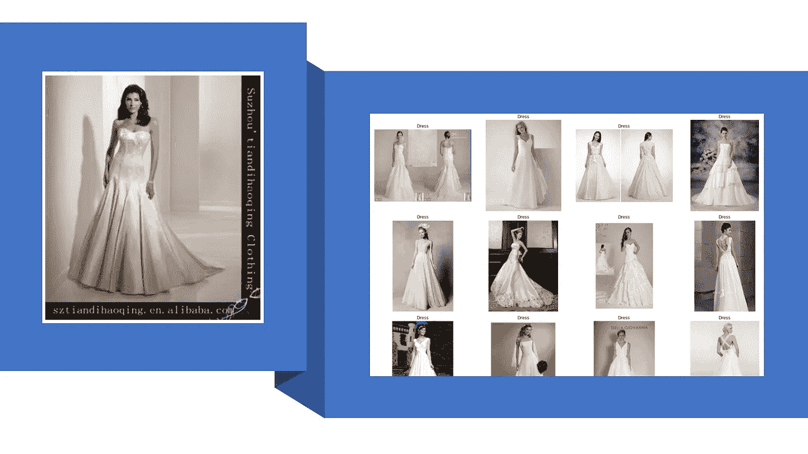

左边是目标图像，右边是由我们的模型生成的建议。服装从 [DeepFashion、](http://mmlab.ie.cuhk.edu.hk/projects/DeepFashion.html)开源由 [**刘 z 等人**](https://liuziwei7.github.io/)

## 现代 RecSys

## 我们将使用 transfer learning、Spotify 的 Annoy、PyTorch 构建一个推荐器，并在 2 毫秒内返回 240，000 张图片中视觉上相似的产品

这是我的现代视觉 RecSys 系列的一部分；请在文章末尾随意查看该系列的其余部分。

# 数据

我们将使用**[**deep fashion**](http://mmlab.ie.cuhk.edu.hk/projects/DeepFashion.html)**数据的子集，由香港中文大学刘 z .等人**开源。我们的数据由 46 个类别的 28 万张时尚图片组成。你可以从他们的网站上下载数据。**

**此外，团队已经发布了一个[更新版本，增加了](https://github.com/switchablenorms/DeepFashion2)的数据。你需要[填写一份谷歌表格](https://docs.google.com/forms/d/e/1FAIpQLSeIoGaFfCQILrtIZPykkr8q_h9qQ5BoTYbjvf95aXbid0v2Bw/viewform?usp=sf_link)来获取数据。**

# **什么是卷积？**

**卷积并不是一项新技术。本质上，我们正在对图像中的每个像素应用内核以实现一个目标，通常是模糊、锐化或检测边缘/对象。对于每个像素，我们将用内核做一个元素级的乘积，然后将结果相加得到一个单一的数。**

**让我们看一个由 Victor Powell 开发的 image [内核工具的例子。](https://setosa.io/ev/image-kernels/)**

**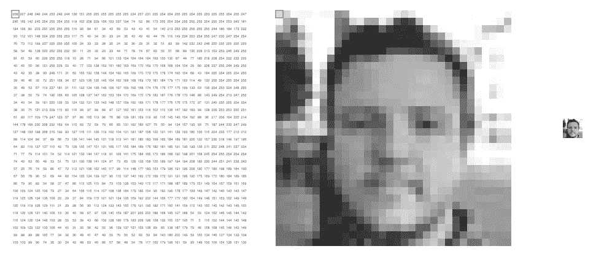**

**基本图像。来源:[图像内核](https://setosa.io/ev/image-kernels/)作者[维克多·鲍威尔](http://twitter.com/vicapow)**

**我们可以看到，图像的每个像素都有一个与之关联的颜色值，其中白色=255，黑色= 0。**

**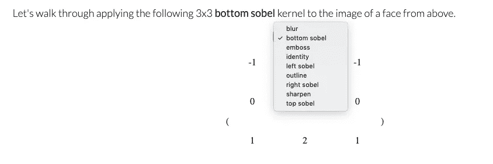**

**采摘内核。来源:[图像内核](https://setosa.io/ev/image-kernels/)作者[维克多·鲍威尔](http://twitter.com/vicapow)**

**接下来，我们将挑选内核。内核可以是任意大小，但是当然，小内核扫描大图像需要更长的时间。 [Sobel](https://en.wikipedia.org/wiki/Sobel_operator) 是一种无处不在的边缘检测算法，具有平滑功能，因此不易受噪声影响。注意有不同种类的 Sobel(上、下、左、右),就像它们的名字一样，这些内核被设计成拾取图像的特定成分。**

**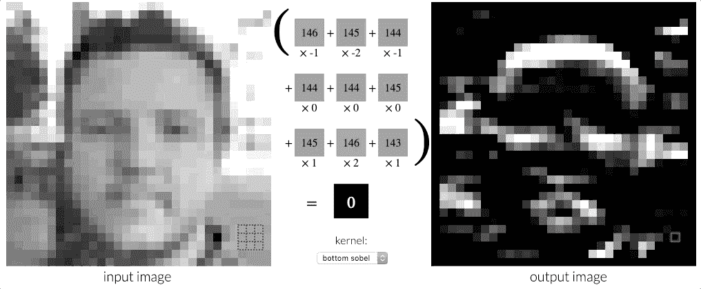**

**这是卷积。来源:[图片内核](https://setosa.io/ev/image-kernels/)作者[维克多·鲍威尔](http://twitter.com/vicapow)**

**正如您从动画中看到的，我们实际上是在图像中移动一个 3x3 内核，生成新的分数并将它们分配给输出图像。你会注意到，在应用底部 Sobel 后，只有部分输出图像以白色突出显示；这些白色部分是底部 Sobel 检测到的底部边缘。**

> **由于每个内核专门检测图像的一个方面，你可以想象我们将不同的内核堆叠起来，制定一个全面的策略。事实的确如此，内核的集合被称为过滤器。在 CNN 中，我们甚至可以堆叠多层过滤器，每个过滤器都有特定的任务。**

**如果你有兴趣，你应该用不同类型的内核亲自测试一下这个工具。CNN 是一个迷人的模型，因为它结合了卷积和神经网络的力量。有许多不同的架构，但通常由[卷积、子采样、激活和完全连接的组合组成，如 Algobeans](https://algobeans.com/2016/01/26/introduction-to-convolutional-neural-network/) 所述。您可以在附加资源部分了解更多关于内核和 CNN 的信息。**

# **为什么 CNN 做视觉推荐？**

**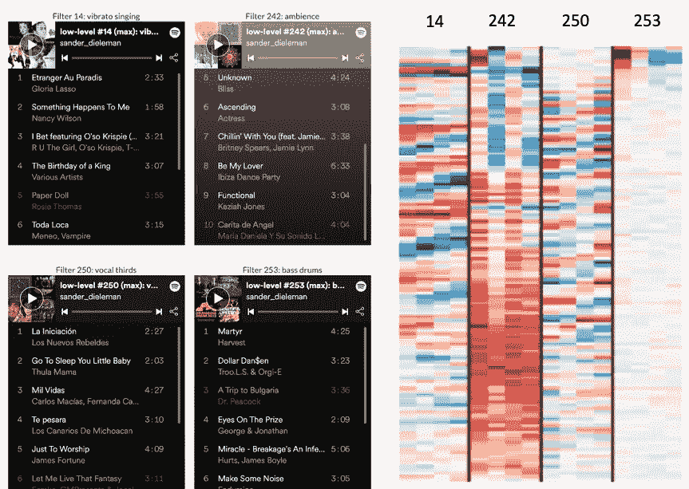**

**过滤器 14、242、250 和 253 的特写。来源:[推荐 Spotify 幻灯片上的音乐](https://benanne.github.io/2014/08/05/spotify-cnns.html#)作者[桑德·迪勒曼](https://benanne.github.io/about/)**

**现在是回顾我们在本系列第 1 部分所学内容的绝佳时机。【Spotify 的 Sander 设计了一个带有过滤器的 CNN，根据音乐的频率模式来检测不同类型的音乐。CNN 开创了一种全新的推荐音乐的方式，这种方式**直观、**，因为它是基于对音乐结构的分析和理解。机器缺乏理解和欣赏音乐的自然能力；CNN 帮助弥合差距。**

> **CNN 的强大之处在于它能够将复杂的视觉问题分解成一层层的过滤器——通常我们可以将这些过滤器可视化，以获得模型试图学习什么的直觉。**

**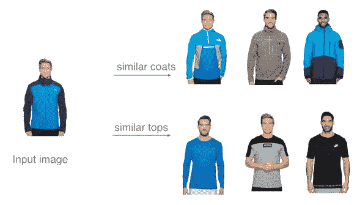**

**基于 CNN 的推荐。来源:[波什内特](https://symj07.wordpress.com/2018/03/19/poshnet/)作者:[夏元](https://symj07.wordpress.com/author/windflower715hotmailcom/)**

**因此，我们的目标是构建一个 CNN，它可以根据与输入图像的视觉相似性推荐商品。CNN 可以应用于各种各样的视觉问题，我在下面收集了一些很棒的文章。请注意，在下一章的[中，我们将调整 CNN 流程，以识别感染严重程度相似的 X 射线图像簇。](/@thiakx/modern-visual-recsys-part4b-covid-19-case-study-with-cnn-5f07fd93a11a)**

**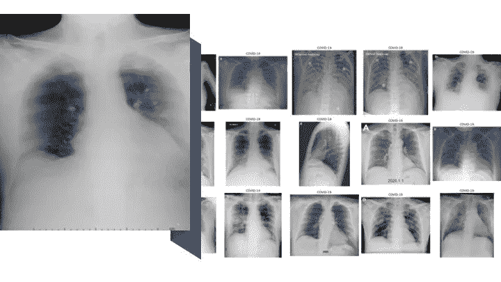**

***严重感染的 X 射线扫描，由我们的模型生成 36 个最相似的扫描。来源:* [*新冠肺炎影像资料收集*](https://github.com/ieee8023/covid-chestxray-dataset) *由* [*约瑟夫·科恩*](https://josephpcohen.com/w/)**

*   **[搜索莫纳什·森西拉布的视觉相似艺术品](http://ai.sensilab.monash.edu/2018/09/17/similarity-search-engine/)**
*   **[使用 Tensorflow 对象检测器、Pytorch 特征提取器和 Spotify 的 Annoy 寻找熟悉的面孔(在动漫角色中)](https://towardsdatascience.com/finding-familiar-faces-with-a-tensorflow-object-detector-pytorch-feature-extractor-and-spotifys-3e78858a8148)**
*   **[Fastai —图片相似性搜索— Pytorch Hooks & Spotify 被 Abhik Jha 惹恼](https://blog.usejournal.com/fastai-image-similarity-search-pytorch-hooks-spotifys-annoy-9161bf517aaf)**
*   **[gau tham Kumar an 使用 FastAi 和 Annoy 推荐相似图片](https://towardsdatascience.com/similar-images-recommendations-using-fastai-and-annoy-16d6ceb3b809)**

# **迁移学习:利用预先训练的深度 CNN**

**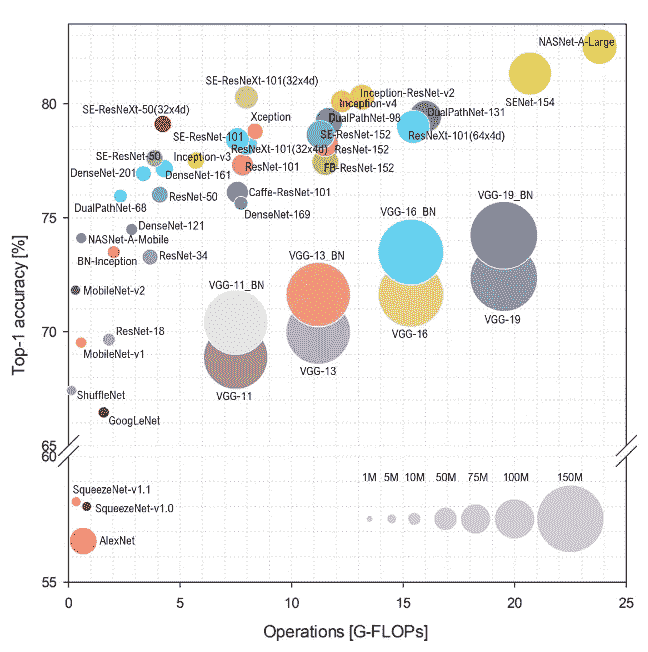**

**[代表性深度神经网络架构基准分析(2018)](https://arxiv.org/pdf/1810.00736.pdf) 。来源:[arxiv](https://arxiv.org)s . Bianco 等人。**

> ****对于大多数现实部署，我们不会从头开始训练 CNN。**多年来，像微软研究院这样的组织已经发布了最先进的、大规模的、预训练的深度 CNN (DCNN)模型，我们应该通过在他们的基线模型上进行训练来利用他们的工作。这就是所谓的迁移学习。**

**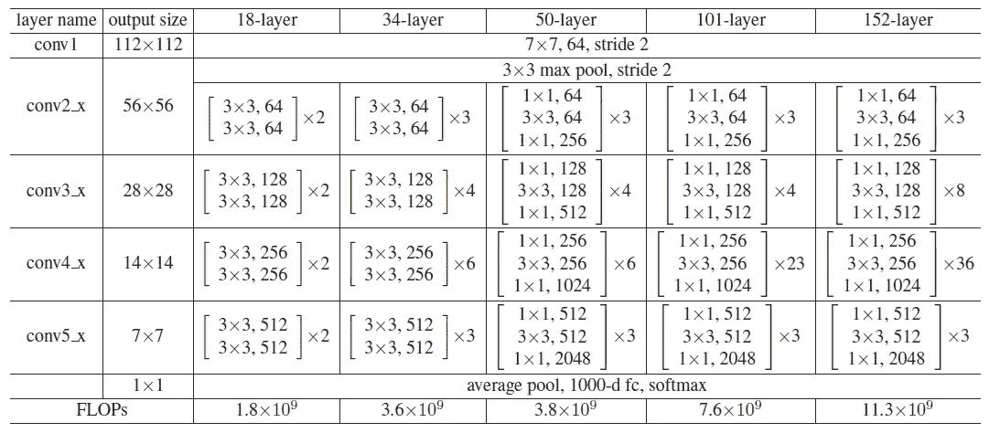**

**ResNet 架构。18 层 ResNet 是测试模型的优秀基准，而 152 层是很好的通用模型。来源:[用于图像识别的深度残差学习](https://arxiv.org/abs/1512.03385)作者[何 k 等人](https://arxiv.org/search/cs?searchtype=author&query=He%2C+K)。**

**标准的预训练 DCNN 之一是 ResNet。更深的网络具有更好地表示输入函数的潜力。深层网络的问题是消失梯度问题，因为我们需要重复乘以小数字来进行反向传播。ResNet 通过跳过一层或多层的**身份快捷连接解决了这个问题**，允许我们构建非常深的网络，这些网络可以很好地概括各种问题。关于 ResNet 的更多细节，请参见进一步阅读部分。**

# **用 airy 近似最近邻**

**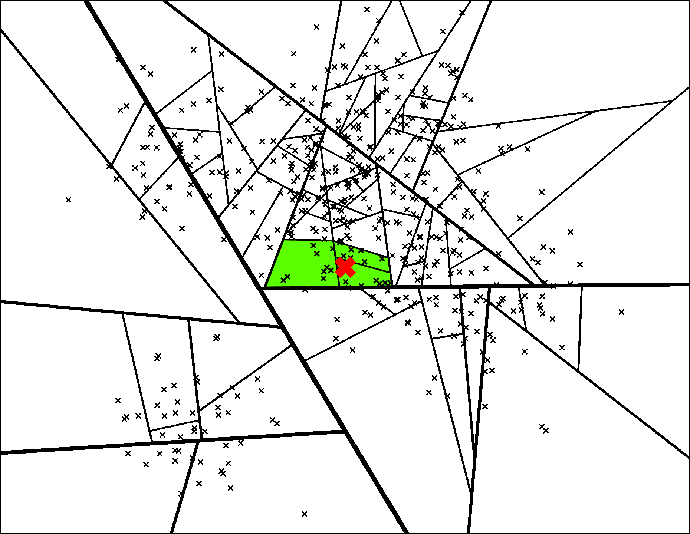****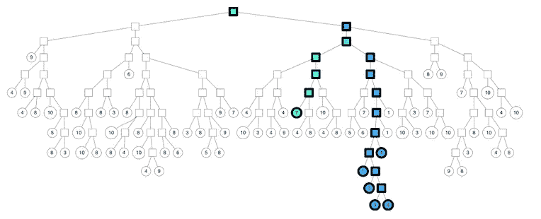**

**[谁说二叉树只对 Leetcode 面试有用？](https://erikbern.com/2015/10/01/nearest-neighbors-and-vector-models-part-2-how-to-search-in-high-dimensional-spaces.html)来源[被](https://github.com/spotify/annoy)[埃里克](https://erikbern.com/about.html)惹恼**

**如果我们只有一个小的图像搜索语料库，简单的距离度量，如余弦相似性将工作。在现实世界的部署中，比如电子商务，我们通常有数百万张图片需要相互比较，API 对每张图片进行成对比较是不切实际的。Spotify 的 Erik Bernhardsson 开发了一个易于使用的 API，可以集成到我们的 PyTorch 工作流程中。**

> **更重要的是，它帮助我们找到最近的邻居，而不需要计算每张图像之间的成对距离。**

**如果你有兴趣了解更多关于 aroy 的知识，请查看进一步阅读中 Erik 的文章。**

# **代码**

**请参考[https://towards data science . com/building-a-personalized-real-time-fashion-collection-recommender-22 DC 90 c 150 CB](https://towardsdatascience.com/building-a-personalized-real-time-fashion-collection-recommender-22dc90c150cb)**

# **查看来自推荐者的结果**

**让我们看看推荐者的结果。比如我们观察到有些单品比较容易推荐，比如这件条纹毛衣。**

**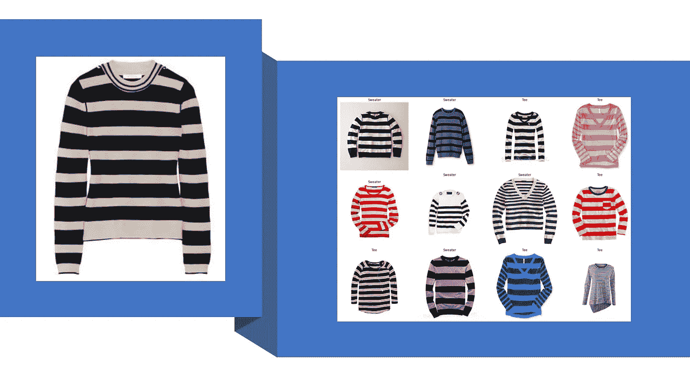**

**左边是目标图像，右边是由我们的模型生成的建议。服装来自 [DeepFashion，](http://mmlab.ie.cuhk.edu.hk/projects/DeepFashion.html)开源由 [**刘 z 等人**](https://liuziwei7.github.io/)**

**白色牛仔裤稍微硬一点；我们似乎以打底裤、黑色裤子和蓝色牛仔裤的搭配结束。**

**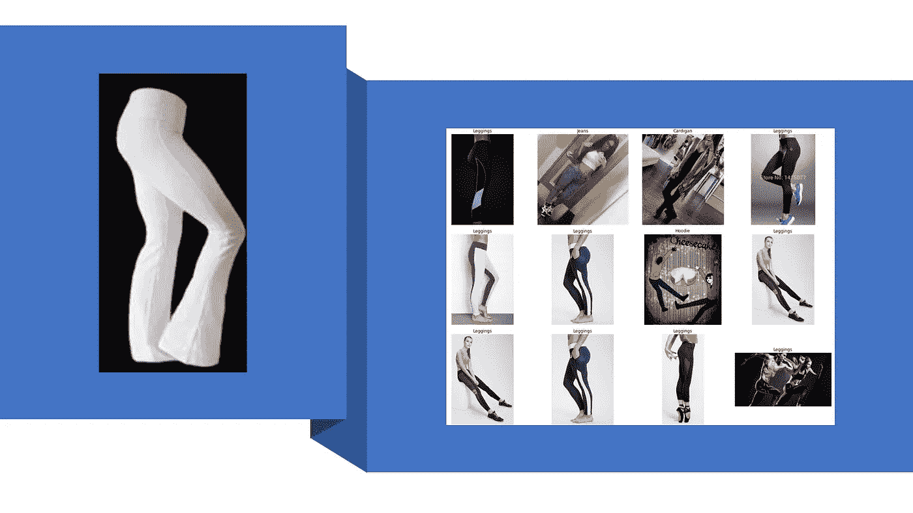**

**左边是目标图像，右边是由我们的模型生成的建议。服装来自 [DeepFashion，](http://mmlab.ie.cuhk.edu.hk/projects/DeepFashion.html)开源由 [**刘 z 等人**](https://liuziwei7.github.io/)**

**虽然这…有趣的装备导致非常多样的一套建议。搭配复杂的颜色、层次和服装似乎很有挑战性。**

**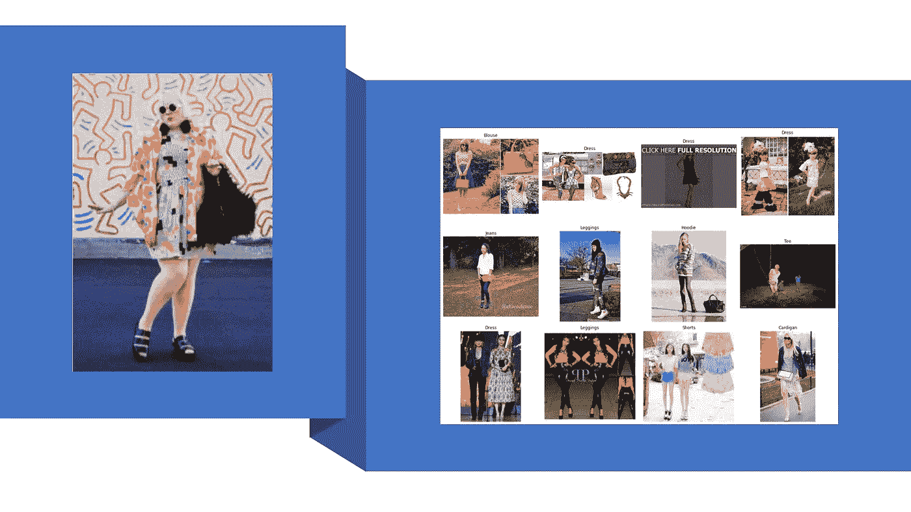**

**左边是目标图像，右边是由我们的模型生成的建议。服装来自 [DeepFashion，](http://mmlab.ie.cuhk.edu.hk/projects/DeepFashion.html)开源来自 [**刘 z 等人**](https://liuziwei7.github.io/)**

# **我们学到了什么**

**在这一章中，我们将探讨 CNN 在推荐中的应用。我们在这里使用了一些先进的技术，但是通过像 ResNet、Fastai、aroy 这样的现代工具，我们可以部署一个强大的推荐器，它可以立即生成新的推荐。**

# **探索现代视觉 RecSys 系列的其余部分**

** [## 现代视觉推荐系统:推荐器是如何工作的？[基础]

### 在这一系列文章中，我将介绍视觉推荐系统的现代方法。我们从一个案例开始…

medium.com](/@thiakx/modern-visual-recsys-part1-introduction-1241c02f76d6)  [## 现代视觉 RecSys:如何设计推荐器？[基础]

### 对于这一章，我将通过亚马逊的案例研究来介绍 RecSys 设计框架。

medium.com](/@thiakx/modern-visual-recsys-part2-the-recsys-design-framework-30d2352fff34)  [## 现代视觉记录系统:视觉记录系统介绍[核心]

### 我们将探索视觉模型的“hello world”数据，来自 Zalando 和 PyTorch 的 FashionMNIST 数据集…

medium.com](/analytics-vidhya/intro-to-visual-recsys-12d54976c521)  [## 现代视觉再现系统:CNN 的新冠肺炎案例研究

### 我们将使用迁移学习、Spotify 的……通过 CNN RecSys 流程，根据严重程度对新冠肺炎 x 光图像进行聚类

medium.com](/@thiakx/modern-visual-recsys-part4b-covid-19-case-study-with-cnn-5f07fd93a11a)  [## 构建个性化的实时时尚收藏推荐器[Pro]

### 我们将利用 PyTorch 中的迁移学习、近似最近邻和嵌入质心检测来实现

towardsdatascience.com](https://towardsdatascience.com/building-a-personalized-real-time-fashion-collection-recommender-22dc90c150cb)  [## 时尚推荐者

### 建立一个随季节变化的推荐器

towardsdatascience.com](https://towardsdatascience.com/temporal-fashion-recommender-59c26313fa25)  [## 视觉推荐系统的未来:四种实用的最新技术

### visual RecSys 的未来令人振奋。让我们探索一些最前沿的技术和想法…

medium.com](/@thiakx/the-future-of-visual-recommender-systems-four-practical-state-of-the-art-techniques-bae9f3e4c27f) 

系列标签:

*   基础:一般知识和理论，需要最低限度的编码经验。
*   核心:更具挑战性的材料与代码。
*   亲:难的材料和代码，用生产级的工具。

# 进一步阅读

*   [卷积核的类型:简化的](https://towardsdatascience.com/types-of-convolution-kernels-simplified-f040cb307c37)
*   [图像卷积示例](https://aishack.in/tutorials/image-convolution-examples/)
*   [由 deeplizard(视频)解释的卷积神经网络(CNN)](https://youtu.be/YRhxdVk_sIs)
*   [卷积神经网络(CNN)简介](https://algobeans.com/2016/01/26/introduction-to-convolutional-neural-network/)
*   [理解卷积神经网络的初学者指南](https://adeshpande3.github.io/A-Beginner%27s-Guide-To-Understanding-Convolutional-Neural-Networks/)
*   [让我们打造一个时尚——MNIST CNN，PyTorch Style](https://towardsdatascience.com/build-a-fashion-mnist-cnn-pytorch-style-efb297e22582)
*   [PoshNet:你的个人虚拟衣橱](https://symj07.wordpress.com/2018/03/19/poshnet/)
*   [ResNet 及其变体的概述](https://towardsdatascience.com/an-overview-of-resnet-and-its-variants-5281e2f56035)
*   [回顾:Inception-v4——从 GoogLeNet 演化而来，与 ResNet Idea(图像分类)合并](https://towardsdatascience.com/review-inception-v4-evolved-from-googlenet-merged-with-resnet-idea-image-classification-5e8c339d18bc)
*   [盗梦空间网络版本的简单指南](https://towardsdatascience.com/a-simple-guide-to-the-versions-of-the-inception-network-7fc52b863202)
*   [埃里克:骚扰:最近邻和向量模型——第二部分——算法和数据结构](https://erikbern.com/2015/10/01/nearest-neighbors-and-vector-models-part-2-how-to-search-in-high-dimensional-spaces.html)**