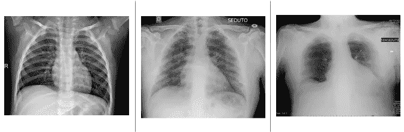
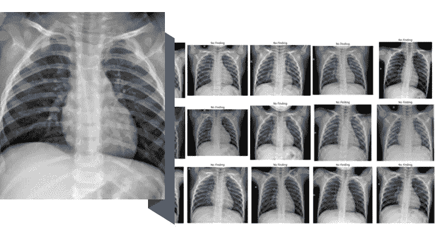
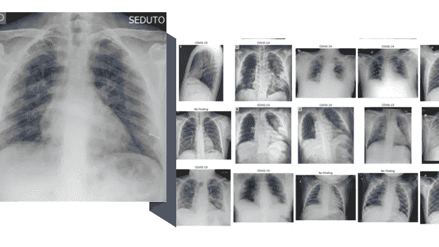
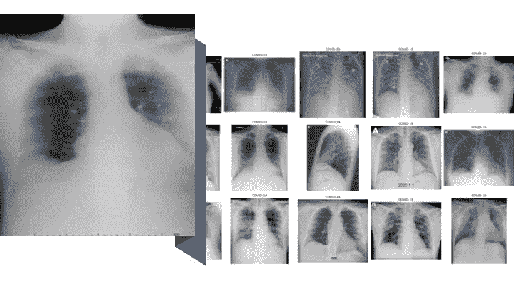

# CNN 的新冠肺炎案例研究

> 原文：<https://medium.com/analytics-vidhya/modern-visual-recsys-part4b-covid-19-case-study-with-cnn-5f07fd93a11a?source=collection_archive---------19----------------------->

## 现代 RecSys

## 我们将使用迁移学习、Spotify 的 airy 和 PyTorch，通过 CNN RecSys 流程，根据严重程度对新冠肺炎 x 光图像进行聚类

这项工作旨在作为一个概念验证，证明我们如何将在 CNN 前一章中建立的相同框架应用到一个完全不同的领域。

**我们将交换训练数据，采用更强大的预训练模型(resnet 152)；其余代码与我们用于 DeepFashion 图像的代码保持一致。**我们的目标是使用近似最近邻来识别感染严重程度相似的 X 射线图像簇。

> 这项工作并不打算作为医学研究，也不代表我们如何使用 CNN 来检测新冠肺炎。

这是我的现代视觉 RecSys 系列的一部分；请在文章末尾随意查看该系列的其余部分。

# 新冠肺炎的数据

*   蒙特利尔大学的 Joseph Cohen 正在[用胸部 x 光或 CT 图像](https://github.com/ieee8023/covid-chestxray-dataset)建立一个新冠肺炎病例的数据库。目前，数据集由 124 张新冠肺炎 x 光照片组成，包括亚洲、欧洲和美国的病例。
*   为了丰富数据，我从 [Kaggle 的胸部 x 光图像(肺炎)数据集](https://www.kaggle.com/paultimothymooney/chest-xray-pneumonia)中合并了另一个健康患者的 **1.5k X 光图像**

从左至右:健康、感染、严重感染患者的 x 光照片。来源:[新冠肺炎图像数据收集](https://github.com/ieee8023/covid-chestxray-dataset)由[约瑟夫·科恩](https://josephpcohen.com/w/)

直觉告诉我们为什么 CNN 能够很好地处理这些数据:

> 如前一章所述，CNN 的优势在于卷积滤波器。这些过滤器非常擅长检测图像中的形状、线条和边界。从 x 光图像中，我们看到随着感染的恶化，图像变得模糊，有更多的白色区域，胸腔变得不明显；这些都是 CNN 能够获取和学习的视觉线索。

# 清理数据

*   由于总共只有不到 25 份 ARDS、肺囊虫、SARS 和链球菌样本，我决定移除这些样本，只保留 COVID 和健康样本。
*   由于 CT 扫描样本不到 25 个，健康患者只有 1 个 CT 扫描，所以我决定去掉 CT 扫描，只保留 x 光片。
*   清洗之后，我们有 102 张 COVID X 光片和 1584 张健康 x 光片。

# 模特培训

我们将遵循前面卷积神经网络 RecSys 章节中概述的完全相同的步骤(您可以参考该章节了解更多详细信息):

*   将图像转换为嵌入内容
*   从 ResNet152 进行迁移学习
*   使用 Fastai 钩子从步骤 2 中检索图像嵌入
*   基于步骤 3 中的嵌入，使用近似最近邻获得最相似的图像。

# 分析

健康的 X 射线扫描，由我们的模型生成 36 个最相似的扫描。来源:[新冠肺炎图像资料收集](https://github.com/ieee8023/covid-chestxray-dataset)由[约瑟夫·科恩](https://josephpcohen.com/w/)

对于健康的 X 射线扫描，我们的模型可以拾取 36 个最相似的 X 射线，它们都是健康的。该模型可以识别和聚类健康的扫描。

受感染的 X 射线扫描与我们的模型生成的 36 个最相似的扫描。来源:[新冠肺炎图片资料收集](https://github.com/ieee8023/covid-chestxray-dataset)作者[约瑟夫·科恩](https://josephpcohen.com/w/)

对于受感染的 X 射线扫描，我们的模型通常选取 80%受感染的 X 射线扫描和 20%健康的扫描的混合。根据感染程度，该模型发现区分轻度感染扫描和健康扫描具有挑战性。

严重感染的 X 射线扫描，由我们的模型生成 36 个最相似的扫描。来源:[新冠肺炎图像数据收集](https://github.com/ieee8023/covid-chestxray-dataset)由[约瑟夫·科恩](https://josephpcohen.com/w/)

对于严重感染的 X 射线扫描，我们的模型可以拾取全部被感染的 36 个最相似的 X 射线。该模型可以识别和聚类严重感染的扫描。

# 这项工作的潜在用例

我们可以使用该模型来跟踪扫描严重性随时间的变化。如果今天的扫描具有更少的健康相邻扫描，并且正在向严重感染的群集漂移，这是患者的状况随着时间而恶化的迹象。

# 代码

[链接到 Colab](https://colab.research.google.com/gist/thiakx/79a247354065c4428d084271fabf2b73/covid-19-case-study-with-cnn.ipynb) (你只需要一个免费的谷歌账户就可以在云端的 GPU 上运行代码)

# 我们学到了什么

在这一章中，我们将探讨我们之前开发的 CNN Recsys 流程在医疗保健领域的应用。我们观察了如何通过对代码进行最小的修改来训练一个强大的模型，展示了我们流程的灵活性。

# 探索现代视觉 RecSys 系列的其余部分

 [## 现代视觉推荐系统:推荐器是如何工作的？[基础]

### 在这一系列文章中，我将介绍视觉推荐系统的现代方法。我们从一个案例开始…

medium.com](/@thiakx/modern-visual-recsys-part1-introduction-1241c02f76d6)  [## 现代视觉 RecSys:如何设计推荐器？[基础]

### 对于这一章，我将通过亚马逊的案例研究来介绍 RecSys 设计框架。

medium.com](/@thiakx/modern-visual-recsys-part2-the-recsys-design-framework-30d2352fff34)  [## 现代视觉记录系统:视觉记录系统介绍[核心]

### 我们将探索视觉模型的“hello world”数据，来自 Zalando 和 PyTorch 的 FashionMNIST 数据集…

medium.com](/analytics-vidhya/intro-to-visual-recsys-12d54976c521)  [## 现代视觉系统:卷积神经网络推荐器

### 我们将通过利用 ResNet 的迁移学习来构建推荐器，并返回视觉上相似的产品…

medium.com\](/@thiakx/modern-visual-recsys-part4-convolutional-neural-networks-recommender-c4174644ab0d)  [## 构建个性化的实时时尚收藏推荐器[Pro]

### 我们将利用 PyTorch 中的迁移学习、近似最近邻和嵌入质心检测来实现

towardsdatascience.com](https://towardsdatascience.com/building-a-personalized-real-time-fashion-collection-recommender-22dc90c150cb)  [## 时尚推荐者

### 建立一个随季节变化的推荐器

towardsdatascience.com](https://towardsdatascience.com/temporal-fashion-recommender-59c26313fa25)  [## 视觉推荐系统的未来:四种实用的最新技术

### visual RecSys 的未来令人振奋。让我们探索一些最前沿的技术和想法…

medium.com](/@thiakx/the-future-of-visual-recommender-systems-four-practical-state-of-the-art-techniques-bae9f3e4c27f) 

系列标签:

*   基础:一般知识和理论，需要最低限度的编码经验。
*   核心:更具挑战性的材料与代码。
*   亲:难的材料和代码，用生产级的工具。

# 进一步阅读

*   [使用 Keras、TensorFlow 和深度学习在 X 射线图像中检测新冠肺炎](https://www.pyimagesearch.com/2020/03/16/detecting-covid-19-in-x-ray-images-with-keras-tensorflow-and-deep-learning/?fbclid=IwAR0DE2Boiy7JxlHBV8DC91ggEJ7TWTEPKK9K9TFqp0tUUEakHyueSo8OFw4)
*   [利用深度学习从 x 光图像中检测 NCOV-19 引起的肺炎](https://towardsdatascience.com/using-deep-learning-to-detect-ncov-19-from-x-ray-images-1a89701d1acd)